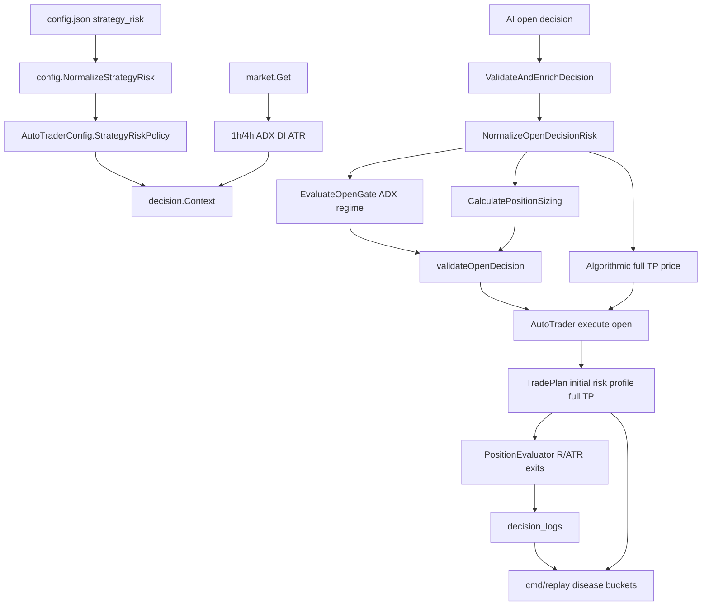

# ATR ADX Risk Optimization Design

## Overview

本设计把实盘亏损诊断转成可执行的工程改造：在 AI 输出进入交易执行前，统一用确定性规则重写或拒绝不合格的止损、止盈、仓位和开仓方向；在持仓阶段，用 R 倍数、ATR trailing 和交易所最小名义额约束管理退出；在 replay 阶段，用订单和决策日志验证病因。

核心变化：

1. 新增策略风险配置和品种 profile。
2. 修正/补齐 1h ADX/DI 指标上下文。
3. 增加开仓参数规范化层：ATR 止损硬地板、最小 TP、真实风险 sizing。
4. 增加 ADX regime hard gate 和更严格的相关性暴露 gate。
5. 保留执行层整仓 TP 保护单，但把 TP 价格改为算法规范化后的合格距离，避免 AI 微止盈绕过分批/跟踪退出。
6. 扩展 replay，按策略病因输出可验证指标。

本设计不改动凭证、不写运行时日志样本、不下真实测试订单。

## Design Principles

- **硬约束优先**: 止损地板、净 RR、ADX gate、相关性限制必须由代码执行，prompt 只做解释。
- **单一规范化入口**: AI 参数、默认补齐、sizing、日志字段都来自同一套 final decision normalization。
- **保守兼容上线**: 新策略通过配置开关启用；默认可以先 report-only 或 safe mode 灰度。
- **单位显式**: 内部保留 ratio，日志/API/replay 同时输出 ratio 和 percent，消除 `0.032` 的误读。
- **交易所约束先行**: 分批、止损、止盈和仓位大小必须满足交易所最小名义额、精度和可用保证金。
- **可复盘**: 所有 rewrite/reject 都要进入结构化 open rejection/replay bucket。

## Architecture



## Data Model

### Config Layer

Add optional top-level config block in `config/config.go`:

```go
type StrategyRiskConfig struct {
    Enabled                 *bool                     `json:"enabled,omitempty"`
    RollbackLegacyValidation bool                     `json:"rollback_legacy_validation,omitempty"`
    FeeSlippagePct          float64                   `json:"fee_slippage_pct,omitempty"`
    DefaultMinNetRR         float64                   `json:"default_min_net_rr,omitempty"`
    ADXTimeframe            string                    `json:"adx_timeframe,omitempty"` // "1h" default
    Profiles                []InstrumentProfileConfig `json:"profiles,omitempty"`
    SafeMode                StrategySafeModeConfig    `json:"safe_mode,omitempty"`
}

type InstrumentProfileConfig struct {
    Name                    string   `json:"name"`
    Symbols                 []string `json:"symbols,omitempty"`
    MatchQuote              string   `json:"match_quote,omitempty"`
    MatchType               string   `json:"match_type,omitempty"` // btc_eth, major_alt, high_beta_alt, non_crypto, default
    MinStopPct              float64  `json:"min_stop_pct,omitempty"`
    FallbackStopPct         float64  `json:"fallback_stop_pct,omitempty"`
    ATRMultiplier           float64  `json:"atr_multiplier,omitempty"`
    ATRTimeframe            string   `json:"atr_timeframe,omitempty"` // 1h or 4h
    MinNetRR                float64  `json:"min_net_rr,omitempty"`
    MaxRiskPct              float64  `json:"max_risk_pct,omitempty"`
    RegimeRiskCapPct        float64  `json:"regime_risk_cap_pct,omitempty"`
    MinADX                  float64  `json:"min_adx,omitempty"`
    AllowLong               *bool    `json:"allow_long,omitempty"`
    AllowShort              *bool    `json:"allow_short,omitempty"`
    MaxSameSideHighCorr     int      `json:"max_same_side_high_corr,omitempty"`
    MaxSameSideLossPct      float64  `json:"max_same_side_loss_pct,omitempty"`
    MinOrderValueUSDT       float64  `json:"min_order_value_usdt,omitempty"`
    ExchangeFullTPMode      string   `json:"exchange_full_tp_mode,omitempty"` // algorithmic_full default, legacy_ai, final_r_target
    ExchangeFullTPMinRR     float64  `json:"exchange_full_tp_min_rr,omitempty"`
}

type StrategySafeModeConfig struct {
    MaxRiskPct       float64 `json:"max_risk_pct,omitempty"`
    MaxPositions     int     `json:"max_positions,omitempty"`
    DailyOpenLimit   int     `json:"daily_open_limit,omitempty"`
    RequireHours     int     `json:"require_hours,omitempty"`
    MinProfitFactor  float64 `json:"min_profit_factor,omitempty"`
}
```

`Config` adds:

```go
StrategyRisk *StrategyRiskConfig `json:"strategy_risk,omitempty"`
```

Policy propagation:

- `main.go` calls `cfg.NormalizeStrategyRisk()` after `NormalizeTradingFrequency()`.
- `manager.TraderManager` should add `AddTraderWithPolicies(...)` or extend the existing add path with both frequency and strategy risk policies.
- `trader.AutoTraderConfig` stores `StrategyRiskPolicy decision.StrategyRiskPolicy`.
- `AutoTrader` injects the policy into every `decision.Context`.
- `AutoTrader.GetStatus()` exposes a redacted strategy risk summary: enabled state, rollback state, active mode, ADX timeframe, profile names/defaults, and exchange full TP mode.

Normalization rules:

- missing `strategy_risk` keeps current behavior unless code deployment explicitly chooses strict defaults;
- `enabled` omitted defaults to true once the block exists;
- `rollback_legacy_validation=true` bypasses new rewrite/gate behavior but keeps diagnostics;
- all percentages accept percent units, e.g. `1.0` means 1%, then normalize to ratio `0.01` in runtime DTO;
- profile defaults are applied by `MatchType`.
- `exchange_full_tp_mode` defaults to `algorithmic_full`: every successful open still places a full-position exchange TP, but the price is computed from normalized stop distance, min RR, ATR/profile rules, and exchange precision. `legacy_ai` is allowed only for rollback/report comparison.

Suggested default profiles:

| Profile | Match | min stop | ATR mult | max risk | min ADX | high corr same side |
| --- | --- | ---: | ---: | ---: | ---: | ---: |
| `btc_eth` | BTCUSDT, ETHUSDT | 1.0% | 1.5 | 0.5%-1.0% | 20 | 1 in safe/loss, 2 normal |
| `major_alt` | SOL, BNB, BCH, XRP, LTC, ADA | 1.5% | 2.0 | 0.5%-1.0% | 22 | 1 in safe/loss, 2 normal |
| `high_beta_alt` | DOGE, HYPE, ZEC, ASTER, others | 2.0% | 2.5 | 0.5% | 25 | 1 |
| `non_crypto` | XAG and explicit symbols | 1.5% | 2.0 | 0.25%-0.5% | 25 | 1 |
| `default` | fallback | 2.0% | 2.5 | 0.5% | 25 | 1 |

All strict profiles default `ExchangeFullTPMode=algorithmic_full`. `ExchangeFullTPMinRR` should be no lower than `MinNetRR`, and can be higher for trend/high-beta profiles when replay shows premature full TP.

### Runtime DTO

Add to `decision/types.go`:

```go
type StrategyRiskPolicy struct {
    Enabled                  bool
    RollbackLegacyValidation bool
    FeeSlippagePct           float64
    DefaultMinNetRR          float64
    ADXTimeframe             string
    Profiles                 []InstrumentProfile
    SafeMode                 StrategySafeMode
}

type InstrumentProfile struct {
    Name                string
    Symbols             []string
    MatchType           string
    MinStopPct          float64
    FallbackStopPct     float64
    ATRMultiplier       float64
    ATRTimeframe        string
    MinNetRR            float64
    MaxRiskPct          float64
    RegimeRiskCapPct    float64
    MinADX              float64
    AllowLong           bool
    AllowShort          bool
    MaxSameSideHighCorr int
    MaxSameSideLossPct  float64
    MinOrderValueUSDT   float64
    ExchangeFullTPMode  string
    ExchangeFullTPMinRR float64
}

type OpenRiskNormalization struct {
    ProfileName              string   `json:"profile_name,omitempty"`
    ATRTimeframe             string   `json:"atr_timeframe,omitempty"`
    ATRValue                 float64  `json:"atr_value,omitempty"`
    RequestedStopLoss        float64  `json:"requested_stop_loss,omitempty"`
    RequestedTakeProfit      float64  `json:"requested_take_profit,omitempty"`
    EffectiveStopLoss        float64  `json:"effective_stop_loss,omitempty"`
    EffectiveTakeProfit      float64  `json:"effective_take_profit,omitempty"`
    ExchangeFullTakeProfit   float64  `json:"exchange_full_take_profit,omitempty"`
    StopDistanceRatio        float64  `json:"stop_distance_ratio,omitempty"`
    StopDistancePct          float64  `json:"stop_distance_pct,omitempty"` // legacy ratio semantics
    StopDistancePercent      float64  `json:"stop_distance_percent,omitempty"`
    MinStopDistanceRatio     float64  `json:"min_stop_distance_ratio,omitempty"`
    MinTakeProfitRatio       float64  `json:"min_take_profit_ratio,omitempty"`
    NetRR                    float64  `json:"net_rr,omitempty"`
    RewrittenStop            bool     `json:"rewritten_stop,omitempty"`
    RewrittenTakeProfit      bool     `json:"rewritten_take_profit,omitempty"`
    RewrittenExchangeFullTP  bool     `json:"rewritten_exchange_full_tp,omitempty"`
    DegradedATR              bool     `json:"degraded_atr,omitempty"`
    Reasons                  []string `json:"reasons,omitempty"`
}
```

Add fields to `Decision`:

```go
RiskNormalization *OpenRiskNormalization `json:"risk_normalization,omitempty"`
ProfileName       string                 `json:"profile_name,omitempty"`
StopDistanceRatio float64                `json:"stop_distance_ratio,omitempty"`
StopDistancePct   float64                `json:"stop_distance_pct,omitempty"` // legacy ratio semantics
StopDistancePercent float64              `json:"stop_distance_percent,omitempty"`
TakeProfitRatio   float64                `json:"take_profit_ratio,omitempty"`
TakeProfitPct     float64                `json:"take_profit_pct,omitempty"` // legacy-compatible ratio if used
TakeProfitPercent float64                `json:"take_profit_percent,omitempty"`
ExchangeFullTakeProfit float64           `json:"exchange_full_take_profit,omitempty"`
ExchangeFullTPMode string                `json:"exchange_full_tp_mode,omitempty"`
NetRR             float64                `json:"net_rr,omitempty"`
```

Existing `StopDistancePct` currently stores ratio despite the name. To avoid breaking older logs, preserve the existing field meaning in code until migration is complete, but add explicit `StopDistanceRatio` and `StopDistancePercent`, and ensure new logs set all three consistently.

### Trade Plan Additions

Extend `TradePlan`:

```go
ProfileName              string  `json:"profile_name,omitempty"`
InitialRiskDistance      float64 `json:"initial_risk_distance,omitempty"`
InitialRiskDistancePct   float64 `json:"initial_risk_distance_pct,omitempty"`
InitialATR               float64 `json:"initial_atr,omitempty"`
InitialATRTimeframe      string  `json:"initial_atr_timeframe,omitempty"`
EffectiveStopLoss        float64 `json:"effective_stop_loss,omitempty"`
EffectiveTakeProfit      float64 `json:"effective_take_profit,omitempty"`
ExchangeFullTakeProfit   float64 `json:"exchange_full_take_profit,omitempty"`
ExchangeFullTPMode       string  `json:"exchange_full_tp_mode,omitempty"`
ExchangeFullTPMinRR      float64 `json:"exchange_full_tp_min_rr,omitempty"`
FeeSlippagePct           float64 `json:"fee_slippage_pct,omitempty"`
MinNetRR                 float64 `json:"min_net_rr,omitempty"`
```

These are persisted in `data/trade_plans.json` and used by `PositionEvaluator`.

## Market Indicator Design

Files:

- `market/data.go`
- `market/data_test.go`

Current issue: top-level ADX/DI comes from 4h data, while the desired regime gate is 1h-first.

Add DI series to 15m and 1h structures:

```go
type MidTermData1h struct {
    ...
    ADXValues   []float64
    DIPlus      []float64
    DIMinus     []float64
    ATRValues   []float64
}

type MidTermData15m struct {
    ...
    ADXValues   []float64
    DIPlus      []float64
    DIMinus     []float64
}
```

Add helper:

```go
type DirectionalIndicatorSnapshot struct {
    Timeframe string
    ADX       float64
    DIPlus    float64
    DIMinus   float64
    ATR       float64
    Source    string
}

func GetDirectionalSnapshot(data *Data, timeframe string) DirectionalIndicatorSnapshot
func GetATR(data *Data, timeframe string) float64
```

ADX algorithm:

- replace `calculateADX()` internals with Wilder smoothing for TR, +DM, -DM, DX, and ADX;
- preserve function signature for compatibility;
- add `calculateADXSeries()` for tests and mid-term series population;
- before enabling strict ADX gating, add report-only comparison fields so replay can compare old simplified DX-like value with new Wilder ADX and quantify gate differences;
- if exact historical values differ from current simplified DX, update tests to assert ranges and monotonic sanity rather than old simplified behavior.

Compatibility:

- keep `CurrentADX`, `CurrentDIPlus`, `CurrentDIMinus` as 4h-compatible top-level fields for old code;
- new ADX gate must call `GetDirectionalSnapshot(data, policy.ADXTimeframe)`.

## Open Decision Normalization

Files:

- `decision/strategy_risk.go` new
- `decision/decision.go`
- `decision/position_sizing.go`
- `decision/open_gate.go`
- `decision/decision_test.go`
- `decision/open_gate_test.go`
- `decision/position_sizing_test.go`

### Function Flow

Add:

```go
func ResolveInstrumentProfile(symbol string, policy *StrategyRiskPolicy) InstrumentProfile

func NormalizeOpenDecisionRisk(d *Decision, ctx *Context, data *market.Data) (*OpenRiskNormalization, error)
```

Call order inside `validateOpenDecision()`:

1. load market data;
2. resolve profile;
3. run `NormalizeOpenDecisionRisk()` unless `RollbackLegacyValidation`;
4. run `EvaluateOpenGate()` with profile, policy, and normalization snapshot in `OpenGateInput`;
5. run pre-open invalidation;
6. run duplicate position/leverage/position size checks;
7. run net RR check using normalized stop/TP;
8. run `CalculatePositionSizing()` using normalized stop distance and fee/slippage;
9. write final normalized fields back into `Decision`.

### Stop Rewrite

For long:

```text
atrStopDistance = ATR(profile.ATRTimeframe) * profile.ATRMultiplier
floorDistance = currentPrice * profile.MinStopPct
effectiveDistance = max(atrStopDistance, floorDistance)
effectiveStop = currentPrice - effectiveDistance
```

For short:

```text
effectiveStop = currentPrice + effectiveDistance
```

If ATR missing:

```text
effectiveDistance = currentPrice * profile.FallbackStopPct
degraded_atr = true
```

Decision:

- if AI stop is tighter than effective stop, rewrite to effective stop;
- if rewrite would violate liquidation/price precision/exchange preflight, reject;
- if AI stop is wider than effective stop, keep AI stop but cap position size by the wider risk.

### TP Rewrite

Minimum TP ratio:

```text
minTPRatio = stopDistanceRatio * profile.MinNetRR + policy.FeeSlippagePct
```

For long:

```text
minTP = currentPrice * (1 + minTPRatio)
```

For short:

```text
minTP = currentPrice * (1 - minTPRatio)
```

If AI TP is closer than min TP, rewrite to min TP unless the profile is configured to reject instead. The default should be rewrite in safe mode because it prevents AI from silently creating negative expectancy while preserving opportunity evaluation.

### Exchange Full TP Protection

Execution must keep full-position take-profit protection. The protection price is not optional in strict mode; what changes is the price source:

```text
exchangeFullTPRatio = max(
  normalizedTPRatio,
  stopDistanceRatio * profile.ExchangeFullTPMinRR,
  finalPlannedRRatio
)
```

For long:

```text
exchangeFullTP = currentPrice * (1 + exchangeFullTPRatio)
```

For short:

```text
exchangeFullTP = currentPrice * (1 - exchangeFullTPRatio)
```

Rules:

- `algorithmic_full` mode always passes `ExchangeFullTakeProfit` to `SetTakeProfit()` after exchange precision adjustment.
- raw AI TP is used only if it already satisfies normalized min TP and final full TP distance.
- if exchange rejects the full TP order, the open remains protected by stop loss, action logs mark TP protection risk, and local `PositionEvaluator` continues managing exits.
- replay must distinguish `raw_ai_tp`, `normalized_effective_tp`, and `exchange_full_tp`.

### Sizing

`PositionSizingInput` already has `FeeSlippagePct`. Extend it rather than duplicating the field:

```go
ProfileName    string
```

Modify output:

```go
FeeSlippageReserveUSD float64 `json:"fee_slippage_reserve_usd"`
TotalRiskUSD          float64 `json:"total_risk_usd"`
TotalRiskPct          float64 `json:"total_risk_pct"`
RiskCapReason         string  `json:"risk_cap_reason,omitempty"`
```

Sizing formula:

```text
riskBudgetUSD = equity * effectiveRiskPct
maxByRisk = riskBudgetUSD / (stopDistanceRatio + feeSlippagePct)
```

`RiskUSD` remains price stop risk for compatibility, while `TotalRiskUSD` includes fee/slippage reserve.

## ADX Regime Gate

Files:

- `decision/open_gate.go`
- `decision/open_gate_test.go`
- `market/data.go`

Add:

```go
func applyADXRegimeGate(result *OpenGateResult, d *Decision, data *market.Data, profile InstrumentProfile, policy *StrategyRiskPolicy, normalization *OpenRiskNormalization)
```

Run it after directional confidence gate and before BTC/correlation gates.

Rules:

- missing ADX snapshot: penalize or block by profile. Default block for strict mode, penalize in report-only.
- ADX < profile.MinADX, default 20: block new trend-following open.
- 20 <= ADX < 25: require confidence at least profile-dependent threshold and direction alignment.
- ADX >= 25: allow only if DI aligns with direction.
- extreme ADX existing chase gate remains in place.

Diagnostics:

```json
{
  "adx_timeframe": "1h",
  "adx": 18.4,
  "di_plus": 21.1,
  "di_minus": 25.7,
  "profile_min_adx": 20,
  "gate": "block",
  "reason": "1h ADX低于趋势开仓阈值"
}
```

This diagnostic is attached to `OpenRejection.GateDiagnostics`.

## Correlation and Exposure Gate

Files:

- `decision/open_gate.go`
- `decision/open_gate_test.go`

Current behavior only blocks same-side high correlation count >= 2. New behavior uses profile and loss/range state.

Add profile-aware helper:

```go
func maxSameSideHighCorr(ctx *Context, profile InstrumentProfile, data *market.Data) int
```

Rules:

- if loss mode active: max same-side high correlation = 1;
- if ADX gate says range: max = 1;
- otherwise profile default, normally 2 for BTC/ETH/major alts, 1 for high beta/non-crypto;
- same-side floating loss beyond `profile.MaxSameSideLossPct` blocks additions;
- applies to longs and shorts.

`applySameSideExposureGate()` and `applyCorrelationConcentrationGate()` should share normalized side/profile logic to avoid conflicting reasons.

## Exit Policy Design

Files:

- `decision/takeprofit.go`
- `decision/takeprofit_test.go`
- `trader/auto_trader.go`
- `trader/trader_test.go`

### Full TP Protection Priority

Current `Evaluate()` checks hard fixed TP before scaled/ATR trailing. Execution also places an exchange full-position TP immediately after open. Change behavior:

1. hard SL remains first priority;
2. execution always attempts to place full-position exchange TP, but uses `Plan.ExchangeFullTakeProfit`, not raw AI TP, for strict plans;
3. local fixed TP full close triggers only at the algorithmic full TP/final R target, not at rejected or rewritten raw AI TP;
4. scaled exit, breakeven stop, and ATR trailing remain active before the algorithmic full TP is reached;
5. for legacy plans with missing field, default to current behavior unless strategy risk policy marks them as strict plans.

### R Multiple

Add helper:

```go
func (e *PositionEvaluator) currentRMultiple() float64
func (e *PositionEvaluator) peakRMultiple() float64
```

Use `Plan.InitialRiskDistance`; fallback to `abs(entry - stop)` for legacy plans.

Rules:

- at MFE >= 1R: move stop to breakeven or lock small profit;
- at MFE >= 2R: scaled exit or tighter ATR trailing;
- at MFE >= 3R: profile trailing distance takes over;
- if scaled exit not executable, output `update_stop_loss` instead of `partial_close`.

### ATR Trailing

Use:

```text
trailingDistance = selectedATR * profile.ATRMultiplier
```

`selectedATR` is either entry ATR or current ATR based on config. Default:

- entry ATR for stable stop planning;
- current ATR for trailing only if current ATR is higher, avoiding too-tight trailing in volatility expansion.

## Prompt and Candidate Design

Files:

- `decision/decision.go`
- `decision/decision_test.go`

Candidate rows should include:

```text
profile=major_alt
ATR(1h)=x.xx
minSL=2.4%
minTP=6.2%
ADX(1h)=18.5 DI+=12 DI-=20 gate=blocked
executable_long=false executable_short=true
```

Rules:

- blocked candidates are excluded from top actionable list or clearly marked `non_executable`;
- prompt says AI may output only executable open actions;
- if all candidates are blocked, prompt should prefer `wait`;
- prompt text must mirror code constants from policy/profile, not hardcoded unrelated values.

## Replay Design

Files:

- `cmd/replay/main.go`
- `logger/replay.go`
- `logger/decision_logger.go`
- `logger/replay_test.go`
- `cmd/replay/*_test.go`

Add replay fields:

```go
type StrategyDiseaseReport struct {
    MicroStopCount              int
    MicroTPCount                int
    LowADXEntryCount            int
    CounterDIEntryCount         int
    SameSideCorrelationCount    int
    ProfileMismatchCount        int
    PrematureFullTPCount        int
    RMultipleStats              RMultipleStats
    RewrittenStopCount          int
    RewrittenTPCount            int
    RejectedByADXCount          int
    RejectedByProfileCount      int
}
```

For each open/close lifecycle, replay attempts to compute:

- requested stop distance;
- final stop distance;
- requested TP distance;
- final TP distance;
- ADX/DI at entry from decision log snapshot;
- profile selected;
- close reason;
- R multiple.

When exchange order/trade JSON is provided, replay uses exchange-filled entry/exit first; otherwise it uses decision log execution records and plan data. It remains read-only.

## API and Frontend Impact

Backend API can stay backward-compatible. Extend JSON payloads only:

- `/api/status`: expose `strategy_risk_policy`, active safe/loss mode caps, active profiles summary.
- `/api/decisions`: new fields in decision actions are optional.
- `/api/performance`: replay-derived disease buckets can be added when available.

Frontend changes are optional for the first implementation. If touched, update TypeScript types for:

- `profile_name`;
- `risk_normalization`;
- `stop_distance_ratio`;
- `stop_distance_pct`;
- `stop_distance_percent`;
- `exchange_full_take_profit`;
- `exchange_full_tp_mode`;
- `net_rr`;
- disease bucket fields.

No UI behavior should be required for the backend safety changes to function.

## Migration and Compatibility

1. Existing `config.json` without `strategy_risk` keeps current behavior unless a deployment intentionally adds the block.
2. Existing `trade_plans.json` lacks new fields; `PositionEvaluator` must fallback to `abs(entry - stop)` and current TP behavior.
3. Existing decision logs have `stop_distance_pct` ratio semantics; replay should detect old logs and output explicit converted percent.
4. `RollbackLegacyValidation` allows emergency return to old validation without code rollback.
5. Do not rewrite historical statistics automatically.

## Rollout Plan

Phase 1: report-only diagnostics

- Add config/profile parser and replay disease buckets.
- Add prompt display of profile/minSL/minTP/ADX gate.
- Log rewrite candidates without changing live orders when rollback/report-only is enabled.

Phase 2: strict validation in safe mode

- Enable ATR stop floor, TP rewrite, risk sizing, and ADX hard gate.
- Set max risk <= 0.5%, max positions <= 1, daily open limit <= 1.
- Keep exchange full TP enabled for strict plans, but place it only at the algorithmic full TP distance.

Phase 3: exit policy activation

- Enable 1R breakeven, scaled exit with min-notional checks, and ATR trailing.
- Compare replay R multiples and MFE giveback before expanding.

Phase 4: balanced recovery

- Only if 24h deduplicated sample passes configured PF/win-loss/MFE thresholds.
- Keep high beta/non-crypto profiles conservative until profile-specific replay improves.

## Validation

Target tests:

- `go test ./market -run ADX`
- `go test ./decision -run 'OpenGate|PositionSizing|ValidateOpenDecision|TakeProfit'`
- `go test ./logger`
- `go test ./cmd/replay`
- `go test ./trader`
- `go test ./config`

Test cases:

- AI stop 0.03% away is rewritten or rejected.
- AI TP below min RR is rewritten or rejected.
- 1h ADX < 20 blocks trend opens.
- 1h ADX > 25 with wrong DI blocks direction.
- loss mode + high correlation same-side position blocks additional exposure.
- wide ATR stop shrinks position size and records total risk including fee/slippage.
- small account cannot partial close, so exit policy tightens stop instead.
- legacy plan keeps old fixed TP behavior.
- strict plan keeps exchange full TP at algorithmic distance and does not full-close at raw AI micro TP.
- replay buckets micro stop, low ADX, profile mismatch, and R multiple.

## Risks and Tradeoffs

- Wider stops reduce stop-out noise but require smaller position sizes; small accounts may see more rejected trades due to min notional.
- ADX hard gate can miss early trend reversals; report-only metrics should quantify missed winners before relaxing thresholds.
- Correcting ADX from simplified DX may change market state classifications; tests must update expectations based on valid indicator behavior.
- Rewriting AI TP/SL changes AI intent. The design records both requested and final values to preserve auditability.
- Moving full TP farther for strict plans may hold positions longer; rollout must start with small risk, hard stop protection, and exchange full TP protection intact.
