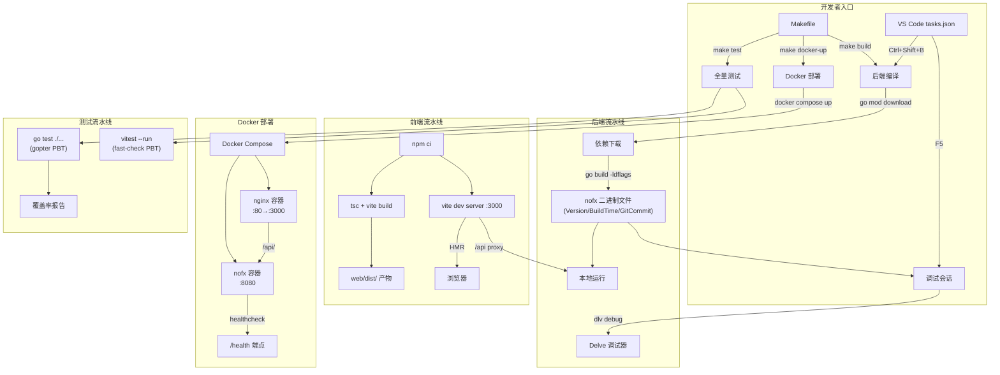
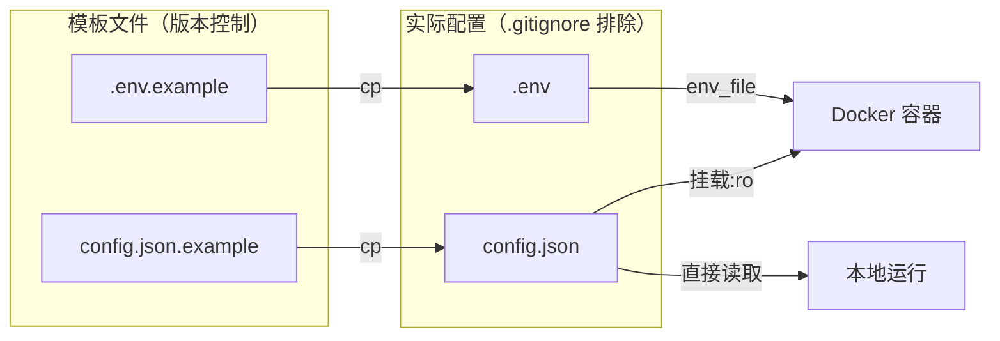

# 技术设计文档：编译、调试与运行流水线

## 概述

本设计为 NOFX 加密货币量化交易系统建立统一的编译、调试与运行流水线（Build-Debug-Run Pipeline）。系统采用 Go 后端 + React/TypeScript 前端的全栈架构，通过 Makefile 和 VS Code tasks.json 提供统一的任务入口，覆盖本地开发、调试、测试和 Docker 容器化部署的完整生命周期。

核心设计目标：
- 一条命令完成后端编译并注入版本元数据（git commit、构建时间）
- VS Code 内置调试配置，支持 Delve 断点调试
- 前端 Vite 开发服务器 + 生产构建流程
- Docker Compose 全栈部署，含健康检查和自动重启
- gopter（后端 PBT）+ vitest/fast-check（前端）双测试体系
- 环境配置模板化管理，敏感信息隔离

## 架构

### 流水线整体架构



### 配置层次



## 组件与接口

### 1. Makefile（统一构建编排器）

Makefile 作为所有构建、测试、部署操作的统一入口，定义以下目标：

| 目标 | 功能 | 依赖 |
|------|------|------|
| `build` | 后端编译 + ldflags 版本注入 | `go mod download` |
| `build-quick` | 快速编译（无版本注入） | - |
| `run` | 本地运行后端 | `build` |
| `test` | 全量测试（后端 + 前端） | - |
| `test-backend` | 仅后端测试 | - |
| `test-frontend` | 仅前端测试 | - |
| `test-coverage` | 带覆盖率的后端测试 | - |
| `dev` | 提示启动前端开发服务器 | - |
| `docker-up` | Docker Compose 构建并启动 | - |
| `docker-down` | Docker Compose 停止 | - |
| `clean` | 清理构建产物 | - |
| `install` | 安装所有依赖（Go + npm） | - |

ldflags 注入变量映射：
- `main.Version` ← `git describe --tags --always --dirty`
- `main.BuildTime` ← `date -u '+%Y-%m-%dT%H:%M:%SZ'`
- `main.GitCommit` ← `git rev-parse --short HEAD`

### 2. VS Code 调试配置（launch.json）

提供两个启动配置：

**Launch 配置**：直接以 dlv 调试模式启动 `main.go`，工作目录设为项目根目录 `${workspaceFolder}`，确保 `config.json` 和 `data/` 路径正确解析。编译参数包含 `CGO_ENABLED=1`（TA-Lib 依赖 CGO）。

**Attach 配置**：附加到已运行的 Delve 调试服务器（默认端口 `localhost:2345`），用于调试已启动的后端进程。

### 3. VS Code 任务配置（tasks.json）

定义以下任务，可通过 `Ctrl+Shift+P → Tasks: Run Task` 或快捷键触发：

- `Backend: Build` — 调用 `make build`
- `Backend: Run` — 调用 `make run`
- `Backend: Test` — 调用 `make test-backend`
- `Frontend: Install` — 在 `web/` 下执行 `npm ci`
- `Frontend: Build` — 在 `web/` 下执行 `npm run build`
- `Frontend: Test` — 在 `web/` 下执行 `npm run test`
- `Docker: Deploy` — 调用 `make docker-up`
- `All: Test` — 调用 `make test`

`Backend: Build` 设为默认构建任务（`group.build.isDefault: true`），配置 `$go` 问题匹配器以在编辑器中显示编译错误。

### 4. Docker 多阶段构建

**后端 Dockerfile**（已存在 `docker/Dockerfile.backend`）：
- Stage 1: TA-Lib 编译（Alpine + gcc）
- Stage 2: Go 编译（golang:1.25-alpine），复制 TA-Lib 库，`go mod download` + `go build`
- Stage 3: 运行时（alpine:latest），仅包含二进制文件 + TA-Lib 动态库 + ca-certificates + tzdata

**前端 Dockerfile**（已存在 `docker/Dockerfile.frontend`）：
- Stage 1: Node 构建（node:20-alpine），`npm ci` + `npm run build`
- Stage 2: Nginx 运行时，复制 `dist/` 和 `nginx.conf`

**Docker Compose**（已存在 `docker-compose.yml`）：
- `nofx` 服务：后端，端口 `${NOFX_BACKEND_PORT:-8080}:8080`，挂载 `config.json:ro` 和 `decision_logs/`
- `nofx-frontend` 服务：前端 Nginx，端口 `${NOFX_FRONTEND_PORT:-3000}:80`，依赖 `nofx`
- 健康检查：后端 `/health`（30s 间隔，10s 超时，3 次重试），前端 `/health`（Nginx 静态 200）

### 5. 测试执行器

**后端测试**：
- `go test ./...` 运行所有包测试
- `go test ./decision/...` 运行单包测试
- gopter PBT 使用 `testutil/` 包中的生成器，默认 100 次迭代
- `-cover` 标志生成覆盖率，`-coverprofile=coverage.out` 输出报告文件

**前端测试**：
- `vitest --run` 单次运行模式，执行 `web/src/**/*.test.ts`
- fast-check 库用于前端属性基测试
- vite.config.ts 已配置 `test.globals: true`

## 数据模型

### 版本元数据（编译时注入）

已在 `main.go` 中定义版本变量（`Version`、`BuildTime`、`GitCommit`），默认值为 `"dev"` / `"unknown"`。通过 `go build -ldflags` 在编译时覆盖：

```
-X main.Version=$(git describe --tags --always --dirty)
-X main.BuildTime=$(date -u '+%Y-%m-%dT%H:%M:%SZ')
-X main.GitCommit=$(git rev-parse --short HEAD)
```

### 环境变量模型（.env）

| 变量名 | 默认值 | 用途 |
|--------|--------|------|
| `NOFX_BACKEND_PORT` | `8080` | 后端 API 外部映射端口 |
| `NOFX_FRONTEND_PORT` | `3000` | 前端 Web 外部映射端口 |
| `NOFX_TIMEZONE` | `Asia/Shanghai` | 容器时区设置 |

### 运行时配置模型（config.json）

已由 `config/config.go` 定义，核心结构：
- `Config.Traders[]` — 交易者配置数组（ID、交易所、AI 模型、密钥等）
- `Config.Leverage` — 杠杆配置（BTC/ETH 和山寨币分别设置）
- `Config.APIServerPort` — API 服务端口（默认 8080）
- `Config.MaxDailyLoss` / `Config.MaxDrawdown` — 风控参数

### 构建产物

| 产物 | 路径 | 生成方式 |
|------|------|----------|
| 后端二进制 | `./nofx` | `go build -o nofx .` |
| 前端静态文件 | `web/dist/` | `cd web && npm run build` |
| 覆盖率报告 | `coverage.out` | `go test -coverprofile=coverage.out ./...` |
| Docker 镜像 | `nofx-trading`, `nofx-frontend` | `docker compose build` |


## 正确性属性（Correctness Properties）

*属性（Property）是指在系统所有有效执行中都应成立的特征或行为——本质上是对系统应做什么的形式化陈述。属性是人类可读规格说明与机器可验证正确性保证之间的桥梁。*

本流水线特性主要涉及构建工具配置和基础设施编排，大部分验收标准属于结构性要求（文件存在性、配置字段正确性）或外部工具行为（Go 编译器、Docker、Vite），不适合属性基测试。以下是从可测试的验收标准中提炼出的属性：

### Property 1: ldflags 版本注入格式正确性

*For any* 有效的版本字符串（version）、构建时间（buildTime）和 Git 提交哈希（gitCommit），生成的 ldflags 字符串应包含正确格式的 `-X main.Version=<version> -X main.BuildTime=<buildTime> -X main.GitCommit=<gitCommit>` 片段，且三个变量值均可从生成的字符串中完整提取回来（round-trip）。

**Validates: Requirements 1.2, 7.3**

### Property 2: 配置加载端口保持（JSON 序列化 round-trip）

*For any* 有效的 Config 结构体（包含至少一个启用的 Trader、合法的端口号和杠杆配置），将其序列化为 JSON 再通过 `LoadConfig` 反序列化后，`APIServerPort`、`Leverage`、`MaxDailyLoss`、`MaxDrawdown` 等数值字段应与原始值一致。

**Validates: Requirements 2.1, 6.1**

### Property 3: Makefile 目标完备性

*For any* 需求规定的 Makefile 目标名称（`build`、`run`、`test`、`test-backend`、`test-frontend`、`dev`、`docker-up`、`docker-down`、`clean`），Makefile 文件内容中应包含该目标的规则定义（匹配 `^<target>:` 模式）。

**Validates: Requirements 7.2**

## 错误处理

### 编译错误

| 场景 | 处理方式 |
|------|----------|
| Go 语法错误 | `go build` 输出文件名:行号:错误信息，Makefile 以非零退出码终止 |
| 依赖缺失 | `go mod download` 失败时输出模块名和错误，终止后续编译 |
| TypeScript 类型错误 | `tsc` 输出类型错误详情，`&&` 链式调用阻止 `vite build` 执行 |
| npm 依赖安装失败 | `npm ci` 输出错误信息并以非零退出码终止 |

### 运行时错误

| 场景 | 处理方式 |
|------|----------|
| `config.json` 不存在 | `loadAndValidateConfig` 返回错误，`main` 调用 `log.Fatalf` 输出提示并退出 |
| `config.json` 格式错误 | `json.Unmarshal` 返回解析错误，包含具体字段信息 |
| 配置验证失败（无启用 Trader） | `Config.Validate()` 返回明确错误信息 |
| API 端口被占用 | `apiServer.Start()` 返回 `bind: address already in use`，`main` 捕获并退出 |

### Docker 部署错误

| 场景 | 处理方式 |
|------|----------|
| 后端健康检查失败 | 30s 间隔检查 `/health`，连续 3 次失败后 Docker 自动重启容器（`restart: unless-stopped`） |
| 前端健康检查失败 | Nginx `/health` 返回静态 200，仅在 Nginx 进程异常时失败，触发容器重启 |
| 镜像构建失败 | `docker compose build` 输出构建日志和错误，以非零退出码终止 |
| 端口冲突 | Docker 输出端口绑定错误，需用户修改 `.env` 中的端口配置 |

### 测试错误

| 场景 | 处理方式 |
|------|----------|
| Go 测试失败 | `go test` 输出失败测试名称和断言详情，gopter 输出缩小后的反例 |
| 前端测试失败 | `vitest` 输出失败测试文件、断言详情和 diff |
| `make test` 部分失败 | 后端测试失败时立即终止（不继续前端测试），以非零退出码退出 |

## 测试策略

### 双重测试方法

本特性采用单元测试 + 属性基测试的双重策略：

- **单元测试**：验证具体示例、边界情况和错误条件
- **属性基测试**：验证跨所有输入的通用属性

两者互补：单元测试捕获具体 bug，属性测试验证通用正确性。

### 后端测试（Go + gopter）

**属性基测试库**：`github.com/leanovate/gopter`（已在项目中使用）

**配置**：
- 每个属性测试最少 100 次迭代（使用 `testutil.DefaultTestParameters()`）
- 固定随机种子（`Seed(42)`）确保可重现性
- 每个属性测试必须以注释引用设计文档中的属性编号

**标签格式**：
```go
// Feature: build-debug-run-pipeline, Property 1: ldflags 版本注入格式正确性
// Feature: build-debug-run-pipeline, Property 2: 配置加载端口保持
```

**属性测试实现**：
- Property 1（ldflags）：生成随机版本字符串、时间戳和 commit hash，验证 ldflags 构建函数的 round-trip 正确性
- Property 2（配置 round-trip）：使用 `testutil.GenConfig()` 生成随机 Config，序列化为 JSON 后重新加载，验证关键字段一致

**单元测试**：
- 验证 `config.json.example` 和 `.env.example` 文件存在
- 验证 `.gitignore` 包含 `config.json` 和 `.env`
- 验证 Makefile 包含所有必需目标（Property 3 也可作为单元测试实现，遍历目标列表）
- 验证 `launch.json` 包含 Launch 和 Attach 两个配置
- 验证 `tasks.json` 包含所有必需任务
- 验证 `docker-compose.yml` 包含健康检查和重启策略配置
- 验证 `nginx.conf` 包含 `/api/` 代理和 `/health` 端点
- 验证 `vite.config.ts` 包含端口 3000 和 `/api` 代理配置

### 前端测试（vitest + fast-check）

**属性基测试库**：`fast-check`（已在 `web/package.json` devDependencies 中）

**配置**：
- `vitest --run` 单次运行模式（非 watch 模式）
- `vite.config.ts` 中 `test.globals: true` 已配置

本流水线特性的前端测试主要为结构性验证（配置文件内容检查），不涉及前端组件逻辑的属性测试。前端属性测试基础设施（fast-check）已就绪，供其他功能特性使用。

### 每个属性对应单一属性测试

每个正确性属性必须由一个独立的属性基测试实现：

| 属性 | 测试文件 | 测试方法 |
|------|----------|----------|
| Property 1: ldflags 格式 | `pipeline_test.go`（新建） | gopter 属性测试 |
| Property 2: 配置 round-trip | `config/config_test.go`（扩展） | gopter 属性测试 |
| Property 3: Makefile 完备性 | `pipeline_test.go`（新建） | 单元测试（遍历目标列表） |
