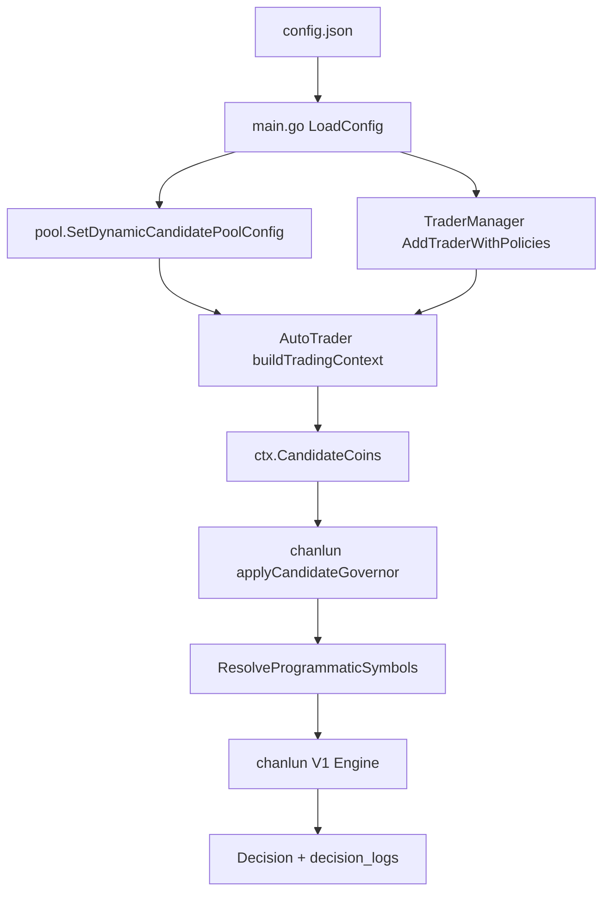

# Chanlun V1 Live Tuning Design

## Overview

本设计只做线上配置调优，不改 Go/React 源码。目标是让 `aster_deepseek` 的缠论 V1 在保留 `trade=1h` 的前提下减少候选浪费、降低结构识别门槛，并温和放宽 entry/RR 约束。

远程运行方式经只读确认：

- 项目路径：`/home/ubuntu/appai3/nofx`
- 后端端口：`8080`
- 前端端口：`3000`
- 后端进程：Docker 容器内 `./nofx`
- Compose 服务：`nofx`
- 普通 `ubuntu` 用户无法直接访问 Docker socket，重启需要 `sudo docker compose ...`

## Architecture



本次候选治理分两层：

1. 全局候选源：临时关闭 `dynamic_candidate_pool.enabled`，让顶层 `candidate_coins` 使用 `default_coins`，从源头移除 `XAUUSDT/CLUSDT/XAGUSDT`。
2. V1 内部候选：设置 `programmatic_strategy.symbol_pool.mode=override`，即使未来重新打开动态池，V1 仍只评估指定 crypto-only 列表。

这会影响同进程内 `aster_chanlun_v2` 的顶层候选来源，因为 `dynamic_candidate_pool` 是全局配置。设计接受这个影响，原因是当前用户目标是修复 V1 空转，且 V2 也在候选中看到相同的非加密标的污染。回滚时恢复备份即可。

## Config Mutation Plan

### Global Candidate Source

修改远程 `config.json` 顶层字段：

```json
{
  "use_default_coins": true,
  "default_coins": [
    "BTCUSDT",
    "ETHUSDT",
    "SOLUSDT",
    "BNBUSDT",
    "XRPUSDT",
    "DOGEUSDT",
    "LTCUSDT",
    "ADAUSDT",
    "HYPEUSDT",
    "ASTERUSDT"
  ],
  "dynamic_candidate_pool": {
    "enabled": false
  }
}
```

保留 `dynamic_candidate_pool` 其他字段不删除，只把 `enabled` 置为 `false`，方便回滚或未来重新启用。

`BCHUSDT` 暂不进入默认列表。最近线上日志中它多次触发 `quote_spread_too_high > 20bps`，短期不适合占用 V1 候选名额。

### V1 Symbol Pool

修改 `traders[].id == "aster_deepseek"` 的 `programmatic_strategy.symbol_pool`：

```json
{
  "mode": "override",
  "symbols": [
    "BTCUSDT",
    "ETHUSDT",
    "SOLUSDT",
    "BNBUSDT",
    "XRPUSDT",
    "DOGEUSDT",
    "LTCUSDT",
    "ADAUSDT",
    "HYPEUSDT",
    "ASTERUSDT"
  ],
  "core_symbols": ["BTCUSDT", "ETHUSDT"]
}
```

保留 `candidate_governor`：

```json
{
  "enabled": true,
  "allow_non_crypto_symbols": [],
  "max_quote_spread_bps": 20,
  "core_symbols_must_appear": ["BTCUSDT", "ETHUSDT"]
}
```

### Structure Thresholds

保留 1h 主周期：

```json
{
  "timeframes": {
    "higher": "4h",
    "trade": "1h",
    "sub": "15m",
    "micro": "3m"
  }
}
```

降低结构门槛：

```json
{
  "structure": {
    "left_bars": 2,
    "right_bars": 2,
    "min_stroke_bars": 4,
    "min_swing_pct": 0.2,
    "atr_multiplier": 0.35
  }
}
```

`left_bars/right_bars` 不放宽，避免信号数量突然膨胀。

### Entry And RR

保留 direct structure：

```json
{
  "entry_timing": {
    "direct_structure_open": true,
    "direct_structure_min_confidence": 70
  }
}
```

放宽 ATR 追价：

```json
{
  "entry_timing": {
    "entry_zone": {
      "max_chase_atr_multiplier": 0.8
    }
  }
}
```

统一 RR 口径：

```json
{
  "take_profit": {
    "min_net_rr": 2.0
  },
  "signal_freshness": {
    "min_remaining_net_rr": 2.0
  },
  "entry_timing": {
    "entry_zone": {
      "min_remaining_net_rr": 2.0,
      "signal_type_min_rr": {
        "buy1@1h": 1.8,
        "sell1@1h": 1.8,
        "buy2@1h": 1.4,
        "sell2@1h": 1.4,
        "buy3@1h": 1.2,
        "sell3@1h": 1.2,
        "buy1": 1.8,
        "sell1": 1.8,
        "buy2": 1.4,
        "sell2": 1.4,
        "buy3": 1.2,
        "sell3": 1.2
      }
    }
  }
}
```

保留 `theoretical_rr_unreachable_skip=true`，避免低 RR 结构继续反复进入生命周期。

### Loosen Mode

修改顶层 `trading_frequency.loosen_mode.max_chase_ratio_bump`：

```json
{
  "trading_frequency": {
    "loosen_mode": {
      "enabled": true,
      "max_chase_ratio_bump": 0.10
    }
  }
}
```

其他 loosen 字段保留原值：`inactivity_window_minutes=720`、`pilot_confidence_drop=10`、`min_net_rr_delta=-0.4`、`max_duration_hours=24`、`hard_floor_pilot_confidence=60`。

## Remote Edit Procedure

### Backup

在远程项目目录创建配置备份：

```bash
cd /home/ubuntu/appai3/nofx
ts=$(date +%Y%m%d_%H%M%S)
cp config.json "config.json.bak.chanlun-v1-live-tuning-${ts}"
```

### Patch

使用 Python JSON parser 修改配置，避免手写 JSON 造成格式错误。脚本只改目标字段，不读取或打印密钥：

```python
import json
from pathlib import Path

path = Path("config.json")
cfg = json.loads(path.read_text())

symbols = [
    "BTCUSDT", "ETHUSDT", "SOLUSDT", "BNBUSDT", "XRPUSDT",
    "DOGEUSDT", "LTCUSDT", "ADAUSDT", "HYPEUSDT", "ASTERUSDT",
]

cfg["use_default_coins"] = True
cfg["default_coins"] = symbols
cfg.setdefault("dynamic_candidate_pool", {})["enabled"] = False

loosen = cfg.setdefault("trading_frequency", {}).setdefault("loosen_mode", {})
loosen["enabled"] = True
loosen["max_chase_ratio_bump"] = 0.10

for trader in cfg.get("traders", []):
    if trader.get("id") != "aster_deepseek":
        continue
    ps = trader.setdefault("programmatic_strategy", {})
    ps["symbol_pool"] = {
        "mode": "override",
        "symbols": symbols,
        "core_symbols": ["BTCUSDT", "ETHUSDT"],
    }
    ps["candidate_governor"] = {
        "enabled": True,
        "allow_non_crypto_symbols": [],
        "max_quote_spread_bps": 20,
        "core_symbols_must_appear": ["BTCUSDT", "ETHUSDT"],
    }

    tf = ps.setdefault("timeframes", {})
    tf["higher"] = "4h"
    tf["trade"] = "1h"
    tf["sub"] = "15m"
    tf["micro"] = "3m"

    structure = ps.setdefault("structure", {})
    structure["left_bars"] = 2
    structure["right_bars"] = 2
    structure["min_stroke_bars"] = 4
    structure["min_swing_pct"] = 0.2
    structure["atr_multiplier"] = 0.35

    tp = ps.setdefault("take_profit", {})
    tp["mode"] = tp.get("mode") or "structure"
    tp["min_net_rr"] = 2.0

    freshness = ps.setdefault("signal_freshness", {})
    freshness["enabled"] = True
    freshness["missed_target_guard"] = True
    freshness["min_remaining_net_rr"] = 2.0

    entry = ps.setdefault("entry_timing", {})
    entry["enabled"] = True
    entry["direct_structure_open"] = True
    entry["direct_structure_min_confidence"] = 70
    zone = entry.setdefault("entry_zone", {})
    zone["min_remaining_net_rr"] = 2.0
    zone["max_chase_atr_multiplier"] = 0.8
    zone["theoretical_rr_unreachable_skip"] = True
    zone["signal_type_min_rr"] = {
        "buy1@1h": 1.8, "sell1@1h": 1.8,
        "buy2@1h": 1.4, "sell2@1h": 1.4,
        "buy3@1h": 1.2, "sell3@1h": 1.2,
        "buy1": 1.8, "sell1": 1.8,
        "buy2": 1.4, "sell2": 1.4,
        "buy3": 1.2, "sell3": 1.2,
    }
    break
else:
    raise SystemExit("aster_deepseek trader not found")

path.write_text(json.dumps(cfg, ensure_ascii=False, indent=2) + "\n")
```

### Validate JSON And Config Summary

```bash
python3 -m json.tool config.json >/dev/null
python3 - <<'PY'
import json
cfg = json.load(open("config.json"))
print("dynamic_enabled", cfg.get("dynamic_candidate_pool", {}).get("enabled"))
print("default_coins", cfg.get("default_coins"))
for t in cfg.get("traders", []):
    if t.get("id") == "aster_deepseek":
        ps = t["programmatic_strategy"]
        print("timeframes", ps.get("timeframes"))
        print("symbol_pool", ps.get("symbol_pool"))
        print("structure", ps.get("structure"))
        print("entry_zone", ps.get("entry_timing", {}).get("entry_zone"))
        print("take_profit", ps.get("take_profit"))
        print("signal_freshness", ps.get("signal_freshness"))
PY
```

## Restart Design

Preferred command:

```bash
cd /home/ubuntu/appai3/nofx
echo "$PASSWORD" | sudo -S docker compose restart nofx
```

Fallbacks:

1. If Compose plugin is unavailable, use `sudo docker-compose restart nofx`.
2. If Compose metadata is unavailable but container is still running, inspect the container name and use `sudo docker restart nofx-trading`.
3. Do not run `./nofx` directly on the host while Docker still owns port 8080.

Health check:

```bash
curl -fsS http://localhost:8080/health
```

Port sanity:

```bash
ss -lntp | grep -E ':8080|:3000'
```

## Observation Plan

Because `scan_interval_minutes=3`, observe at least 10 minutes after restart.

Validation script should inspect latest 3 new V1 logs after the restart timestamp:

- `timestamp`
- `cycle_number`
- `candidate_coins`
- `wait_reason_summary`
- `decisions`
- `risk_state.active_mode`
- `risk_state.frequency_policy`
- `risk_state.suppressions`
- `strategy_diagnostics.messages`
- `strategy_diagnostics.confidence_histogram`

Pass conditions:

- `candidate_coins` has no `XAUUSDT`、`XAGUSDT`、`CLUSDT`。
- `candidate_details` does not show `non_crypto_symbol` for the observed cycles.
- `risk_state.frequency_policy.loosen_mode.max_chase_ratio_bump` is `0.1`.
- V1 stays on `strategy_name=chanlun_programmatic` and `strategy_version=v1`.
- `timeframes.trade` remains `1h` in config summary.
- Service health is OK.

Strategic interpretation:

- If all three cycles still `wait/no_trigger`, deployment is technically valid if candidate pollution is gone and messages show crypto-only 1h evaluation.
- If `open_rejected` appears, capture exact `gate_reasons` and `reason_code`; this is useful progress because the strategy reached open validation again.
- If an open succeeds, immediately inspect `stop_loss_set` and `take_profit_set`/protection fields in the action log.

## Rollback

Rollback restores the backup file and restarts only the backend service:

```bash
cd /home/ubuntu/appai3/nofx
cp config.json.bak.chanlun-v1-live-tuning-YYYYMMDD_HHMMSS config.json
python3 -m json.tool config.json >/dev/null
echo "$PASSWORD" | sudo -S docker compose restart nofx
curl -fsS http://localhost:8080/health
```

Rollback triggers:

- JSON parse failure.
- Backend health check failure.
- Config validation failure on startup.
- New logs stop being written for more than 2 scan intervals.
- Observed candidates still contain non-crypto symbols after restart.
- Successful open appears without protection order status.

## Risks

- Disabling dynamic candidate pool is global and also affects `aster_chanlun_v2` in the same process.
- Lower structure thresholds can increase signal noise; direct risk validation remains enabled to block invalid SL/TP, low RR, BTC weak regime, and correlation concentration.
- Loosen chase bump affects global frequency policy. Current V1 is already in `loosen`, so this change can take effect quickly once a signal appears.
- `ASTERUSDT` is included as a crypto candidate because it appeared in recent dynamic candidates; if Aster execution rejects it, remove it in the next config-only rollback.

## No Code Changes

This design does not require local source edits. If later evidence shows config-only tuning is insufficient, a separate spec should handle code-level changes such as:

- per-trader dynamic candidate pool;
- dynamic-pool non-crypto hard filtering before `ctx.CandidateCoins`;
- explicit false override support for `trading_frequency.report_only`.
