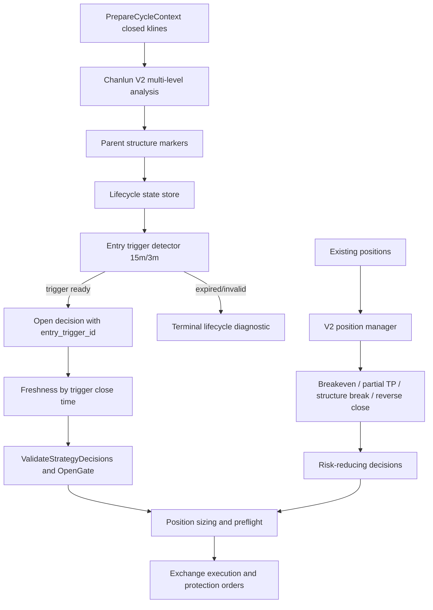

# Chanlun V2 Entry Exit Optimization Design

## Overview

161 日志显示，当前 V2 已经能识别并压制过期结构信号，但仍缺少从“结构背景”到“可执行入场触发”的中间层。正确方向不是放宽 hard freshness，让 BNB/HYPE 这类 20 根 1h 以前的结构信号重新开仓，而是把 V2 信号拆成两层：

- Parent structure layer: 记录 1h 缠论买卖点结构，只作为方向、风险区间和生命周期背景。
- Entry trigger layer: 在 parent structure 之后，由 15m/3m 新鲜触发产生可执行 open 决策。

平仓侧则需要从“等待 1h 反向信号”扩展为“多层风险降低管理”：保本、分批止盈、结构破坏、浮盈回撤、反向确认平仓都应在新开仓之前执行。

## Design Principles

- 不用旧结构直接开仓：旧 `buy2/sell2` 可显示、可跟踪，但不可直接作为 open action。
- 可执行动作必须新鲜：open freshness 基于 entry trigger close time。
- 风控不放松：BTC regime、ADX/DI、RR、sizing、preflight 均保留。
- 平仓优先：risk-reducing action 在每周期先于新开仓执行。
- 生命周期可审计：parent structure、entry trigger、open rejection、close action 都能用 ID 串起来。
- 渐进上线：先 report-only 和 replay，再小仓位 pilot，最后启用完整执行。

## Architecture



## Log Findings Applied To Design

### Finding 1: Structure latency is too large for direct open

Examples from 161:

- `BNBUSDT buy2` was evaluated 19 to 20 trade candles after its structure time.
- `CLUSDT buy2` was evaluated 8 to 9 trade candles after its structure time.
- `DOGEUSDT buy3` was evaluated 58 trade candles after its structure time.

Design response:

- Parent structures older than `direct_open_max_age_candles` become background-only.
- Open action is generated only from a fresh entry trigger.

### Finding 2: Existing freshness gate is necessary but insufficient

Latest 161 logs show stale signals are already downgraded:

- `raw_signal_count=2`
- `signal_count=0`
- BNB/HYPE repeated stale signals are diagnostic-only.

Design response:

- Keep existing freshness and stale suppression.
- Add entry trigger layer so valid structures can still become trades if a new 15m/3m confirmation appears.

### Finding 3: Open gate is doing useful protection

Fresh DOGE long at age 1 was rejected because:

- symbol was in down structure,
- DI direction conflicted,
- BTC 1h/4h was bearish for high beta long.

Design response:

- Entry trigger only creates candidates.
- Existing open gate remains the final market regime and risk filter.

### Finding 4: Zero quantity must never reach execution

Historical `open_long` decisions failed with `仓位大小必须>0`.

Design response:

- Add an execution preflight fail-safe before any exchange order call.
- Convert zero quantity to structured `open_rejected` with `position_sizing.zero_quantity`.

## Technical Design

### 1. Configuration

Add optional config under `config.ChanlunV2StrategyConfig`:

```go
type ChanlunV2EntryTimingConfig struct {
    Enabled                      *bool    `json:"enabled,omitempty"`
    DirectStructureOpen          bool     `json:"direct_structure_open,omitempty"`
    DirectOpenMaxAgeCandles      int      `json:"direct_open_max_age_candles,omitempty"`
    WatchTimeframe               string   `json:"watch_timeframe,omitempty"`
    WatchMaxCandles              int      `json:"watch_max_candles,omitempty"`
    TriggerTimeframe             string   `json:"trigger_timeframe,omitempty"`
    MaxTriggerAgeCandles         int      `json:"max_trigger_age_candles,omitempty"`
    AllowedTriggerTypes          []string `json:"allowed_trigger_types,omitempty"`
    MinTriggerConfidence         int      `json:"min_trigger_confidence,omitempty"`
    EntryZone                    ChanlunV2EntryZoneConfig `json:"entry_zone,omitempty"`
    ThirdPointQuality            ChanlunV2ThirdPointQualityConfig `json:"third_point_quality,omitempty"`
    PilotEnabled                 bool     `json:"pilot_enabled,omitempty"`
    PilotRiskFraction            float64  `json:"pilot_risk_fraction,omitempty"`
}

type ChanlunV2EntryZoneConfig struct {
    Mode                         string  `json:"mode,omitempty"`
    MaxChaseRatio                float64 `json:"max_chase_ratio,omitempty"`
    MinRemainingNetRR            float64 `json:"min_remaining_net_rr,omitempty"`
    MaxChaseATRMultiplier        float64 `json:"max_chase_atr_multiplier,omitempty"`
}

type ChanlunV2ThirdPointQualityConfig struct {
    Enabled                      *bool   `json:"enabled,omitempty"`
    QualityTimeframe             string  `json:"quality_timeframe,omitempty"`
    UseATRNormalization          *bool   `json:"use_atr_normalization,omitempty"`
    UseSymbolPercentiles         bool    `json:"use_symbol_percentiles,omitempty"`
    PercentileLookbackCandles    int     `json:"percentile_lookback_candles,omitempty"`
    MaxSupportGapPercentile      float64 `json:"max_support_gap_percentile,omitempty"`
    MaxSupportGapPct             float64 `json:"max_support_gap_pct,omitempty"`
    MaxSupportGapATR             float64 `json:"max_support_gap_atr,omitempty"`
    MaxRetracementRatio          float64 `json:"max_retracement_ratio,omitempty"`
    MaxPullbackCandles           int     `json:"max_pullback_candles,omitempty"`
    RangePullbackCandles         int     `json:"range_pullback_candles,omitempty"`
    RangeRiskFraction            float64 `json:"range_risk_fraction,omitempty"`
}
```

Suggested defaults:

- `enabled=true`
- `direct_structure_open=false`
- `direct_open_max_age_candles=0`
- `watch_timeframe=15m`
- `watch_max_candles=8`
- `trigger_timeframe=15m`
- `max_trigger_age_candles=1`
- `allowed_trigger_types=["pullback_retest_resume","breakout_continuation","micro_reversal_confirm"]`
- `min_trigger_confidence=65`
- `entry_zone.mode="structure_range"`
- `entry_zone.max_chase_ratio=0.35`
- `entry_zone.min_remaining_net_rr=2.5`
- `entry_zone.max_chase_atr_multiplier=0.6`
- `third_point_quality.enabled=true`
- `third_point_quality.quality_timeframe="watch"`，默认使用 `15m`，但可配置为 `trade` 或 `trigger`
- `third_point_quality.use_atr_normalization=true`
- `third_point_quality.percentile_lookback_candles=480`
- `third_point_quality.max_support_gap_percentile=70`
- `third_point_quality.max_support_gap_pct=1.0` 仅作为 1h profile seed，实际优先使用 ATR/分位数归一化
- `third_point_quality.max_support_gap_atr=0.6`
- `third_point_quality.max_retracement_ratio=0.55`
- `third_point_quality.max_pullback_candles=5`
- `third_point_quality.range_pullback_candles=8`
- `third_point_quality.range_risk_fraction=0.5`
- `pilot_enabled=false` for first rollout

Add optional V2 position management config:

```go
type ChanlunV2PositionManagementConfig struct {
    Enabled                      *bool   `json:"enabled,omitempty"`
    BreakevenEnabled             *bool   `json:"breakeven_enabled,omitempty"`
    BreakevenTriggerR            float64 `json:"breakeven_trigger_r,omitempty"`
    BreakevenBufferPct           float64 `json:"breakeven_buffer_pct,omitempty"`
    PartialTakeProfitEnabled     *bool   `json:"partial_take_profit_enabled,omitempty"`
    PartialTakeProfitR           float64 `json:"partial_take_profit_r,omitempty"`
    PartialTakeProfitPct         float64 `json:"partial_take_profit_pct,omitempty"`
    StructureBreakEnabled        *bool   `json:"structure_break_enabled,omitempty"`
    StructureBreakTimeframe      string  `json:"structure_break_timeframe,omitempty"`
    StructureBreakConfirmBars    int     `json:"structure_break_confirm_bars,omitempty"`
    FloatingDrawdownEnabled      *bool   `json:"floating_drawdown_enabled,omitempty"`
    FloatingDrawdownActivationR  float64 `json:"floating_drawdown_activation_r,omitempty"`
    FloatingDrawdownPct          float64 `json:"floating_drawdown_pct,omitempty"`
    ReverseSignalCloseEnabled    *bool   `json:"reverse_signal_close_enabled,omitempty"`
    ReverseSignalMinConfidence   int     `json:"reverse_signal_min_confidence,omitempty"`
}
```

Suggested defaults:

- `enabled=true`
- breakeven at `1.0R`
- partial take profit `50%` at `1.5R`
- structure break on `15m`, confirm 1 to 2 bars
- floating drawdown activates at `1.5R`, drawdown `40%`
- reverse signal close enabled at confidence `60`

### 2. Lifecycle State

Add `strategy/chanlunv2/state.go`:

```go
type SignalLifecycleState struct {
    TraderID              string `json:"trader_id"`
    Symbol                string `json:"symbol"`
    ParentSignalID        string `json:"parent_signal_id"`
    ParentSignalType      string `json:"parent_signal_type"`
    ParentSignalCloseTime int64  `json:"parent_signal_close_time"`
    Direction             string `json:"direction"`
    Status                string `json:"status"`
    EntryTriggerID        string `json:"entry_trigger_id,omitempty"`
    EntryTriggerType      string `json:"entry_trigger_type,omitempty"`
    EntryTriggerCloseTime int64  `json:"entry_trigger_close_time,omitempty"`
    LastEvaluationTime    int64  `json:"last_evaluation_time,omitempty"`
    TerminalReasonCode    string `json:"terminal_reason_code,omitempty"`
    UpdatedAt             int64  `json:"updated_at"`
}
```

Statuses:

- `structure_seen`
- `watching_entry`
- `entry_trigger_ready`
- `open_attempted`
- `position_opened`
- `terminal_expired`
- `terminal_invalidated`
- `terminal_target_crossed`
- `terminal_rr_invalid`
- `closed`

Persistence:

- Runtime path: `data/chanlun_v2_lifecycle_{trader_id}.json`
- Atomic write via temp file + rename.
- Do not commit runtime state.

### 3. Parent Structure Processing

Current `multiLevelJudgment()` returns trade timeframe signals. New flow:

1. Convert every trade signal into a parent structure marker.
2. Calculate parent age from `parent_signal_close_time` to current `evaluation_close_time`.
3. If direct open is disabled or parent age exceeds direct window, do not create open decision.
4. Start or update lifecycle as `watching_entry` if:
   - parent is not terminal,
   - target not crossed,
   - remaining RR not below minimum,
   - watch window not expired.
5. If watch window expired, mark terminal and keep marker visible as background/invalidated.

### 4. Entry Trigger Detector

Add `strategy/chanlunv2/entry_timing.go`.

Inputs:

- parent structure signal
- `market.Data.Klines["15m"]`
- optional `market.Data.Klines["3m"]`
- current price, stop loss, take profit, ATR/ADX context

Trigger types:

- `pullback_retest_resume`: price pulls back toward entry/structure zone and closes back in parent direction.
- `breakout_continuation`: after parent structure, sub timeframe breaks a local pivot in parent direction without target crossing.
- `micro_reversal_confirm`: 3m prints a local reversal pattern after 15m pullback.

Output:

```go
type EntryTrigger struct {
    ID                    string
    Type                  string
    Timeframe             string
    CloseTime             int64
    ParentSignalID        string
    ParentSignalCloseTime int64
    Direction             string
    Confidence            int
    EntryPrice            float64
    StopLoss              float64
    TakeProfit            float64
    QualityCategory       string
    QualityMetrics        *ThirdPointQualityMetrics
    Diagnostics           map[string]any
}
```

Open decision conversion:

- `SignalID = EntryTrigger.ID`
- `signal_close_time = EntryTrigger.CloseTime`
- `trigger_close_time = EntryTrigger.CloseTime`
- `parent_signal_id = ParentSignalID`
- `parent_signal_close_time = ParentSignalCloseTime`
- `entry_trigger_type = Type`
- `layer = "entry_trigger"`

This is the critical fix: executable freshness now measures the trigger, not the old structure.

### 4.1 Third Buy/Sell Quality Model

User proposed `D/N` classification is incorporated as a side-aware third buy/sell quality layer. The implementation should not hardcode hourly thresholds; it should produce comparable metrics across `1h`、`15m`、`3m` and different symbol volatility profiles.

Metrics:

```go
type ThirdPointQualityMetrics struct {
    P0                    float64 `json:"p0"`
    P1                    float64 `json:"p1"`
    BreakoutExtreme       float64 `json:"breakout_extreme"`
    SupportGapPct         float64 `json:"support_gap_pct"`          // G
    SupportGapATR         float64 `json:"support_gap_atr"`          // G_ATR
    RetracementRatio      float64 `json:"retracement_ratio"`        // R
    PullbackCandles       int     `json:"pullback_candles"`         // N
    QualityTimeframe      string  `json:"quality_timeframe"`
    RemainingNetRR        float64 `json:"remaining_net_rr"`
}
```

Data source mapping in existing V2 structures:

- `P0` should be resolved from `Signal.CenterID` against `AnalysisResult.Centers`. For long `buy3`, use center `ZG`; for short `sell3`, use center `ZD`.
- If `CenterID` is missing or the referenced center cannot be found, the trigger cannot be classified as `strong_third_buy/sell`; record `third_point.missing_center_boundary` and fall back to normal entry trigger evaluation only if config allows non-third-point triggers.
- The breakout candle is the first closed K line on `quality_timeframe` after the center boundary is available whose close is directionally beyond `P0`.
- `P1` should use the first confirmed pullback/rebound fractal after breakout when available. If no fractal is available before the resume trigger, use the local extreme from closed K lines between breakout and trigger close.
- Long H and short L are the direction extremes between breakout and P1, computed from closed K lines only.

Side-aware formulas:

- Long third buy: `G=(P1-P0)/P0`; invalid if `G <= 0`.
- Short third sell: `G=(P0-P1)/P0`; invalid if `G <= 0`.
- Long retracement: `R=(H-P1)/(H-P0)`, where H is the breakout high before P1.
- Short retracement: `R=(P1-L)/(P0-L)`, where L is the breakout low before P1.
- `N` is counted on `quality_timeframe`; for non-1h profiles compare either per-timeframe thresholds or minute-normalized equivalents.
- `G_ATR=abs(P1-P0)/ATR(quality_timeframe)` is the preferred cross-symbol distance guard. Percent thresholds like `1.0%/1.5%/3.0%` are only operator profile seeds.

Classifier:

- `third_point.reentered_center`: `G <= 0`, meaning the pullback/rebound returned into the center boundary.
- `entry_zone_chased` / `third_point.chased`: `G_ATR` or symbol percentile distance is too large, meaning entry is far from the structure boundary.
- `third_point.deep_retracement`: `R` is too large, meaning the breakout leg was mostly retraced.
- `third_point.range_after_breakout`: `N` exceeds the range threshold; direct strong third-point entry is disabled, but a secondary smaller-level trigger may still be evaluated with reduced risk.
- `strong_third_buy` / `strong_third_sell`: `G > 0`, `G_ATR` acceptable, `R` acceptable, `N` within max, and remaining net RR passes.

Volume, OI, taker imbalance and funding can enrich diagnostics or confidence, but they should not bypass the hard `G/R/N/G_ATR/RR` gates.

### 5. Freshness And Open Validation

Reuse existing `applyChanlunV2FreshnessGuard`, but support trigger metadata:

- If `trigger_close_time` exists, use it as executable signal close time.
- Preserve parent fields separately.
- Continue target-crossed and remaining RR checks.
- Continue stale suppression for terminal trigger/open states.

Validation order:

1. parent lifecycle terminal checks
2. entry trigger freshness
3. third buy/sell quality checks: `G/R/N/G_ATR`
4. remaining RR and chase checks
5. `decision.ValidateStrategyDecisions()` for open-like decisions, preserving its existing open gate, risk normalization and sizing behavior
6. explicit V2 sizing/preflight fail-safe for any deterministic zero-quantity or min-notional miss that escapes validation
7. `decision.ValidateRiskReducingStrategyDecisions()` or an equivalent V2 wrapper for risk-reducing actions
8. execution preflight

### 6. Sizing Fail-Safe

Add or tighten V2 validation around `validateChanlunV2Decisions()` and `AutoTrader.executeDecision()`:

- Any open-like decision with `Quantity <= 0` after sizing is not executable.
- The rejection reason should be structured:
  - `position_sizing.zero_quantity`
  - `position_sizing.min_notional`
  - `position_sizing.insufficient_margin`
  - `preflight.invalid_sl_tp`
- `DecisionRecord` should receive `open_rejected`, not failed `open_long`.

### 7. Position Management

Add `strategy/chanlunv2/position_management.go`.

Run before new opens:

```go
func (e *Engine) managePositionsV2(ctx *decision.Context, timeframes map[string]string) []decision.Decision
```

Decision priority:

1. Exchange/account reconciliation and protection repair remain in trader layer.
2. Hard close:
   - 1h reverse signal with confidence >= configured threshold plus sub/micro confirmation.
   - 15m structure break confirmed against the position.
3. Partial close:
   - first target / R threshold.
   - floating drawdown after activation.
4. Move stop:
   - breakeven after R threshold.
   - trail behind 15m swing or ATR band.

Risk-reducing actions:

- Must execute before open-like actions.
- Must preserve `CancelStopLossOrders()` and `CancelTakeProfitOrders()` split.
- Must not be blocked by open signal freshness.
- Must still pass exchange precision, position existence and min close quantity checks.

### 8. Observability

Extend V2 diagnostics:

```json
{
  "parent_signal_count": 2,
  "entry_trigger_count": 1,
  "structure_to_trigger_latency_candles": 3,
  "third_point_quality": {
    "category": "strong_third_buy",
    "support_gap_atr": 0.42,
    "retracement_ratio": 0.31,
    "pullback_candles": 4
  },
  "entry_trigger_rejections": ["entry_zone_chased"],
  "position_management_actions": ["breakeven_move_stop"],
  "open_conversion": {
    "parent_seen": 10,
    "trigger_ready": 2,
    "open_validated": 1,
    "executed": 0
  }
}
```

Marker fields:

- `parent_signal_id`
- `parent_signal_close_time`
- `entry_trigger_id`
- `entry_trigger_type`
- `trigger_close_time`
- `structure_to_trigger_latency_candles`
- `third_point_quality_category`
- `support_gap_pct`
- `support_gap_atr`
- `retracement_ratio`
- `pullback_candles`
- existing `signal_close_time`, `decision_close_time`, `evaluation_close_time`, `action_timestamp`, `freshness_state`, `age_candles`

### 9. Rollout

Phase A: report-only

- Parent structures and entry triggers are logged and shown in strategy check.
- No new open decisions from entry triggers yet.

Phase B: validation-only

- Entry triggers produce open candidates, but execution disabled or converted to `open_rejected` with `report_only`.
- Compare trigger latency and rejection distribution against 161 logs.

Phase C: pilot

- Enable pilot only for BTC/ETH or configured symbols.
- Use reduced risk fraction, e.g. 25% to 50% of normal sizing.

Phase D: full

- Enable all configured symbols after replay and live dry-run pass.

## Compatibility

- Existing V2 freshness defaults stay enabled.
- Existing stale suppression remains; lifecycle persistence improves restart behavior.
- Old logs without parent/trigger fields remain readable.
- No exchange interface change is required unless close action types need richer metadata.
- Tests must use fake trader/mock exchange and must not place real orders.

## Risks

- Entry trigger rules may overfit if thresholds are tuned only on one day of 161 logs.
- Persisted lifecycle state can suppress valid new structures if IDs are not stable and specific enough.
- More position management actions increase exchange order complexity; protective order cancellation must remain split by stop-loss/take-profit.
- Too much pilot looseness in bearish BTC regime can recreate rejected long pressure, so open gate must remain final.
