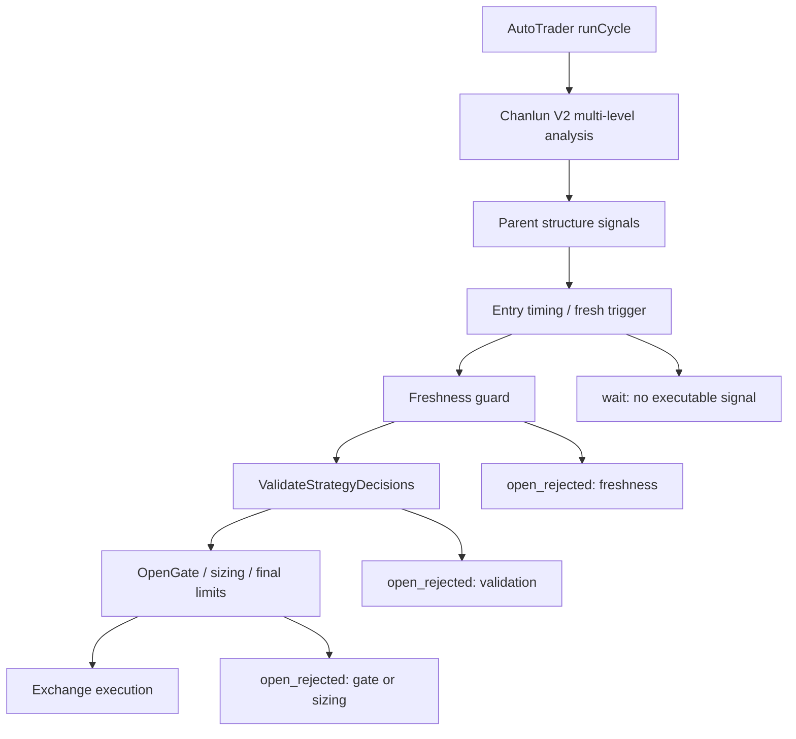

# 缠论 V2 最近 48 小时无开仓诊断与优化设计

## 总览

最近 48 小时无开仓不是单纯“没有信号”。日志显示每个周期都有父结构信号，最终没有开仓的主因是可执行 entry trigger 极少，且 3 个真正进入开仓候选的 `sell2` trigger 被旧 freshness RR 逻辑按全局 2.5 阈值过滤。

当前本地 HEAD 已包含关键修复方向：`minRemainingNetRR(ctx, policy, signalType)` 会按有效信号类型读取 `entry_timing.entry_zone.signal_type_min_rr`，并支持 loosen mode 放宽。但运行日志缺少 HEAD 新增的 `active_mode` 与 `effective_entry_timing` 诊断字段，说明需要把“代码已同步”与“运行进程已重启到新代码”分开验证。

## 开仓链路



## 日志事实

分析命令：

```bash
GOCACHE=/tmp/nofx-go-build-cache go run ./cmd/replay \
  -log-dir decision_logs \
  -trader aster_chanlun_v2 \
  -from 2026-05-29T17:25:00+08:00 \
  -to 2026-05-31T23:59:59+08:00 \
  -open-rejection-daily \
  -near-miss-limit 20
```

结果摘要：

| 指标 | 数值 |
| --- | ---: |
| 决策记录 | 961 |
| 成功开仓 | 0 |
| `final_action=wait` | 961 |
| `open_rejected` | 3 |
| `raw_signal_count` 合计 | 4028 |
| `entry_trigger_count` 合计 | 3 |
| freshness RR 拒绝 | 3 |
| 直接 RR 终态 | 15 |
| 重复终态静默 | 3884 |
| 等待 fresh entry trigger | 86 |
| entry zone chased | 39 |

3 个 open rejected 样本：

| 时间 | Symbol | Intent | Signal | 剩余净 RR | 日志阈值 | 配置信号阈值 |
| --- | --- | --- | --- | ---: | ---: | ---: |
| 2026-05-30 15:15:13 +08:00 | ADAUSDT | open_short | sell2 | 1.19 | 2.5 | 1.1 |
| 2026-05-30 16:48:13 +08:00 | ADAUSDT | open_short | sell2 | 1.16 | 2.5 | 1.1 |
| 2026-05-31 02:30:14 +08:00 | DOGEUSDT | open_short | sell2 | 1.90 | 2.5 | 1.1 |

风险状态摘要：

- `open_count_24h=0`
- `daily_open_limit=2`
- `remaining_risk_budget=0.08`
- `loss_mode.active=false`
- `auto_rollback_active=false`

因此最近 48 小时无开仓的主因不在账户硬停、亏损模式、持仓上限或日开仓次数上限。

## 代码归因

### 旧运行逻辑

旧版本 `strategy/chanlunv2/engine.go` 中：

- `enrichChanlunV2FreshnessMetadata()` 调用 `e.minRemainingNetRR(ctx, policy)`。
- `minRemainingNetRR()` 优先返回 `strategy_risk.default_min_net_rr`，即 2.5。
- 对 entry trigger 来说，日志虽有 `parent_signal_type=sell2`，但旧代码没有用该信号类型取 `entry_timing.entry_zone.signal_type_min_rr.sell2=1.1`。

这导致 3 个 `sell2` trigger 被错误当成需要 2.5 净 RR 的普通趋势开仓。

### 当前 HEAD 逻辑

当前 `dd023df3b` 中：

- `enrichChanlunV2FreshnessMetadata()` 通过 `effectiveChanlunV2DecisionSignalType(d)` 解析 `SignalType`、`parent_signal_type`、`signal_type`。
- `minRemainingNetRR(ctx, policy, signalType)` 在有信号类型时调用 `minRemainingNetRRForV2Signal(e.effectiveEntryTiming(ctx), signalType)`。
- loosen mode 通过 `applyEffectiveV2MinRR()` 作用于 freshness RR。
- `StrategyDiagnostics` 预期包含 `active_mode` 与 `effective_entry_timing`，便于判断放宽是否生效。

因此第一优先级不是继续降低全局阈值，而是重启/部署当前 HEAD 并验证日志字段与行为。

## 优化设计

### 1. 运行版本验证

增加或执行一次启动后验证：

- 确认最新日志的 `strategy_diagnostics` 包含 `active_mode`、`effective_entry_timing`。
- 确认 `config_hash` 与当前配置一致。
- 对新产生的 `open_rejected` 检查 `min_remaining_net_rr` 是否等于对应 `signal_type_min_rr`，例如 `sell2=1.1`。

可不修改代码，作为部署 checklist 执行。

### 2. Freshness RR 回归测试

在 `strategy/chanlunv2/engine_test.go` 添加覆盖：

- 构造 `entry_trigger` 层 Decision。
- `StrategyMetadata.parent_signal_type=sell2`。
- 当前价、止损、止盈构造出 remaining net RR 约 1.19。
- 配置 `sell2=1.1`、`default_min_net_rr=2.5`。
- 断言 `applyChanlunV2FreshnessGuard()` 不返回 `freshness_gate.rr_invalid`。

再补一个缺失信号类型用例，确保回退仍使用全局或默认阈值。

### 3. Replay 兼容审计

扩展 `logger/replay.go` 或新增轻量函数，对历史 `freshness_gate.rr_invalid` 样本做只读审计：

- 从 `DecisionAction.StrategyMetadata` 读取 `parent_signal_type`、`remaining_net_rr`、`min_remaining_net_rr`。
- 优先由 `cmd/replay -config` 读取运行配置，并把 signal-type 阈值作为参数传入 `logger`；未提供配置时只使用日志已有字段和内置默认阈值，并在报告 notes 中标记。
- 输出“旧阈值拒绝但新阈值可通过”的样本数和 symbol。

这不重放交易，也不推断 open gate 一定通过，只说明 freshness RR 这层在新代码下不会再误杀。

### 4. No-open 诊断报表

增强现有 `BuildOpenRejectionDailyReport()`：

- 输出 `no_successful_open_hours`。
- 输出 top bucket：`freshness_rr_invalid`、`parent_rr_invalid`、`waiting_for_trigger`、`entry_zone_chased`、`terminal_suppressed`。
- 输出 “version_diagnostic_missing” 标记：日志缺少当前诊断字段时提示重启部署。

保持 report-only，不影响实盘。

### 5. 长时间无开仓的保守 loosen 策略

当前配置已启用：

- `trading_frequency.mode=balanced`
- `loosen_mode.enabled=true`
- `inactivity_window_minutes=720`
- `pilot_confidence_drop=10`
- `min_net_rr_delta=-0.4`
- `max_chase_ratio_bump=0.1`
- `hard_floor_pilot_confidence=60`

设计约束：

- loosen 只降低 entry trigger 触发门槛和 signal-type RR 门槛，不降低账户硬风控。
- loosen 不允许绕过 `ValidateStrategyDecisions()`、open gate、position sizing、exchange preflight。
- 本规格不接入 `PilotRiskFraction` 真实缩仓；候选通过后仍使用现有 position sizing 和账户风险预算决定可执行仓位。
- 每次成功开仓后自动回到 normal/balanced。
- 当 loss mode 或 safe mode 生效时退出 loosen。

在 HEAD 已有 `loosen_mode.go` 的基础上，重点补验证与可观测性，而不是再盲目放宽配置。

## 影响范围

### 后端

- `strategy/chanlunv2/engine.go`
- `strategy/chanlunv2/entry_timing.go`
- `strategy/chanlunv2/loosen_mode.go`
- `strategy/chanlunv2/engine_test.go`
- `logger/replay.go`
- `logger/replay_test.go`
- 可选：`cmd/replay/main.go`

### 运行配置

- 不建议立即降低 `strategy_risk.default_min_net_rr`。
- 保留 `entry_timing.entry_zone.signal_type_min_rr` 作为缠论 V2 分信号阈值来源。
- 如重启后仍长期无 trigger，可再评估 `entry_zone.max_chase_ratio`、`watch_max_candles` 和候选池覆盖，但必须基于新日志。

## 风险控制

- 不修改真实密钥、钱包地址或账户配置。
- 不修改 `data/`、`decision_logs/`、`coin_pool_cache/`。
- 测试和 replay 只读，不触发真实下单。
- 所有实盘开仓仍经过 `decision.ValidateStrategyDecisions()` 和交易所 preflight。

## 验证计划

1. 代码测试：

```bash
GOCACHE=/tmp/nofx-go-build-cache go test ./strategy/chanlunv2 ./logger ./decision
```

2. 日志 replay：

```bash
GOCACHE=/tmp/nofx-go-build-cache go run ./cmd/replay \
  -log-dir decision_logs \
  -trader aster_chanlun_v2 \
  -from 2026-05-29T17:25:00+08:00 \
  -to 2026-05-31T23:59:59+08:00 \
  -open-rejection-daily \
  -config config.json
```

3. 部署后验证：

- 新日志出现 `active_mode` 和 `effective_entry_timing`。
- 若再次出现 sell2 freshness RR 拒绝，`min_remaining_net_rr` 应为 1.1 或 loosen 后有效阈值，而不是 2.5。
- 若 freshness 通过但仍未开仓，下一层拒绝必须明确落在 open gate、sizing、final limit 或 exchange execution。
