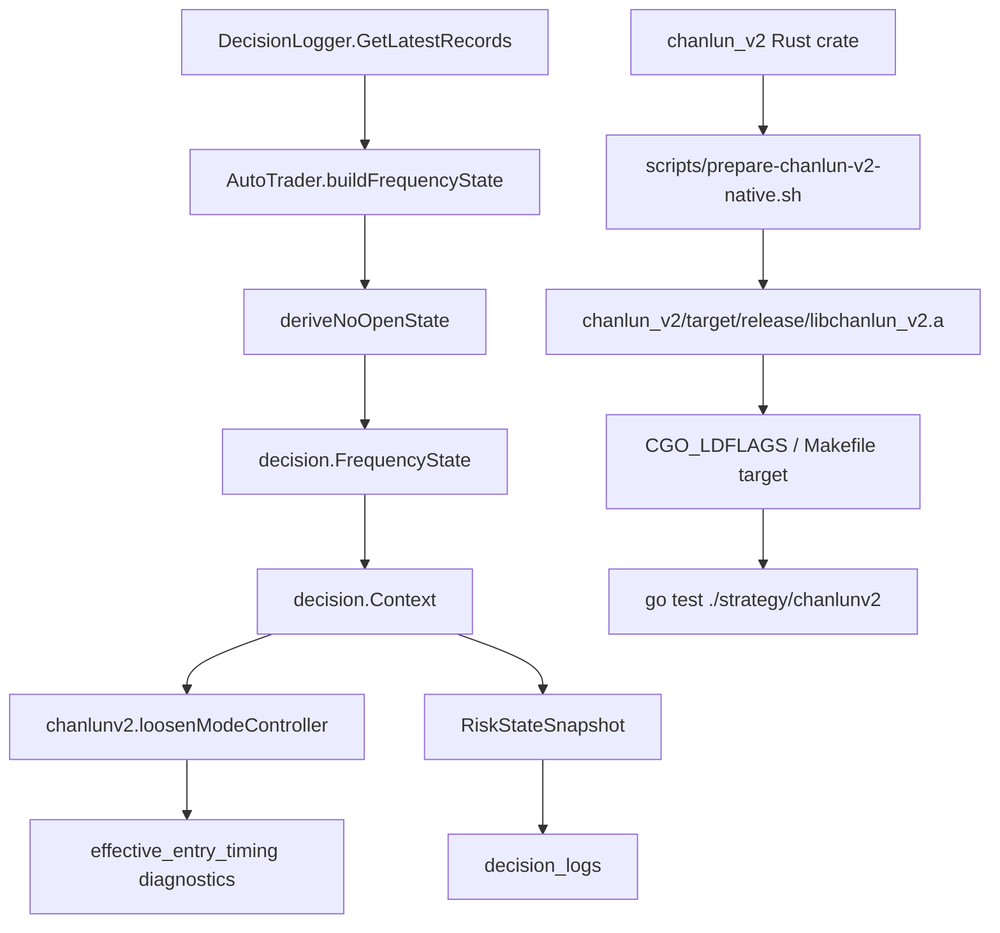

# 缠论 V2 运行态修正与部署验证设计

## 总览

本设计覆盖两个运行保障问题：

1. `loosen_mode` 当前使用 `ctx.RuntimeMinutes` 作为无成功开仓 fallback。服务重启后，即使历史日志已连续 50 小时无开仓，新进程仍从 0 分钟开始等待，导致 12 小时 loosen 窗口不能跨重启生效。
2. Chanlun V2 Go 包默认 CGO 链接 `libchanlun_v2.a`，但本机和 217 远端缺少该静态库与 `cargo`，默认 `go test ./strategy/chanlunv2` 无法闭环。

核心原则：

- 不改变 freshness RR 修复逻辑，不再放宽交易阈值。
- 不绕过 `decision` 的确定性风控链路。
- 不引入数据库，继续基于决策日志和 JSON 快照做可观测状态。
- 运行时修正只改变 loosen 进入时机，不改变仓位放大或交易所执行保护。
- native 依赖验证优先使用本地构建产物和脚本，不提交静态库二进制。

## 当前架构事实

- `trader.AutoTrader.buildContext()` 读取最近决策日志，构造 `decision.Context`。
- `trader.AutoTrader.buildFrequencyState()` 负责 `OpenCount24h`、`LastOpenAt`、`OpenRejected24h` 等频率状态。
- `strategy/chanlunv2.loosenModeController()` 进入 loosen 的关键逻辑是：
  - 若 `FrequencyState.LastOpenAt` 存在，使用 `time.Since(LastOpenAt)`。
  - 否则使用 `ctx.RuntimeMinutes`。
- `logger.RiskStateSnapshot` 已有 `InactivityMinutes` 和 `LastOpenAt`，但缺少 inactivity 来源、日志窗口起点和 warning。
- `strategy/chanlunv2/ffi.go` 通过 `#cgo LDFLAGS: -L/usr/local/lib -lchanlun_v2 -lm` 链接 Rust 静态库。
- Docker backend 构建阶段已经能从 `chanlun_v2/` 构建并复制 `libchanlun_v2.a`，但裸机 Makefile 和远端验证没有等价命令。

## 方案架构



## 设计 1：跨重启 no-open 状态

### 数据结构

在 `decision/types.go` 中扩展 `FrequencyState`，保持旧字段不变：

```go
type FrequencyState struct {
    OpenCount24h       int
    ClosedTrades24h    int
    ProfitFactor24h    float64
    Drawdown24hPct     float64
    AutoRollbackActive bool
    AutoRollbackReason string
    LastOpenAt         time.Time
    LastCloseAt        time.Time
    OpenRejected24h    int
    SignalCount24h     int

    InactivityMinutes  int       `json:"inactivity_minutes,omitempty"`
    InactivitySource   string    `json:"inactivity_source,omitempty"`
    NoOpenSince        time.Time `json:"no_open_since,omitempty"`
    LogWindowStart     time.Time `json:"log_window_start,omitempty"`
    LogWindowEnd       time.Time `json:"log_window_end,omitempty"`
    InactivityWarning  string    `json:"inactivity_warning,omitempty"`
}
```

`InactivitySource` 允许值：

- `last_successful_open`：从最近成功开仓时间开始计算。
- `log_window_start`：当前可读日志窗口内没有成功开仓，从窗口第一条记录开始计算。
- `runtime_fallback`：无日志或日志不可用，回退当前进程运行时长。

同步扩展 `logger.FrequencyStateSnapshot` 与 `logger.RiskStateSnapshot`：

```go
type FrequencyStateSnapshot struct {
    ...
    InactivityMinutes int    `json:"inactivity_minutes,omitempty"`
    InactivitySource  string `json:"inactivity_source,omitempty"`
    NoOpenSince       string `json:"no_open_since,omitempty"`
    LogWindowStart    string `json:"log_window_start,omitempty"`
    LogWindowEnd      string `json:"log_window_end,omitempty"`
    InactivityWarning string `json:"inactivity_warning,omitempty"`
}

type RiskStateSnapshot struct {
    ...
    InactivitySource  string `json:"inactivity_source,omitempty"`
    NoOpenSince       string `json:"no_open_since,omitempty"`
    LogWindowStart    string `json:"log_window_start,omitempty"`
    LogWindowEnd      string `json:"log_window_end,omitempty"`
    InactivityWarning string `json:"inactivity_warning,omitempty"`
}
```

保持 `RiskStateSnapshot.InactivityMinutes` 和 `LastOpenAt` 旧字段继续输出，避免破坏已有前端或 replay 读取。

### no-open 推导函数

在 `trader/auto_trader.go` 增加纯函数，便于单元测试：

```go
type noOpenState struct {
    Minutes int
    Source string
    Since time.Time
    LogWindowStart time.Time
    LogWindowEnd time.Time
    LastSuccessfulOpenAt time.Time
    Warning string
}

func deriveNoOpenState(records []*logger.DecisionRecord, traderID string, now time.Time, runtimeMinutes int) noOpenState
```

规则：

1. 忽略 nil record 和零时间 record。
2. 若 `traderID` 非空，优先只接受匹配当前 trader 的记录；正常运行链路中 records 已来自 `decision_logs/{trader_id}` 的 scoped `DecisionLogger`，该参数用于测试与未来复用时避免混入其他 trader。
3. `LogWindowStart` 为 scoped records 中最早有效 `record.Timestamp`。
4. `LogWindowEnd` 为 scoped records 中最晚有效 `record.Timestamp`。
5. `LastSuccessfulOpenAt` 复用或替代 `lastSuccessfulOpenAt(records)`：
   - 只统计 `action.Success == true` 且 open-like action。
   - open-like action 使用 `FinalAction` fallback 到 `Action` 判断，与 replay 的 no-open 报告口径保持一致。
   - action 时间优先 `action.Timestamp`，否则 `record.Timestamp`。
6. 若存在 `LastSuccessfulOpenAt`：
   - `Source=last_successful_open`
   - `Since=LastSuccessfulOpenAt`
   - `Minutes=max(0, now-Since)`
7. 若没有成功开仓但 `LogWindowStart` 存在：
   - `Source=log_window_start`
   - `Since=LogWindowStart`
   - `Minutes=max(0, now-Since)`
8. 若无有效日志：
   - `Source=runtime_fallback`
   - `Since=now-runtimeMinutes`
   - `Minutes=runtimeMinutes`
   - `Warning=frequency_history_unavailable`

时间统一使用 `time.Now()` 传入，避免测试中依赖真实时间。

### buildFrequencyState 修改

将 `buildFrequencyState(records, accountEquity)` 改为内部使用当前时间：

```go
func (at *AutoTrader) buildFrequencyState(records []*logger.DecisionRecord, accountEquity float64) decision.FrequencyState {
    return at.buildFrequencyStateAt(records, accountEquity, time.Now())
}

func (at *AutoTrader) buildFrequencyStateAt(records []*logger.DecisionRecord, accountEquity float64, now time.Time) decision.FrequencyState
```

`buildFrequencyStateAt`：

- 继续计算原有 24h/rollback window 统计。
- 调用 `deriveNoOpenState(records, at.id, now, int(now.Sub(at.startTime).Minutes()))`。
- 填充 `FrequencyState.InactivityMinutes`、`InactivitySource`、`NoOpenSince`、`LogWindowStart`、`LogWindowEnd`、`InactivityWarning`。
- `LastOpenAt` 继续填最近成功开仓时间，保留兼容。

`loadRecentDecisionRecords` 的 limit 从固定 500 调整为按 loosen 窗口推导：

```go
func (at *AutoTrader) frequencyRecordLimit() int
```

建议：

- 基础值 500。
- 若 `LoosenMode.InactivityWindowMinutes > 0` 且 `ScanIntervalMinutes > 0`，取 `ceil(window/scanInterval)*2 + 20`。
- 上限 10000，避免异常配置导致每周期读过多文件。

这样 720 分钟、3 分钟周期时至少读取约 500 条，仍覆盖 12 小时以上；更长窗口也能被有界覆盖。

## 设计 2：loosenModeController 使用 no-open 状态

新增 helper：

```go
func inactivityDurationForLoosen(ctx *decision.Context) time.Duration
```

优先级：

1. `ctx.FrequencyState.InactivityMinutes > 0`
2. `ctx.FrequencyState.LastOpenAt` 非零
3. `ctx.RuntimeMinutes`

然后在 `loosenModeController` 中替换现有：

```go
inactiveFor := time.Duration(ctx.RuntimeMinutes) * time.Minute
if ctx.FrequencyState != nil && !ctx.FrequencyState.LastOpenAt.IsZero() {
    inactiveFor = time.Since(ctx.FrequencyState.LastOpenAt)
}
```

改为：

```go
inactiveFor := inactivityDurationForLoosen(ctx)
```

退出条件不变：

- loss mode active
- safe/loss effective mode
- `OpenCount24h > 0`

loosen 调整不变：

- `MinNetRRDelta`
- `MaxChaseRatioBump`
- `PilotConfidenceDrop`
- `HardFloorPilotConfidence`

不改 `ValidateStrategyDecisions()`、open gate、position sizing、exchange preflight。

## 设计 3：日志与 replay 可观测性

### 风险状态输出

更新 `AutoTrader.buildRiskStateSnapshot()`：

- 从 `ctx.FrequencyState` 复制：
  - `InactivityMinutes`
  - `InactivitySource`
  - `NoOpenSince`
  - `LogWindowStart`
  - `LogWindowEnd`
  - `InactivityWarning`
- 同步写入顶层 `RiskStateSnapshot` 与嵌套 `FrequencyStateSnapshot`。
- 如果 `InactivityWarning != ""`，追加到 `snapshot.Warnings`，例如：

```go
snapshot.Warnings["frequency_history_unavailable"] = true
```

### Strategy diagnostics

`strategy/chanlunv2.effectiveEntryTimingDiagnostics()` 可增加只读诊断字段：

```go
"inactivity_minutes": ctx.FrequencyState.InactivityMinutes,
"inactivity_source": ctx.FrequencyState.InactivitySource,
"no_open_since": ctx.FrequencyState.NoOpenSince,
```

这让远端排查时无需同时翻 `risk_state` 和 strategy diagnostics。

### replay 版本诊断

当前 `chanlunV2VersionDiagnosticMissing(records)` 对任意旧格式 Chanlun V2 日志都返回 true。对于跨重启窗口，旧日志与新日志混在一起时容易误导。

新增逻辑：

```go
func chanlunV2VersionDiagnosticStatus(records []*DecisionRecord) VersionDiagnosticStatus
```

结构：

```go
type VersionDiagnosticStatus struct {
    Missing bool
    CurrentWindowMissing bool
    MissingCount int
    CurrentWindowMissingCount int
    CurrentWindowStart time.Time
}
```

判断方式：

- 按时间排序。
- 识别“当前窗口”：最后一个 cycle 重置点之后的记录；若无 cycle 重置，则取全部记录。
- cycle 重置点：当前 record `CycleNumber > 0` 且小于前一个有效 cycle。
- `Missing` 表示全窗口存在旧格式。
- `CurrentWindowMissing` 表示当前窗口仍缺字段。

`OpenRejectionDailyReport` 可扩展：

```go
VersionDiagnosticMissing bool `json:"version_diagnostic_missing,omitempty"`
CurrentVersionDiagnosticMissing bool `json:"current_version_diagnostic_missing,omitempty"`
VersionDiagnosticMissingCount int `json:"version_diagnostic_missing_count,omitempty"`
CurrentVersionDiagnosticMissingCount int `json:"current_version_diagnostic_missing_count,omitempty"`
CurrentVersionWindowStart time.Time `json:"current_version_window_start,omitempty"`
```

notes 文案调整：

- 如果只有历史旧窗口缺字段：提示“历史日志含旧格式，当前重启窗口已具备诊断字段”。
- 如果当前窗口仍缺字段：提示“当前运行进程可能未部署 HEAD 或日志字段未写入”。

## 设计 4：native 依赖准备与验证

### 脚本

新增：

```text
scripts/prepare-chanlun-v2-native.sh
scripts/check-chanlun-v2-native.sh
```

`prepare-chanlun-v2-native.sh`：

- 检查 `cargo`。
- 若缺失，输出：
  - macOS: `curl --proto '=https' --tlsv1.2 -sSf https://sh.rustup.rs | sh`
  - Ubuntu: 同 rustup 命令，或使用 Docker 构建路径。
- 若存在，执行：

```bash
cd chanlun_v2
cargo build --release
```

- 输出可复制的测试命令：

```bash
CGO_LDFLAGS="-L$(pwd)/chanlun_v2/target/release" go test ./strategy/chanlunv2
```

- 可选参数：
  - `--install-local`：将 `target/release/libchanlun_v2.a` 安装到 `/usr/local/lib`。需要 sudo 时只提示用户，不在脚本中强制写入。

`check-chanlun-v2-native.sh`：

- 检查以下路径是否存在：
  - `/usr/local/lib/libchanlun_v2.a`
  - `chanlun_v2/target/release/libchanlun_v2.a`
- 检查 `cargo` 是否可用。
- 检查 `CGO_ENABLED`。
- 不构建，只输出状态和下一步命令。

### Makefile

新增 targets：

```make
.PHONY: native-chanlunv2 check-native-chanlunv2 test-chanlunv2 test-chanlunv2-go

native-chanlunv2:
	./scripts/prepare-chanlun-v2-native.sh

check-native-chanlunv2:
	./scripts/check-chanlun-v2-native.sh

test-chanlunv2:
	CGO_LDFLAGS="-L$(PWD)/chanlun_v2/target/release" go test ./strategy/chanlunv2

test-chanlunv2-go:
	CGO_ENABLED=0 go test ./strategy/chanlunv2
```

如果本地没有 target/release 库但 `/usr/local/lib` 有库，`test-chanlunv2` 仍可通过，因为 `ffi.go` 已包含 `/usr/local/lib`。

### 文档

可更新 `docs/project-spec.md` 或新增短文档 `docs/chanlun-v2-native.md`：

- 说明 CGO 验证和纯 Go 验证差异。
- 说明 Docker build 已包含 Rust 构建阶段。
- 说明裸机远端需要先运行 `make native-chanlunv2` 或安装系统级库。

## 影响范围

### 后端代码

- `decision/types.go`
  - 扩展 `FrequencyState`。
- `trader/auto_trader.go`
  - 新增 `deriveNoOpenState()`。
  - 新增 `buildFrequencyStateAt()`。
  - 调整 `buildFrequencyState()` 使用动态 record limit 和 no-open 状态。
  - 扩展 `copyFrequencyStateSnapshot()` 与 `buildRiskStateSnapshot()`。
- `logger/decision_logger.go`
  - 扩展 `RiskStateSnapshot` 和 `FrequencyStateSnapshot`。
- `strategy/chanlunv2/loosen_mode.go`
  - 使用 `inactivityDurationForLoosen()`。
  - 可扩展 `effectiveEntryTimingDiagnostics()`。
- `logger/replay.go`
  - 改进 version diagnostic 判断，区分历史窗口和当前窗口。

### 运维与验证

- `scripts/prepare-chanlun-v2-native.sh`
- `scripts/check-chanlun-v2-native.sh`
- `Makefile`
- 可选 `docs/chanlun-v2-native.md`

### 不变范围

- `trader.Trader` 接口不变。
- 交易所实现不变。
- 真实运行配置 `config.json` 不纳入提交。
- `data/`、`decision_logs/`、`coin_pool_cache/` 不纳入提交。

## 兼容性

- 新增 JSON 字段均为 `omitempty`，旧日志继续可解析。
- 旧日志没有 `InactivitySource` 时 replay 不报错。
- 若 `FrequencyState.InactivityMinutes` 为 0，loosen 仍可回退到 `LastOpenAt` 或 `RuntimeMinutes`。
- 如果日志文件缺失或解析失败，不阻塞交易周期，只降低到 runtime fallback。

## 风险控制

- no-open 继承只影响是否进入 `loosen`，不直接生成开仓。
- loosen 仍被 `loss_mode`、`safe/loss`、`OpenCount24h` 退出条件约束。
- open gate 与 position sizing 保持最终裁决权。
- native 依赖脚本不自动 sudo 安装，避免远端无意改系统库。
- 远端验证命令只读运行，临时输出写 `/tmp` 并清理。

## 测试计划

### 单元测试

`trader/auto_trader_test.go`：

- 无成功开仓、日志窗口超过 12 小时，`InactivitySource=log_window_start`。
- 存在成功开仓，`InactivitySource=last_successful_open` 且分钟数从成功开仓时间算。
- 空日志，`InactivitySource=runtime_fallback`。
- 多 trader 日志混入时，只使用当前 trader logger 已加载的记录；若测试构造混合记录，确保按 trader ID 过滤或说明输入已 scoped。
- `buildFrequencyStateAt()` 填充 `InactivityMinutes` 与 `NoOpenSince`。

`strategy/chanlunv2/engine_test.go` 或 `loosen_mode_test.go`：

- `FrequencyState.InactivityMinutes=13*60` 且无 loss/safe/open，进入 loosen。
- `RuntimeMinutes=30` 但 `FrequencyState.InactivityMinutes=13*60`，仍进入 loosen。
- `OpenCount24h>0` 或 loss mode active 时退出 loosen。

`logger/replay_test.go`：

- 历史旧格式 + 当前窗口新格式：`VersionDiagnosticMissing=true`，`CurrentVersionDiagnosticMissing=false`。
- 当前窗口仍缺字段：`CurrentVersionDiagnosticMissing=true`。

脚本可用 `bash -n` 做语法检查：

```bash
bash -n scripts/prepare-chanlun-v2-native.sh
bash -n scripts/check-chanlun-v2-native.sh
```

### 命令验证

必跑：

```bash
CGO_ENABLED=0 GOCACHE=/tmp/nofx-go-build-cache go test ./strategy/chanlunv2 ./logger ./decision ./cmd/replay
GOCACHE=/tmp/nofx-go-build-cache go test ./logger ./decision ./cmd/replay ./trader
```

native 依赖可用时跑：

```bash
make check-native-chanlunv2
make native-chanlunv2
make test-chanlunv2
```

远端只读验证：

```bash
ssh my-ubuntu 'cd /home/ubuntu/appai2/nofx && git status --short --branch && git log -1 --oneline'
ssh my-ubuntu 'cd /home/ubuntu/appai2/nofx && bash -lc "make check-native-chanlunv2"'
ssh my-ubuntu 'cd /home/ubuntu/appai2/nofx && bash -lc "CGO_ENABLED=0 GOCACHE=/tmp/nofx-go-build-cache go test ./strategy/chanlunv2 ./logger ./decision ./cmd/replay"'
```

若服务重启需单独人工确认，不放入自动验证命令。

## 部署说明

代码合并后：

1. 本地完成 Go 层测试。
2. 准备 native 依赖，完成 CGO 测试或明确记录环境阻塞。
3. 同步到 217。
4. 只读检查最新日志与风险状态。
5. 如需让新 no-open 继承逻辑进入实盘进程，人工确认后重启服务。
6. 重启后等待至少 1 个新周期，确认：
   - `risk_state.inactivity_source` 不再是意外的 `runtime_fallback`。
   - 若历史 no-open 超过 720 分钟且风险健康，`active_mode=loosen`。
   - 若仍为 `balanced`，日志能解释原因。
