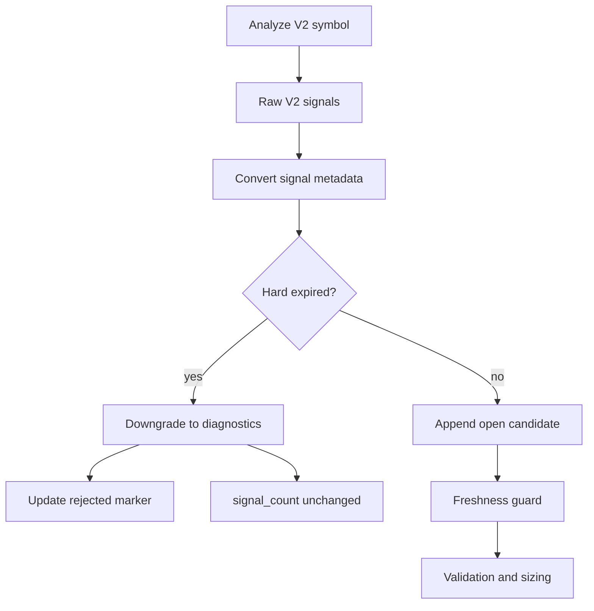

# Design: Chanlun V2 Stale Diagnostic Downgrade

## Overview

The existing Chanlun V2 flow converts raw trade signals into `decision.Decision`, then runs freshness and validation. This correctly blocks stale signals, but hard-expired signals still reach the open-candidate stage for at least one cycle and still appear as ordinary `buy2` diagnostics every cycle.

The new flow computes the same freshness age immediately after signal conversion and before adding the decision to `allDecisions`. If the signal is already `freshness_gate.signal_expired`, it is downgraded into strategy diagnostics and a terminal marker update. It does not enter validation, does not become `OpenRejection`, and does not count as an active signal.

## Flow

## Technical Plan

### `strategy/chanlunv2/engine.go`

- Add a small `chanlunV2FreshnessEvaluation` helper struct.
- Extract freshness metadata enrichment into `enrichChanlunV2FreshnessMetadata` so early downgrade and the existing freshness guard use identical age/limit logic.
- Add `downgradeExpiredChanlunV2Signal`:
  - returns `false` when freshness policy is disabled or the signal is not hard expired;
  - for hard-expired open-like signals, sets `freshness_state`, `age_candles`, `guard_reason_code`, `reason_code`, `stale_reason`, and `action_timestamp`;
  - records/updates stale suppression lifecycle state for concise repeated diagnostics;
  - marks the signal marker rejected for chart visibility;
  - returns a diagnostic string but no `OpenRejection`.
- In `GetFullDecision`, call the downgrade helper before appending a decision to `allDecisions`.
- Track:
  - `raw_signal_count`
  - `signal_count`
  - `downgraded_stale_signals`
- Add those fields to `StrategyDiagnostics`.

### `strategy/chanlunv2/report.go`

- Add a helper for applying a diagnostic stale rejection marker without requiring the rejection to be returned as a decision action.
- Reuse `applyOpenRejectionToV2Marker` to keep marker metadata consistent with existing freshness rejection markers.

### `trader/auto_trader.go`

- Update rolling signal counting to prefer an explicit numeric `StrategyDiagnostics["signal_count"]`, including explicit zero.
- Keep the existing `per_candidate` and `candidate_details` fallbacks for older logs and other strategies.

### `logger/daily_summary.go`

- Apply the same explicit `signal_count` preference to daily summaries.

## Compatibility

- Old logs remain readable.
- Strategies that do not emit `signal_count` keep existing fallback behavior.
- The first hard-expired signal no longer creates an `open_rejected` action; it is visible via `strategy_diagnostics.downgraded_stale_signals` and the rejected signal marker.

## Validation

- Add/adjust V2 tests for hard-expired early downgrade:
  - no executable decision candidate;
  - no `OpenRejection`;
  - diagnostic and marker metadata are present;
  - fresh/aged signal behavior remains unchanged.
- Add rolling signal-count tests:
  - explicit `signal_count: 0` counts as zero;
  - explicit `signal_count: 2` counts as two;
  - legacy fallback still uses candidate details.
- Run targeted tests:
  - `CGO_ENABLED=0 go test ./strategy/chanlunv2 ./trader ./logger`
  - `CGO_ENABLED=0 go build ./...`
