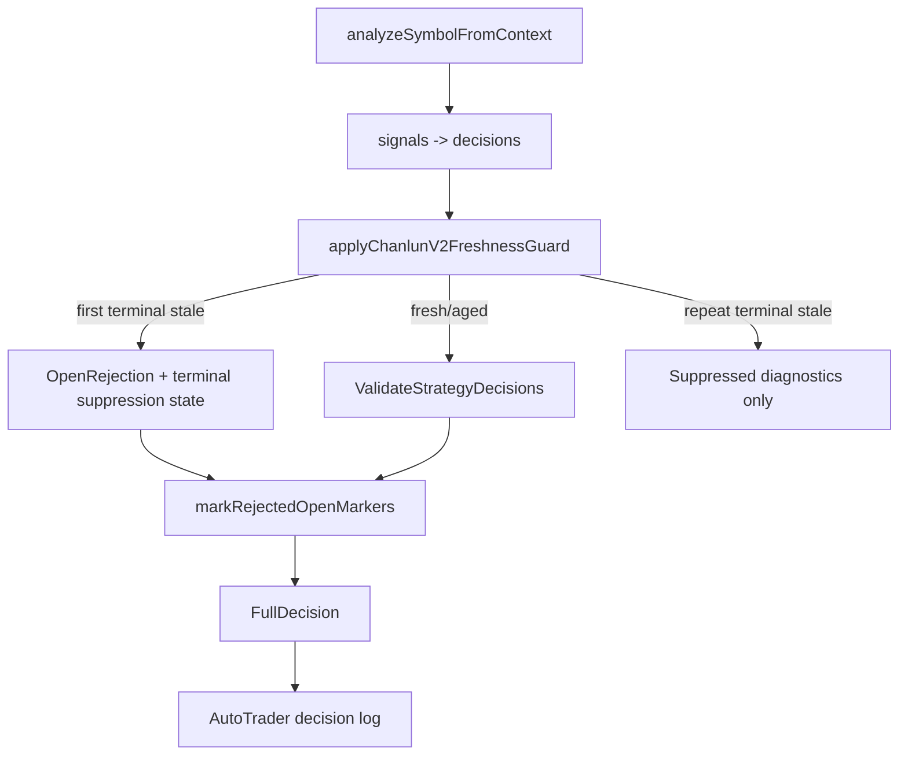

# Design: Chanlun V2 Stale Signal Suppression

## Overview

Chanlun V2 currently performs freshness validation after converting raw strategy signals into `decision.Decision`. Terminal freshness failures are correct, but the engine has no memory that the same `signal_id` has already reached a terminal stale state. Because the live scan interval is shorter than the trade timeframe, the same stale signal is emitted and rejected repeatedly.

The design adds a small in-memory suppression registry inside `strategy/chanlunv2.Engine`. The first terminal freshness rejection is still emitted and still updates the strategy marker. Later appearances of the same `signal_id` are filtered out before validation and before `OpenRejection` logging. This preserves safety while reducing operational noise.

## Architecture



## Data Structures

Add to `strategy/chanlunv2.Engine`:

```go
staleSuppressions map[string]chanlunV2StaleSuppression
```

The map is guarded by the existing `Engine.mu`. Keys are deterministic strings:

- Lifecycle key: `trader_id|symbol|signal_id`
- Dedupe key: `trader_id|symbol|signal_id|reason_code|evaluation_close_time`

Suppression record fields:

```go
type chanlunV2StaleSuppression struct {
    TraderID            string
    Symbol              string
    SignalID            string
    ReasonCode          string
    FreshnessState      string
    SignalCloseTime     int64
    DecisionCloseTime   int64
    EvaluationCloseTime int64
    FirstSeenAt         int64
    LastSeenAt          int64
    SuppressedCount     int
    LastReason          string
    DedupeKeys          map[string]bool
}
```

The engine also exposes helper methods:

- `terminalChanlunV2FreshnessReason(reasonCode string) bool`
- `chanlunV2StaleLifecycleKey(traderID, symbol, signalID string) string`
- `chanlunV2StaleDedupeKey(...) string`
- `e.shouldSuppressTerminalFreshnessRepeat(...)`
- `e.rememberTerminalFreshnessRejection(...)`
- `e.staleSuppressionDiagnostics(traderID string) []string`

## Freshness Guard Flow

`applyChanlunV2FreshnessGuard` changes from:

```go
([]decision.Decision, []decision.OpenRejection)
```

to:

```go
([]decision.Decision, []decision.OpenRejection, []string)
```

Flow:

1. For non-open actions, pass through unchanged.
2. For open-like actions, compute existing freshness metadata.
3. Before returning a terminal rejection:
   - Build lifecycle and dedupe keys.
   - If lifecycle/dedupe is already terminal, drop the candidate and append a compact diagnostic such as `BNBUSDT buy2 重复过期信号已静默: freshness_gate.signal_expired 已静默2次`.
   - Otherwise emit the rejection normally and remember the terminal lifecycle.
4. For aged-but-not-terminal signals, keep current confidence decay behavior.
5. For fresh signals, keep current behavior.

`GetFullDecision` appends suppressed diagnostics to the summary and `StrategyDiagnostics["freshness_suppressed"]`, but does not add them to `OpenRejections`.

## Marker Behavior

The first terminal rejection still calls `markRejectedOpenMarkers`, which updates the marker to `rejected`. Later cycles call `setLatestReport` before freshness guard, but `preserveTerminalV2Markers` already merges terminal markers by `signal_id`; therefore the rejected marker remains visible.

No frontend API contract change is required.

## Log Wording

`trader.AutoTrader.appendOpenRejectionsToRecord` will detect freshness rejections using:

- `GateDiagnostics["source"] == "freshness_gate"`
- any `GateReasons` item with prefix `freshness_gate.`
- `StrategyMetadata["guard_reason_code"]` or `StrategyMetadata["reason_code"]` with prefix `freshness_gate.`

Freshness rejections will use:

```text
⚠ SYMBOL action 被信号新鲜度拒绝: reason
```

Other rejections keep:

```text
⚠ SYMBOL action 被开仓门控拒绝: reason
```

## Compatibility and Safety

- Suppression is in-memory only. It avoids persistent state and keeps restart behavior simple.
- The first terminal stale rejection remains visible in `OpenRejections`, decision logs, marker status, and chart APIs.
- New `signal_id` values are never suppressed by previous signal lifecycles.
- Existing open gate validation and order execution code paths are unchanged.
- Tests use fixtures/fake contexts and do not touch live exchange order APIs.

## Validation Plan

- Add Chanlun V2 unit tests covering:
  - first expired signal returns one freshness rejection;
  - second call with same `signal_id` returns no rejection and emits suppression diagnostics;
  - new `signal_id` is evaluated normally;
  - marker remains rejected after `setLatestReport`.
- Add trader logging tests covering freshness wording and non-freshness wording.
- Run targeted tests:
  - `CGO_ENABLED=0 go test ./strategy/chanlunv2 ./trader ./logger`
  - `CGO_ENABLED=0 go test ./api ./manager` if shared logging/API behavior is affected.
  - `CGO_ENABLED=0 go build ./...`
