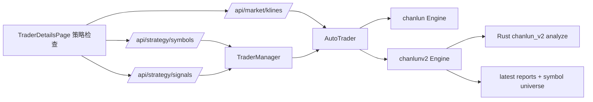

# 缠论 V2 策略检查设计

## Overview

复用 v1 的策略检查 HTTP 和前端契约，不新增页面和 API 路径。`strategy/chanlunv2.Engine` 在每次 `GetFullDecision` 中缓存本周期的标的池和每个 symbol 的 `chanlun.SignalReport` 兼容报告；`trader.AutoTrader` 根据 `decision_mode` 路由到 v1 或 v2 引擎；前端把 `chanlun_v2` 视为策略型 trader，继续使用现有 `StrategyCandlestickChart` 和信号展示模型。

## Backend Plan

### `strategy/chanlunv2.Engine`

- Add mutex-protected fields:
  - `latestSignals map[string]*chanlun.SignalReport`
  - `symbolUniverse map[string][]chanlun.StrategySymbol`
  - `configHash string`
- Keep report schema compatible by importing `nofx/strategy/chanlun` for DTO types only.
- During `GetFullDecision`:
  - Resolve candidate/position symbols into `chanlun.StrategySymbol` values and cache them.
  - For each analyzed symbol, convert v2 `Signal` values into `chanlun.ChanlunSignal` and `chanlun.SignalMarker`.
  - Cache a report even when the symbol has no executable signal, so the UI can show diagnostics.
  - Add strategy metadata to generated `decision.Decision` values for logs and marker consistency.
- Add public methods used by `AutoTrader`:
  - `SymbolUniverse(traderID string) []chanlun.StrategySymbol`
  - `LatestSignalsWithOptions(traderID, symbol string, opts chanlun.SignalReportOptions) (*chanlun.SignalReport, bool)`
  - `EmptySignalReportWithOptions(traderID, symbol string, opts chanlun.SignalReportOptions) *chanlun.SignalReport`
- Implement v2-local report filtering for `view`, `layers`, `statuses`, time range, and `limit`.

### `trader.AutoTrader`

- Extend `ChanlunV2EngineInterface` with the strategy inspection methods above.
- Update `GetStrategySymbols` and `GetLatestStrategySignalsWithOptions` to branch on `chanlun_v2`.
- Update `ResolveMarketKlineLimit` to read `ChanlunV2StrategyConfig.HistoryDepth`.
- Ensure `manager.AddTraderWithPolicies` passes `cfg.ChanlunV2Strategy` into `AutoTraderConfig`.

### API

No route changes. Existing handlers remain:

- `GET /api/strategy/symbols`
- `GET /api/strategy/signals`
- `GET /api/market/klines`

Error response format remains `{"error":"..."}`.

## Frontend Plan

- Treat `decision_mode === 'programmatic' || decision_mode === 'chanlun_v2'` as strategy-check capable.
- Keep the v1 layout and components unchanged.
- Update fallback text so only non-strategy AI traders show the AI mode message.
- Reuse existing TypeScript types because v2 returns the same JSON shape.

## Compatibility

- v1 `programmatic` code paths keep existing methods and state store behavior.
- v2 report filtering is intentionally simpler than v1 lifecycle compaction but preserves response fields expected by the UI.
- Query `limit` continues to override strategy configured K line depth for both v1 and v2.

## Validation

- Backend unit/integration tests:
  - v2 empty signal report includes timeframe metadata.
  - v2 `/api/market/klines` uses `chanlun_v2_strategy.history_depth` when query `limit` is absent.
  - v2 report option filtering returns `view` and `filters`.
  - v2 engine converts signals to report markers.
- Frontend validation:
  - `cd web && npm run build`
- Backend validation:
  - `CGO_ENABLED=0 go test ./strategy/chanlunv2 ./api ./manager ./trader`
