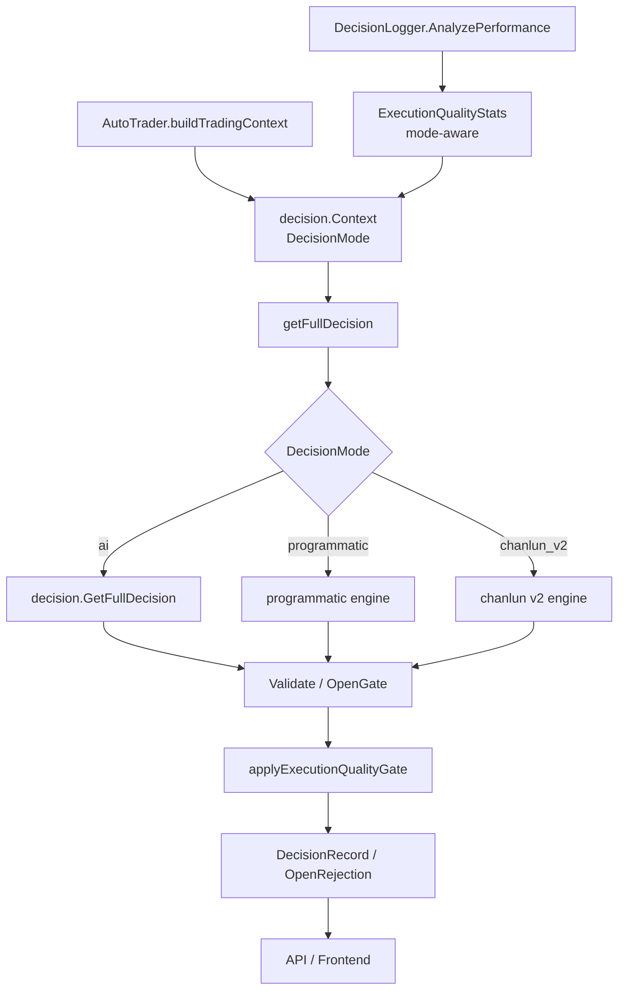

# Decision Mode Quality Gates Design

## Overview

本设计修复两个可观测性与风控归因问题：

- `chanlun_v2` 当前被后端周期日志归类为“AI决策”，导致用户误判本轮是否调用 AI。
- `ExecutionQualityStats.AIFailureCount` 当前作为全局历史质量指标进入所有模式的 open gate，导致非 AI 策略也出现“AI失败次数偏高，新开仓降权”。

设计目标是让决策模式贯穿 `AutoTrader -> decision.Context -> OpenGate -> logger.ExecutionQualityStats -> API/frontend`，并在保持旧日志和旧字段兼容的前提下，使 AI 调用失败只影响 AI 模式。真正跨模式的执行安全风险仍继续对所有模式生效。

## Design Principles

- **模式语义清晰**：`ai`、`programmatic`、`chanlun_v2` 的日志标签、错误文案和统计字段必须反映真实来源。
- **安全边界不放松**：只移除误导性的 AI 失败降权，不改变保护单失败、高危执行失败、BTC/ADX/DI、亏损模式、仓位 sizing 等核心 gate。
- **向后兼容**：保留 `ai_failure_count`，新增字段使用 `omitempty`，旧日志缺少 `decision_mode` 时走 legacy 启发式。
- **小范围改动**：优先在已有结构上加模式字段和 helper，不引入新的风控框架。
- **可测试**：每条行为变化都有单元测试覆盖，尤其是 AI 失败在不同模式下的 gate 差异。

## Architecture



## Technical Design

### 1. Decision Mode Normalization

Add a small normalization and label helper at the `trader` layer, where config is already available:

- `AutoTrader.GetDecisionMode()` already returns `"ai"` when config is empty.
- Update `AutoTrader.decisionModeLabel()` to switch on `GetDecisionMode()`:
  - `"ai"` -> `AI决策`
  - `"programmatic"` -> `程序化策略`
  - `"chanlun_v2"` -> `缠论V2策略`
  - unknown -> `策略(<mode>)`
- Update the per-cycle action log before `getFullDecision(ctx)` so `chanlun_v2` says it is running the Chanlun V2 strategy instead of requesting AI analysis.
- Update startup log branches in `AutoTrader.Run()`:
  - `programmatic`: existing wording
  - `chanlun_v2`: `🚀 缠论V2策略自动交易系统启动` and `🧩 缠论V2策略将生成交易决策`
  - `ai`: existing AI wording

Affected file:

- `trader/auto_trader.go`

### 2. Carry Decision Mode Into Decision Context

Extend `decision.Context`:

```go
type Context struct {
    ...
    DecisionMode string `json:"-"`
}
```

Set it in `AutoTrader.buildTradingContext()`:

```go
DecisionMode: at.GetDecisionMode(),
```

This gives `EvaluateOpenGate()` a reliable mode source without changing every strategy validation call signature.

Affected files:

- `decision/decision.go`
- `trader/auto_trader.go`
- Tests that instantiate `decision.Context` only need updates if they assert exact literals or use keyed fields with no issue expected.

### 3. Mode-Aware Execution Quality Gate

Current logic:

```go
if quality.AIFailureCount >= 3 {
    result.penalize("AI失败次数偏高，新开仓降权")
    result.EffectiveRisk *= 0.5
}
```

Change `applyExecutionQualityGate` to accept mode context:

```go
func applyExecutionQualityGate(result *OpenGateResult, quality *logger.ExecutionQualityStats, decisionMode string)
```

`EvaluateOpenGate()` passes `ctx.DecisionMode`. The AI failure branch becomes:

- Apply only when `decisionMode == "ai"` or mode is empty legacy AI context.
- Reason text becomes `AI调用失败次数偏高，新开仓降权`.
- For `programmatic` and `chanlun_v2`, skip AI failure penalty.

Also make the AI backoff branch mode-aware:

- `ctx.AIBackoffUntil` blocks new opens only for `decisionMode == "ai"` or empty legacy AI context.
- For `programmatic` and `chanlun_v2`, stale AI backoff state must not block strategy-generated open decisions.

Cross-mode rules remain unchanged:

- `HighRiskExecutionFailures > 0 || ProtectionOrderFailures > 0` -> block all modes.
- `PartialCloseFailureRate >= 50 && PartialCloseAttempts >= 3` -> penalize all modes.

Affected file:

- `decision/open_gate.go`

### 4. Mode-Aware Execution Quality Statistics

Extend `logger.ExecutionQualityStats` while retaining old fields:

```go
type ExecutionQualityStats struct {
    ...
    AIFailureCount int `json:"ai_failure_count"`
    AIFailureCountByMode map[string]int `json:"ai_failure_count_by_mode,omitempty"`
    StrategyFailureCount int `json:"strategy_failure_count,omitempty"`
    StrategyFailureCountByMode map[string]int `json:"strategy_failure_count_by_mode,omitempty"`
}
```

Classification helper inside `logger` to avoid import cycle with `decision`:

```go
func normalizeDecisionModeForQuality(mode string) string
func isExplicitAIProviderFailureText(value string) bool
func isAIFailureRecord(record *DecisionRecord) bool
func isStrategyFailureRecord(record *DecisionRecord) bool
```

Proposed behavior:

- If `record.DecisionMode == "ai"` or empty legacy mode:
  - `isAIFailureText(record.ErrorMessage)` increments `AIFailureCount`.
  - `AIFailureCountByMode[mode]` increments, using `"legacy"` for empty mode.
- If `record.DecisionMode == "programmatic"` or `"chanlun_v2"`:
  - AI failure count does not increment for generic historical text created by old labels such as `获取AI决策失败`.
  - Strategy engine failures increment `StrategyFailureCount` and `StrategyFailureCountByMode[mode]`.
- If non-AI mode error text explicitly identifies an AI provider/API failure, such as `AI API调用失败`, `AI响应解析失败`, `DeepSeek调用失败`, `Qwen响应解析失败`, or OpenAI-compatible provider errors, classify it as AI failure as well. Keep this helper narrow so broad substrings like `api调用失败` or old `获取AI决策失败` do not override `decision_mode`.

Existing execution metrics remain:

- `OpenFailures`
- `OpenRejectedCount`
- `PartialCloseFailures`
- `ProtectionOrderFailures`
- `HighRiskExecutionFailures`
- `RecentHighRiskErrors`
- `RecentOpenRejectionReasons`

Affected files:

- `logger/decision_logger.go`
- `logger/logger_test.go`
- `logger/replay.go` only if report schemas require explicit field references; JSON serialization will include new fields automatically.

### 5. API And Frontend Contract

Backend already exposes:

- `DecisionRecord.decision_mode`
- `/api/status` returns `decision_mode`
- `/api/traders` returns `decision_mode`
- `/api/performance` includes `execution_quality`

No breaking API change is required. Add optional frontend fields so the UI can show the new metrics without failing older responses:

```ts
export interface ExecutionQuality {
  ai_failure_count: number
  ai_failure_count_by_mode?: Record<string, number>
  strategy_failure_count?: number
  strategy_failure_count_by_mode?: Record<string, number>
}
```

Frontend display improvement:

- `AILearning` can label `ai_failure_count` as “AI调用失败” and, when mode-aware fields exist, optionally show per-mode detail.
- Existing `DecisionCard` already uses `isStrategyDecisionMode(decision.decision_mode)` to choose “策略分析” vs “AI思考”; after backend label fix, `chanlun_v2` records should already display strategy wording.

Affected files:

- `web/src/types/index.ts`
- `web/src/types.ts`
- `web/src/components/AILearning.tsx` for its inline `execution_quality` type and “AI调用失败” label

If per-mode detail is not displayed in the first implementation, the optional fields still need to be accepted by the component type so future backend responses do not drift from frontend contracts.

### 6. Decision Record And Open Rejection Metadata

No schema change is required for decision records because `DecisionMode` already exists at the record level. Ensure existing flow remains:

- `record.DecisionMode = firstNonEmpty(fullDecision.DecisionMode, at.GetDecisionMode())`
- `appendOpenRejectionsToRecord()` preserves strategy fields from `decision.OpenRejection`.

Optional improvement:

- When building `OpenRejection`, include decision mode in diagnostics if already available through `Context.DecisionMode`.
- This is not required for the first implementation because record-level `decision_mode` is enough for performance classification.

Affected files:

- `trader/auto_trader.go`
- `decision/decision.go` only if adding optional diagnostics

## Data Structures

### `decision.Context`

```go
DecisionMode string `json:"-"`
```

Used by:

- `EvaluateOpenGate()`
- Tests constructing context for mode-specific gate behavior

### `logger.ExecutionQualityStats`

```go
AIFailureCount int `json:"ai_failure_count"` // existing, preserved
AIFailureCountByMode map[string]int `json:"ai_failure_count_by_mode,omitempty"`
StrategyFailureCount int `json:"strategy_failure_count,omitempty"`
StrategyFailureCountByMode map[string]int `json:"strategy_failure_count_by_mode,omitempty"`
```

Compatibility:

- Existing JSON consumers keep using `ai_failure_count`.
- New consumers can show per-mode details.

## Risk Controls

- AI failure penalty removal is scoped to non-AI modes only.
- Protection order and high-risk execution failures remain hard blockers for every mode.
- `chanlun_v2` still uses the previously added sizing/validation path:
  - `PrepareCycleContext`
  - `ValidateStrategyDecisions`
  - `ValidateAndEnrichDecision`
  - `validateOpenDecisionWithOptions`
  - `EvaluateOpenGate`
  - final decision limits
  - execution preflight
- Programmatic strategy validation remains unchanged except for not inheriting AI failure penalties.
- Legacy records without `decision_mode` keep old AI failure detection so historical AI deployments still produce useful risk signals.

## Compatibility And Migration

- No migration script is required.
- Old `decision_logs` can continue to be read.
- Old logs with missing `decision_mode` are treated as legacy AI for `ai_failure_count`.
- Old logs where `chanlun_v2` errors were labeled as `获取AI决策失败` but include `decision_mode:"chanlun_v2"` will no longer count as AI failures after the new classifier.
- Frontend optional fields prevent runtime failures with older backend responses.

## Test Plan

### Backend Unit Tests

- `trader`:
  - `decisionModeLabel()` returns correct labels for `ai`、`programmatic`、`chanlun_v2`、unknown.
  - `buildTradingContext()` injects `DecisionMode`.
- `trader` or log-facing tests:
  - per-cycle action log for `chanlun_v2` does not say `正在请求AI分析并决策`.
- `decision`:
  - `EvaluateOpenGate()` with `DecisionMode:"ai"` and `AIFailureCount >= 3` penalizes and halves risk.
  - Same setup with `DecisionMode:"programmatic"` does not include AI failure reason.
  - Same setup with `DecisionMode:"chanlun_v2"` does not include AI failure reason.
  - `AIBackoffUntil` blocks AI mode but does not block `programmatic` or `chanlun_v2`.
  - Protection order/high-risk execution failures still block all modes.
- `logger`:
  - mixed records count generic AI failures only for `ai`/legacy.
  - `chanlun_v2` record with old “获取AI决策失败” text increments strategy failure, not AI failure.
  - non-AI record with explicit AI provider/API failure text increments AI failure.
  - `ai_failure_count` remains populated for legacy AI records.

### Integration/Build Checks

- `CGO_ENABLED=0 go test ./decision ./logger ./trader`
- `CGO_ENABLED=0 go test ./api ./manager` if API/frontend contracts touched.
- `CGO_ENABLED=0 go build ./...`
- `cd web && npm run build` if frontend types/components touched.

## Rollout Plan

1. Implement backend mode propagation and label changes.
2. Implement mode-aware execution quality classification.
3. Update open gate to apply AI failure penalty only in AI mode.
4. Add/adjust tests.
5. Update frontend optional types if new JSON fields are added.
6. Build, test, commit, deploy.
7. Verify 161 logs:
   - `chanlun_v2` cycle shows “缠论V2策略周期”.
   - `programmatic` cycle shows “程序化策略周期”.
   - non-AI open rejection no longer contains “AI失败次数偏高”.
   - non-AI open rejection is not blocked by stale `AIBackoffUntil`.
   - AI mode, if enabled and historically failing, still shows AI call failure penalty.
