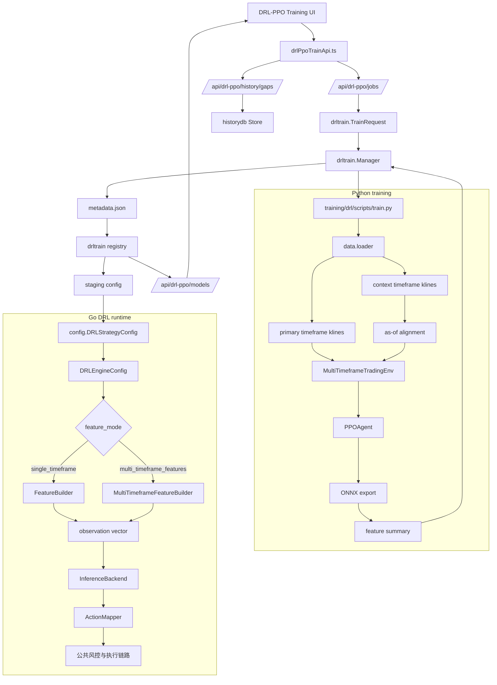

# DRL-PPO Multi-Timeframe Features Design

## Overview

本设计在现有 DRL-PPO 单时间框架训练和推理链路上新增一个可选特征模式：`multi_timeframe_features`。旧模型、旧训练请求、旧 DRL trader 配置继续默认走 `single_timeframe`，输入维度仍为 `observation_window * 16 + 3`。

新增模式以一个主时间框架驱动训练环境 step、奖励计算和动作输出，同时在每个主时间框架决策点按 as-of 规则拼接多个辅助时间框架的已收盘上下文特征。模型元数据和 trader 配置会记录特征模式、主时间框架、辅助时间框架、输入维度和 schema version，用于训练、评估、导出和实盘推理一致性校验。

## Design Principles

- **默认兼容**：未配置 `feature_mode` 时一律按 `single_timeframe` 处理，旧模型和旧 staging config 不需要迁移。
- **防未来函数优先**：辅助时间框架只能使用 `close_time <= primary_decision_time` 的 K 线。
- **主周期驱动动作**：多时间框架只增强状态表示，不改变动作频率、奖励推进和公共风控链路。
- **维度显式校验**：训练、导出、模型注册、推理启动都必须记录并校验 input shape。
- **实验优先于部署**：多时间框架模型默认视为研究候选，需要评估和 baseline 对比后再生成部署建议。

## Architecture



## Feature Modes and Schema

### Constants

Go and Python should use matching names:

```text
single_timeframe
multi_timeframe_features
```

Schema versions:

```text
drl_ppo_single_v1
drl_ppo_multi_tf_v1
```

Metadata and config use `feature_schema` as the canonical JSON field. For compatibility with requirement wording and UI labels, backend readers should also accept `feature_schema_version` as an alias and normalize it into `feature_schema`.

### Observation Dimension

Existing single-timeframe dimension remains unchanged:

```text
single_dim = observation_window * 16 + 3
```

Multi-timeframe v1 dimension:

```text
multi_dim =
  primary_window * 16
  + len(context_timeframes) * context_window * 16
  + len(context_timeframes) * 2
  + 3
```

The `2` status features per context timeframe are:

- `context_available_ratio`: available context rows / context_window, clipped to `[0, 1]`
- `context_staleness_ratio`: minutes since last context close / timeframe minutes, clipped to `[0, 10]` and divided by `10`

Account features remain a single block at the end:

- signed position ratio
- unrealized pnl ratio
- available balance ratio

### Default Multi-Timeframe Policy

For a primary timeframe, the default context timeframes are conservative and can be overridden:

| Primary | Default Context |
| --- | --- |
| `3m` | `15m`, `1h`, `4h` |
| `15m` | `1h`, `4h` |
| `1h` | `4h` |
| `4h` | none |

`context_window` default is `min(observation_window, 60)`, with allowed range `[5, 200]`.

## Configuration Design

### `config.DRLStrategyConfig`

Extend `config/drl.go`:

```go
const (
    DRLFeatureModeSingleTimeframe = "single_timeframe"
    DRLFeatureModeMultiTimeframe  = "multi_timeframe_features"
)

type DRLStrategyConfig struct {
    // existing fields...
    FeatureMode       string   `json:"feature_mode,omitempty"`
    PrimaryTimeframe  string   `json:"primary_timeframe,omitempty"`
    ContextTimeframes []string `json:"context_timeframes,omitempty"`
    ContextWindow     int      `json:"context_window,omitempty"`
    FeatureSchema     string   `json:"feature_schema,omitempty"`
}
```

Compatibility rules:

- `FeatureMode == ""` normalizes to `single_timeframe`.
- `PrimaryTimeframe == ""` normalizes to `Timeframe`.
- `Timeframe` remains supported and is treated as primary timeframe.
- For `single_timeframe`, `ContextTimeframes` are ignored after normalization.
- For `multi_timeframe_features`, `Timeframe` and `PrimaryTimeframe` must converge to the same normalized value.
- `FeatureSchema` is derived from `FeatureMode`; users do not need to set it.

Validation rules:

- supported timeframes: `3m`, `15m`, `1h`, `4h`
- `context_timeframes` are normalized lowercase, deduplicated, sorted by duration ascending, and cannot include the primary timeframe
- invalid mode returns `feature_mode必须是single_timeframe或multi_timeframe_features`
- invalid primary returns `primary_timeframe必须是3m、15m、1h或4h`
- invalid context returns `context_timeframes包含非法timeframe: {value}`

### Runtime Engine Config

Extend `strategy/drl/types.go`:

```go
type DRLEngineConfig struct {
    // existing fields...
    FeatureMode       string
    PrimaryTimeframe  string
    ContextTimeframes []string
    ContextWindow     int
    FeatureSchema     string
}
```

`ObservationDimension()` branches by `FeatureMode`. `MarketHistoryDepth()` returns depth overrides for primary and context timeframes.

Current `market.GetWithHistory()` still constructs `market.Data` from all four supported timeframes (`3m`, `15m`, `1h`, `4h`). Therefore DRL multi-timeframe depth changes must not assume omitted map keys disable fetching a timeframe. Required primary/context timeframes should receive explicit depth overrides, while non-required timeframes may continue using market package defaults until the market data builder supports sparse timeframe bundles.

## Backend Training API Design

### `drltrain.TrainRequest`

Extend `drltrain/types.go`:

```go
type TrainRequest struct {
    // existing fields...
    FeatureMode       string   `json:"feature_mode,omitempty"`
    PrimaryTimeframe  string   `json:"primary_timeframe,omitempty"`
    ContextTimeframes []string `json:"context_timeframes,omitempty"`
    ContextWindow     int      `json:"context_window,omitempty"`
}
```

Normalization:

- `feature_mode` default: `single_timeframe`
- `primary_timeframe` default: `timeframe`
- `context_window` default: `min(observation_window, 60)`
- for single mode, context fields are stored empty

### Command Construction

Extend `drltrain.Manager.buildCommand()`:

```text
--feature-mode <single_timeframe|multi_timeframe_features>
--primary-timeframe <tf>
--context-timeframes <comma-separated list>
--context-window <n>
```

Single-timeframe jobs still pass `--timeframe` for backward-compatible CLI behavior. Multi-timeframe jobs pass both `--timeframe` and `--primary-timeframe`; the train script validates equality after normalization.

### Coverage API

Current `POST /api/drl-ppo/history/gaps` remains compatible with old request bodies. Extend accepted JSON:

```json
{
  "source": "binance-futures",
  "symbol": "BTCUSDT",
  "timeframe": "3m",
  "feature_mode": "multi_timeframe_features",
  "primary_timeframe": "3m",
  "context_timeframes": ["15m", "1h", "4h"],
  "from": "2026-01-01",
  "to": "2026-06-06",
  "timezone": "Asia/Singapore"
}
```

Extended response:

```json
{
  "ok": false,
  "detail": "1h 覆盖不足: ...",
  "gaps": [],
  "timeframe_results": [
    {
      "timeframe": "3m",
      "role": "primary",
      "ok": true,
      "detail": "",
      "gaps": [],
      "coverage": {
        "count": 74880,
        "from_ms": 1767196979999,
        "to_ms": 1780675199999,
        "data_hash": "..."
      }
    },
    {
      "timeframe": "1h",
      "role": "context",
      "ok": false,
      "detail": "结束覆盖不足: ...",
      "gaps": [{ "...": "..." }]
    }
  ]
}
```

Old UI can continue reading top-level `ok/detail/gaps`. New UI reads `timeframe_results`.

### Fetch API

`POST /api/drl-ppo/history/fetch` already accepts `timeframes`. UI will send primary plus context timeframes. Backend should normalize and dedupe before calling `historydb.FetchToStore()`.

## Model Registry and Metadata

### Metadata Shape

`drltrain.Manager.writeCompletionSummary()` remains the owner of `metadata.json`. Python training scripts provide model artifacts and, when needed, a feature summary artifact that the manager can merge into metadata. This preserves the current backend-owned model registry flow and avoids two writers competing for the same metadata file.

Training completion writes `metadata.json`:

```json
{
  "model_id": "btc_3m_multi_v1",
  "model_version": "btc_3m_multi_v1",
  "feature_mode": "multi_timeframe_features",
  "feature_schema": "drl_ppo_multi_tf_v1",
  "feature_schema_version": "drl_ppo_multi_tf_v1",
  "input_shape": [1, 3849],
  "source": "binance-futures",
  "symbol": "BTCUSDT",
  "timeframe": "3m",
  "primary_timeframe": "3m",
  "context_timeframes": ["15m", "1h", "4h"],
  "observation_window": 60,
  "context_window": 60,
  "feature_layout": [
    {"name": "primary:3m", "offset": 0, "length": 960},
    {"name": "context:15m", "offset": 960, "length": 960},
    {"name": "context:1h", "offset": 1920, "length": 960},
    {"name": "context:4h", "offset": 2880, "length": 960},
    {"name": "context_status", "offset": 3840, "length": 6},
    {"name": "account", "offset": 3846, "length": 3}
  ],
  "data_from": "2026-01-01",
  "data_to": "2026-06-06",
  "allow_incomplete_data": false,
  "created_at": "2026-06-06T12:00:00Z"
}
```

### `drltrain.ModelMetadata`

Extend `drltrain/registry.go` model metadata with:

```go
FeatureMode       string  `json:"feature_mode,omitempty"`
FeatureSchema     string  `json:"feature_schema,omitempty"`
FeatureSchemaVersion string `json:"feature_schema_version,omitempty"`
InputShape        []int64 `json:"input_shape,omitempty"`
PrimaryTimeframe  string  `json:"primary_timeframe,omitempty"`
ContextTimeframes []string `json:"context_timeframes,omitempty"`
ContextWindow     int     `json:"context_window,omitempty"`
FeatureLayout     []FeatureSegment `json:"feature_layout,omitempty"`
```

`FeatureSchemaVersion` is read as an alias of `FeatureSchema`; when writing new metadata, both fields can be emitted in the first version to avoid UI/API drift.

```go
type FeatureSegment struct {
    Name   string `json:"name"`
    Offset int    `json:"offset"`
    Length int    `json:"length"`
}
```

Old metadata missing these fields normalizes to:

- `FeatureMode = single_timeframe`
- `FeatureSchema = drl_ppo_single_v1`
- `PrimaryTimeframe = Timeframe`
- `InputShape = [1, observation_window*16+3]` when inferable

### Staging Config

Single-timeframe staging remains unchanged:

```json
{
  "drl_strategy": {
    "model_path": "...",
    "timeframe": "1h",
    "observation_window": 60
  }
}
```

Multi-timeframe staging adds:

```json
{
  "drl_strategy": {
    "model_path": "...",
    "feature_mode": "multi_timeframe_features",
    "feature_schema": "drl_ppo_multi_tf_v1",
    "timeframe": "3m",
    "primary_timeframe": "3m",
    "context_timeframes": ["15m", "1h", "4h"],
    "observation_window": 60,
    "context_window": 60
  }
}
```

## Python Training Design

### Files

- `training/drl/data/loader.py`
  - add `load_multi_timeframe_klines()`
- `training/drl/data/multiframe.py`
  - as-of alignment helpers and validation
- `training/drl/env/features.py`
  - keep current single-timeframe feature builder unchanged
- `training/drl/env/multi_timeframe_features.py`
  - multi-timeframe observation builder
- `training/drl/env/trading_env.py`
  - keep current `CryptoTradingEnv` for single mode
- `training/drl/env/multi_timeframe_env.py`
  - `MultiTimeframeTradingEnv`
- `training/drl/scripts/train.py`
  - add feature mode CLI args and optional feature summary output
- `training/drl/scripts/evaluate.py`
  - restore feature mode from metadata or CLI
- `training/drl/scripts/export_model.py`
  - accept explicit observation dimension or metadata

### Loader

```python
def load_multi_timeframe_klines(
    db_path: str,
    symbol: str,
    primary_timeframe: str,
    context_timeframes: list[str],
    source: str = "binance-futures",
    start: str | None = None,
    end: str | None = None,
) -> dict[str, pd.DataFrame]:
    ...
```

Returned dict includes the primary timeframe key. The loader should read each timeframe with identical date filters and let the env builder apply as-of alignment.

### Multi-Timeframe Observation Builder

```python
FEATURE_PER_STEP = 16
ACCOUNT_FEATURES = 3
CONTEXT_STATUS_FEATURES = 2

@dataclass(frozen=True)
class MultiTimeframeFeatureConfig:
    primary_timeframe: str
    context_timeframes: tuple[str, ...]
    observation_window: int = 60
    context_window: int = 60
```

Observation composition:

1. primary segment: same 16 features per step as current builder
2. context segments in sorted `context_timeframes` order
3. context status features per context timeframe
4. account features

The builder also returns or records a deterministic feature layout. Segment offsets are derived from the final normalized config, so Python metadata and Go runtime diagnostics can compare the same layout:

```text
primary:<tf>      offset 0
context:<tf>      after primary and previous contexts
context_status    after all context feature windows
account           final 3 values
```

As-of algorithm:

```python
decision_time = primary_df.iloc[index]["close_time_ms"]
context_slice = context_df[context_df["close_time_ms"] <= decision_time].tail(context_window)
```

No use of `open_time` for context eligibility. A higher timeframe candle that has opened but not closed at `decision_time` is not eligible.

### Multi-Timeframe Environment

`MultiTimeframeTradingEnv` uses primary K lines for:

- `index`
- current execution price
- reward calculation
- termination/truncation

It calls `build_multi_timeframe_observation(frames, primary_index, account, position, config)` for observations.

### CLI Compatibility

`train.py`:

```text
--feature-mode single_timeframe|multi_timeframe_features
--primary-timeframe 3m
--context-timeframes 15m,1h,4h
--context-window 60
```

Default remains `single_timeframe`, so existing shell commands and backend command construction keep working.

The train script should not directly overwrite `metadata.json` owned by `drltrain.Manager`. If Python needs to expose exact layout diagnostics, it should write a separate summary artifact or structured stdout that the manager reads before writing metadata.

## Go Runtime Design

### Feature Builders

Existing `FeatureBuilder` remains the single-timeframe builder.

New file: `strategy/drl/multi_timeframe_feature_builder.go`

```go
type MultiTimeframeFeatureBuilder struct {
    Config       DRLEngineConfig
    LastStats    FeatureStats
    LastRaw      []float64
    LastFeatures []float32
}

func (b *MultiTimeframeFeatureBuilder) Build(
    klinesByTimeframe map[string][]market.Kline,
    account decision.AccountInfo,
    position *decision.PositionInfo,
) ([]float32, error)
```

`FeatureStats` extends with:

```go
FeatureMode       string         `json:"feature_mode,omitempty"`
PrimaryTimeframe  string         `json:"primary_timeframe,omitempty"`
ContextTimeframes []string       `json:"context_timeframes,omitempty"`
InputShape        []int64        `json:"input_shape,omitempty"`
ContextStats      []ContextStats `json:"context_stats,omitempty"`
MissingContext    int            `json:"missing_context,omitempty"`
```

```go
type ContextStats struct {
    Timeframe       string  `json:"timeframe"`
    AvailableKlines int     `json:"available_klines"`
    UsedKlines      int     `json:"used_klines"`
    MissingRows     int     `json:"missing_rows"`
    LastCloseMS     int64   `json:"last_close_ms,omitempty"`
    StalenessRatio  float64 `json:"staleness_ratio,omitempty"`
}
```

### Engine Branch

`strategy/drl.Engine` should hold both builders or a common adapter:

```go
type ObservationBuilder interface {
    BuildSingle(...)
    BuildMulti(...)
}
```

Pragmatic implementation:

- keep `FeatureBuilder` for single mode
- add `MultiFeatureBuilder`
- branch in `Engine.GetFullDecision()` on `Config.FeatureMode`

Single mode:

```go
klines := data.Klines[e.Config.Timeframe]
observation, err := e.FeatureBuilder.Build(klines, ctx.Account, pos)
```

Multi mode:

```go
frames := map[string][]market.Kline{}
for _, tf := range e.Config.RequiredTimeframes() {
    frames[tf] = data.Klines[tf]
}
observation, err := e.MultiFeatureBuilder.Build(frames, ctx.Account, pos)
```

`MarketHistoryDepth()` returns explicit depth overrides:

- primary: `observation_window + 80`
- each context: `context_window + 80`

The result map can contain both primary and context keys. If a timeframe already exists, use the max depth. Existing market preparation still fetches all four timeframes, so non-required timeframes can be omitted from the override map only because `market.normalizeHistoryDepth()` supplies defaults.

### Missing Context Policy

Config fields:

```go
ContextMissingPolicy string `json:"context_missing_policy,omitempty"` // wait|zero_fill
MaxMissingContext    int    `json:"max_missing_context,omitempty"`
```

Default:

- training: zero fill with diagnostics
- runtime: `wait` if all context rows for a timeframe are missing; otherwise zero-fill missing leading rows

This prevents opening positions from empty higher timeframe context.

## Frontend Design

### Types

`web/src/types/drlPpoTraining.ts`:

```ts
export type DRLPPOFeatureMode = 'single_timeframe' | 'multi_timeframe_features';

export interface DRLPPOTrainRequest {
  feature_mode?: DRLPPOFeatureMode;
  primary_timeframe?: string;
  context_timeframes?: string[];
  context_window?: number;
  // existing fields...
}

export interface DRLPPOTimeframeGapResult {
  timeframe: string;
  role: 'primary' | 'context';
  ok: boolean;
  detail?: string;
  gaps: DRLPPOGapIssue[];
  coverage?: DRLPPOCoverage;
}

export interface DRLPPOGapCheck {
  ok: boolean;
  detail?: string;
  gaps: DRLPPOGapIssue[];
  timeframe_results?: DRLPPOTimeframeGapResult[];
}
```

Model type adds:

```ts
feature_mode?: DRLPPOFeatureMode;
feature_schema?: string;
input_shape?: number[];
primary_timeframe?: string;
context_timeframes?: string[];
context_window?: number;
```

### UI Controls

In `DRLPPOTrainingPage`:

- segmented control for feature mode
- primary timeframe select remains current `timeframe`
- multi-select checkboxes/toggles for context timeframes when `multi_timeframe_features`
- number field for `context_window`
- help tooltips for new params
- coverage panel shows each timeframe row in multi mode

Context timeframe control should use explicit checkboxes or toggle chips, not free text.

### UX Rules

- Default mode: `single_timeframe`
- When mode changes to multi:
  - preselect default context timeframes for current primary
  - remove primary from context list
  - reset gapCheck to null
- “补历史数据” submits all required timeframes
- “启动训练” disabled until all required timeframes pass coverage, unless `allow_incomplete_data` is checked

## Evaluation and Ablation Design

Multi-timeframe models are research candidates. Evaluation should preserve current model evaluation behavior and add optional baseline comparison metadata.

### Baseline Selection

For a multi-timeframe model, the UI and backend should look for a comparable single-timeframe baseline with matching:

- `source`
- `symbol`
- `primary_timeframe` or old `timeframe`
- `data_from` / `data_to`
- `observation_window`

If no baseline exists, the evaluation response should include a warning:

```text
未完成多时间框架基准对比
```

### Evaluation Response Extension

Extend `DRLPPOEvaluation` and backend response with optional fields:

```json
{
  "feature_mode": "multi_timeframe_features",
  "baseline_model_id": "btc_3m_single_v1",
  "baseline_complete": true,
  "baseline_metrics": {
    "sharpe": 0.82,
    "max_drawdown": 0.18,
    "direction_accuracy": 0.53,
    "return_drawdown_ratio": 1.4
  },
  "ablation_warnings": []
}
```

UI comparison should mark multi-timeframe models as “需要复核” when key metrics do not improve over baseline. This is advisory only and does not auto-deploy or auto-block model files.

### Rolling Metrics

If rolling evaluation is enabled by the existing evaluation flow, each window result should carry:

- `feature_mode`
- `input_dimension`
- `missing_context_ratio`
- `zero_fill_ratio`
- baseline comparison status when available

## API and Data Contract Compatibility

Backward compatibility:

- old `TrainRequest` without feature fields is valid
- old `DRLPPOGapCheck` response fields remain populated
- old model metadata displays as single mode
- old staging config generation remains unchanged

Forward compatibility:

- new metadata contains schema and input shape
- runtime fails fast if model shape mismatches mode
- UI labels model feature mode clearly

## Risk Controls

- **Future leakage**: use auxiliary `close_time <= primary close_time`, never open/in-progress higher timeframe candles.
- **Shape mismatch**: `input_shape` from metadata and config-generated dimension must match before model is considered deployable.
- **Runtime missing context**: multi mode logs missing context and outputs wait if critical context is absent.
- **Overfitting**: UI and model registry mark multi-timeframe models as requiring baseline comparison.
- **Operational isolation**: training jobs do not mutate `config.json` or restart trader.
- **Security**: all API responses continue to redact secrets and use Storage Root relative display paths.

## Migration and Compatibility

No database migration is required. Existing `klines` table already stores `source/symbol/timeframe` and can serve all supported timeframes.

Existing model metadata is interpreted as:

```json
{
  "feature_mode": "single_timeframe",
  "feature_schema": "drl_ppo_single_v1",
  "primary_timeframe": "<timeframe>",
  "context_timeframes": []
}
```

Existing `config.json` DRL trader blocks are valid. New multi-timeframe config is optional:

```json
{
  "decision_mode": "drl",
  "drl_strategy": {
    "model_path": "/app/runtime/models/drl/btc_multi/model.onnx",
    "feature_mode": "multi_timeframe_features",
    "feature_schema": "drl_ppo_multi_tf_v1",
    "timeframe": "3m",
    "primary_timeframe": "3m",
    "context_timeframes": ["15m", "1h", "4h"],
    "observation_window": 60,
    "context_window": 60
  }
}
```

## Validation Plan

Go:

- `go test ./config`
- `go test ./historydb`
- `go test ./api`
- `go test ./drltrain`
- `go test ./strategy/drl`

Python:

- `cd training/drl && python -m pytest`
- unit tests for as-of alignment, no future leakage, observation dimension, missing context

Frontend:

- `cd web && npm run build`

End-to-end:

1. Run short single-timeframe train job and confirm unchanged metadata/input shape.
2. Run short multi-timeframe train job with `3m + 15m/1h`.
3. Confirm coverage checks all required timeframes.
4. Confirm model metadata contains feature mode and input shape.
5. Confirm staging config includes multi-timeframe fields.
6. Confirm DRL runtime refuses mismatched model shape and logs Chinese diagnostics.
