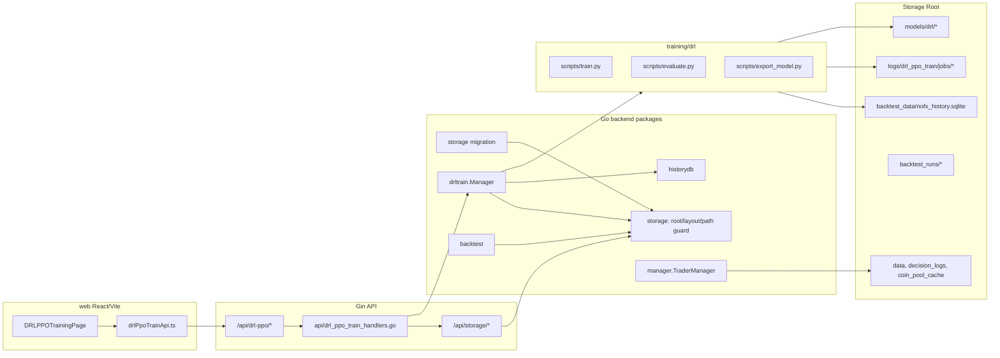

# DRL-PPO 训练 UI 与存储路径 Design

## Overview

本设计在现有 NOFX 架构上新增两条能力线：

1. 统一运行时存储：通过可配置 Storage Root 管理历史数据库、模型、训练日志、回测输出、运行状态和缓存。原生运行默认 `/Volumes/light2/nofx`，Docker Compose 默认将项目本地 `./runtime` 挂载到容器内 `/app/runtime`。
2. DRL-PPO 训练 UI 与后端任务模块：后端新增 `drl_ppo_train` job manager，封装 `training/drl/scripts/train.py`、`evaluate.py` 和历史数据覆盖检查；前端新增 DRL-PPO 训练操作页，支持数据检查、补数据、训练、日志、模型评估和部署准备。

本设计不改变交易执行链路。训练模块只生成和评估模型，不直接重启 trader、不自动修改实盘配置、不绕过 `decision` 的风控校验。

## Architecture



## Design Principles

- **路径单一来源**：所有运行时路径通过后端 `storage` 包解析，禁止各模块继续直接拼接 `data/`、`models/drl/`、`backtest_data/` 等源码相对路径。
- **Compose 默认本地挂载**：Docker Compose 的宿主机挂载源默认是项目本地 `./runtime`，容器内稳定路径是 `/app/runtime`；外置盘只在用户显式设置 `NOFX_RUNTIME_HOST_PATH=/Volumes/light2/nofx` 时使用。
- **训练和交易隔离**：`drl_ppo_train` 只管理训练进程和产物；模型部署只生成 staging 配置建议，实际切换仍需要显式确认并走现有 trader 配置与风控链路。
- **失败可诊断**：路径解析、迁移、训练失败、模型评估失败都要写结构化 metadata 和中文错误摘要。
- **向后兼容但不静默回退**：旧路径可迁移，开发模式可允许外部路径；生产默认不允许在 Storage Root 外读写运行时产物。

## Runtime Storage Design

### Environment and Config

新增配置结构：

```go
type StorageConfig struct {
    Root               string `json:"root,omitempty"`
    AllowExternalPaths bool   `json:"allow_external_paths,omitempty"`
}

type DRLPPOTrainConfig struct {
    Enabled        bool   `json:"enabled,omitempty"`
    MaxConcurrency int    `json:"max_concurrency,omitempty"`
    PythonBin      string `json:"python_bin,omitempty"`
    TrainScript    string `json:"train_script,omitempty"`
    EvaluateScript string `json:"evaluate_script,omitempty"`
    LogTailBytes   int64  `json:"log_tail_bytes,omitempty"`
}

type Config struct {
    // existing fields...
    Storage     StorageConfig     `json:"storage,omitempty"`
    DRLPPOTrain DRLPPOTrainConfig `json:"drl_ppo_train,omitempty"`
}
```

环境变量优先级：

| Purpose | Env | Default |
| --- | --- | --- |
| 后端生效 Storage Root | `NOFX_STORAGE_ROOT` | 原生运行 `/Volumes/light2/nofx` |
| Compose 宿主机挂载源 | `NOFX_RUNTIME_HOST_PATH` | `./runtime` |
| Compose 容器内 Storage Root | `NOFX_CONTAINER_STORAGE_ROOT` | `/app/runtime` |
| 允许 Storage Root 外路径 | `NOFX_STORAGE_ALLOW_EXTERNAL_PATHS` | `false` |
| 启用训练 API | `NOFX_DRL_TRAIN_API_ENABLED` | `false` |
| 训练并发上限 | `NOFX_DRL_TRAIN_MAX_CONCURRENCY` | `1` |
| Python 解释器 | `NOFX_DRL_TRAIN_PYTHON_BIN` | `python3` |

解析优先级：

1. `NOFX_STORAGE_ROOT`
2. `config.storage.root`
3. 默认值

Docker Compose 会显式设置：

```yaml
volumes:
  - ${NOFX_RUNTIME_HOST_PATH:-./runtime}:/app/runtime
environment:
  - NOFX_STORAGE_ROOT=${NOFX_CONTAINER_STORAGE_ROOT:-/app/runtime}
  - NOFX_CONTAINER_STORAGE_ROOT=${NOFX_CONTAINER_STORAGE_ROOT:-/app/runtime}
  - NOFX_RUNTIME_HOST_PATH=${NOFX_RUNTIME_HOST_PATH:-./runtime}
```

因此 Compose 默认不会挂载 `/Volumes/light2/nofx`。如果用户希望 Compose 使用外置盘，只设置：

```bash
NOFX_RUNTIME_HOST_PATH=/Volumes/light2/nofx docker compose up -d --build
```

容器内后端仍使用 `/app/runtime`。

### Storage Package

新增 `storage/` 包：

```go
type RootSource string

const (
    RootSourceEnv     RootSource = "env"
    RootSourceConfig  RootSource = "config"
    RootSourceDefault RootSource = "default"
)

type RuntimeConfig struct {
    Root               string     `json:"root"`
    RootSource         RootSource `json:"root_source"`
    HostMountPath      string     `json:"host_mount_path,omitempty"`
    HostMountSource    string     `json:"host_mount_source,omitempty"`
    ContainerRoot      string     `json:"container_root,omitempty"`
    AllowExternalPaths bool       `json:"allow_external_paths"`
}

type Layout struct {
    Root          string `json:"root"`
    BacktestData  string `json:"backtest_data"`
    HistoryDB     string `json:"history_db"`
    ModelsDRL     string `json:"models_drl"`
    TrainLogs     string `json:"train_logs"`
    TrainJobs     string `json:"train_jobs"`
    BacktestRuns  string `json:"backtest_runs"`
    Data          string `json:"data"`
    DecisionLogs  string `json:"decision_logs"`
    CoinPoolCache string `json:"coin_pool_cache"`
    Tmp           string `json:"tmp"`
    Trash         string `json:"trash"`
}
```

主要函数：

- `ResolveRuntimeConfig(cfg config.StorageConfig, env map[string]string, cwd string) (RuntimeConfig, error)`
- `NewLayout(runtime RuntimeConfig) Layout`
- `EnsureLayout(layout Layout) error`
- `ResolveUnderRoot(layout Layout, value string) (string, error)`
- `RelForDisplay(layout Layout, path string) string`
- `DiskUsage(layout Layout) (*Diagnostics, error)`

路径规则：

- Storage Root 本身必须已存在且可写；原生运行默认 `/Volumes/light2/nofx` 不存在时启动失败并提示用户创建目录或改配置。
- 运行时子目录由 `EnsureLayout` 创建；子目录初始化失败时启动失败，不静默回退源码目录。
- 相对路径基于 Storage Root 解析。
- 绝对路径默认必须在 Storage Root 内。
- `allow_external_paths=true` 只作为开发开关，并在诊断接口中返回警告。

### Directory Layout

Storage Root 下目录：

```text
backtest_data/
  nofx_history.sqlite
models/
  drl/
    <model_version>/
      model.zip
      model.onnx
      metadata.json
      evaluation.json
    archive/
logs/
  drl_ppo_train/
    jobs/
      <job_id>/
        job.json
        stdout.log
        stderr.log
        summary.json
backtest_runs/
data/
decision_logs/
coin_pool_cache/
tmp/
trash/
```

`backtest.DefaultHistoryDBPath` 和 `backtest.DefaultOutputDir` 不再作为最终运行路径直接使用；API 和 CLI 入口应通过 `storage.Layout` 转换为 `${root}/backtest_data/nofx_history.sqlite` 与 `${root}/backtest_runs`。

## Docker Compose Design

`docker-compose.yml` 调整目标：

- 删除默认的独立 `./models:/app/models:ro`、`./data:/app/data`、`./decision_logs:/app/decision_logs` 运行时挂载，改为统一挂载 `${NOFX_RUNTIME_HOST_PATH:-./runtime}:/app/runtime`。
- 保留 `./config.json:/app/config.json:ro`。
- 设置 `NOFX_STORAGE_ROOT=${NOFX_CONTAINER_STORAGE_ROOT:-/app/runtime}`。
- 设置 `NOFX_RUNTIME_HOST_PATH` 供诊断接口展示宿主机来源。
- `.env.example` 增加 `NOFX_RUNTIME_HOST_PATH=./runtime`，并注释说明外置盘覆盖方式。

如果 Docker 镜像需要支持训练 API，后端镜像必须包含 Python 训练依赖。考虑到 `torch/stable-baselines3` 在 Alpine/musl 上兼容性差，设计采用两阶段策略：

1. 第一阶段保持 `nofx` 后端镜像为交易和 API 服务，训练 API 默认 disabled；本机原生运行可启用训练。
2. 第二阶段新增 `docker/Dockerfile.trainer` 或切换训练运行器为 Debian/Python slim sidecar，共享 `/app/runtime`，后端通过本地 HTTP 或 exec runner 调度。该任务在 `tasks.md` 中单独拆分，避免阻塞存储挂载修正。

Compose 挂载变更不依赖训练镜像完成。

## Backend API Design

### Route Registration

`api/server.go`：

```go
api.GET("/storage/diagnostics", s.handleStorageDiagnostics)
api.POST("/storage/migrations", s.handleStorageMigrationStart)
api.GET("/storage/migrations/:migration_id", s.handleStorageMigrationStatus)

if drlPPOTrainAPIEnabled() {
    s.registerDRLPPOTrainRoutes(api.Group("/drl-ppo"))
}
```

训练 API 默认关闭，只有 `NOFX_DRL_TRAIN_API_ENABLED=true` 或 `config.drl_ppo_train.enabled=true` 时注册。关闭时前端 health 请求返回 404 或 disabled 状态，页面不展示启动训练入口。

### Storage Diagnostics

`GET /api/storage/diagnostics`

Response:

```json
{
  "root": "/app/runtime",
  "root_source": "env",
  "host_mount_path": "./runtime",
  "container_root": "/app/runtime",
  "allow_external_paths": false,
  "directories": [
    {"name": "backtest_data", "path": "backtest_data", "exists": true, "writable": true, "bytes": 123456}
  ],
  "disk": {
    "total_bytes": 1000000000,
    "free_bytes": 700000000,
    "used_bytes": 300000000
  },
  "warnings": []
}
```

路径展示使用 Storage Root 相对路径，避免把宿主机绝对路径暴露到 UI。

### Migration API and CLI

新增 `cmd/storage-migrate/main.go`，同时提供 API job：

`POST /api/storage/migrations`

Request:

```json
{
  "sources": ["backtest_data", "models/drl", "logs", "backtest_runs", "data", "decision_logs", "coin_pool_cache"],
  "overwrite": false,
  "create_symlinks": false
}
```

Report:

```json
{
  "migration_id": "migration_20260606_120000",
  "status": "completed",
  "root": "/Volumes/light2/nofx",
  "copied_files": 120,
  "copied_bytes": 345678901,
  "skipped": 3,
  "conflicts": [
    {"source": "models/drl/model.onnx", "target": "models/drl/model.onnx", "reason": "target_exists"}
  ],
  "errors": []
}
```

迁移规则：

- 默认 copy 后校验 size/hash，不覆盖目标。
- 覆盖模式先写入 `trash/migration_backup_<timestamp>/` 或校验 hash 后替换。
- 失败时源文件不删除。
- 默认不创建 symlink；用户显式开启时只为轻量入口目录创建，不能把大模型重新写回源码目录。

### DRL-PPO Train Routes

新增 `api/drl_ppo_train_handlers.go`，路径组 `/api/drl-ppo`：

| Method | Path | Purpose |
| --- | --- | --- |
| `GET` | `/health` | 模块启用状态、Python 可用性、Storage Root 摘要 |
| `GET` | `/storage` | Storage Root 与关键目录状态，前端可复用 diagnostics 简表 |
| `GET` | `/history/coverage` | 历史数据覆盖列表 |
| `POST` | `/history/gaps` | 检查指定 symbol/timeframe/range 缺口 |
| `POST` | `/history/fetch` | 启动补数据 job，复用 `historydb.FetchToStore` |
| `GET` | `/jobs` | 训练 job 列表，最近任务置顶 |
| `POST` | `/jobs` | 创建 `drl_ppo_train` job |
| `GET` | `/jobs/:job_id` | 查询 job 状态 |
| `POST` | `/jobs/:job_id/cancel` | 取消 job |
| `GET` | `/jobs/:job_id/logs` | 按 offset 或 tail 返回日志 |
| `GET` | `/models` | 模型注册表 |
| `POST` | `/models/:model_id/evaluate` | 启动模型评估 |
| `GET` | `/models/:model_id/evaluation` | 查询评估报告 |
| `POST` | `/models/:model_id/staging-config` | 生成 DRL trader 配置建议 |

错误响应保持现有约定：

```json
{"error": "中文错误摘要"}
```

### Training Job Request

```go
type DRLPPOTrainRequest struct {
    Source               string  `json:"source,omitempty"`
    Symbol               string  `json:"symbol"`
    Timeframe            string  `json:"timeframe"`
    Start                string  `json:"start"`
    End                  string  `json:"end"`
    TotalTimesteps       int     `json:"total_timesteps"`
    NSteps               int     `json:"n_steps,omitempty"`
    BatchSize            int     `json:"batch_size,omitempty"`
    NEpochs              int     `json:"n_epochs,omitempty"`
    ObservationWindow    int     `json:"observation_window"`
    InitialBalance       float64 `json:"initial_balance"`
    TakerFee             float64 `json:"taker_fee"`
    MakerFee             float64 `json:"maker_fee"`
    Slippage             float64 `json:"slippage"`
    Rolling              bool    `json:"rolling"`
    OutputModelName      string  `json:"output_model_name"`
    AllowIncompleteData  bool    `json:"allow_incomplete_data,omitempty"`
}
```

Validation:

- `symbol` 使用现有 USDT symbol 规则。
- `timeframe` 只允许 `3m`、`15m`、`1h`、`4h`。
- `start < end`。
- `total_timesteps` 建议范围 `[1000, 50000000]`。
- `observation_window` 范围 `[10, 200]`，与 `config.NormalizeDRLStrategy` 保持一致。
- fee/slippage 允许 ratio 格式，例如 `0.0005`。
- `output_model_name` 只能包含字母、数字、`_`、`-`、`.`，最终仍归入 Storage Root。

### Job Manager

新增 `drltrain/` 包：

```text
drltrain/
  config.go
  manager.go
  job.go
  process.go
  registry.go
  logs.go
  recovery.go
```

核心类型：

```go
type JobStatus string

const (
    JobPending     JobStatus = "pending"
    JobRunning     JobStatus = "running"
    JobCompleted   JobStatus = "completed"
    JobFailed      JobStatus = "failed"
    JobCancelled   JobStatus = "cancelled"
    JobInterrupted JobStatus = "interrupted"
)

type JobMetadata struct {
    JobID        string            `json:"job_id"`
    Type         string            `json:"type"`
    Status       JobStatus         `json:"status"`
    Request      DRLPPOTrainRequest `json:"request"`
    StartedAt    time.Time         `json:"started_at,omitempty"`
    EndedAt      time.Time         `json:"ended_at,omitempty"`
    PID          int               `json:"pid,omitempty"`
    Progress     TrainProgress     `json:"progress,omitempty"`
    LogPath      string            `json:"log_path"`
    Error        string            `json:"error,omitempty"`
    Artifacts    ModelArtifacts    `json:"artifacts,omitempty"`
    SummaryPath  string            `json:"summary_path,omitempty"`
}

type TrainProgress struct {
    Timesteps        int       `json:"timesteps,omitempty"`
    TotalTimesteps   int       `json:"total_timesteps"`
    LastLogAt        time.Time `json:"last_log_at,omitempty"`
    RuntimeSeconds   int64     `json:"runtime_seconds"`
    Stalled          bool      `json:"stalled"`
}

type ModelArtifacts struct {
    ModelID       string `json:"model_id,omitempty"`
    ModelVersion  string `json:"model_version,omitempty"`
    ZipPath       string `json:"zip_path,omitempty"`
    ONNXPath      string `json:"onnx_path,omitempty"`
    RollingSummaryPath string `json:"rolling_summary_path,omitempty"`
    WindowModelPaths []string `json:"window_model_paths,omitempty"`
    MetadataPath  string `json:"metadata_path,omitempty"`
    EvaluationPath string `json:"evaluation_path,omitempty"`
}
```

Manager behavior:

- `Start(req)` 创建 `${root}/logs/drl_ppo_train/jobs/<job_id>/job.json`。
- 启动前检查历史数据覆盖；不足时除非 `allow_incomplete_data=true`，否则拒绝。
- 使用 `exec.CommandContext` 启动 `python3 training/drl/scripts/train.py`。
- 为训练脚本传入 job 目录下的 `progress.jsonl`，后端优先从结构化进度文件读取 timesteps；若脚本版本未输出进度，则退化为日志更新时间和运行时长。
- stdout/stderr 分别写入 job 目录。
- 普通训练结束后解析 `.zip` 和 `.onnx` 输出，写 `summary.json` 和模型 `metadata.json`。
- rolling 训练结束后解析 rolling result JSON 和 window `.zip` 模型；默认不标记为 deployable，除非后续选择单个 window 模型并导出 ONNX。
- 后端重启时扫描 job metadata；无活跃 PID 的 running job 标记为 `interrupted`。
- 默认 `MaxConcurrency=1`，额外请求返回 409。
- cancel 先 `SIGTERM`，超时后 kill。

Command example:

```bash
python3 training/drl/scripts/train.py \
  --data-path /app/runtime/backtest_data/nofx_history.sqlite \
  --source binance-futures \
  --symbol BTCUSDT \
  --timeframe 4h \
  --start 2025-01-01 \
  --end 2026-01-01 \
  --output /app/runtime/models/drl/btcusdt_4h_20260606/model.onnx \
  --progress-path /app/runtime/logs/drl_ppo_train/jobs/job_20260606_120000/progress.jsonl \
  --total-timesteps 100000 \
  --observation-window 60 \
  --initial-balance 10000 \
  --taker-fee 0.0005 \
  --maker-fee 0.0002 \
  --slippage 0.0003
```

### Training Script Changes

当前 `training/drl/scripts/train.py` 已支持训练参数、普通训练 ONNX 导出和 rolling 训练，但没有结构化进度输出。实现时需要补充：

- `train.py` 新增 `--progress-path` 可选参数。
- `training/drl/agents/ppo_agent.py` 新增 Stable Baselines callback，将 `timesteps`、`total_timesteps`、`elapsed_seconds`、`timestamp` 写入 JSONL。
- rolling 模式每个 window 训练也写入 progress JSONL，并在 rolling result 中保留 window `.zip` 模型相对路径。
- 后端不依赖 stdout 解析 timesteps；stdout/stderr 仅作为日志展示和失败定位。

### Model Registry and Evaluation

模型注册表读取 `${root}/models/drl/**/metadata.json`。

Model metadata:

```json
{
  "model_id": "btcusdt_4h_20260606_120000",
  "model_version": "btcusdt_4h_20260606_120000",
  "symbol": "BTCUSDT",
  "timeframe": "4h",
  "source": "binance-futures",
  "data_from": "2025-01-01",
  "data_to": "2026-01-01",
  "total_timesteps": 100000,
  "observation_window": 60,
  "created_at": "2026-06-06T12:00:00Z",
  "zip_path": "models/drl/btcusdt_4h_20260606/model.zip",
  "onnx_path": "models/drl/btcusdt_4h_20260606/model.onnx",
  "deployable": true,
  "runtime_note": "当前默认 DRL 推理后端为 stub，真实 ONNX Runtime 依赖 build tag"
}
```

Evaluation request calls `training/drl/scripts/evaluate.py` and writes:

```json
{
  "annual_return": 0.12,
  "sharpe": 0.8,
  "sortino": 1.0,
  "max_drawdown": 0.18,
  "win_rate": 0.52,
  "directional_accuracy": 0.56,
  "recommended_for_deploy": true,
  "thresholds": {
    "directional_accuracy": 0.55,
    "max_drawdown": 0.2
  }
}
```

部署准备接口只返回 staging config：

```json
{
  "trader_patch": {
    "decision_mode": "drl",
    "drl_strategy": {
      "model_path": "models/drl/btcusdt_4h_20260606/model.onnx",
      "model_version": "btcusdt_4h_20260606_120000",
      "timeframe": "4h",
      "symbols": ["BTCUSDT"],
      "observation_window": 60
    }
  },
  "warnings": [
    "当前为配置建议，不会自动修改实盘 trader",
    "当前默认推理后端为 stub，需确认 ONNX Runtime build tag"
  ]
}
```

## Frontend Design

新增文件：

```text
web/src/components/drlPpoTraining/DRLPPOTrainingPage.tsx
web/src/components/drlPpoTraining/StoragePanel.tsx
web/src/components/drlPpoTraining/DataCoveragePanel.tsx
web/src/components/drlPpoTraining/TrainForm.tsx
web/src/components/drlPpoTraining/JobList.tsx
web/src/components/drlPpoTraining/JobLogViewer.tsx
web/src/components/drlPpoTraining/ModelRegistry.tsx
web/src/lib/drlPpoTrainApi.ts
web/src/types/drlPpoTraining.ts
```

`web/src/App.tsx`：

- Page 类型扩展为 `competition | trader | backtest | drlPpoTraining`。
- hash 使用 `#drl-ppo-training`。
- 调用 `drlPpoTrainApi.health()` 判断模块是否启用。
- 启用时在顶部页面切换区展示 `DRL-PPO`。

UI 布局：

- 顶部状态条：Storage Root、可用空间、训练 API 状态、Python 可用性、运行中 job 数。
- 左侧训练表单：symbol、timeframe、start/end、total_timesteps、observation_window、initial_balance、fee、slippage、rolling、output_model_name。
- 中间数据覆盖：coverage 表格、缺口检查、补数据 job 状态。
- 右侧任务列表：最近 job、状态过滤、运行中 job 置顶、取消按钮。
- 下方日志与模型：日志 tail、summary、模型列表、评估结果、部署建议。

交互规则：

- 数据覆盖不足时训练按钮 disabled，除非用户勾选“允许不完整数据训练”并二次确认。
- 取消训练、删除模型、覆盖迁移、生成部署建议都要确认。
- 日志使用 `GET /jobs/:job_id/logs?offset=<n>` 增量拉取，避免一次加载超大文件。
- 路径只展示 Storage Root 相对路径，例如 `models/drl/.../model.onnx`。
- UI 风格沿用当前 Binance 风格深色操作台，不做营销页。

## Integration Points

### main.go

- `loadAndValidateConfig` 后解析 `storage.RuntimeConfig`。
- `ensureDataDir(DefaultDataDir)` 改为 `storage.EnsureLayout(layout)`。
- `decision.Config.DataDir` 使用 `layout.Data`。
- 初始化 pool cache 时新增 setter 或配置，使 AI500/OI Top 缓存使用 `layout.CoinPoolCache`。
- `trader.AutoTrader` decision log dir 使用 `layout.DecisionLogs/<trader_id>`，避免硬编码 `decision_logs/<id>`。

### backtest/historydb

- Backtest API 默认 DB 从 `layout.HistoryDB` 读取。
- Backtest output dir 从 `layout.BacktestRuns` 读取。
- 请求体中用户传入 `db` 或 `output_dir` 时走 `storage.ResolveUnderRoot`。
- `historydb.Open` 保持底层能力不变，调用方负责传入已解析路径。

### strategy/drl lifecycle

- `defaultModelOutputDir` 和 `defaultModelArchiveDir` 通过 Storage Layout 注入。
- 自动重训练 scheduler 的 `DataPath` 默认使用 `layout.HistoryDB`。
- 现有 `models/drl` 相对 model path 在加载 DRL trader 时解析到 Storage Root。
- `config.DRLStrategyConfig.ModelPath` 仍保持用户配置字段；运行时创建 live DRL trader 和 DRL backtest engine 前，将相对路径解析到 Storage Root，绝对路径默认必须位于 Storage Root 内。

### API server construction

`api.NewServer` 当前只接收 `TraderManager` 和 port。新增 options：

```go
type ServerOptions struct {
    StorageLayout *storage.Layout
    DRLTrain      *drltrain.Manager
}

func NewServer(traderManager *manager.TraderManager, port int, opts ...ServerOption) *Server
```

为了兼容测试，可保留现有签名并新增 `NewServerWithOptions`。

## Security and Risk Controls

- API 不返回任何交易所 API key、私钥、钱包私密字段或完整 config。
- 文件读写统一经 `storage.ResolveUnderRoot`，拒绝 `../` 和 Root 外绝对路径。
- 训练 API 只使用公共行情历史数据，不读取交易所私钥。
- 训练 job 不修改已启用 trader 配置。
- staging config 不自动写入 `config.json`；若后续实现写入，也必须有确认和备份。
- 删除模型或日志默认移动到 `trash/`。
- 运行中交易服务不因训练失败、取消或超时而停止。

## Compatibility and Migration Notes

- 现有源码目录下的 `models/drl/*.onnx`、`backtest_data/*.sqlite`、`data/`、`decision_logs/`、`coin_pool_cache/` 通过迁移命令复制到 Storage Root。
- `.gitignore` 继续忽略 runtime 产物，并新增 `runtime/`。
- `config.json.example` 增加 `storage` 和 `drl_ppo_train` 示例，但不写真实密钥。
- `docker-compose.yml` 迁移后，本地默认运行产物写入 `./runtime`，不会写入 `/Volumes/light2/nofx`。
- 原生运行若未设置 env/config，默认使用 `/Volumes/light2/nofx`；如果该目录不存在或不可写，启动失败并提示用户创建目录或改 `NOFX_STORAGE_ROOT`。

## Validation Plan

Backend:

```bash
go test ./storage
go test ./drltrain
go test ./api ./backtest ./historydb
go test ./config ./manager ./trader
```

Frontend:

```bash
cd web && npm run build
cd web && npm run test
```

Docker Compose:

```bash
docker compose config | rg './runtime|/app/runtime'
docker compose up -d --build
docker compose exec nofx sh -lc 'test -w /app/runtime && echo ok'
docker compose down

NOFX_RUNTIME_HOST_PATH=/Volumes/light2/nofx docker compose config | rg '/Volumes/light2/nofx|/app/runtime'
```

End-to-end short training:

```bash
NOFX_STORAGE_ROOT=/Volumes/light2/nofx NOFX_DRL_TRAIN_API_ENABLED=true go run main.go
```

然后通过 UI 或 API 使用小规模 BTCUSDT 数据启动短训练 job，确认状态从 `running` 进入 `completed` 或 `failed`，并能读取日志、summary 和模型 metadata。
