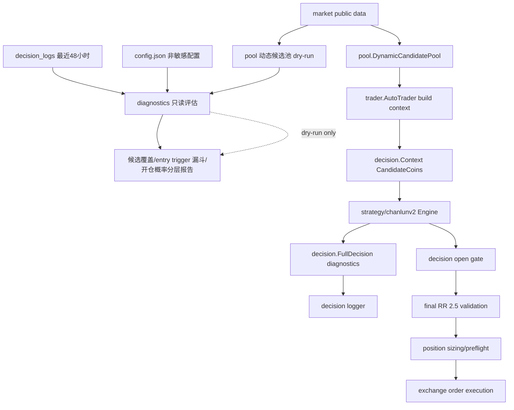

# 动态候选池 Short-side 覆盖与缠论 V2 Entry Trigger 评估设计

## 总览

本设计采用先评估、再灰度、最后小范围行为变更的路径。核心判断是：当前无开仓主要发生在策略输出可执行候选之前，不能通过降低最终 RR 或关闭 BTC hard veto 解决。设计目标是扩大可观察候选空间，尤其是 BTC 弱势时的 short-side 覆盖，同时把缠论 V2 父结构到 entry trigger 的漏斗拆成结构化指标。

本规格不改变交易所接口、不触发真实下单、不修改生产 `config.json`。任何会影响实盘候选排序的逻辑都必须由显式配置打开，并保留回滚开关。

## 设计原则

1. **观测优先**：先通过 dry-run 报告回答动态候选池和 entry trigger 漏斗问题，再改实盘排序。
2. **候选不是信号**：BTC 弱势只影响候选覆盖和排序，不直接生成 `open_short`。
3. **硬风控不动**：最终 RR 2.5、BTC hard veto、position sizing、交易所 preflight 均保持硬约束。
4. **不引入循环依赖**：`pool` 目前依赖 `logger` 的 performance 类型，新的综合诊断不得让 `logger` 反向依赖 `pool`。
5. **可回滚**：动态池、short-side 覆盖、父结构 RR 终态调整分别用独立配置或阶段任务控制。

## 架构图



## 分期设计

### Phase 1: 只读评估与诊断增强

Phase 1 不改变实盘候选排序，不启用真实配置变更。目标是生成一份可复现报告：

- 当前静态候选池覆盖。
- 假设动态候选池 dry-run 快照。
- BTC regime 与 short-side 候选数量。该阶段使用评估命令的本地默认参数计算方向覆盖，不要求新增生产配置字段。
- 缠论 V2 父结构到 entry trigger 漏斗。
- 开仓概率分层估计。

### Phase 2: 动态候选池 short-side 覆盖灰度

Phase 2 在显式配置下允许动态池排序和 prompt 选择受 short-side 覆盖影响。默认建议先 `report_only=true`，线上确认 24-48 小时后再切换实盘候选排序。Phase 2 是把 Phase 1 的只读方向评估提升为可配置运行时能力。

### Phase 3: 父结构 RR 终态策略评估

Phase 3 只在 Phase 1 报告证明 `entry_rr_invalid` 过早终态化是主因时执行。默认不改变父结构 lifecycle；若执行，则新增显式配置把部分 parent RR 失败降级为观察态或 near-miss 诊断，最终 RR 2.5 不变。

## 技术方案

### 1. 动态候选池配置扩展

修改 `config/config.go` 的 `DynamicCandidatePoolConfig`，新增 short-side 覆盖配置。

```go
type DynamicCandidateShortSideCoverageConfig struct {
    Enabled                 *bool   `json:"enabled,omitempty"`
    ReportOnly              bool    `json:"report_only,omitempty"`
    MinPromptCount          int     `json:"min_prompt_count,omitempty"`
    MaxPromptRatio          float64 `json:"max_prompt_ratio,omitempty"`
    RiskOffScoreBoost       float64 `json:"risk_off_score_boost,omitempty"`
    MinADX                  float64 `json:"min_adx,omitempty"`
    MinRelativeWeakness1h   float64 `json:"min_relative_weakness_1h,omitempty"`
    MinRelativeWeakness4h   float64 `json:"min_relative_weakness_4h,omitempty"`
    RequireBearishDI        bool    `json:"require_bearish_di,omitempty"`
    RequireBearishEMA       bool    `json:"require_bearish_ema,omitempty"`
    MaxAbsFundingRate       float64 `json:"max_abs_funding_rate,omitempty"`
}

type DynamicCandidatePoolConfig struct {
    // existing fields...
    ShortSideCoverage DynamicCandidateShortSideCoverageConfig `json:"short_side_coverage,omitempty"`
}
```

默认值：

- `Enabled=false`，避免未显式配置时改变实盘候选。
- `ReportOnly=true`，即使显式启用也先只输出诊断，除非用户明确设为 `false`。
- `MinPromptCount=3`，用于 BTC 弱势时的最少 short-side prompt 覆盖。
- `MaxPromptRatio=0.4`，避免 prompt 被空头候选完全占据。
- `RiskOffScoreBoost=8`，仅在非 report-only 时用于排序加分。
- `MinADX=18`，只作为候选倾向过滤，不替代 open gate 的 ADX 逻辑。
- `MaxAbsFundingRate=0.001`，沿用动态池现有资金费率拥挤边界。

同步修改：

- `config/config_test.go`：默认值、显式启用、非法值归一化。
- `main.go`：把归一化配置传给 `pool.SetDynamicCandidatePoolConfig()`。
- `pool/dynamic_candidate_pool.go`：运行时 config 增加同构字段。

注意：该配置扩展属于 Phase 2。Phase 1 的 dry-run 报告不得要求用户先修改生产配置；评估命令应使用本地默认 short-side 评估参数或命令行参数。

### 2. 动态候选池数据结构扩展

修改 `pool/dynamic_candidate_pool.go`。

```go
type MarketRegimeDiagnostics struct {
    Regime          string         `json:"regime"`
    BTCPriceChange1h float64      `json:"btc_price_change_1h,omitempty"`
    BTCPriceChange4h float64      `json:"btc_price_change_4h,omitempty"`
    BTCADX          float64       `json:"btc_adx,omitempty"`
    BTCDIPlus       float64       `json:"btc_di_plus,omitempty"`
    BTCDIMinus      float64       `json:"btc_di_minus,omitempty"`
    BTCEMA20        float64       `json:"btc_ema20,omitempty"`
    BTCEMA50        float64       `json:"btc_ema50,omitempty"`
    Reasons         []string      `json:"reasons,omitempty"`
}

type CandidateSideProfile struct {
    Bias                 string   `json:"bias,omitempty"` // long, short, neutral
    ShortScore           float64  `json:"short_score,omitempty"`
    LongScore            float64  `json:"long_score,omitempty"`
    RelativeWeakness1h   float64  `json:"relative_weakness_1h,omitempty"`
    RelativeWeakness4h   float64  `json:"relative_weakness_4h,omitempty"`
    Reasons              []string `json:"reasons,omitempty"`
    ReportOnly           bool     `json:"report_only,omitempty"`
}

type DynamicCandidate struct {
    // existing fields...
    SideProfile CandidateSideProfile `json:"side_profile,omitempty"`
}

type DynamicCandidatePool struct {
    // existing fields...
    RegimeDiagnostics MarketRegimeDiagnostics `json:"regime_diagnostics,omitempty"`
    ShortSideSummary  ShortSideSummary        `json:"short_side_summary,omitempty"`
}
```

`ShortSideSummary` 记录：

- `enabled`
- `report_only`
- `btc_weak`
- `candidate_count`
- `prompt_count`
- `min_prompt_count`
- `max_prompt_ratio`
- `symbols`
- `reasons`

### 3. Short-side 评分与 prompt 保底

新增 helper：

- `detectDynamicMarketRegimeWithDiagnostics(btc *market.Data) (string, MarketRegimeDiagnostics)`
- `scoreDirectionalProfile(symbol string, data *market.Data, btc *market.Data, metrics CandidateMetrics, cfg DynamicCandidateShortSideCoverageConfig) CandidateSideProfile`
- `isBTCWeakRegime(regime string, diag MarketRegimeDiagnostics) bool`
- `selectPromptCandidatesWithCoverage(snapshot *DynamicCandidatePool, positionSymbols []string, cfg DynamicCandidatePoolConfig) []string`

Phase 1 只调用方向评分和 summary 计算，不调用 prompt 保底和排序加分。Phase 2 才允许在显式 `report_only=false` 时改变排序和 prompt 选择。

评分逻辑分为基础质量和方向倾向：

- 基础质量继续使用流动性、成交量、波动、funding、历史表现。
- 方向倾向新增 long/short 两套镜像评分。
- short-side 倾向满足条件越多，`ShortScore` 越高：
  - `CurrentDIMinus > CurrentDIPlus`
  - `CurrentEMA20 < CurrentEMA50`
  - `PriceChange1h < BTC.PriceChange1h` 或 `PriceChange4h < BTC.PriceChange4h`
  - `CurrentADX >= MinADX`
  - funding 不拥挤
  - 下跌不是极端插针或波动异常

在 `ReportOnly=true` 时：

- 只写 `SideProfile`、`ShortSideSummary` 和 reasons。
- 不改变候选排序。
- 不改变 `selectPromptCandidates()` 结果。

在 `ReportOnly=false` 且 BTC 弱势时：

- short-side 候选获得 `RiskOffScoreBoost`，但仍必须通过硬过滤。
- prompt 选择先加入 core 和持仓，再保底加入 short-side 候选，数量受 `MinPromptCount` 与 `MaxPromptRatio` 双重限制。
- 之后按总 score 填满剩余 prompt 候选。

这保证 short-side 覆盖影响的是“被策略看到的机会”，不是“直接开空”。

### 4. CandidateCoins 上下文字段

修改 `decision/types.go` 的 `CandidateCoin`，增加候选侧诊断字段：

```go
type CandidateCoin struct {
    // existing fields...
    MarketRegime    string   `json:"market_regime,omitempty"`
    SideBias        string   `json:"side_bias,omitempty"`
    ShortSideScore  float64  `json:"short_side_score,omitempty"`
    LongSideScore   float64  `json:"long_side_score,omitempty"`
    SideReasons     []string `json:"side_reasons,omitempty"`
}
```

修改 `trader/auto_trader.go` 构建候选时，从 `mergedPool.DynamicCandidates[symbol].SideProfile` 复制字段。

同步修改 `logger/decision_logger.go` 的 `CandidateSnapshot` 与 `trader/auto_trader.go::fillCandidateSnapshots()`，否则新增字段只存在于 `decision.Context`，不会落入 `decision_logs`。如前端需要展示候选侧诊断，同步 `web/src/types/index.ts` 的 `candidate_details` 类型。

影响范围：

- 决策日志会带更多候选诊断。
- 不改变 `trader.Trader` 接口。
- 新增前端字段均为可选字段，不改变现有 API 必需字段。

### 5. 缠论 V2 entry trigger 漏斗诊断

当前 `strategy/chanlunv2.Engine.GetFullDecision()` 已有：

- `raw_signal_count`
- `parent_structure_count`
- `entry_trigger_count`
- `trigger_rejection_reasons`
- `terminal_suppressed_count`

新增结构化 funnel：

```go
type EntryTriggerFunnelDiagnostics struct {
    RawSignalCount          int            `json:"raw_signal_count"`
    ParentStructureCount    int            `json:"parent_structure_count"`
    ParentTerminalByReason  map[string]int `json:"parent_terminal_by_reason,omitempty"`
    WaitingForTriggerCount  int            `json:"waiting_for_trigger_count,omitempty"`
    TriggerReadyCount       int            `json:"trigger_ready_count,omitempty"`
    TriggerReadyByType      map[string]int `json:"trigger_ready_by_type,omitempty"`
    TriggerRejectedByReason map[string]int `json:"trigger_rejected_by_reason,omitempty"`
    TerminalSuppressedCount int            `json:"terminal_suppressed_count,omitempty"`
    PerSymbol               map[string]EntryTriggerSymbolFunnel `json:"per_symbol,omitempty"`
}
```

`evaluateParentStructureEntry()` 已返回 `Terminal`、`TriggerRejected`、`TriggerReady`、`ReasonCode`，因此实现上在 `GetFullDecision()` 的信号循环中累加即可。

新增分类：

- 父结构直接终态：
  - `entry_rr_invalid`
  - `entry_parent.target_crossed`
  - `entry_parent.invalid_structure`
  - `entry_parent.watch_window_expired`
  - `lifecycle.terminal`
- 等待 trigger：
  - `waiting_for_fresh_entry_trigger`
- trigger 拒绝：
  - `entry_trigger_low_confidence`
  - `entry_trigger_expired`
  - `entry_zone_chased`
  - `third_point.reentered_center`
  - `third_point.deep_retracement`
  - `third_point.range_after_breakout`
  - `entry_rr_invalid`
- trigger ready：
  - 按 `entry_trigger_type` 聚合。

写入 `FullDecision.StrategyDiagnostics["entry_trigger_funnel"]`，并保留旧字段，避免 replay 兼容破坏。

### 6. 父结构 RR 终态替代策略

默认不改变当前 terminal 逻辑。若 Phase 1 报告证明 `entry_rr_invalid` 是主因，Phase 3 可引入显式配置：

```go
type ChanlunV2ParentRRPolicyConfig struct {
    Mode                 string  `json:"mode,omitempty"` // terminal, watch_near_miss
    NearMissMaxGap       float64 `json:"near_miss_max_gap,omitempty"`
    MaxNearMissCandles   int     `json:"max_near_miss_candles,omitempty"`
    ReportOnly           bool    `json:"report_only,omitempty"`
}
```

设计行为：

- `terminal`：保持现状。
- `watch_near_miss + report_only=true`：只统计如果不 terminal 会继续观察多少父结构。
- `watch_near_miss + report_only=false`：当剩余 RR 低于 entry threshold 但差距不超过 `NearMissMaxGap` 时，不立即 terminal，状态写为 `watching_entry_rr_near_miss`，继续等待 fresh trigger；trigger 生成后仍执行 entry zone、freshness、open gate 和最终 RR 2.5。

该方案只影响父结构是否继续观察，不降低最终开仓门槛。

### 7. 只读评估报告

新增 `diagnostics` 包，避免 `logger` 和 `pool` 循环依赖。

建议文件：

- `diagnostics/candidate_entry_report.go`
- `diagnostics/candidate_entry_report_test.go`
- `cmd/candidate-entry-eval/main.go`

命令示例：

```bash
go run ./cmd/candidate-entry-eval \
  -log-dir decision_logs \
  -trader aster_chanlun_v2 \
  -config config.json \
  -from 2026-06-04T13:55:45+08:00 \
  -to 2026-06-06T13:55:45+08:00 \
  -dynamic-pool-dry-run \
  -snapshot-path /tmp/nofx_dynamic_candidate_pool_preview.json \
  -output /tmp/nofx_candidate_entry_eval.json
```

命令特性：

- 默认 `dry-run=true`。
- 默认不写 `data/dynamic_candidate_pool.json`。
- 读取日志使用 `logger.LoadDecisionRecordsRecursive()` 和 `logger.FilterReplayRecords()`。
- 动态池预览调用 `pool` 的 preview API，写临时 snapshot 或只在内存中返回。
- 报告中标记市场数据是“当前公共行情”，历史日志是“过去 48 小时决策事实”，两者不混为历史回测。

报告结构：

```go
type CandidateEntryEvaluationReport struct {
    GeneratedAt        time.Time                         `json:"generated_at"`
    Window             EvaluationWindow                  `json:"window"`
    TraderID           string                            `json:"trader_id,omitempty"`
    DryRun             bool                              `json:"dry_run"`
    RuntimeFacts       RuntimeNoOrderFacts               `json:"runtime_facts"`
    StaticPool         CandidatePoolSnapshotSummary      `json:"static_pool"`
    DynamicPoolPreview CandidatePoolSnapshotSummary      `json:"dynamic_pool_preview,omitempty"`
    ShortSideCoverage  ShortSideCoverageReport           `json:"short_side_coverage,omitempty"`
    EntryTriggerFunnel EntryTriggerFunnelReport          `json:"entry_trigger_funnel"`
    OpenProbability    LayeredOpenProbabilityEstimate    `json:"open_probability"`
    Notes              []string                          `json:"notes,omitempty"`
}
```

`EvaluationWindow` 由 `diagnostics` 包定义，包含 `from`、`to`、`record_count`、`timezone` 等字段；当前 `logger` 包没有可复用的 `ReplayWindow` 类型。

`LayeredOpenProbabilityEstimate` 不给收益承诺，只输出分层近似：

- `candidate_coverage`: 静态池与动态池候选覆盖变化。
- `parent_signal_rate`: 每周期父结构出现频率。
- `entry_trigger_rate`: 父结构转 trigger 的历史比例。
- `open_gate_pass_rate`: trigger 后通过 open gate 的历史比例。
- `final_rr_pass_rate`: 通过最终 RR 2.5 的历史比例。
- `qualitative_probability`: `very_low`、`low`、`medium`、`unknown`。
- `blocking_layers`: 当前最主要阻断层。

### 8. Pool preview API

为避免评估命令写真实运行路径，新增 pool 内部 API：

```go
type DynamicPoolPreviewOptions struct {
    AI500Limit       int
    PositionSymbols  []string
    Performance      *logger.PerformanceAnalysis
    PoolConfig       DynamicCandidatePoolConfig
    SourceConfig     CoinPoolSourceConfig
    SnapshotPath     string
    WriteSnapshot    bool
    ForceRefresh     bool
}

func PreviewDynamicCandidatePool(opts DynamicPoolPreviewOptions) (*DynamicCandidatePool, *MergedCoinPool, error)
```

`CoinPoolSourceConfig` 记录评估命令从 `config.json` 读取到的默认币、AI500 URL、OI Top URL、cache dir 和 `use_default_coins`。现有 `refreshDynamicCandidatePool()` 会读取包级 `coinPoolConfig`/`oiTopConfig`，因此实现 preview 时需要重构 source collection，让 dry-run 使用 `SourceConfig`，不能假设服务启动时已经调用过 `pool.SetDefaultCoins()`、`pool.SetUseDefaultCoins()`、`pool.SetCoinPoolAPI()` 和 `pool.SetOITopAPI()`。

规则：

- `WriteSnapshot=false` 时只返回内存结果。
- `SnapshotPath` 为空且 `WriteSnapshot=true` 时使用 `/tmp/nofx_dynamic_candidate_pool_preview.json`，不使用生产默认路径。
- 该 API 不改变全局 `dynamicCandidatePoolConfig`。
- 该 API 不改变全局 `coinPoolConfig` 或 `oiTopConfig`；如必须临时覆盖，应在内部保存并恢复，且测试覆盖并发风险。
- 单元测试通过 mock `getMarketDataForDynamicPool` 和 `fetchExchangeVolumeTickers`。

### 9. 灰度配置示例

只读评估配置片段：

```json
{
  "dynamic_candidate_pool": {
    "enabled": false,
    "short_side_coverage": {
      "enabled": true,
      "report_only": true,
      "min_prompt_count": 3,
      "max_prompt_ratio": 0.4
    }
  }
}
```

动态池实盘候选启用但 short-side 仍 report-only：

```json
{
  "dynamic_candidate_pool": {
    "enabled": true,
    "min_pool_size": 15,
    "max_pool_size": 30,
    "prompt_candidate_limit": 10,
    "core_symbols": ["BTCUSDT", "ETHUSDT"],
    "short_side_coverage": {
      "enabled": true,
      "report_only": true
    }
  }
}
```

short-side 覆盖影响排序和 prompt 保底：

```json
{
  "dynamic_candidate_pool": {
    "enabled": true,
    "short_side_coverage": {
      "enabled": true,
      "report_only": false,
      "min_prompt_count": 3,
      "max_prompt_ratio": 0.4,
      "risk_off_score_boost": 8
    }
  }
}
```

该配置仍不会绕过缠论 V2、open gate、最终 RR 2.5 或 BTC hard veto。

## 文件级实现计划

### `config/config.go`

- 新增 `DynamicCandidateShortSideCoverageConfig`。
- `DynamicCandidatePoolConfig.ApplyDefaults()` 归一化 short-side 配置。
- `Validate()` 保持兼容，不要求旧配置补字段。

### `main.go`

- `initializeModules()` 传递 short-side runtime config 到 `pool.SetDynamicCandidatePoolConfig()`。

### `pool/dynamic_candidate_pool.go`

- 扩展 runtime config、candidate、snapshot、summary 结构。
- 新增 BTC regime diagnostics。
- 新增方向评分和 short-side summary。
- 新增 prompt 保底选择逻辑。
- 新增 `PreviewDynamicCandidatePool()`。

### `decision/types.go`

- 扩展 `CandidateCoin`，保存 side bias 和 reasons。

### `logger/decision_logger.go`

- 扩展 `CandidateSnapshot`，保存 side bias、short score、long score、side reasons 和 market regime。

### `trader/auto_trader.go`

- 构建 `candidateCoins` 时复制 `SideProfile`。
- `fillCandidateSnapshots()` 将 side diagnostics 写入 `CandidateDetails`。
- 动态池启用时日志补充 short-side summary。

### `web/src/types/index.ts`

- 如 API 或页面需要展示候选侧诊断，扩展 `candidate_details` 可选字段；若仅后端日志使用，可延后该项。

### `strategy/chanlunv2/engine.go`

- 新增 `entry_trigger_funnel` 聚合。
- 保留旧 diagnostics 字段。
- 只做观测增强，不默认改变 lifecycle。

### `strategy/chanlunv2/entry_timing.go`

- Phase 1 不改行为。
- Phase 3 才增加 parent RR near-miss policy，并要求显式配置。

### `diagnostics/`

- 新增候选池和 entry trigger 综合评估报告。
- 聚合 `logger` 日志事实与 `pool` dry-run 预览。
- 输出开仓概率分层估计。

### `cmd/candidate-entry-eval/`

- 新增 CLI，用于本机或服务器只读评估。
- 默认 dry-run。
- 支持 `-log-dir`、`-trader`、`-config`、`-from`、`-to`、`-output`、`-snapshot-path`、`-write-snapshot=false`。

## 兼容性

- 旧配置不包含 `short_side_coverage` 时，行为不变。
- 旧决策日志没有 `entry_trigger_funnel` 时，报告从旧字段和 CoT 文案 best-effort 解析。
- 动态池 snapshot 新增字段为 `omitempty`，旧读取路径可忽略。
- `CandidateCoin` 新增 JSON 字段为可选字段，旧前端不受影响。
- 不改变 `trader.Trader` 接口和交易所实现。

## 风控与交易所行为

- 本设计不改变下单路径。
- 本设计不降低 `validateOpenDecision()` 的最终 RR 2.5。
- 本设计不关闭 `decision.EvaluateBTCHighBetaLongVeto()`。
- 本设计不改变仓位 sizing、风险预算、亏损模式、执行质量 gate、最小名义额校准和交易所 preflight。
- 评估命令只读取日志、配置和公共行情，不调用交易所下单 API。
- 生产启用动态池后，如果数据源失败，仍回退静态池，不阻塞交易循环。

## 测试策略

### 单元测试

- `config`: short-side 配置默认值、显式启用、非法值归一化。
- `pool`: BTC risk-off 时 short-side score、report-only 不改排序、非 report-only prompt 保底、低流动性继续剔除、OI Top 失败回退。
- `trader`: `CandidateCoins` 包含 side bias、score、reasons，且不影响基础字段。
- `strategy/chanlunv2`: `entry_trigger_funnel` 统计父结构终态、等待 trigger、trigger ready、trigger rejected。
- `diagnostics`: 最近 48 小时报告结构、缺字段兼容、开仓概率分层。

### 验证命令

优先窄测试：

```bash
go test ./config ./pool ./strategy/chanlunv2 ./diagnostics
go test ./trader ./logger
```

触及共享配置或交易循环后：

```bash
go test ./...
```

如果只新增文档，不需要运行 Go 测试。

## 上线步骤

1. 合并 Phase 1，只部署诊断和 dry-run 命令。
2. 在服务器运行 `candidate-entry-eval`，输出最近 48 小时报告。
3. 若报告显示动态池能扩大有效 short-side 覆盖，先配置 `dynamic_candidate_pool.enabled=true` 且 `short_side_coverage.report_only=true`。
4. 观察 24-48 小时：
   - `short_side_candidate_count`
   - `short_side_prompt_count`
   - `entry_trigger_count`
   - `open_rejections`
   - `final_rr` 拒绝比例
   - 真实订单数和亏损模式状态
5. 若噪声可控，再显式设置 `short_side_coverage.report_only=false`。
6. 如出现异常，回滚 short-side 覆盖或动态池开关，不降低 RR，不关闭 BTC hard veto。

## 回滚策略

- 快速回滚 short-side 覆盖：`short_side_coverage.enabled=false` 或 `report_only=true`。
- 快速回滚动态池：`dynamic_candidate_pool.enabled=false`。
- 代码回滚：回退候选池评分/诊断 commit；由于新增字段均为可选字段，旧日志兼容。
- 运行时数据回滚：不需要删除生产 `data/`；如 snapshot 异常，可让系统回退静态池或删除动态池 snapshot 后重刷。

## 风险与缓解

| 风险 | 影响 | 缓解 |
| --- | --- | --- |
| short-side 候选噪声增加 | 缠论 V2 分析更多低质量标的 | 保留流动性、OI、funding、波动过滤；默认 report-only |
| prompt 被空头候选挤占 | 多空结构失衡 | `MaxPromptRatio` 限制 short-side 占比 |
| 当前公共行情与历史日志不一致 | dry-run 误读历史机会 | 报告明确区分“当前动态池预览”和“历史日志事实” |
| 父结构 RR 终态策略放松后重复噪声 | terminal suppression 效果下降 | Phase 3 独立配置、near-miss 上限和观察窗口 |
| 用户误解 entry RR 为最终下单 RR | 风控预期错位 | 文档和报告明确最终 RR 2.5 不变 |

## 未解决问题

1. 是否使用交易所历史 24h ticker 快照重建过去 48 小时动态池？当前设计只使用当前公共行情做动态池预览。
2. `OI Top API` 线上为空时，是否需要配置可靠数据源，还是先依赖交易所成交额 Top。
3. short-side 候选覆盖的默认 `MinPromptCount=3` 是否适合当前 balanced profile 的 prompt limit，需要通过 dry-run 报告确认。
4. 父结构 RR near-miss 是否进入 Phase 3，必须由 Phase 1 报告证明它是主要阻断后再决定。
