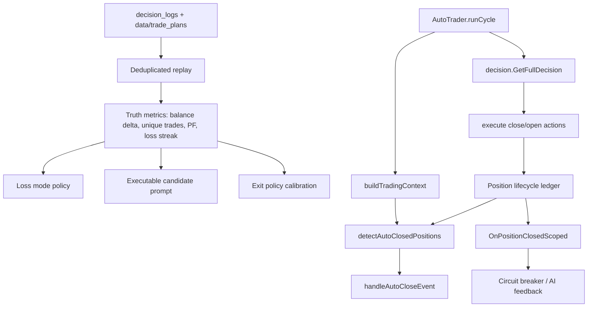

# Live Loss Diagnosis Optimization Design

## Overview

本设计基于 2026-05-13 至 2026-05-16 本机与 161 的 `aster_deepseek` 实盘日志。结论是：先修复交易生命周期与统计口径，再优化策略入场/出场。否则 AI 学习、rolling performance、熔断和人工评估都会被重复亏损污染。

核心问题：

1. `runCycle()` 在执行交易前调用 `updatePositionSnapshots(ctx.Positions)`，但手动 `close_long/close_short` 成功后没有同步移除 `lastPositions`。下一周期 `detectAutoClosedPositions()` 将已被主动平掉的仓位误判为 snapshot auto-close。
2. 误判 auto-close 进入 `handleAutoCloseEvent()`，再调用 `OnPositionClosedScoped()`。由于计划已在首次平仓时移除，第二条 closed trade 出现 `entry_price=0`、`quantity=0`、`direction=""`，但仍更新收益序列和连亏。
3. `CheckCircuitBreaker()` 使用污染后的 `TradeStatistics.ConsecutiveLosses`，两端都进入“连续亏损 8 次”的熔断/等待状态。
4. 去重后仍有策略缺陷：亏损单集中在软止损/动量失败后退出，盈利单回吐明显，AI 多次输出 RR 不达标或 BTC gate 明确禁止的机会。

Relevant code:

- `trader/auto_trader.go`: `runCycle()` lines 358-402, close handlers around 1473-1542, snapshot auto-close around 2426-2485。
- `trader/auto_close_event.go`: dedupe and `handleAutoCloseEvent()` lines 28-98。
- `decision/persistence.go`: `OnPositionClosedScoped()` lines 941-983。
- `decision/risk.go`: consecutive-loss circuit breaker lines 436-445。
- `decision/decision.go`: AI cadence/gates and RR validation lines 651-897。
- `decision/open_gate.go`: BTC/high beta/ADX gate lines 49-84 and 207-230。
- `decision/takeprofit.go`: soft stop logic lines 298-335。

## Evidence Summary

| Source | Actual account delta | Raw closed stats | Duplicate pattern |
| --- | ---: | --- | --- |
| 本机 | 200.0262 -> 197.4584 USDT, about -2.5678 | 10 trades, 1W/9L, PF 0.00596, loss streak 8 | BCH/ETH/DOGE/BNB manual close followed by `AUTO_CLOSE_DETECTED` |
| 161 | 45.4439 -> 44.1798 USDT, about -1.2640 | 9 trades, 1W/8L, PF 0.2481, loss streak 8 | BCH/BTC/ETH/BNB manual close followed by `AUTO_CLOSE_DETECTED` |

Local action distribution:

- `open_long=3`, `open_short=3`
- `close_long=3`, `close_short=3`
- `auto_close_long=2`, `auto_close_short=2`
- `open_rejected=163`, `wait=1402`
- top rejection: `XAGUSDT open_long` blocked by BTC 1h/4h bearish high-beta gate 32 times

161 action distribution:

- `open_short=4`, `open_long=1`
- `close_short=3`, `close_long=1`
- `auto_close_short=4`, `auto_close_long=1`
- `open_rejected=166`, `wait=1518`
- top rejection: same XAG high-beta long BTC gate block 32 times

## Architecture



## Design Principles

- **Truth first**: 优先修复交易生命周期和统计口径，再调阈值。
- **Idempotent close events**: 同一持仓生命周期的 close event 只能影响统计一次。
- **Exchange truth beats inference**: order-tracker 成交明细优先，snapshot 推断只能作为兜底。
- **Loss mode deterministic**: 连亏后降风险应由本地规则生效，不依赖 AI 自觉。
- **Do no harm**: 不改变真实凭证、不开真实订单、不降低保护单语义。

## Component Design

### 1. Position Lifecycle Ledger

Files:

- `trader/auto_trader.go`
- `trader/auto_close_event.go`
- `trader/trader_test.go`

Add an in-memory lifecycle close ledger scoped by trader:

```go
type closedLifecycleKey struct {
    TraderID string
    Symbol   string
    Side     string
}
```

Each successful manual close SHALL:

1. call `decision.OnPositionClosedScoped()` once;
2. call `orderTracker.StopTracking(symbol, side)`;
3. delete `lastPositions[symbol+"_"+side]`;
4. delete `positionFirstSeenTime[symbol+"_"+side]`;
5. mark the lifecycle closed for a TTL longer than one scan cycle, e.g. 30 minutes.

`detectAutoClosedPositions()` SHALL check the lifecycle ledger before emitting snapshot auto-close. If a manual close was just recorded for the same symbol/side, it SHALL skip the snapshot event.

### 2. Safe Auto-Close Accounting

Files:

- `trader/auto_close_event.go`
- `decision/persistence.go`
- `logger/decision_logger.go`

`handleAutoCloseEvent()` should classify event source:

- `order_tracker`: exchange-confirmed, can update stats if not duplicate.
- `snapshot`: inferred, can update stats only if an active plan exists and the lifecycle was not already closed.
- `stale_plan`: inferred from active plan missing on exchange after restart, can update stats once using plan data and marked as inferred.

The statistics writer SHALL only create a counted `ClosedTradeRecord` when it has either:

- an active `TradePlan`, or
- validated exchange close metadata from order/trade history containing symbol, side, entry price, exit price, quantity, leverage, close reason, and close time.

It SHALL reject or no-op invalid statistical updates when:

- no active plan exists,
- no validated exchange close metadata exists,
- side is empty,
- quantity and entry are unavailable,
- event source is snapshot fallback and lifecycle is already closed.

The event can still be logged as reconciliation evidence without entering `closed_trades` or `returns`.

### 3. Reconciliation and Replay Report

Files:

- `cmd/replay/main.go`
- `logger/replay.go`
- optional new `cmd/reconcile-trades/main.go`
- optional read-only exchange snapshots through `Trader.GetOrderHistory()` / `Trader.GetTradeHistory()`

Extend replay report with:

- raw closed trade count vs deduplicated closed trade count;
- duplicate close candidates grouped by symbol/side;
- raw PF/win rate vs deduplicated PF/win rate;
- balance delta from account snapshots;
- local-vs-exchange close mismatch count when order/trade history snapshots are available;
- top rejection reason buckets: RR, BTC high-beta gate, confidence, pre-open invalidation;
- loss-mode simulation: what risk/cap would have applied after each deduplicated loss.

Repair command behavior:

1. dry-run by default;
2. prints records that would be excluded from statistics;
3. writes repaired statistics only with explicit `--apply`;
4. never rewrites raw decision logs.

### 4. Loss Mode Policy

Files:

- `logger/decision_logger.go`
- `decision/open_gate.go`
- `decision/decision.go`
- `trader/auto_trader.go`
- `config/config.go`

Add or derive a deterministic loss mode from deduplicated outcomes:

```go
type LossModeState struct {
    Active          bool
    Reason          string
    CooldownUntil   time.Time
    MaxRiskPerTrade float64
    MaxPositions    int
    DailyOpenLimit  int
    MinConfidence   int
}
```

Suggested defaults:

- trigger: 2 consecutive deduplicated losses or last 3 trades with at least 2 losses and total PnL < 0;
- duration: 24 hours or until recovery criteria;
- risk: 0.5% per trade;
- max positions: 1;
- daily opens: 1 while active;
- min confidence: 90;
- high beta altcoin longs blocked unless BTC 1h/4h is supportive.

Recovery:

- last 3 deduplicated trades PF >= 1.2, or
- cooldown expires and no additional deduplicated loss occurred.

This should replace reliance on polluted raw `TradeStatistics.ConsecutiveLosses` for adaptive behavior. Circuit breaker can still use consecutive losses, but only after deduplication is fixed.

Existing code note: `logger.BuildRollingPerformance()` already derives `EffectiveMaxRiskPerTrade`, but `decision.EvaluateOpenGate()` intentionally does not call `applyRollingPerformanceGate()` and tests assert old rolling gates must not block fresh strategy decisions. Loss mode should therefore be implemented as an explicit deduplicated state rather than silently re-enabling the old rolling gate behavior.

### 5. Executable Candidate Prompt

Files:

- `decision/decision.go`
- `decision/open_gate.go`
- `market/data.go` only if extra diagnostics are required

The AI prompt should not repeatedly ask for trades that local deterministic gates will reject.

Changes:

1. If BTC high-beta long gate is `block`, exclude high beta altcoin longs from prompt candidate display or mark them as `non_executable`.
2. Include exact net RR formula used by live validation: `(rewardPct - 0.2) / riskPct >= 2.5`.
3. For each candidate, include suggested stop distance, minimum TP distance, and whether long/short direction is executable.
4. Prioritize BTC/ETH, low-correlation symbols, or short setups when BTC higher timeframe is weak.
5. Add replay buckets for RR rejection so prompt changes can be measured.

### 6. Exit Policy Calibration

Files:

- `decision/takeprofit.go`
- `decision/takeprofit_test.go`

Observed issue:

- 本机 XAG peak +5.66% closed +0.15%。
- 本机 ETH peak +3.46% closed -0.11%。
- 多笔 loss exited only after -3% to -7.48% leveraged PnL。

Proposed default changes:

1. Move to breakeven or slight lock once MFE >= 1R or leveraged PnL >= 2%。
2. If min notional supports it, partial close 30%-50% at 1R; otherwise tighten stop instead of emitting partial close。
3. Reduce no-momentum loss threshold from current late exit pattern toward earlier invalidation, e.g. after 45-60 minutes with MFE < 1.5% and current PnL < -1.5%。
4. Tighten MFE giveback: if peak PnL >= 3% and current gives back > 60%-70% with weak momentum, close or tighten stop before turning negative。
5. Keep hard stop and exchange protection orders as first priority.

### 7. Configuration Proposal

Suggested runtime config after fixes, not before:

```json
{
  "trading_frequency": {
    "mode": "safe",
    "daily_open_limit": 1,
    "rollback_window_hours": 24,
    "rollback_min_profit_factor": 1.2,
    "rollback_max_drawdown_pct": 1.5
  }
}
```

For the current accounts, run safe mode until at least 10 deduplicated trades show PF > 1 and no duplicate close events.

## Migration Notes

- Existing raw logs should remain immutable.
- Repaired statistics should be written from a replay/reconcile command or after service restart with fixed logic.
- Any backfill must preserve original `closed_trades` for audit, e.g. by writing `data/trade_plans.repaired.json` first.
- Runtime services should be paused or watched during repair to avoid concurrent writes.

## Validation

Targeted tests:

- `go test ./trader -run 'AutoClose|Close'`
- `go test ./decision -run 'OpenGate|TakeProfit|PositionSizing|Circuit'`
- `go test ./logger -run 'Replay|Rolling|TradeOutcome'`
- `go test ./config`

Replay checks:

- Run local sample: `go run ./cmd/replay -log-dir decision_logs -trader aster_deepseek -from 2026-05-13`
- Run 161 sample through copied logs or remote command.
- Verify duplicate snapshot auto-closes no longer affect deduplicated metrics.

## Rollout Plan

1. Implement and test lifecycle dedupe.
2. Deploy to one instance only.
3. Run for 24 hours in safe/loss mode with low risk.
4. Compare raw and deduplicated replay reports.
5. Only then calibrate exits and prompt candidate filtering.
