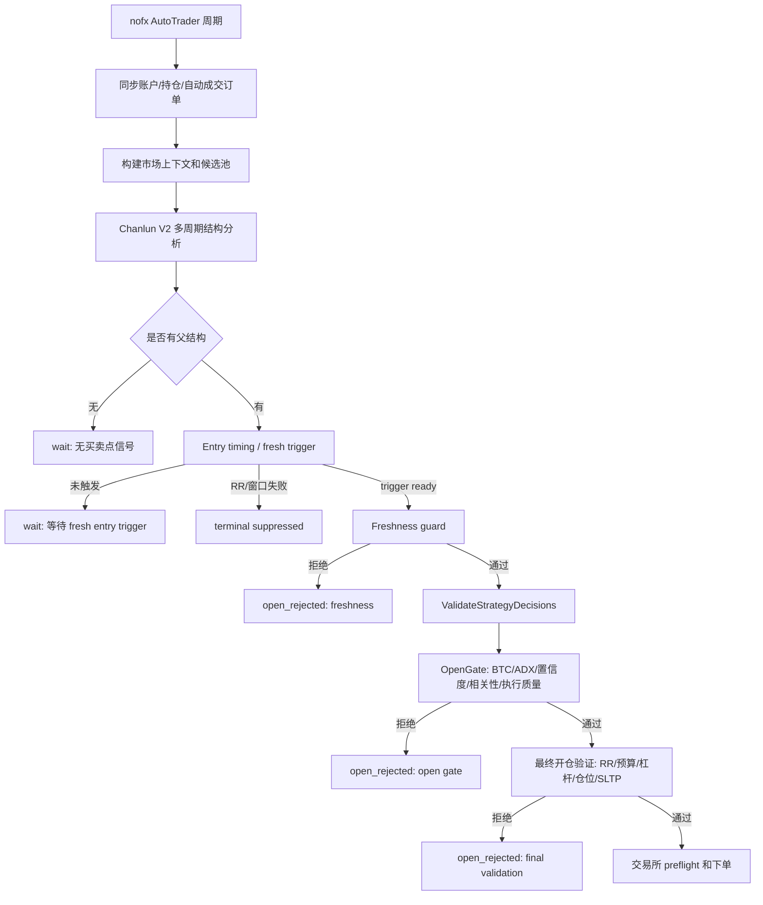

# NOFX 服务最近 2 日无交易单输出诊断与方案

## 总览

最近 2 日无交易单输出是策略/风控链路的预期结果，不是服务没有运行，也不是交易所下单失败。

当前唯一启用的 `aster_chanlun_v2` 每 3 分钟正常运行，写入 960 条决策记录。执行层没有真实订单，是因为所有开仓候选都在交易所执行前被拒绝：

- 916 个周期没有可执行信号，最终 `wait`。
- 44 个周期出现开仓候选，但全部被标记为 `open_rejected`。
- 34 个 `ASTERUSDT open_long` 被 BTC 多周期转弱硬阻断。
- 10 个 `DOGEUSDT open_short` 分别被 freshness RR、置信度和最终 RR 2.5 拒绝。

因此方案重点不是“直接放开下单”，而是让系统在 BTC 弱势环境下更早过滤必然被拒的高 beta 多单，提升 short-side near-miss 的可见性，并明确缠论 V2 的 signal-type RR 只控制 entry trigger，最终开仓验证继续保留 RR 2.5 硬阈值。

## 当前链路



最近 48 小时没有任何候选到达 `K`。

## 证据摘要

### 服务状态

Docker Compose 显示：

- `nofx-trading` 容器处于 healthy。
- 服务启动时间为 2026-05-31 23:27:07 +08:00。
- 启动日志显示版本为 `dev`，构建时间和 Git 为 `unknown`，说明当前容器构建未注入版本信息。
- 配置加载成功，共 5 个 trader，只有 1 个启用。

启动日志中的启用状态：

- 跳过 `Hyperliquid DeepSeek Trader`
- 跳过 `Binance Qwen Trader`
- 跳过 `Binance Custom API Trader`
- 跳过 `Aster DeepSeek Trader`
- 初始化 `Aster Chanlun V2 Trader`

### 决策日志

只读 replay 命令：

```bash
GOCACHE=/tmp/nofx-go-build-cache go run ./cmd/replay \
  -log-dir decision_logs \
  -trader aster_chanlun_v2 \
  -from 2026-05-31T16:30:37+08:00 \
  -to 2026-06-02T16:30:37+08:00 \
  -open-rejection-daily \
  -near-miss-limit 10 \
  -config config.json
```

关键输出：

| 字段 | 值 |
| --- | ---: |
| `record_count` | 960 |
| `rejected_open_count` | 44 |
| `no_successful_open_hours` | 47.91 |
| `top_no_open_buckets.adx` | 37 |
| `top_no_open_buckets.rr` | 21 |
| `trigger_ready_count` | 48 |
| `open_gate_rejection_count` | 44 |

说明：以上 `top_no_open_buckets.adx/rr` 是当前 replay 的历史基线。交叉检查确认现有 bucket 分类会先匹配 ADX 再匹配 BTC，因此增强后的报告需要把 `btc_hard_veto`、`adx_report_only` 和 `final_rr` 拆分出来，同时保留原始 `record_count=960`、`rejected_open_count=44` 用于对账。

`freshness_compatibility` 显示：

- 2 个 `DOGEUSDT sell2` 样本按旧 freshness RR 2.5 被拒。
- 如果按 `sell2` 信号类型阈值 1.1 审计，这 2 个样本会通过 freshness RR。
- 这不代表它们一定会真实下单，因为后面仍有 open gate 和最终 RR 2.5。

### 账户与计划状态

- 最近 48 小时 `positions` 全部为空。
- `data/trade_plans.json` 中 `plans` 为空。
- 已关闭交易统计最后更新为 2026-05-27。
- 可用余额在窗口内基本稳定，没有因持仓或成交发生明显变化。

## 原因链路

### 1. 不是服务故障

服务持续写入决策日志，自动成交订单检查持续运行，API 有访问日志，容器健康检查通过。没有交易单输出不是因为服务没跑。

### 2. 不是交易所执行失败

容器日志没有真实下单、开仓成功、成交成功或交易所拒单日志。唯一命中的“订单”相关日志是启动时创建订单追踪器，不是交易所订单。

### 3. 不是多个 trader 共同无输出

最近 2 日只有 `aster_chanlun_v2` 启用。`aster_deepseek` 最近没有决策文件，最后停在 2026-05-25。其他 trader 被配置禁用。

### 4. ASTERUSDT 多单被 BTC 硬阻断

2026-06-02 的主要开仓候选是 `ASTERUSDT buy2 -> open_long`。这些候选的置信度在 loosen 模式下降低基础要求后可达到最低置信度要求，但仍被 BTC 多周期硬阻断：

```text
BTC 1h/4h 明显转弱，禁止新开高 beta 山寨多单
```

代码位置：

- `decision/open_gate.go` 的 `applyBTCMultiTimeframeGate()`
- 高 beta 山寨多单在 BTC 确认转弱时直接 `blockWithDiagnostics`

日志同时出现 ADX 15.x 低于 25 的信息，但该段标记为 `report-only`。因此对 ASTERUSDT 来说，硬阻断不是单纯 ADX，而是 BTC 多周期转弱。

### 5. DOGEUSDT 空单更接近可交易，但被多层阈值拦截

`DOGEUSDT sell2 -> open_short` 共有 10 次候选：

- 2 次 freshness RR 使用旧阈值 2.5 拒绝；按 `sell2=1.1` 审计会通过 freshness。
- 3 次 open gate 要求置信度 65，但实际置信度 62。
- 5 次最终开仓验证中 RR 约 1.36-1.59，低于当前全局硬阈值 2.5。

代码位置：

- freshness 和缠论 V2 诊断在 `strategy/chanlunv2/engine.go`
- open gate 置信度在 `decision/open_gate.go`
- 最终 RR 2.5 硬检查在 `decision/decision.go` 的 `validateOpenDecisionWithOptions()`

### 6. Loosen 模式没有绕过硬风控

日志显示当前多数周期 `active_mode=loosen`，并且 open gate 的基础置信度有从 78 下调到 60 的诊断。但 loosen 并没有绕过：

- BTC hard veto
- 最终 RR 2.5
- 风险预算、仓位 sizing、交易所 preflight

这符合保守设计，但也解释了为什么“已经 loosen”仍没有订单。

## 方案

### 方案 A：先增强 no-order 报告，不改变实盘风控

目标是让下次排查不需要手工翻 Docker 和 JSON。

实现点：

1. 保留并强化 `cmd/replay -open-rejection-daily` 作为标准入口。
2. 在 replay 输出中新增或突出基于决策日志/config 可得的字段：
   - `real_exchange_order_count`，按决策日志中真实成功 open 或可识别 exchange order 信息近似统计。
   - `enabled_trader_count`，从提供的 `config.json` 读取。
   - `final_validation_rr_rejection_count`
   - `btc_hard_veto_count`
   - `freshness_pass_but_final_rr_fail_count`
3. 服务日志相关字段只在新增服务日志输入时统计；若未提供服务日志输入，报告只输出人工交叉验证 note，不把“订单追踪器创建”从 replay 内部计为真实交易所订单。
4. 对 `report-only` 文案做分层解释，避免把 ADX report-only 误读为真实硬阻断。
5. 输出“服务日志覆盖范围不足”提示：容器日志从 2026-05-31 23:27:07 开始，本地决策日志覆盖完整 48 小时。

优点：

- 不影响实盘。
- 能直接回答“为什么没有交易单”。
- 给后续调参提供稳定基线。

风险：

- 只改善可观测性，不会增加订单输出。

### 方案 B：BTC 弱势下提前抑制高 beta 多单，减少无效 open_rejected

目标是把 ASTERUSDT 这类必然被 BTC hard veto 的高 beta 多单更早归入 strategy diagnostic，而不是每 3 分钟都推进到 open gate 后再拒绝。

实现点：

1. 先在 `decision` 包提取或暴露只读 helper，例如 `EvaluateBTCHighBetaLongVeto(symbol, action, btcData)`，由 `applyBTCMultiTimeframeGate()` 和 `strategy/chanlunv2` precheck 共同调用，避免策略层和 open gate 逻辑分叉。
2. 在缠论 V2 生成 open candidate 前读取 BTC multi-timeframe regime。
3. 当 BTC confirmed bearish 且候选为高 beta alt `open_long`：
   - 标记 `btc_hard_veto_precheck`
   - 将该 signal 进入短期 cooldown 或 terminal suppressed
   - no-open 报告保留样本和计数
4. 在同一 BTC regime 下优先展示 short-side near-miss，例如 DOGEUSDT sell2。

优点：

- 不放松风控。
- 减少重复拒绝循环。
- 让策略更符合当前市场方向。

风险：

- 如果 BTC 快速反转，提前 suppress 的 long 信号可能错过窗口。因此 cooldown 必须短，并且 BTC regime 变化时解除。
- 该方案会改变未来相同场景的统计口径：一部分历史上会成为 `open_rejected` 的候选，将在策略预检查阶段变成 `btc_hard_veto_precheck` 或 terminal suppression。历史 replay 仍用于解释原始 `open_rejected=44`。

### 方案 C：明确缠论 V2 RR 阈值语义，不降低 RR

目标是解决当前阈值语义不一致：`entry_timing.signal_type_min_rr` 可以让 `sell2` 以 1.1-1.6 的 RR 成为候选，但最终 `validateOpenDecision` 仍用全局 2.5 硬拒绝。本规格确认不降低 RR 阈值，因此方案 C 只做诊断和文档澄清，不改变实盘开仓准入。

设计：

1. 不改最终开仓逻辑，继续保留 RR 2.5 硬阈值。
2. 不新增 `strategy_risk.final_min_net_rr_by_signal_type`。
3. 不复用缠论 V2 entry timing 的 signal-type RR 作为最终开仓 RR。
4. 在 replay、前端诊断和配置说明中明确：signal-type RR 只控制 entry trigger，最终下单仍要求 RR 2.5。
5. 将 `freshness pass but final RR fail` 作为独立 no-order bucket 输出，避免把这类样本误判为“应该下单但没下单”。

优点：

- 不降低交易质量门槛。
- 保持当前确定性风控边界。
- 配置语义更清楚，减少误读。

风险：

- 该方案不会直接增加订单输出。
- DOGEUSDT 这类低于 RR 2.5 的 short-side near-miss 仍会被最终验证拒绝。

### 方案 D：Loosen 模式增加硬阻断解释

目标是让用户看到“已经放宽了什么”和“仍被什么硬阻断”。

实现点：

1. 在 `risk_state.frequency_state` 或 `strategy_diagnostics` 中增加：
   - `loosen_applied_rules`
   - `remaining_hard_blocks`
   - `loosen_started_at`
   - `loosen_expires_at`
2. 记录 `max_duration_hours` 当前是否仅作为配置/诊断值；本规格默认不新增 loosen 实际退出行为。
3. 对 `runaway_rejection_loop=true` 输出 top 重复 signal 和重复 reason。

优点：

- 解释“为什么 loosen 后还是没单”。
- 明确 `max_duration_hours` 的当前实现状态，避免把诊断字段误解为已经执行退出。

风险：

- 需要保持字段与前端类型、replay schema 兼容。
- 如果后续要让 `max_duration_hours` 触发实际回到 balanced/safe，应另补行为设计、状态来源和测试，因为这会改变交易行为。

### 方案 E：候选池覆盖和 OI Top 数据修复作为后续项

当前日志反复出现：

```text
未配置OI Top API URL，跳过OI Top数据获取
```

这不是最近 2 日无订单的直接原因，因为静态 10 币候选池仍在正常分析。但它限制了系统寻找更适合当前市场 regime 的候选。

后续可选：

1. 配置 OI Top API URL。
2. 启用动态候选池。
3. 在 BTC 弱势时提高 short-side 候选覆盖。

该项不应作为第一优先级，因为它可能扩大搜索范围，但不会解决最终 RR 和 BTC hard veto 的核心链路。

## 推荐执行顺序

1. 先做方案 A：把 no-order 报告固化，确保历史窗口能复现 `record_count=960`、`rejected_open_count=44`，增强后能输出 `btc_hard_veto_count`、`final_rr_rejection_count`。
2. 再做方案 B：提取共享 BTC veto helper，并将 BTC hard veto 前移到策略诊断/冷却，减少未来 ASTERUSDT long 重复拒绝。
3. 做方案 C 的只读诊断澄清：保留最终 RR 2.5，不新增降低 RR 的 pilot。
4. 同步做方案 D 的可观测性字段，降低后续排查成本。
5. 最后评估方案 E 的候选池扩展。

## 测试计划

### 只读验证

```bash
GOCACHE=/tmp/nofx-go-build-cache go run ./cmd/replay \
  -log-dir decision_logs \
  -trader aster_chanlun_v2 \
  -from 2026-05-31T16:30:37+08:00 \
  -to 2026-06-02T16:30:37+08:00 \
  -open-rejection-daily \
  -near-miss-limit 10 \
  -config config.json
```

### 单元测试方向

- `decision/open_gate_test.go`
  - BTC confirmed bearish blocks high beta alt long.
  - ADX report-only does not by itself create hard block.
  - loosen confidence override lowers base confidence but does not override BTC hard block.

- `decision/decision_test.go`
  - `validateOpenDecisionWithOptions()` reports final RR rejection separately from open gate rejection.
  - 确认低于 RR 2.5 的候选仍被最终开仓验证拒绝。

- `strategy/chanlunv2/engine_test.go`
  - high beta long under BTC bearish is pre-suppressed with `btc_hard_veto_precheck`。
  - repeated same signal hard veto enters cooldown/terminal suppression.
  - short-side near-miss remains visible in diagnostics.

- `logger/replay_test.go`
  - replay buckets distinguish `btc_hard_veto`、`adx_report_only`、`freshness_rr`、`final_rr`。
  - without service log input, replay does not claim Docker order tracker wording as exchange order.
  - with optional service log input, service/order wording does not count order tracker creation as exchange order.

### 命令

Focused backend validation:

```bash
GOCACHE=/tmp/nofx-go-build-cache go test ./decision ./strategy/chanlunv2 ./logger ./cmd/replay
```

If final RR behavior or backend contracts change:

```bash
GOCACHE=/tmp/nofx-go-build-cache go test ./...
```

## 风险控制

- 不修改真实密钥或账户配置。
- 不在 replay 或测试中下真实订单。
- 不直接关闭 BTC hard veto。
- 不引入低于当前最终 RR 2.5 的 signal-type final RR、pilot final RR 或按场景降低 final RR 的配置。
- 所有真实开仓仍必须经过 `ValidateStrategyDecisions()`、position sizing、交易所 preflight、保护单创建。

## 当前建议

本次明确不为了“有交易单”降低 RR 阈值，也不关闭 BTC hard veto。

更稳妥的路径是：

1. 先把 no-order 报告增强为标准运维工具。
2. 前移 BTC hard veto，减少重复无效候选。
3. 补充 RR 阈值语义诊断：entry trigger 通过不代表最终可下单，最终 RR 2.5 保持不变。
