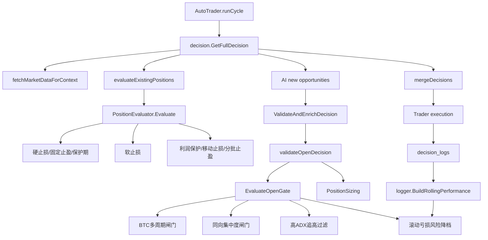

# 盈利导向策略防护优化 Design

## Overview

本设计把 2026-05-06/2026-05-07 复盘得到的盈利优化规则固化到本地策略层，避免只依赖 AI prompt。实现分三条路径：

1. **开仓准入层**：扩展 `decision/open_gate.go`，在 AI 决策通过前拦截弱市场追多、同向集中、极高 ADX 追高和已有亏损持仓继续加仓。
2. **持仓评估层**：扩展 `decision/takeprofit.go`，收紧利润保护，提前保本/锁盈，并增加保护期后的软止损。
3. **滚动绩效层**：扩展 `logger/decision_logger.go` 的 `RollingPerformanceSnapshot`，识别最近亏损并把降仓/提高置信度传递给开仓闸门。

设计目标是“少做错、少回吐、少扛亏”，而不是提高交易频率。

## Architecture



## Design Principles

- **本地硬规则优先于 AI 理由**：AI 可以提出机会，但开仓必须通过 deterministic gate。
- **阈值集中、行为可测**：新增规则使用包内常量和 helper，单元测试覆盖主要边界。
- **优先退出坏交易**：软止损只在保护期后生效，不破坏已有硬止损和保护期极端亏损优先级。
- **不扩大执行面**：不修改交易所接口、不新增订单类型、不触碰凭证。
- **向后兼容持久化 JSON**：新增字段只加到 logger 快照；交易计划结构不强制迁移。

## Components

### 1. Open Gate Enhancements

**File:** `decision/open_gate.go`

新增常量：

```go
const (
    highBetaLongMaxSameSidePositions = 2
    losingSameSideBlockPnLPct        = -4.0
    extremeADX                       = 60.0
    elevatedADX                      = 50.0
    highADXRiskMultiplier            = 0.5
    highADXMinConfidence             = 90
    btcConflictMinConfidence         = 88
)
```

新增/扩展函数：

- `isHighBetaAltcoin(symbol string) bool`
- `normalizePositionSide(side string) string`
- `applyBTCMultiTimeframeGate(result *OpenGateResult, d *Decision, ctx *Context)`
- `applySameSideExposureGate(result *OpenGateResult, d *Decision, ctx *Context)`
- `applyHighADXChaseGate(result *OpenGateResult, d *Decision, data *market.Data)`
- `isBearishStructure(data *market.Data) bool`
- `hasBTCMultiTimeframeConflict(data *market.Data) bool`
- `hasPullbackConfirmationForLong(data *market.Data) bool`

`EvaluateOpenGate` 调用顺序调整为：

1. rolling performance gate
2. existing BTC crash/volatility gate
3. **BTC multi-timeframe gate**
4. **same-side exposure gate**
5. existing high-correlation gate
6. **high ADX chase gate**
7. short side gate
8. execution quality gate

#### BTC 多周期判定

以现有 `market.Data` 字段计算，不新增市场请求：

- 4h 明显空头：`CurrentDIPlus < CurrentDIMinus` 且 `CurrentPrice < LongerTermContext.EMA20`，或 4h MACDHist 最新值为负且价格低于 EMA50。
- 1h 明显空头：`MidTermSeries1h` 最新 EMA20 < EMA50，或 MACDHist 最新值为负且价格变化为负。
- 15m/1h 冲突：15m MACDHist、EMA20/EMA50 与 1h/4h 方向不一致。

行为：

- 高 beta `open_long` 遇到 BTC 1h/4h 明显空头：`block`
- 高 beta `open_long` 遇到短中期冲突：`penalize`，`MinConfidence >= 88`，`EffectiveRisk *= 0.5`

#### 同方向集中度

行为：

- 高 beta `open_long` 且已有 `long` 持仓数 >= 2：`block`
- 高 beta `open_long` 且已有高 beta `long` 持仓数 >= 1：`penalize`，`EffectiveRisk *= 0.5`
- 任一同方向持仓 `UnrealizedPnLPct <= -4`：`block`

实现时需要统一持仓方向。实盘上下文通常使用 `long`/`short`，但部分测试和旧路径可能出现 `BUY`/`SELL`，因此集中度 helper 先用 `normalizePositionSide` 归一化。

此规则比现有“高相关集中度”更宽，因为 5.6/5.7 的问题不是只有相关性，而是同方向高 beta 暴露。

#### 高 ADX 追高过滤

行为：

- 高 beta `open_long` 且目标 `CurrentADX > 60`，同时 `PriceChange1h >= 1.5%` 或 `PriceChange4h >= 4%`，且无回踩确认：`block`
- 高 beta `open_long` 且目标 `CurrentADX > 50`：`penalize`，`MinConfidence >= 90`，`EffectiveRisk *= 0.5`

回踩确认使用已有数据粗判：

- 当前价格接近或回踩过 EMA20：`CurrentPrice <= CurrentEMA20 * 1.01`
- 或 15m RSI 不过热：最新 RSI14 < 60 且 MACDHist 回升

### 2. Risk Downgrade from Rolling Performance

**File:** `logger/decision_logger.go`

扩展 `RollingPerformanceSnapshot`：

```go
Recent3          RollingStats `json:"recent_3"`
RecentLossStreak int          `json:"recent_loss_streak,omitempty"`
Recent3Losses    int          `json:"recent_3_losses,omitempty"`
```

新增 helper：

- `recentLossStreak(trades []TradeOutcome) int`
- `countLosses(trades []TradeOutcome) int`
- `applyGlobalRecentLossGate(snapshot *RollingPerformanceSnapshot)`

`BuildRollingPerformance` 新行为：

- 最近两笔闭合交易均亏损：
  - `EffectiveMaxRiskPerTrade = min(existing, 0.01)`
  - `Reasons += "最近2笔连续亏损，下一笔单笔风险降至1%"`
- 最近三笔亏损不少于两笔且总 PnL 为负：
  - 记录 `Recent3` 与 `Recent3Losses`
  - 对 `SideGates["long"]` 和 `SideGates["short"]` 应用全局降权：`MinConfidence >= 85`，`RiskMultiplier <= 0.75`
  - `Reasons += "最近3笔中至少2笔亏损且总PnL为负，提高下一笔开仓门槛"`
  - 不因样本少于 2 笔阻断交易

由于 `AutoTrader` 已将 `performance.Rolling.EffectiveMaxRiskPerTrade` 注入 `Context.EffectiveMaxRiskPerTrade`，`decision/open_gate.go` 的 `baseOpenGateRisk` 会自动消费该降档。

### 3. Take Profit and Soft Stop Enhancements

**File:** `decision/takeprofit.go`

为支持“BTC 或目标币短周期动量转弱”，扩展持仓评估器：

```go
type PositionEvaluator struct {
    Position      *PositionInfo
    Plan          *TradePlan
    MarketData    *market.Data
    BTCMarketData *market.Data
    Symbol        string
}
```

`decision.evaluateExistingPositions` 在构造 evaluator 时从 `ctx.MarketDataMap["BTCUSDT"]` 注入 `BTCMarketData`。如果 BTC 数据缺失，软止损只使用目标币动量，避免数据不足误平仓。

调整配置：

```go
ProfitProtectRatio: 0.60
BreakevenThreshold: 6.0
LockProfitThresholds:
    10% -> lock 25%, ADX >= 20
    12% -> lock 40%, ADX >= 20
    20% -> lock 60%, ADX >= 15
```

新增常量：

```go
const (
    softStopLossPnLPct          = -5.0
    noMomentumMFEThresholdPct   = 3.0
    noMomentumLossPnLPct        = -3.0
    noMomentumHoldMinutes       = 60
    highPeakProfitProtectPct    = 12.0
    highPeakProfitProtectRatio  = 0.65
    basePeakProfitProtectRatio  = 0.60
)
```

新增函数：

- `evaluateSoftStop() *EvaluationResult`
- `checkLostBreakevenWithWeakMomentum(peakPnL float64) bool`
- `hasWeakShortTermMomentum(data *market.Data, direction string) bool`
- `profitProtectRatioForPeak(peakPnL float64, config *TakeProfitEngineConfig) float64`

`PositionEvaluator.Evaluate` 优先级调整：

1. 硬止损
2. 固定止盈
3. 最小持仓保护期
4. **保护期后的软止损**
5. 利润保护
6. ATR 跟踪止盈
7. 分批止盈
8. 移动止损
9. 动态止盈
10. 计划失效

软止损行为：

- 保护期后 `UnrealizedPnLPct <= -5%`：`close`
- 持仓超过 60 分钟、`max(PeakPnLPercent, 当前PnL) < 3%`、当前 `UnrealizedPnLPct <= -3%`：`close`
- 曾经浮盈超过 3%，当前 `UnrealizedPnLPct <= 0`，且 BTC/目标短周期动量转弱：优先 `close`

利润保护行为：

- 峰值 `>= 12%` 使用 `65%` 保护线。
- 峰值 `>= 8%` 使用 `60%` 保护线。
- 保留已有“曾盈利 >=10%，现仅剩 <2%”兜底逻辑，但预计更少触发。

### 4. Prompt Alignment

**File:** `decision/decision.go`

更新 `buildSystemPrompt`：

- 在“硬约束”增加：
  - BTC 1h/4h 弱势时禁止山寨多单
  - 已有 2 个同向多单时禁止继续加高 beta 多单
  - 任一同向持仓亏损超过 4% 时禁止加同向仓
  - ADX > 60 代表追高风险，需要回踩确认
  - 最近亏损后自动降仓
- 在“开仓决策流程”中把 ADX 说明从单纯 `ADX>25` 改为 `25-50 为趋势确认，>60 需回踩确认`

Prompt 只是减少无效 AI 输出；实际约束仍在本地验证层。

## Data Structures

### RollingPerformanceSnapshot

```go
type RollingPerformanceSnapshot struct {
    SymbolGates              map[string]PerformanceGate `json:"symbol_gates"`
    SideGates                map[string]PerformanceGate `json:"side_gates"`
    Recent3                  RollingStats               `json:"recent_3"`
    Recent10                 RollingStats               `json:"recent_10"`
    Recent20                 RollingStats               `json:"recent_20"`
    RecentLossStreak         int                        `json:"recent_loss_streak,omitempty"`
    Recent3Losses            int                        `json:"recent_3_losses,omitempty"`
    EffectiveMaxRiskPerTrade float64                    `json:"effective_max_risk_per_trade"`
    Reasons                  []string                   `json:"reasons,omitempty"`
}
```

JSON 兼容性：新增字段不会影响旧 JSON 反序列化；API 消费方可忽略额外字段。`recent_loss_streak` 和 `recent_3_losses` 使用 `omitempty`，`recent_3` 与现有 `recent_10`/`recent_20` 一样作为普通统计字段返回。

## API Contracts

无新增 HTTP API。

现有 API 如果返回 rolling performance，会多出三个新增字段：

- `recent_3`
- `recent_loss_streak`
- `recent_3_losses`

前端未强依赖这些字段时无需同步改动；如 TypeScript 类型存在严格定义，执行阶段再补类型。

## Testing Strategy

### decision/open_gate_test.go

新增测试：

- `TestEvaluateOpenGate_BTCMultiTimeframeBearishBlocksAltLong`
- `TestEvaluateOpenGate_BTCConflictPenalizesAltLong`
- `TestEvaluateOpenGate_SameSideExposureBlocksThirdHighBetaLong`
- `TestEvaluateOpenGate_LosingSameSidePositionBlocksAdd`
- `TestEvaluateOpenGate_ExtremeADXChaseBlocks`
- `TestEvaluateOpenGate_ElevatedADXPenalizes`

### decision/takeprofit_test.go

新增测试：

- `TestEvaluateProfitProtection_HighPeakUsesSixtyFivePercentLine`
- `TestEvaluateTrailingStop_BreakevenAtSixPercent`
- `TestEvaluateSoftStop_AfterProtectionAtMinusFive`
- `TestEvaluateSoftStop_NoMomentumAfterSixtyMinutes`
- `TestEvaluateSoftStop_LostBreakevenWithWeakMomentum`

保留现有测试语义：

- 保护期内 `>-3%` 不平仓。
- 保护期内 `<-3%` 继续紧急平仓。
- 硬止损和固定止盈优先于软止损。
- 移动止损多头只升不降、空头只降不升。

### logger/logger_test.go

新增测试：

- `TestBuildRollingPerformance_RecentTwoLossesReduceRisk`
- `TestBuildRollingPerformance_RecentThreeTwoLossesRaisesConfidence`
- `TestBuildRollingPerformance_InsufficientSamplesDoNotBlock`

### Validation Commands

优先运行：

```bash
go test ./logger ./decision
```

若执行阶段触及 trader 执行动作或 API 结构，再补：

```bash
go test ./trader ./api ./manager
```

## Risks and Mitigations

- **规则过严导致错过趋势行情**：高 ADX 规则只硬拒绝“极高 ADX + 已涨 + 无回踩确认”的高 beta 多单；ADX 50-60 只降权。
- **市场数据缺失误拦截**：helper 在数据不足时默认不 block，只在信号明确时执行阻断。
- **短线噪声导致过早平仓**：软止损在保护期后才生效，且 MFE/时长/亏损阈值组合触发。
- **旧日志滚动样本不足**：滚动亏损降档要求至少 2 或 3 笔闭合样本，避免启动初期误判。
- **实盘执行风险**：不新增订单类型，仍输出现有 `close_long`、`partial_close`、`update_stop_loss` 等动作。

## Rollout Plan

1. 先实现开仓闸门 helper 和测试。
2. 再实现盈利保护与软止损测试。
3. 再实现滚动亏损降档和 prompt 对齐。
4. 跑 `go test ./logger ./decision`。
5. 用 5.6/5.7 日志规则复盘校验：HYPE/ZEC/SOL 类追高应被拒绝或降权，ETH/XRP 盈利保护应更早触发。
