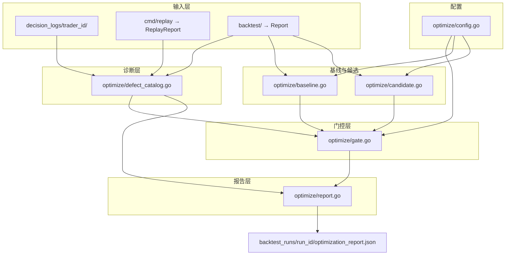
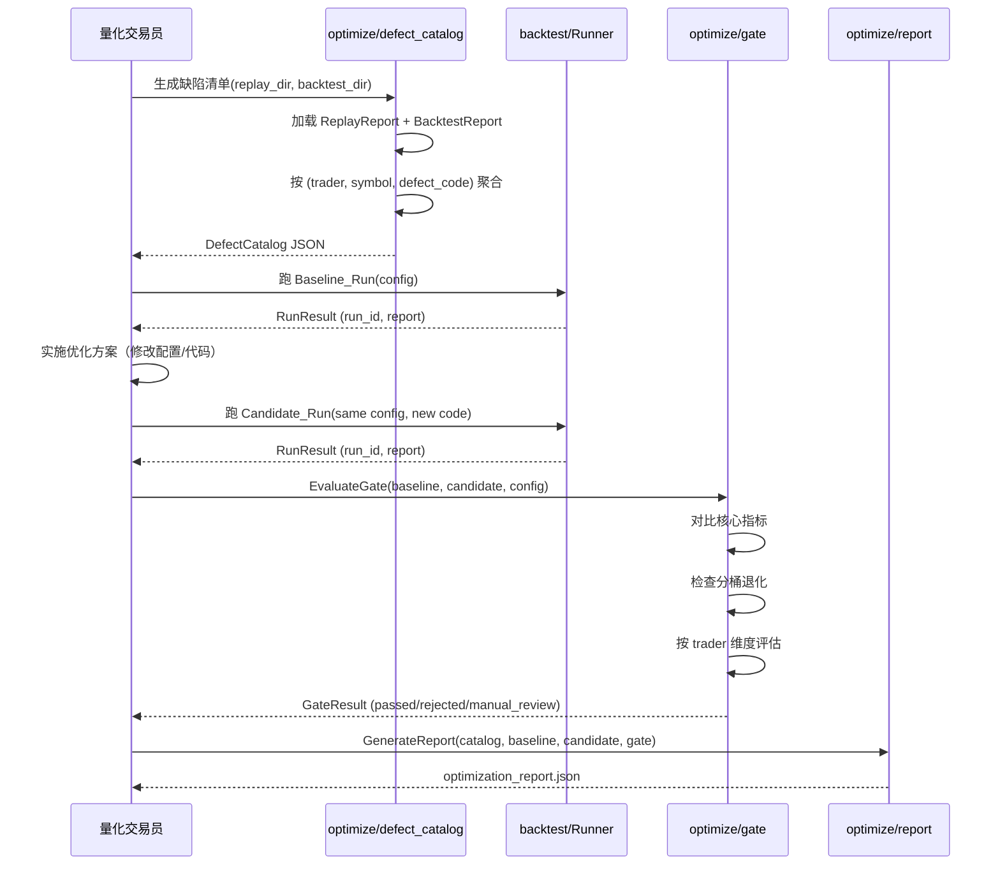
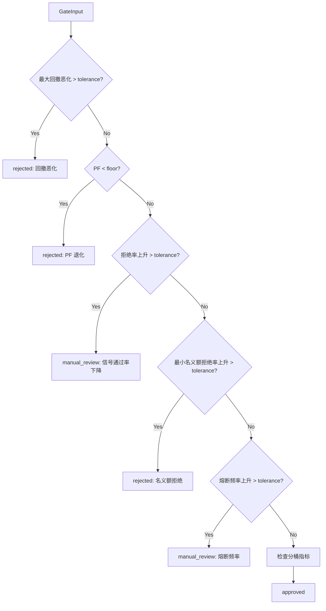

# Design Document: 程序化缠论策略盈利能力优化

## Overview

本设计在已有程序化缠论策略（`strategy/chanlun/`）、决策层（`decision/`）、回测管线（`backtest/`）和 replay 管线（`cmd/replay` + `logger/replay.go`）基础上，新增一套数据驱动的"缺陷诊断 → 基线对比 → 优化门控 → 灰度上线"流程。

核心设计原则：
1. **不重新实现**：复用现有 `backtest.Runner`、`logger.BuildReplayReport`、`decision.EvaluateOpenGate` 等公共入口，新增代码只做聚合、对比和门控。
2. **确定性风控不可旁路**：所有优化方案产出的 `Risk_Increase_Action` 仍必须通过 `ValidateAndEnrichDecision` → `validateOpenDecision` → `EvaluateOpenGate` → `CalculatePositionSizing` → `enforceFinalDecisionLimits` 全链路。
3. **可复现**：Defect_Catalog、Baseline_Run、Candidate_Run 均以 JSON 快照落盘，run_id 和 config_hash 可追溯。
4. **安全**：所有测试使用 fake/mock，运行时数据 git-ignored，不提交真实凭证。

## Architecture



## Components and Interfaces

### 1. optimize 包（新增）

新增 `optimize/` 顶层包，包含以下文件：

| 文件 | 职责 |
|------|------|
| `config.go` | OptimizationConfig 加载、归一化、阈值默认值 |
| `defect_catalog.go` | 从 replay 报告和 backtest 报告聚合缺陷清单 |
| `baseline.go` | 封装 Baseline_Run 触发和指标提取 |
| `candidate.go` | 封装 Candidate_Run 触发和指标提取 |
| `gate.go` | Optimization_Gate 量化对比和通过/拒绝判定 |
| `metrics.go` | 核心指标计算（分桶、bootstrap 区间、信号质量） |
| `report.go` | 优化报告生成和 JSON 落盘 |
| `signal_quality.go` | 信号质量诊断指标（生成频率、确认延迟、撤回率、1R 命中率） |

### 2. 核心接口定义

```go
package optimize

import (
    "nofx/backtest"
    "nofx/logger"
    "time"
)

// OptimizationConfig 优化流程配置
type OptimizationConfig struct {
    // 门控阈值
    MaxDrawdownRelativeTolerance float64 `json:"max_drawdown_relative_tolerance"` // 默认 1.10
    ProfitFactorRelativeFloor    float64 `json:"profit_factor_relative_floor"`    // 默认 0.95
    RejectionRateAbsoluteTolerance float64 `json:"rejection_rate_absolute_tolerance"` // 默认 0.10
    MinNotionalRejectionTolerance  float64 `json:"min_notional_rejection_tolerance"`  // 默认 0.05
    ReplayBacktestConsistencyTolerance float64 `json:"replay_backtest_consistency_tolerance"` // 默认 0.05

    // 诊断区间
    ReplayFrom   string `json:"replay_from"`
    ReplayTo     string `json:"replay_to"`
    BacktestFrom string `json:"backtest_from"`
    BacktestTo   string `json:"backtest_to"`
    WarmupFrom   string `json:"warmup_from"`
    Timezone     string `json:"timezone"`

    // 灰度
    CircuitBreakerFrequencyTolerance float64 `json:"circuit_breaker_frequency_tolerance"` // 默认 0.05 次/天
}

// GradualRolloutConfig 灰度上线配置
type GradualRolloutConfig struct {
    DryRunEnabled              bool    `json:"dry_run_enabled"`               // 默认 true
    MaxPositionRatio           float64 `json:"max_position_ratio"`            // 默认 0.30
    RollingWindowTrades        int     `json:"rolling_window_trades"`         // 默认 30
    NetPnLDegradationThreshold float64 `json:"net_pnl_degradation_threshold"` // 与 Gate 同口径
    MaxDrawdownThreshold       float64 `json:"max_drawdown_threshold"`        // 与 Gate 同口径
    RejectionRateThreshold     float64 `json:"rejection_rate_threshold"`      // 与 Gate 同口径
    TraderRolloutOrder         []string `json:"trader_rollout_order,omitempty"`
}

// DefectEntry 单条缺陷
type DefectEntry struct {
    DefectCode         string            `json:"defect_code"`
    DescriptionZH      string            `json:"description_zh"`
    EvidenceRefs       []EvidenceRef     `json:"evidence_refs"`
    AffectedTraders    []string          `json:"affected_traders"`
    AffectedSymbols    []string          `json:"affected_symbols"`
    AffectedSides      []string          `json:"affected_sides"`
    AffectedSignalTypes []string         `json:"affected_signal_types"`
    PrimaryMetric      string            `json:"primary_metric"`
    MetricDeltaVsHealthy float64         `json:"metric_delta_vs_healthy_subset"`
    SampleCount        map[string]int    `json:"sample_count"`          // per trader
    DirectionDist      map[string]string `json:"direction_distribution"` // per trader
}

// EvidenceRef 证据引用
type EvidenceRef struct {
    Source    string `json:"source"`     // "decision_log", "replay_report", "backtest_report"
    Path      string `json:"path"`
    TraderID  string `json:"trader_id"`
    Symbol    string `json:"symbol,omitempty"`
    SignalID  string `json:"signal_id,omitempty"`
    TimeFrom  string `json:"time_from,omitempty"`
    TimeTo    string `json:"time_to,omitempty"`
}

// DefectCatalog 缺陷清单
type DefectCatalog struct {
    GeneratedAt    time.Time          `json:"generated_at"`
    DiagnosisInterval DiagnosisInterval `json:"diagnosis_interval"`
    Defects        []DefectEntry      `json:"defects"`
    Summary        DefectSummary      `json:"summary"`
}

// DiagnosisInterval 诊断时间区间元数据
type DiagnosisInterval struct {
    ReplayFrom   string `json:"replay_from"`
    ReplayTo     string `json:"replay_to"`
    BacktestFrom string `json:"backtest_from"`
    BacktestTo   string `json:"backtest_to"`
    WarmupFrom   string `json:"warmup_from"`
    Timezone     string `json:"timezone"`
}

// DefectSummary 缺陷汇总
type DefectSummary struct {
    TotalDefects     int            `json:"total_defects"`
    ByTrader         map[string]int `json:"by_trader"`
    ByDefectCode     map[string]int `json:"by_defect_code"`
    BySignalType     map[string]int `json:"by_signal_type"`
}
```

### 3. Optimization Gate

```go
package optimize

// GateInput 门控输入
type GateInput struct {
    Baseline    *RunMetrics
    Candidate   *RunMetrics
    Config      *OptimizationConfig
    ByTrader    map[string]*RunMetrics // 按 trader 维度
}

// RunMetrics 单次运行的核心指标
type RunMetrics struct {
    RunID              string             `json:"run_id"`
    ConfigHash         string             `json:"config_hash"`
    DataHash           string             `json:"data_hash,omitempty"`
    WinRate            float64            `json:"win_rate"`
    ProfitFactor       float64            `json:"profit_factor"`
    NetPnL             float64            `json:"net_pnl"`
    NetPnLPct          float64            `json:"net_pnl_pct"`
    MaxDrawdownPct     float64            `json:"max_drawdown_pct"`
    AverageR           float64            `json:"average_r"`
    AvgHoldMinutes     float64            `json:"avg_hold_minutes"`
    SignalToExecDelay  DelayStats         `json:"signal_to_exec_delay"`
    FeeRatio           float64            `json:"fee_ratio"`
    SlippageRatio      float64            `json:"slippage_ratio"`
    RejectionRate      float64            `json:"rejection_rate"`
    TradeCount         int                `json:"trade_count"`
    BySymbol           map[string]*BucketMetrics `json:"by_symbol"`
    BySide             map[string]*BucketMetrics `json:"by_side"`
    BySignalType       map[string]*BucketMetrics `json:"by_signal_type"`
    ByMarketState      map[string]*BucketMetrics `json:"by_market_state"`
    ByATRProfile       map[string]*BucketMetrics `json:"by_atr_profile"`
    BySymbolCategory   map[string]*BucketMetrics `json:"by_symbol_category"` // BTC/ETH/altcoin
}

// DelayStats 延迟统计
type DelayStats struct {
    SignalToDecisionP50 float64 `json:"signal_to_decision_p50"`
    SignalToDecisionP95 float64 `json:"signal_to_decision_p95"`
    DecisionToFillP50   float64 `json:"decision_to_fill_p50"`
    DecisionToFillP95   float64 `json:"decision_to_fill_p95"`
}

// BucketMetrics 分桶指标
type BucketMetrics struct {
    WinRate        float64 `json:"win_rate"`
    ProfitFactor   float64 `json:"profit_factor"`
    NetPnL         float64 `json:"net_pnl"`
    MaxDrawdownPct float64 `json:"max_drawdown_pct"`
    AverageR       float64 `json:"average_r"`
    TradeCount     int     `json:"trade_count"`
    RejectionRate  float64 `json:"rejection_rate"`
}

// GateResult 门控结果
type GateResult struct {
    Passed          bool              `json:"passed"`
    Verdict         string            `json:"verdict"` // "approved", "rejected", "manual_review"
    Reasons         []string          `json:"reasons"`
    Comparisons     []MetricComparison `json:"comparisons"`
    ByTraderVerdict map[string]string `json:"by_trader_verdict,omitempty"`
    OverrideReason  string            `json:"override_reason,omitempty"`
    OverrideBy      string            `json:"override_by,omitempty"`
}

// MetricComparison 单指标对比
type MetricComparison struct {
    Metric             string     `json:"metric"`
    BaselineValue      float64    `json:"baseline_value"`
    CandidateValue     float64    `json:"candidate_value"`
    AbsoluteDelta      float64    `json:"absolute_delta"`
    RelativeDelta      float64    `json:"relative_delta"`
    Threshold          float64    `json:"threshold"`
    ConfidenceInterval [2]float64 `json:"confidence_interval,omitempty"` // bootstrap 95% CI
    Passed             bool       `json:"passed"`
}

// EvaluateGate 执行门控评估
func EvaluateGate(input GateInput) GateResult {
    // 实现见 gate.go
    return GateResult{}
}
```

### 4. Signal Quality Metrics

```go
package optimize

// SignalQualityInput 信号质量诊断输入
type SignalQualityInput struct {
    Signals     []backtest.SignalOutcome
    Trades      []backtest.TradeLifecycle
    Executions  []backtest.ExecutionEvent
    ATRProfile  string // Low/Medium/High
    ADXRange    string // <20, 20-30, >30
}

// SignalQualityMetrics 单类信号的质量指标
type SignalQualityMetrics struct {
    SignalType        string  `json:"signal_type"`
    GenerationRate    float64 `json:"generation_rate_per_day"`
    ConfirmDelayBars  float64 `json:"confirm_delay_bars_avg"`
    RevocationRate    float64 `json:"revocation_rate"`
    OneRHitRate       float64 `json:"one_r_hit_rate"`
    FinalRMultiple    float64 `json:"final_r_multiple_avg"`
    SampleCount       int     `json:"sample_count"`
}

// SignalQualityReport 信号质量报告
type SignalQualityReport struct {
    Overall       []SignalQualityMetrics            `json:"overall"`
    ByATRProfile  map[string][]SignalQualityMetrics `json:"by_atr_profile"`
    ByADXRange    map[string][]SignalQualityMetrics `json:"by_adx_range"`
}
```

### 5. 资金曲线与回撤分析

```go
package optimize

// EquityCurveAnalysis 资金曲线分析
type EquityCurveAnalysis struct {
    DailyReturns         []DailyReturn       `json:"daily_returns"`
    CumulativeDrawdown   []DrawdownPoint     `json:"cumulative_drawdown"`
    Rolling30PF          []RollingMetric     `json:"rolling_30_profit_factor"`
    Rolling30WinRate     []RollingMetric     `json:"rolling_30_win_rate"`
    HighDrawdownPeriods  []DrawdownAttribution `json:"high_drawdown_periods"`
    CircuitBreakerEvents []CircuitBreakerEvent `json:"circuit_breaker_events"`
}

// DrawdownAttribution 高回撤区间归因
type DrawdownAttribution struct {
    PeriodStart     string   `json:"period_start"`
    PeriodEnd       string   `json:"period_end"`
    DrawdownPct     float64  `json:"drawdown_pct"`
    Lifecycles      []string `json:"lifecycle_ids"`
    SignalTypes      []string `json:"signal_types"`
    BTCMarketStates []string `json:"btc_market_states"`
}

// CircuitBreakerEvent 熔断事件
type CircuitBreakerEvent struct {
    Timestamp       string  `json:"timestamp"`
    TriggerMetric   string  `json:"trigger_metric"`
    PreFrequency    float64 `json:"pre_open_frequency"`
    PostFrequency   float64 `json:"post_open_frequency"`
    RecoveryTime    string  `json:"recovery_time,omitempty"`
}

// DailyReturn 日度收益
type DailyReturn struct {
    Date      string  `json:"date"`
    PnL       float64 `json:"pnl"`
    PnLPct    float64 `json:"pnl_pct"`
    Equity    float64 `json:"equity"`
}

// DrawdownPoint 回撤时间序列点
type DrawdownPoint struct {
    Timestamp    string  `json:"timestamp"`
    DrawdownPct  float64 `json:"drawdown_pct"`
    PeakEquity   float64 `json:"peak_equity"`
    CurrentEquity float64 `json:"current_equity"`
}

// RollingMetric 滚动指标时间序列点
type RollingMetric struct {
    Timestamp string  `json:"timestamp"`
    Value     float64 `json:"value"`
    Window    int     `json:"window"`
}

// OptimizationReport 完整优化报告
type OptimizationReport struct {
    RunID            string                `json:"run_id"`
    GeneratedAt      time.Time             `json:"generated_at"`
    DefectCatalog    *DefectCatalog        `json:"defect_catalog"`
    Baseline         *RunMetrics           `json:"baseline"`
    Candidate        *RunMetrics           `json:"candidate"`
    GateResult       GateResult            `json:"gate_result"`
    SignalQuality    *SignalQualityReport   `json:"signal_quality"`
    EquityAnalysis   *EquityCurveAnalysis  `json:"equity_analysis"`
    ConsistencyCheck *ConsistencyResult    `json:"consistency_check,omitempty"`
}

// ConsistencyResult Replay/Backtest 一致性检查结果
type ConsistencyResult struct {
    Consistent  bool     `json:"consistent"`
    Differences []string `json:"differences,omitempty"`
    Tolerance   float64  `json:"tolerance"`
}
```

## Data Models

### OptimizationConfig JSON Schema

```json
{
  "max_drawdown_relative_tolerance": 1.10,
  "profit_factor_relative_floor": 0.95,
  "rejection_rate_absolute_tolerance": 0.10,
  "min_notional_rejection_tolerance": 0.05,
  "replay_backtest_consistency_tolerance": 0.05,
  "circuit_breaker_frequency_tolerance": 0.05,
  "replay_from": "2025-01-01",
  "replay_to": "2025-06-01",
  "backtest_from": "2025-01-01",
  "backtest_to": "2025-06-01",
  "warmup_from": "2024-12-01",
  "timezone": "Asia/Singapore"
}
```

### DefectCatalog 输出示例

```json
{
  "generated_at": "2025-07-01T10:00:00Z",
  "diagnosis_interval": {
    "replay_from": "2025-01-01",
    "replay_to": "2025-06-01",
    "backtest_from": "2025-01-01",
    "backtest_to": "2025-06-01",
    "warmup_from": "2024-12-01",
    "timezone": "Asia/Singapore"
  },
  "defects": [
    {
      "defect_code": "MICRO_STOP_HIGH_VOL",
      "description_zh": "高波动环境下微止损频率过高，导致连续亏损",
      "evidence_refs": [
        {"source": "replay_report", "path": "replay.json", "trader_id": "binance_qwen"}
      ],
      "affected_traders": ["binance_qwen"],
      "affected_symbols": ["ETHUSDT", "SOLUSDT"],
      "affected_sides": ["long"],
      "affected_signal_types": ["buy2"],
      "primary_metric": "micro_stop_rate",
      "metric_delta_vs_healthy_subset": 0.15
    }
  ]
}
```

## Sequence Diagrams

### 完整优化流程



### 门控评估逻辑



## Integration Points

### 与现有代码的集成

| 现有模块 | 集成方式 | 约束 |
|---------|---------|------|
| `backtest/Runner` | 直接调用 `Run()` 获取 `RunResult` | 不修改 Runner 内部逻辑 |
| `backtest/Report` | 读取 `report.json`、`trades.csv`、`equity.csv`、`signals.csv`、`rejections.csv` | 只读 |
| `logger/replay.go` | 调用 `BuildReplayReport()` 获取 `ReplayReport` | 只读 |
| `decision/open_gate.go` | 优化方案仍通过 `EvaluateOpenGate` | 不旁路 |
| `decision/strategy_risk.go` | ATR/ADX profile 复用 | 不重复实现 |
| `decision/position_sizing.go` | 仓位 sizing 复用 | 不在策略层直接计算 |
| `decision/takeprofit.go` | 止盈止损复用 | 通过 TradePlan 字段表达 |
| `decision/loss_mode.go` | 亏损模式复用 | 不新增并行逻辑 |
| `decision/risk.go` | 熔断复用 | 不新增并行熔断 |
| `decision/parser.go` | 失效条件解析复用 | 不旁路 |
| `trader/exchange_calibration.go` | 最小名义额校准复用 | 不硬编码交易所差异 |

### 新增 CLI 入口

在 `cmd/optimize/` 新增命令行工具：

```go
// cmd/optimize/main.go
// 子命令：
//   diagnose  - 生成 DefectCatalog
//   baseline  - 触发 Baseline_Run
//   compare   - 对比 Baseline vs Candidate，执行 Gate
//   report    - 生成完整优化报告
```

## Configuration Additions

### optimize_config.json（新增，git-ignored 的运行时配置）

位于 `backtest_runs/` 或通过 CLI 参数传入，不提交到仓库：

```json
{
  "max_drawdown_relative_tolerance": 1.10,
  "profit_factor_relative_floor": 0.95,
  "rejection_rate_absolute_tolerance": 0.10,
  "min_notional_rejection_tolerance": 0.05,
  "replay_backtest_consistency_tolerance": 0.05,
  "circuit_breaker_frequency_tolerance": 0.05,
  "replay_from": "2025-01-01",
  "replay_to": "2025-06-01",
  "backtest_from": "2025-01-01",
  "backtest_to": "2025-06-01",
  "warmup_from": "2024-12-01",
  "timezone": "Asia/Singapore",
  "traders": ["binance_qwen", "hyperliquid_deepseek"],
  "symbols": ["BTCUSDT", "ETHUSDT", "SOLUSDT"]
}
```

## Error Handling

### 错误场景 1: 证据不足

**条件**: 缺陷无法定位到 decision_logs、replay 或 backtest 中的具体记录
**响应**: `DefectCatalog` 生成时拒绝该条缺陷，返回 `ErrInsufficientEvidence`
**恢复**: 用户需补充更多历史数据或扩大诊断区间

### 错误场景 2: 基线与候选不可比

**条件**: Baseline_Run 和 Candidate_Run 的 data_hash、timezone、symbols 不一致
**响应**: `EvaluateGate` 返回 `ErrIncomparableRuns`，不做指标对比
**恢复**: 用户需确保两次运行使用相同配置（除优化改动外）

### 错误场景 3: Replay/Backtest 一致性超限

**条件**: 同一区间 replay 与 backtest 同口径指标差异超过 `replay_backtest_consistency_tolerance`
**响应**: 报告中标记 `consistency_warning`，暂停结论性判断
**恢复**: 用户需排查差异来源（通常是执行模型差异或数据覆盖不足）

### 错误场景 4: 门控阈值被覆盖

**条件**: 用户手动覆盖门控阈值
**响应**: 快照中记录 `override_reason` 和 `override_by`，不得使用未提交到仓库的本地配置
**恢复**: 覆盖记录永久保留在报告中

## Testing Strategy

### Unit Testing Approach

- `optimize/` 包内每个函数独立测试
- 使用构造的 `backtest.Report` 和 `logger.ReplayReport` 作为输入
- 不依赖真实 decision_logs 或历史数据
- 覆盖边界条件：空输入、单条记录、极端指标值

### Property-Based Testing Approach

**Property Test Library**: `github.com/leanovate/gopter`

属性基测试覆盖 Requirement 12 中的 7 条 correctness properties：
1. 所有 Risk_Increase_Action 通过 Deterministic_Gate
2. Chanlun_Engine 确定性输出
3. Optimization_Gate 回撤/PF 约束
4. 止损/止盈调用路径分离
5. 同 symbol 无双向持仓
6. Replay 可完整重建 Position_Lifecycle
7. 决策日志必填字段完整

### Integration Testing Approach

- `cmd/optimize` CLI 端到端测试：使用 fixture 数据跑完整流程
- 与 `backtest/Runner` 集成：使用 historydb fixture 验证 Baseline/Candidate 生成
- 不触发真实交易所调用

## Performance Considerations

- DefectCatalog 生成：O(n) 扫描 decision_logs，n 为记录数，通常 < 10000
- Gate 评估：O(m) 对比，m 为指标数，常数级
- 信号质量分析：O(s) 扫描信号，s 为信号数，通常 < 5000
- 资金曲线分析：O(e) 扫描 equity 点，e 为回测周期数

无需特殊性能优化，所有操作为离线批处理。

## Security Considerations

- 所有配置文件使用脱敏占位符，不含真实 API key
- `backtest_runs/` 目录 git-ignored
- 测试使用 fake/mock client，不触发真实下单
- 门控阈值覆盖需记录操作人和原因

## Correctness Properties

*A property is a characteristic or behavior that should hold true across all valid executions of a system—essentially, a formal statement about what the system should do. Properties serve as the bridge between human-readable specifications and machine-verifiable correctness guarantees.*

### Property 1: Optimization_Gate 正确执行阈值判定

*For any* Baseline_Run 和 Candidate_Run 的指标对，如果 Candidate 的最大回撤相对 Baseline 恶化超过 `max_drawdown_relative_tolerance`，或 Candidate 的 Profit_Factor 低于 Baseline 的 `profit_factor_relative_floor` 倍，则 Optimization_Gate SHALL 拒绝该 Candidate；如果拒绝率上升超过 `rejection_rate_absolute_tolerance`，则 SHALL 标记为 manual_review。按 trader 维度独立评估时，任一 trader 维度的最小名义额拒绝率上升超过 `min_notional_rejection_tolerance` 也 SHALL 拒绝。

**Validates: Requirements 2.5, 2.6, 2.7, 6.5, 9.5, 12.3**

### Property 2: Chanlun_Engine 确定性输出

*For any* 相同的 K 线输入序列、相同的 `ProgrammaticStrategyPolicy` 配置、相同的 `StateStore` 内容，对 `Chanlun_Engine` 的两次调用 SHALL 产生 byte-equal 的分型、笔、线段、中枢和买卖点序列化结果。

**Validates: Requirements 3.6, 12.2**

### Property 3: 止损/止盈调用路径分离

*For any* 优化后的止损调整动作，调用路径 SHALL 通过 `CancelStopLossOrders()`；*For any* 优化后的止盈调整动作，调用路径 SHALL 通过 `CancelTakeProfitOrders()`；同一周期同时调整止损与止盈时，两个 Cancel 接口 SHALL 分别独立调用，不得复用同一取消接口。

**Validates: Requirements 5.5, 12.4**

### Property 4: 同 symbol 无双向持仓

*For any* 优化后的开仓决策，如果同 symbol 已存在反向持仓，则该决策 SHALL 不被生成或被合并优先级排序拒绝；同 symbol 双向持仓即视为违例。

**Validates: Requirements 12.5**

### Property 5: Replay 可完整重建 Position_Lifecycle

*For any* 优化后的同一 trader_id，从 decision_logs 抽样的任一 Position_Lifecycle，Replay_Pipeline SHALL 能完整重建开仓 → 加仓 → 减仓 → 平仓 → 保护单事件序列，无未匹配 Execution_Event。

**Validates: Requirements 12.6**

### Property 6: 决策日志必填字段完整

*For any* 决策日志中的 Risk_Increase_Action 或 Risk_Reduction_Action，日志 SHALL 包含以下所有字段：`structure_key`、`signal_id`、`parent_signal_id`、`entry_trigger_id`、`source_layer`、`signal_type`、`analysis_timeframe`、`trigger_timeframe`、`structure_target`、`signal_close_time`、`decision_close_time`、`age_candles`、`freshness_state`、`reason_code`、`config_hash`、`strategy_version`。

**Validates: Requirements 11.1, 12.7**

### Property 7: Risk_Increase_Action 通过所有 Deterministic_Gate

*For any* 由优化后的 Chanlun_Engine 生成的 Risk_Increase_Action，Decision_Layer SHALL 通过 `ValidateAndEnrichDecision`、`validateOpenDecision`、`EvaluateOpenGate`、`CalculatePositionSizing`、ATR/ADX profile、最小名义额校验、相关性、亏损模式所有 Deterministic_Gate；存在反例即视为违例。

**Validates: Requirements 4.6, 12.1**

### Property 8: DefectCatalog 拒绝无证据缺陷

*For any* 输入的缺陷条目，如果其 evidence_refs 为空或无法定位到 decision_logs、replay 报告或 backtest 报告中的具体记录，则 DefectCatalog 生成流程 SHALL 拒绝接收该条缺陷。

**Validates: Requirements 1.3**

### Property 9: DefectCatalog 输出完整性

*For any* 成功生成的 DefectCatalog，每条 DefectEntry SHALL 包含非空的 `defect_code`、`description_zh`、`evidence_refs`（至少一条且 source 为 "decision_log"/"replay_report"/"backtest_report" 之一）、`affected_traders`、`primary_metric`；且 Catalog 顶层 SHALL 包含完整的 `diagnosis_interval` 元数据（`replay_from`、`replay_to`、`backtest_from`、`backtest_to`、`warmup_from`、`timezone`）。

**Validates: Requirements 1.1, 1.2, 1.5, 1.6**

## Dependencies

| 依赖 | 用途 | 备注 |
|------|------|------|
| `nofx/backtest` | 回测管线 | 已有，只读调用 |
| `nofx/logger` | Replay 报告 | 已有，只读调用 |
| `nofx/decision` | 风控类型和接口 | 已有，不修改 |
| `nofx/strategy/chanlun` | 缠论引擎 | 已有，不修改 |
| `nofx/market` | 行情数据类型 | 已有，只读 |
| `github.com/leanovate/gopter` | 属性基测试 | 已有 |

