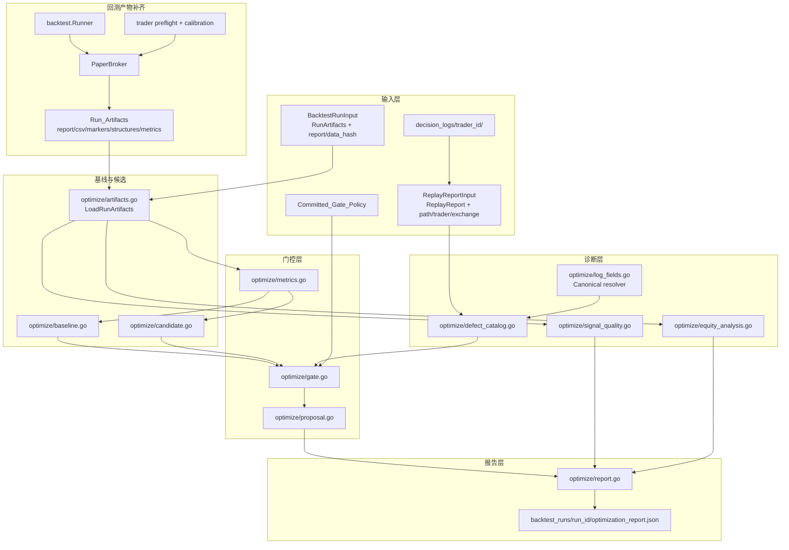
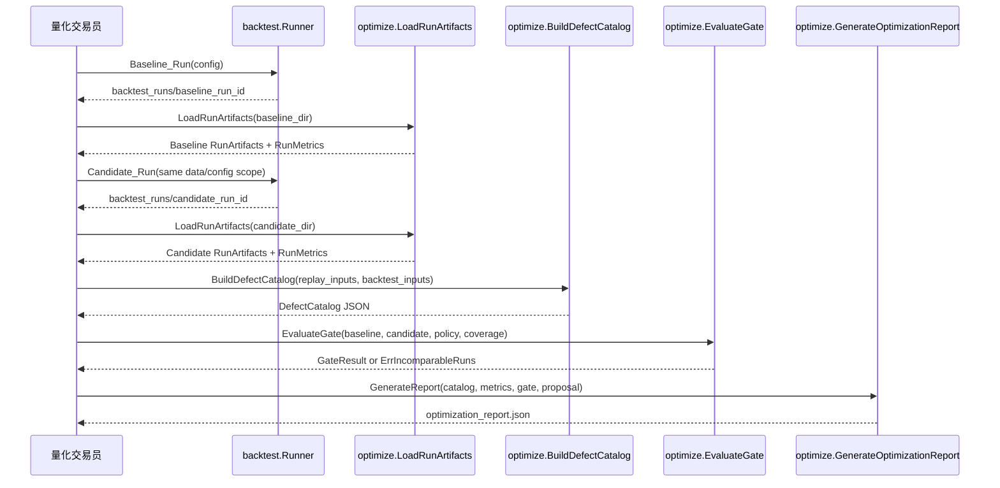
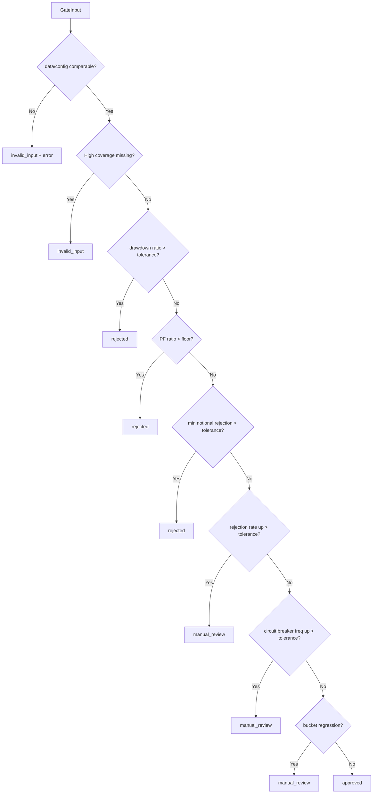

# Design Document: 程序化缠论策略盈利能力优化

## Overview

本设计在已有程序化缠论策略（`strategy/chanlun/`）、决策层（`decision/`）、交易执行公共层（`trader/`）、回测管线（`backtest/`）和 replay 管线（`cmd/replay` + `logger/replay.go`）基础上，新增一套数据驱动的"缺陷诊断 -> 基线对比 -> 优化门控 -> 灰度上线"流程。

本次修订解决交叉验证发现的核心问题：

1. `optimize` 不再直接消费裸 `backtest.Report` / `logger.ReplayReport`，而是消费带 `path`、`trader_id`、`exchange`、`run_id`、`data_hash` 的输入 wrapper。
2. Backtest run artifacts 先补齐 `data_hash`、结构快照、分桶指标、最小名义额拒绝、MFE/MAE 和 lifecycle 回撤，否则 Optimization_Gate 不给出 `approved`。
3. Backtest 执行路径复用 `trader.EvaluateExecutionPreflight` 和 exchange calibration 的公共入口，不复制一份 paper-only 规则。
4. 决策日志字段通过 Canonical Log Field Resolver 统一解析，避免顶层字段、`strategy_metadata` 和 `explanation.details` 语义分叉。
5. Requirement 12/14 的属性基测试是必做项，不作为 MVP optional 项跳过。

核心设计原则：

1. **不旁路风控**：所有 `Risk_Increase_Action` 仍必须通过 `ValidateAndEnrichDecision` -> `validateOpenDecision` -> `EvaluateOpenGate` -> `CalculatePositionSizing` -> `enforceFinalDecisionLimits` 全链路。
2. **先补证据再优化**：缺少 data hash、结构快照、字段解析或分桶指标时，报告只能给出 `invalid_input` 或 `manual_review`，不得给出实盘灰度批准。
3. **可复现**：Defect_Catalog、Baseline_Run、Candidate_Run、GateResult、Proposal_Checklist 均以 JSON 快照落盘，run_id、data_hash、config_hash 和 policy_ref 可追溯。
4. **安全**：所有测试使用 fake/mock 或历史数据 fixture，不触发真实下单，不提交真实凭证。

## Architecture



## Backtest Artifact Extensions

### Report Additions

`backtest.Report` 采用向后兼容的 additive 字段扩展：

```go
type Report struct {
    // existing fields...
    DataHash             string                       `json:"data_hash,omitempty"`
    DataHashes           map[string]string            `json:"data_hashes,omitempty"` // symbol|timeframe -> hash
    TraderID             string                       `json:"trader_id,omitempty"`
    Exchange             string                       `json:"exchange,omitempty"`
    BySide               map[string]BucketStats       `json:"by_side,omitempty"`
    ByMarketState        map[string]BucketStats       `json:"by_market_state,omitempty"`
    ByATRProfile         map[string]BucketStats       `json:"by_atr_profile,omitempty"`
    ByADXRange           map[string]BucketStats       `json:"by_adx_range,omitempty"`
    BySymbolCategory     map[string]BucketStats       `json:"by_symbol_category,omitempty"`
    MinNotionalRejects   int                          `json:"min_notional_rejects,omitempty"`
    CircuitBreakerEvents []BacktestCircuitBreakerEvent `json:"circuit_breaker_events,omitempty"`
}

type BucketStats struct {
    TradeCount     int     `json:"trade_count"`
    RejectionCount int     `json:"rejection_count,omitempty"`
    NetPnL         float64 `json:"net_pnl"`
    WinRate        float64 `json:"win_rate"`
    ProfitFactor   float64 `json:"profit_factor,omitempty"`
    MaxDrawdownPct float64 `json:"max_drawdown_pct,omitempty"`
    AverageR       float64 `json:"average_r,omitempty"`
}

type BacktestCircuitBreakerEvent struct {
    Timestamp     time.Time `json:"timestamp"`
    TriggerMetric string    `json:"trigger_metric"`
    PreFrequency  float64   `json:"pre_open_frequency"`
    PostFrequency float64   `json:"post_open_frequency"`
}
```

`DataHash` 由 `historydb.Store.DataHash()` 计算。共同 hash 应覆盖所有 symbol/timeframe/source/warmup/stat window，可用稳定排序后的 per-key hash 再 hash 得出。

### New Artifact Files

`backtest.WriteArtifacts()` 新增下列文件：

| 文件 | 目的 |
| --- | --- |
| `structures.json` | 结构快照，支撑 Requirement 3 和 Requirement 11 的 replay 重建 |
| `metrics.json` | 统一 `RunMetrics` 原始快照，避免 `optimize` 从多个 CSV 重复推导 |
| `proposal_checklist.json` | 单个优化方案的证据、配置、灰度和人工复盘记录 |

新增 artifact 均写入 `backtest_runs/<run_id>/`，该目录保持 git ignored。

### Structure Snapshot

```go
type StructureSnapshot struct {
    SnapshotID       string  `json:"snapshot_id"`
    TraderID         string  `json:"trader_id"`
    Exchange         string  `json:"exchange,omitempty"`
    Symbol           string  `json:"symbol"`
    Timeframe        string  `json:"timeframe"`
    StructureKey     string  `json:"structure_key"`
    SignalID         string  `json:"signal_id,omitempty"`
    EntryTriggerID   string  `json:"entry_trigger_id,omitempty"`
    SignalType       string  `json:"signal_type,omitempty"`
    SourceLayer      string  `json:"source_layer,omitempty"`
    SegmentID        string  `json:"segment_id,omitempty"`
    CenterID         string  `json:"center_id,omitempty"`
    BiID             string  `json:"bi_id,omitempty"`
    FractalID        string  `json:"fractal_id,omitempty"`
    ZG               float64 `json:"zg,omitempty"`
    ZD               float64 `json:"zd,omitempty"`
    ABCStartMS       int64   `json:"abc_start_ms,omitempty"`
    ABCEndMS         int64   `json:"abc_end_ms,omitempty"`
    SegmentEndMS     int64   `json:"segment_end_ms,omitempty"`
    ConfirmCloseMS   int64   `json:"confirm_close_ms,omitempty"`
    Revoked          bool    `json:"revoked,omitempty"`
    RevokedAtMS      int64   `json:"revoked_at_ms,omitempty"`
    RevocationReason string  `json:"revocation_reason,omitempty"`
    ATRProfile       string  `json:"atr_profile,omitempty"`
    ADXRange         string  `json:"adx_range,omitempty"`
    BTCMarketState   string  `json:"btc_market_state,omitempty"`
}
```

首期实现若无法完整填充分型/笔编号，也必须输出 `snapshot_id`、`structure_key`、signal linkage、timeframe、confirm/revocation 字段，并在 `assumptions` 中声明缺口。Optimization_Gate 对缺失结构上下文的策略优化不得输出 `approved`。

### Backtest Preflight Integration

当前 `PaperBroker` 的执行检查需要调整为复用交易执行公共层：

```go
type ExchangeCalibrationProvider interface {
    OpenMinOrderValueUSDT(exchange, symbol string) float64
    PartialCloseMinValueUSDT(exchange, symbol string) float64
}
```

实现策略：

- 在 `trader/exchange_calibration.go` 中导出最小名义额查询函数，或抽取到无交易所副作用的公共文件。
- `backtest.PaperBroker` 在 open/add/partial_close 前调用 `trader.EvaluateExecutionPreflight()` 或等价导出 helper。
- preflight rejection 使用与实盘一致的 reason code，写入 `rejections.csv` 和 `metrics.json`。
- 如某交易所（例如 Hyperliquid）存在保护单行为差异，报告写入 `assumptions`，但不得复制最小名义额或重复持仓规则。

## optimize Package

新增 `optimize/` 顶层包，包含以下文件：

| 文件 | 职责 |
| --- | --- |
| `config.go` | OptimizationConfig 加载、默认值、Committed_Gate_Policy 引用 |
| `types.go` | 公共类型 |
| `artifacts.go` | 加载 run directory、CSV、markers、structures、metrics |
| `log_fields.go` | Canonical_Log_Field 解析器 |
| `defect_catalog.go` | 从 replay/backtest 输入聚合缺陷清单 |
| `baseline.go` | 封装 Baseline_Run 触发、artifact 加载和指标提取 |
| `candidate.go` | 封装 Candidate_Run 触发并校验与 baseline 可比 |
| `metrics.go` | 核心指标、分桶、bootstrap 区间 |
| `gate.go` | Optimization_Gate 量化对比和通过/拒绝判定 |
| `signal_quality.go` | 信号/结构质量诊断指标 |
| `equity_analysis.go` | 资金曲线、滚动指标、高回撤归因 |
| `consistency.go` | Replay/Backtest 同口径一致性检查 |
| `proposal.go` | Proposal_Checklist 和 requirement coverage |
| `report.go` | 优化报告生成和 JSON 落盘 |
| `rollout.go` | 灰度配置、回滚条件检查 |

## Core Types

### Configuration

```go
type OptimizationConfig struct {
    MaxDrawdownRelativeTolerance        float64 `json:"max_drawdown_relative_tolerance"`          // default 1.10
    ProfitFactorRelativeFloor           float64 `json:"profit_factor_relative_floor"`             // default 0.95
    RejectionRateAbsoluteTolerance      float64 `json:"rejection_rate_absolute_tolerance"`        // default 0.10
    MinNotionalRejectionTolerance       float64 `json:"min_notional_rejection_tolerance"`         // default 0.05
    ReplayBacktestConsistencyTolerance  float64 `json:"replay_backtest_consistency_tolerance"`    // default 0.05
    CircuitBreakerFrequencyTolerance    float64 `json:"circuit_breaker_frequency_tolerance"`      // default 0.05/day
    BootstrapIterations                 int     `json:"bootstrap_iterations"`                     // default 1000
    BootstrapSeed                       int64   `json:"bootstrap_seed,omitempty"`

    ReplayFrom   string `json:"replay_from"`
    ReplayTo     string `json:"replay_to"`
    BacktestFrom string `json:"backtest_from"`
    BacktestTo   string `json:"backtest_to"`
    WarmupFrom   string `json:"warmup_from"`
    Timezone     string `json:"timezone"`

    PolicyRef    string `json:"policy_ref,omitempty"`
    PolicyCommit string `json:"policy_commit,omitempty"`
    OverrideBy   string `json:"override_by,omitempty"`
    OverrideReason string `json:"override_reason,omitempty"`
}

type GradualRolloutConfig struct {
    DryRunEnabled              bool     `json:"dry_run_enabled"`     // default true
    MaxPositionRatio           float64  `json:"max_position_ratio"`  // default 0.30
    RollingWindowTrades        int      `json:"rolling_window_trades"` // default 30
    NetPnLDegradationThreshold float64  `json:"net_pnl_degradation_threshold"`
    MaxDrawdownThreshold       float64  `json:"max_drawdown_threshold"`
    RejectionRateThreshold     float64  `json:"rejection_rate_threshold"`
    TraderRolloutOrder         []string `json:"trader_rollout_order,omitempty"`
}

type CommittedGatePolicy struct {
    PolicyRef    string `json:"policy_ref"`
    PolicyCommit string `json:"policy_commit"`
    ApprovedBy   string `json:"approved_by,omitempty"`
    ApprovedAt   string `json:"approved_at,omitempty"`
    Thresholds   OptimizationConfig `json:"thresholds"`
}
```

`LoadOptimizationConfig()` 可以读取 git-ignored 运行配置，但若阈值覆盖默认值，必须同时存在 `policy_ref` 和 `policy_commit`，否则返回校验错误。

### Input Wrappers and Artifacts

```go
type ReplayReportInput struct {
    Report   logger.ReplayReport
    Path     string
    RunID    string
    DataHash string
    TraderID string
    Exchange string
    From     string
    To       string
}

type BacktestRunInput struct {
    Artifacts *RunArtifacts
    RunID     string
    DataHash  string
    TraderID  string
    Exchange  string
}

type RunArtifacts struct {
    RunID        string
    OutputDir    string
    Report       backtest.Report
    Trades       []backtest.TradeLifecycle
    Executions   []backtest.ExecutionEvent
    Signals      []backtest.SignalOutcome
    Rejections   []decision.OpenRejection
    Equity       []backtest.EquityPoint
    Markers      map[string][]chanlun.SignalMarker
    Structures   []StructureSnapshot
    Metrics      *RunMetrics
}
```

`LoadRunArtifacts(outputDir string) (*RunArtifacts, error)` 负责读取 `report.json`、CSV、marker JSON、`structures.json` 和 `metrics.json`。如果 `metrics.json` 缺失，可从 artifact 重新提取，但必须记录 `metrics_source=derived`。

### Defect Catalog

```go
type DefectEntry struct {
    DefectCode                 string              `json:"defect_code"`
    DescriptionZH              string              `json:"description_zh"`
    EvidenceRefs               []EvidenceRef       `json:"evidence_refs"`
    AffectedTraders            []string            `json:"affected_traders"`
    AffectedExchanges          []string            `json:"affected_exchanges"`
    AffectedSymbols            []string            `json:"affected_symbols"`
    AffectedSides              []string            `json:"affected_sides"`
    AffectedSignalTypes        []string            `json:"affected_signal_types"`
    PrimaryMetric              string              `json:"primary_metric"`
    MetricDeltaVsHealthySubset float64             `json:"metric_delta_vs_healthy_subset"`
    SampleCountByTraderExchange map[string]int     `json:"sample_count_by_trader_exchange"`
    DirectionDistByTraderExchange map[string]string `json:"direction_distribution_by_trader_exchange"`
}

type EvidenceRef struct {
    Source         string `json:"source"` // decision_log, replay_report, backtest_report
    Path           string `json:"path"`
    RunID          string `json:"run_id,omitempty"`
    DataHash       string `json:"data_hash,omitempty"`
    TraderID       string `json:"trader_id"`
    Exchange       string `json:"exchange,omitempty"`
    Symbol         string `json:"symbol,omitempty"`
    Side           string `json:"side,omitempty"`
    SignalID       string `json:"signal_id,omitempty"`
    EntryTriggerID string `json:"entry_trigger_id,omitempty"`
    ReasonCode     string `json:"reason_code,omitempty"`
    TimeFrom       string `json:"time_from,omitempty"`
    TimeTo         string `json:"time_to,omitempty"`
}
```

```go
type DefectCatalog struct {
    GeneratedAt       time.Time          `json:"generated_at"`
    DiagnosisInterval DiagnosisInterval  `json:"diagnosis_interval"`
    Defects           []DefectEntry      `json:"defects"`
    Summary           DefectSummary      `json:"summary"`
}

type DiagnosisInterval struct {
    ReplayFrom   string `json:"replay_from"`
    ReplayTo     string `json:"replay_to"`
    BacktestFrom string `json:"backtest_from"`
    BacktestTo   string `json:"backtest_to"`
    WarmupFrom   string `json:"warmup_from"`
    Timezone     string `json:"timezone"`
}

type DefectSummary struct {
    TotalDefects             int            `json:"total_defects"`
    ByDefectCode             map[string]int `json:"by_defect_code"`
    ByTraderExchange         map[string]int `json:"by_trader_exchange"`
    BySignalType             map[string]int `json:"by_signal_type"`
    RejectedNoEvidenceCount  int            `json:"rejected_no_evidence_count,omitempty"`
}
```

函数签名：

```go
func BuildDefectCatalog(
    replayInputs []ReplayReportInput,
    backtestInputs []BacktestRunInput,
    config *OptimizationConfig,
) (*DefectCatalog, error)
```

无 evidence 或缺 trader/exchange context 的缺陷返回 `ErrInsufficientEvidence`。

### Metrics and Gate

```go
type RunMetrics struct {
    RunID             string `json:"run_id"`
    TraderID          string `json:"trader_id,omitempty"`
    Exchange          string `json:"exchange,omitempty"`
    ConfigHash        string `json:"config_hash"`
    DataHash          string `json:"data_hash"`
    Timezone          string `json:"timezone"`
    SymbolSetHash     string `json:"symbol_set_hash,omitempty"`
    InitialEquity     float64 `json:"initial_equity"`
    FeeModelHash      string `json:"fee_model_hash,omitempty"`
    SlippageModelHash string `json:"slippage_model_hash,omitempty"`
    FundingMode       string `json:"funding_mode,omitempty"`
    LiquidationMode   string `json:"liquidation_mode,omitempty"`
    ExecutionModelHash string `json:"execution_model_hash,omitempty"`

    WinRate           float64 `json:"win_rate"`
    ProfitFactor      float64 `json:"profit_factor"`
    NetPnL            float64 `json:"net_pnl"`
    NetPnLPct         float64 `json:"net_pnl_pct"`
    MaxDrawdownPct    float64 `json:"max_drawdown_pct"`
    AverageR          float64 `json:"average_r"`
    AvgHoldMinutes    float64 `json:"avg_hold_minutes"`
    FeeRatio          float64 `json:"fee_ratio"`
    SlippageRatio     float64 `json:"slippage_ratio"`
    RejectionRate     float64 `json:"rejection_rate"`
    MinNotionalRejectionRate float64 `json:"min_notional_rejection_rate"`
    CircuitBreakerFrequencyPerDay float64 `json:"circuit_breaker_frequency_per_day"`
    TradeCount        int `json:"trade_count"`

    SignalToExecDelay DelayStats `json:"signal_to_exec_delay"`
    BySymbol          map[string]*BucketMetrics `json:"by_symbol"`
    BySide            map[string]*BucketMetrics `json:"by_side"`
    BySignalType      map[string]*BucketMetrics `json:"by_signal_type"`
    ByMarketState     map[string]*BucketMetrics `json:"by_market_state"`
    ByATRProfile      map[string]*BucketMetrics `json:"by_atr_profile"`
    ByADXRange        map[string]*BucketMetrics `json:"by_adx_range"`
    BySymbolCategory  map[string]*BucketMetrics `json:"by_symbol_category"`
    ByTraderExchange  map[string]*BucketMetrics `json:"by_trader_exchange"`
}

type DelayStats struct {
    SignalToDecisionMS float64 `json:"signal_to_decision_ms_avg"`
    DecisionToFillMS   float64 `json:"decision_to_fill_ms_avg"`
    P50MS              float64 `json:"p50_ms,omitempty"`
    P95MS              float64 `json:"p95_ms,omitempty"`
    SampleCount        int     `json:"sample_count"`
}

type BucketMetrics struct {
    TradeCount                   int     `json:"trade_count"`
    RejectionCount               int     `json:"rejection_count,omitempty"`
    WinRate                      float64 `json:"win_rate"`
    ProfitFactor                 float64 `json:"profit_factor"`
    NetPnL                       float64 `json:"net_pnl"`
    NetPnLPct                    float64 `json:"net_pnl_pct,omitempty"`
    MaxDrawdownPct               float64 `json:"max_drawdown_pct,omitempty"`
    AverageR                     float64 `json:"average_r,omitempty"`
    RejectionRate                float64 `json:"rejection_rate,omitempty"`
    MinNotionalRejectionRate     float64 `json:"min_notional_rejection_rate,omitempty"`
    CircuitBreakerFrequencyPerDay float64 `json:"circuit_breaker_frequency_per_day,omitempty"`
    SampleCount                  int     `json:"sample_count"`
}

type MetricComparison struct {
    Metric             string     `json:"metric"`
    BaselineValue      float64    `json:"baseline_value"`
    CandidateValue     float64    `json:"candidate_value"`
    AbsoluteDelta      float64    `json:"absolute_delta"`
    RelativeDelta      float64    `json:"relative_delta"`
    Threshold          float64    `json:"threshold"`
    ConfidenceInterval [2]float64 `json:"confidence_interval,omitempty"`
    CIStatus           string     `json:"ci_status,omitempty"` // ok, insufficient_samples, disabled
    Passed             bool       `json:"passed"`
}

type GateInput struct {
    Baseline  *RunMetrics
    Candidate *RunMetrics
    Config    *OptimizationConfig
    Policy    *CommittedGatePolicy
    ByTraderExchange map[string]*RunMetrics
    RequirementCoverage *RequirementCoverageSummary
}

type GateResult struct {
    Passed          bool              `json:"passed"`
    Verdict         string            `json:"verdict"` // approved, rejected, manual_review, invalid_input
    Reasons         []string          `json:"reasons"`
    Comparisons     []MetricComparison `json:"comparisons"`
    ByTraderExchangeVerdict map[string]string `json:"by_trader_exchange_verdict,omitempty"`
    OverrideReason  string            `json:"override_reason,omitempty"`
    OverrideBy      string            `json:"override_by,omitempty"`
    PolicyRef       string            `json:"policy_ref,omitempty"`
    PolicyCommit    string            `json:"policy_commit,omitempty"`
}

func EvaluateGate(input GateInput) (GateResult, error)
```

`EvaluateGate` 在以下情况返回 error：

- baseline/candidate 任一为空。
- `data_hash`、timezone、symbol set、initial equity、cost model、funding/liquidation mode 不可比。
- config 覆盖阈值但没有 committed policy 引用。

对于业务门控失败，返回 nil error + `GateResult{Verdict:"rejected"|"manual_review"}`。

### Canonical Log Field Resolver

```go
type CanonicalLogFields struct {
    StructureKey      string `json:"structure_key"`
    SignalID          string `json:"signal_id"`
    ParentSignalID    string `json:"parent_signal_id"`
    EntryTriggerID    string `json:"entry_trigger_id"`
    SourceLayer       string `json:"source_layer"`
    SignalType        string `json:"signal_type"`
    AnalysisTimeframe string `json:"analysis_timeframe"`
    TriggerTimeframe  string `json:"trigger_timeframe"`
    StructureTarget   float64 `json:"structure_target"`
    SignalCloseTime   int64  `json:"signal_close_time"`
    DecisionCloseTime int64  `json:"decision_close_time"`
    AgeCandles        int    `json:"age_candles"`
    FreshnessState    string `json:"freshness_state"`
    ReasonCode        string `json:"reason_code"`
    ConfigHash        string `json:"config_hash"`
    StrategyVersion   string `json:"strategy_version"`
}

type FieldResolutionError struct {
    Field string
    Reason string
}

func ResolveCanonicalLogFields(action logger.DecisionAction) (CanonicalLogFields, []FieldResolutionError)
```

读取优先级：

1. `logger.DecisionAction` 顶层字段。
2. `action.StrategyMetadata`.
3. `action.Explanation` 或 `explanation.details` 中的机器字段。

解析器用于 Requirement 11、Property 6、DefectCatalog evidence 和 replay/backtest 一致性检查。

### Signal Quality

```go
type SignalQualityInput struct {
    Signals    []backtest.SignalOutcome
    Structures []StructureSnapshot
    Trades     []backtest.TradeLifecycle
    Executions []backtest.ExecutionEvent
}

type SignalQualityMetrics struct {
    SignalType       string  `json:"signal_type"`
    SourceLayer      string  `json:"source_layer,omitempty"`
    GenerationRate   float64 `json:"generation_rate_per_day"`
    ConfirmDelayBars float64 `json:"confirm_delay_bars_avg"`
    RevocationRate   float64 `json:"revocation_rate"`
    OneRHitRate      float64 `json:"one_r_hit_rate"`
    FinalRMultiple   float64 `json:"final_r_multiple_avg"`
    SampleCount      int     `json:"sample_count"`
}

type SignalQualityReport struct {
    RunID             string                         `json:"run_id"`
    Metrics           []SignalQualityMetrics         `json:"metrics"`
    ByATRProfile      map[string][]SignalQualityMetrics `json:"by_atr_profile,omitempty"`
    ByADXRange        map[string][]SignalQualityMetrics `json:"by_adx_range,omitempty"`
    MissingStructures bool                           `json:"missing_structures,omitempty"`
    Assumptions       []string                       `json:"assumptions,omitempty"`
}
```

若 `structures.json` 缺失，`BuildSignalQualityReport()` 返回 `ErrMissingStructureSnapshots`，报告只能进入 `manual_review`。

### Equity and Consistency Reports

```go
type EquityCurveAnalysis struct {
    RunID                 string                 `json:"run_id"`
    DailyEquity           []DailyEquityPoint     `json:"daily_equity"`
    RollingMetrics        []RollingMetricPoint   `json:"rolling_metrics"`
    DrawdownIntervals     []DrawdownAttribution  `json:"drawdown_intervals"`
    CircuitBreakerEvents  []BacktestCircuitBreakerEvent `json:"circuit_breaker_events,omitempty"`
    LossModeSwitches      []LossModeSwitchEvent  `json:"loss_mode_switches,omitempty"`
}

type DailyEquityPoint struct {
    Date           string  `json:"date"`
    Equity         float64 `json:"equity"`
    NetPnL         float64 `json:"net_pnl"`
    DrawdownPct    float64 `json:"drawdown_pct"`
}

type RollingMetricPoint struct {
    Timestamp      int64   `json:"timestamp"`
    WindowTrades   int     `json:"window_trades"`
    ProfitFactor   float64 `json:"profit_factor"`
    WinRate        float64 `json:"win_rate"`
}

type DrawdownAttribution struct {
    StartMS        int64  `json:"start_ms"`
    EndMS          int64  `json:"end_ms"`
    MaxDrawdownPct float64 `json:"max_drawdown_pct"`
    LifecycleID    string `json:"lifecycle_id,omitempty"`
    SignalType     string `json:"signal_type,omitempty"`
    BTCMarketState string `json:"btc_market_state,omitempty"`
    ATRProfile     string `json:"atr_profile,omitempty"`
    ADXRange        string `json:"adx_range,omitempty"`
    Exchange        string `json:"exchange,omitempty"`
}

type LossModeSwitchEvent struct {
    Timestamp     int64   `json:"timestamp"`
    TriggerMetric string  `json:"trigger_metric"`
    BeforeMode    string  `json:"before_mode"`
    AfterMode     string  `json:"after_mode"`
    OpenFrequency float64 `json:"open_frequency,omitempty"`
}

type ConsistencyResult struct {
    ReplayRunID   string             `json:"replay_run_id,omitempty"`
    BacktestRunID string             `json:"backtest_run_id,omitempty"`
    Comparable    bool               `json:"comparable"`
    Verdict       string             `json:"verdict"` // ok, warning, invalid_input
    Comparisons   []MetricComparison `json:"comparisons"`
    Reasons       []string           `json:"reasons,omitempty"`
}
```

### Proposal Checklist and Coverage

```go
type OptimizationProposal struct {
    ProposalID       string   `json:"proposal_id"`
    DefectCodes      []string `json:"defect_codes"`
    EvidenceRefs     []EvidenceRef `json:"evidence_refs"`
    ChangedModules   []string `json:"changed_modules"`
    ConfigChanges    []ConfigChange `json:"config_changes"`
    BaselineRunID    string `json:"baseline_run_id"`
    CandidateRunID   string `json:"candidate_run_id"`
    DataHash         string `json:"data_hash"`
    GateResult       string `json:"gate_result"`
    Rollout          GradualRolloutConfig `json:"rollout"`
    RollbackSwitches []string `json:"rollback_switches"`
    ManualReviewNotes []string `json:"manual_review_notes,omitempty"`
}

type ConfigChange struct {
    Path         string `json:"path"`
    OldValue     any    `json:"old_value,omitempty"`
    NewValue     any    `json:"new_value,omitempty"`
    DefaultValue any    `json:"default_value,omitempty"`
    RollbackValue any   `json:"rollback_value,omitempty"`
    Reason       string `json:"reason,omitempty"`
}

type RequirementCoverageSummary struct {
    Items []RequirementCoverageItem `json:"items"`
}

type RequirementCoverageItem struct {
    Requirement string `json:"requirement"`
    Status      string `json:"status"` // satisfied, not_applicable, missing
    Severity    string `json:"severity,omitempty"` // low, medium, high
    Evidence    []EvidenceRef `json:"evidence,omitempty"`
    Notes       string `json:"notes,omitempty"`
}
```

`GateResult` 若发现 High severity missing coverage，必须输出 `invalid_input` 或 `rejected`，不得输出 `approved`。

## Data Models

### optimize_config.json

运行配置可以位于 `backtest_runs/<run_id>/` 或通过 CLI 传入，但阈值覆盖必须引用 committed policy：

```json
{
  "max_drawdown_relative_tolerance": 1.10,
  "profit_factor_relative_floor": 0.95,
  "rejection_rate_absolute_tolerance": 0.10,
  "min_notional_rejection_tolerance": 0.05,
  "replay_backtest_consistency_tolerance": 0.05,
  "circuit_breaker_frequency_tolerance": 0.05,
  "bootstrap_iterations": 1000,
  "replay_from": "2025-01-01",
  "replay_to": "2025-06-01",
  "backtest_from": "2025-01-01",
  "backtest_to": "2025-06-01",
  "warmup_from": "2024-12-01",
  "timezone": "Asia/Singapore",
  "policy_ref": ".kiro/specs/programmatic-chanlun-profit-optimization/gate-policy.json",
  "policy_commit": "abc1234"
}
```

### DefectCatalog Example

```json
{
  "generated_at": "2026-05-20T10:00:00Z",
  "diagnosis_interval": {
    "replay_from": "2026-01-01",
    "replay_to": "2026-05-01",
    "backtest_from": "2026-01-01",
    "backtest_to": "2026-05-01",
    "warmup_from": "2025-12-01",
    "timezone": "Asia/Singapore"
  },
  "defects": [
    {
      "defect_code": "MICRO_STOP_HIGH_VOL",
      "description_zh": "高波动环境下微止损频率过高，导致连续亏损",
      "evidence_refs": [
        {
          "source": "replay_report",
          "path": "decision_logs/binance_qwen/replay.json",
          "trader_id": "binance_qwen",
          "exchange": "binance",
          "symbol": "ETHUSDT",
          "side": "long",
          "reason_code": "micro_stop"
        }
      ],
      "affected_traders": ["binance_qwen"],
      "affected_exchanges": ["binance"],
      "affected_symbols": ["ETHUSDT"],
      "affected_sides": ["long"],
      "affected_signal_types": ["buy2"],
      "primary_metric": "micro_stop_rate",
      "metric_delta_vs_healthy_subset": 0.15,
      "sample_count_by_trader_exchange": {
        "binance_qwen|binance": 12
      }
    }
  ]
}
```

## Sequence Diagrams

### 完整优化流程



### Gate 逻辑



## Integration Points

| 现有模块 | 集成方式 | 约束 |
| --- | --- | --- |
| `backtest/Runner` | 继续触发历史行情回测，新增 artifact 字段和结构快照 | additive schema，旧报告可读但不能 approved |
| `backtest/PaperBroker` | open/add/partial close 前复用 trader preflight/calibration | 不复制交易所差异规则 |
| `historydb.Store` | 计算 per symbol/timeframe data hash 和共同 data hash | hash 必须稳定排序 |
| `logger/replay.go` | `BuildReplayReport()` 输出继续只读使用，外层 wrapper 补 trader/exchange/path | 不改写原始日志 |
| `logger/decision_logger.go` | Canonical resolver 支持顶层字段和 metadata fallback | 兼容旧日志 |
| `decision/open_gate.go` | 新入场门槛仍走 `EvaluateOpenGate` | 不在策略层旁路 |
| `decision/strategy_risk.go` | ATR/ADX profile 复用 | 不重复实现 |
| `decision/position_sizing.go` | 仓位 sizing 复用 | 不在策略层直接计算 |
| `decision/takeprofit.go` | 止盈止损复用 | 通过 TradePlan 字段表达 |
| `decision/loss_mode.go` | 亏损模式复用 | 不新增并行逻辑 |
| `decision/risk.go` | 熔断复用 | 不新增并行熔断 |
| `decision/parser.go` | 失效条件解析复用 | 不旁路 |
| `web/src/lib/api.ts` / `web/src/types/index.ts` | 仅当新增前端可见字段时同步 | 保持 trader-scoped API |

## CLI

新增 `cmd/optimize/`：

```text
optimize diagnose  -replay-report <path> -trader <id> -exchange <name> -backtest-run <dir>
optimize baseline  -config <backtest.json> -trader <id> -exchange <name>
optimize compare   -baseline-run <dir> -candidate-run <dir> -policy <gate-policy.json>
optimize report    -catalog <defect_catalog.json> -baseline-run <dir> -candidate-run <dir> -proposal <proposal_checklist.json>
```

所有命令使用 flag，不硬编码路径。CLI 端到端测试使用 fixture run directory，不访问真实交易所。

## Error Handling

### ErrInsufficientEvidence

条件：缺陷无法定位到 decision_logs、replay 或 backtest 中的具体记录，或缺少 trader/exchange/path context。

响应：`BuildDefectCatalog()` 返回错误；CLI 输出非零退出码。

### ErrIncomparableRuns

条件：Baseline_Run 和 Candidate_Run 的 `data_hash`、timezone、symbols、initial_equity、费用模型、funding/liquidation 或 execution model 不一致。

响应：`EvaluateGate()` 返回 `(GateResult{Verdict:"invalid_input"}, ErrIncomparableRuns)`。

### ErrMissingStructureSnapshots

条件：需要结构级信号质量或 replay 结构上下文，但 `structures.json` 缺失或字段不足。

响应：报告标记 `manual_review` 或 `invalid_input`；不得 `approved`。

### ErrUncommittedPolicyOverride

条件：阈值被覆盖但缺少 `policy_ref` 或 `policy_commit`。

响应：配置加载或 Gate 校验失败。

## Testing Strategy

### Unit Tests

- `optimize/`：config、artifact loader、metrics、gate、defect catalog、canonical log resolver、proposal coverage。
- `backtest/`：data hash、structure snapshots、metrics artifact、preflight/calibration integration。
- `logger/`：旧日志和新日志的 Canonical_Log_Field fallback。
- `trader/`：导出/抽取后的 calibration helper 保持现有交易所语义。

### Property-Based Tests

这些测试是必做项，不标记 optional：

1. `optimize` 包：Optimization_Gate 阈值判定。
2. `strategy/chanlun` 包：Chanlun_Engine 确定性输出。
3. `trader` 或 `trader_test` 包：止损/止盈取消路径分离。
4. `backtest` 或 `decision` 包：同 symbol 无双向持仓。
5. `logger` 包：BuildTradeReplay 可完整重建 Position_Lifecycle。
6. `logger` / `optimize` 包：Canonical_Log_Field 必填字段完整。
7. `decision` 包：Risk_Increase_Action 通过所有 Deterministic_Gate；未导出的 `validateOpenDecision` 和 `enforceFinalDecisionLimits` 测试必须放在 `decision` 包内。

### Integration Tests

- `cmd/optimize diagnose/compare/report` 使用 fixture run directory。
- `backtest.Runner` 使用 historydb fixture，验证 `data_hash`、`structures.json`、`metrics.json` 和 preflight rejection。
- 所有测试不得触发真实下单或私有 REST/WebSocket。

## Performance Considerations

- DefectCatalog：O(n) 扫描 evidence refs 和报告桶。
- Run artifact loading：CSV/JSON 流式读取，避免一次性读取超大日志目录。
- Bootstrap：默认 1000 次，可配置；样本不足时跳过并标记。
- Structure snapshots：按 run 写 JSON，首期规模通常低于 marker 数量数倍，可接受。

## Security Considerations

- 所有运行配置使用脱敏占位符，不含真实 API key。
- `backtest_runs/`、`decision_logs/`、`data/`、`coin_pool_cache/` 保持 git ignored。
- Gate policy 可提交，但不得包含真实账户信息。
- 测试使用 fake/mock，不触发真实下单。

## Correctness Properties

1. **Optimization_Gate 阈值判定**：任意可比 baseline/candidate，回撤或 PF 超限必 rejected，拒绝率或熔断频率超限必 manual_review，最小名义额拒绝超限必 rejected。
2. **Chanlun_Engine 确定性输出**：相同 K 线、配置和 StateStore 内容产生 byte-equal 的结构与信号输出。
3. **止损/止盈调用路径分离**：止损更新只走 `CancelStopLossOrders()`，止盈更新只走 `CancelTakeProfitOrders()`。
4. **同 symbol 无双向持仓**：反向持仓存在时不开新反向仓，或被合并/执行前拒绝。
5. **Replay 可重建生命周期**：合法决策日志序列可完整重建开仓、加仓、减仓、平仓和保护单事件，无未匹配事件。
6. **Canonical_Log_Field 完整**：Risk_Increase_Action / Risk_Reduction_Action 可解析 Requirement 11.1 的所有字段。
7. **Risk_Increase_Action 通过 Deterministic_Gate**：由 Chanlun_Engine 生成的合法开仓动作必须通过 decision 包所有确定性 gate。
8. **DefectCatalog 拒绝无证据缺陷**：缺陷无 evidence 或无 context 时不得进入 catalog。
9. **DefectCatalog 输出完整**：成功输出包含 diagnosis interval、affected traders/exchanges、evidence refs 和核心指标。

## Traceability

| Requirement | Design Coverage |
| --- | --- |
| R1 | Defect Catalog, Input Wrappers |
| R2 | Backtest Artifact Extensions, Metrics and Gate |
| R3 | Structure Snapshot, Signal Quality |
| R4 | Proposal Checklist, Gate, Integration Points |
| R5 | Backtest Artifact Extensions, Signal/Equity Analysis |
| R6 | Backtest Preflight Integration, Metrics and Gate |
| R7 | Equity Analysis, Gate |
| R8 | Backtest Preflight Integration, Error Handling |
| R9 | Defect Catalog, Integration Points |
| R10 | Security Considerations |
| R11 | Canonical Log Field Resolver, Structure Snapshot |
| R12 | Correctness Properties, Property-Based Tests |
| R13 | Rollout, Proposal Checklist |
| R14 | Testing Strategy |
| R15 | Proposal Checklist and Coverage |

## Dependencies

| 依赖 | 用途 | 备注 |
| --- | --- | --- |
| `nofx/backtest` | 回测管线与 artifacts | 需要 additive report/artifact 扩展 |
| `nofx/historydb` | data hash | 已有 per key hash，需共同 hash |
| `nofx/logger` | Replay 报告和日志字段 | 只读加载，新增 resolver |
| `nofx/decision` | 风控类型和接口 | PBT 可放在包内访问未导出函数 |
| `nofx/trader` | preflight 和 calibration | 需要导出或抽取无副作用 helper |
| `nofx/strategy/chanlun` | 缠论引擎与结构快照来源 | 不新增并行策略实现 |
| `github.com/leanovate/gopter` | 属性基测试 | 已有 |
