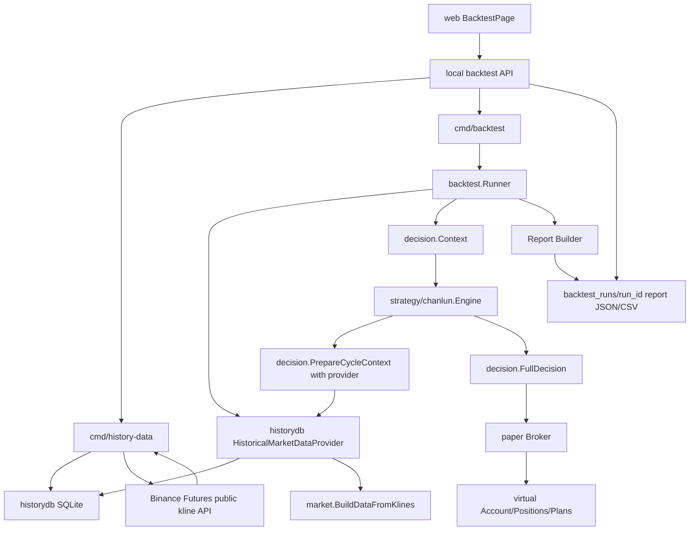

# 程序化策略回测 Design

## Overview

本设计为 NOFX 增加本地开发测试环境的程序化策略行情级回测能力。回测从历史 K 线数据库读取数据，按虚拟时钟驱动当前 `strategy/chanlun.Engine`，复用程序化策略、公共风控和仓位 sizing 逻辑，并用纸面撮合器模拟成交、持仓、权益、手续费、滑点和保护单。

本功能只用于本地开发测试：

- 不部署到 161 生产服务器。
- 不启动真实 `AutoTrader` 实盘循环。
- 不调用 AI。
- 不调用真实交易所下单。
- 不写生产 `config.json`、`data/`、`decision_logs/`、`coin_pool_cache/`。

回测与现有 `cmd/replay` 分工如下：

| 能力 | `cmd/replay` | 新回测 |
| --- | --- | --- |
| 输入 | 已生成的 `decision_logs` | 历史 K 线和回测配置 |
| 是否重新生成策略决策 | 否 | 是 |
| 是否模拟成交 | 基于日志推导 | 使用 paper broker |
| 用途 | 日志复盘、对账、病因诊断 | 验证程序化策略参数和主交易级别 |

## Architecture



关键设计点：

- `historydb` 负责历史行情本地存储、抓取游标、数据质量检查和 gap 检测。
- `cmd/history-data` 是开发测试命令，负责抓取、检查和展示历史数据，不进入生产部署。
- `backtest` 包负责回测配置解析、虚拟时钟、上下文构建、策略调用、纸面撮合和报告。
- `decision.PrepareCycleContext()` 增加可选历史行情 provider 注入，避免回测中调用实时 `market.Get()`。
- `strategy/chanlun.Engine` 增加可选历史行情 provider/clock 透传字段，因为 Engine 是 `PrepareCycleContext()` 的实际调用者。
- `market` 包抽出可复用的历史 K 线指标构建入口，回测禁用实时 OI/funding enrich。
- `web` 增加独立回测操作页面，通过本地开发测试 API 管理历史数据、启动回测、展示报告和复盘 K 线信号。

## File Layout

新增或调整的主要文件：

```text
backtest/
  config.go            # 回测配置、参数归一化、warmup 计算
  runner.go            # 主回测循环
  broker.go            # 纸面账户、持仓、撮合、保护单
  report.go            # JSON/CSV 报告结构与统计
  provider.go          # HistoricalMarketDataProvider
  batch.go             # 批量参数回测
  *_test.go

historydb/
  store.go             # SQLite 打开、schema 初始化、upsert/query
  schema.go            # schema version 与迁移
  fetcher.go           # 历史数据抓取任务
  source.go            # KlineSource 接口
  binance_source.go    # Binance Futures 公共 K 线数据源
  quality.go           # 数据质量检查、gap 检测
  rate_limit.go        # 可配置限频、退避、重试
  *_test.go

cmd/history-data/main.go
cmd/backtest/main.go

api/backtest_handlers.go       # 本地开发测试回测 API，生产默认禁用
web/src/components/backtest/    # 回测独立操作页面组件
web/src/lib/backtestApi.ts      # 回测 API client
web/src/types/backtest.ts       # 回测页面类型

market/data.go         # 导出 BuildDataFromKlines 或等价无网络构建入口
decision/decision.go   # CyclePreparationOptions 增加 provider/clock/OI 控制
strategy/chanlun/engine.go # Engine 增加 provider/clock 透传，回测路径不走实时行情
decision/persistence.go# 增加 backtest runtime 初始化或隔离 helper
.gitignore             # backtest_data/, backtest_runs/, *.sqlite*
```

说明：

- `historydb` 放在根目录包，避免和运行时 `data/` 混在一起。
- `backtest` 不依赖 `trader.Trader`，只消费 `decision.Decision`。
- `cmd/backtest` 和 `cmd/history-data` 均为本地 CLI，不加入 Docker Compose 或生产启动脚本。

## Historical Database

### Storage Choice

首期使用本地嵌入式单文件数据库。设计建议使用 SQLite：

- 适合 OHLCV 时间序列的范围查询和 upsert。
- 单文件，便于本地移动和删除。
- 适合本地开发测试，不需要启动服务。

Go driver 建议优先选择纯 Go SQLite driver，降低本地 CGO 环境要求。若实现阶段选择 CGO driver，需要在 tasks 中补充本地安装说明。

默认路径：

```text
backtest_data/nofx_history.sqlite
```

`.gitignore` 需要包含：

```gitignore
backtest_data/
backtest_runs/
*.sqlite
*.sqlite-shm
*.sqlite-wal
```

### Schema

核心表：

```sql
CREATE TABLE schema_migrations (
  version INTEGER PRIMARY KEY,
  applied_at TEXT NOT NULL
);

CREATE TABLE klines (
  source TEXT NOT NULL,
  symbol TEXT NOT NULL,
  timeframe TEXT NOT NULL,
  open_time_ms INTEGER NOT NULL,
  close_time_ms INTEGER NOT NULL,
  open REAL NOT NULL,
  high REAL NOT NULL,
  low REAL NOT NULL,
  close REAL NOT NULL,
  volume REAL NOT NULL,
  quote_volume REAL DEFAULT 0,
  trade_count INTEGER DEFAULT 0,
  quality TEXT NOT NULL DEFAULT 'ok',
  fetched_at TEXT NOT NULL,
  raw_hash TEXT DEFAULT '',
  created_at TEXT NOT NULL,
  updated_at TEXT NOT NULL,
  PRIMARY KEY (source, symbol, timeframe, open_time_ms)
);

CREATE INDEX idx_klines_lookup
  ON klines(source, symbol, timeframe, close_time_ms);

CREATE TABLE fetch_runs (
  id TEXT PRIMARY KEY,
  source TEXT NOT NULL,
  symbols TEXT NOT NULL,
  timeframes TEXT NOT NULL,
  data_from TEXT NOT NULL,
  data_to TEXT NOT NULL,
  status TEXT NOT NULL,
  request_count INTEGER NOT NULL DEFAULT 0,
  inserted_count INTEGER NOT NULL DEFAULT 0,
  duplicate_count INTEGER NOT NULL DEFAULT 0,
  retry_count INTEGER NOT NULL DEFAULT 0,
  rate_wait_count INTEGER NOT NULL DEFAULT 0,
  started_at TEXT NOT NULL,
  finished_at TEXT,
  error TEXT DEFAULT ''
);

CREATE TABLE quality_issues (
  id TEXT PRIMARY KEY,
  source TEXT NOT NULL,
  symbol TEXT NOT NULL,
  timeframe TEXT NOT NULL,
  issue_type TEXT NOT NULL,
  start_time_ms INTEGER NOT NULL,
  end_time_ms INTEGER NOT NULL,
  detail TEXT NOT NULL,
  detected_at TEXT NOT NULL
);
```

预留表：

```sql
CREATE TABLE funding_rates (...);
CREATE TABLE open_interest (...);
CREATE TABLE candidate_pool_snapshots (...);
```

v1 不强制实现 funding/OI 历史表。若未实现，报告写：

```json
{
  "funding_mode": "disabled",
  "oi_mode": "disabled"
}
```

### Data Quality

写入和回测读取时都需要校验：

- `open_time_ms < close_time_ms`
- `open/high/low/close > 0`
- `high >= max(open, close, low)`
- `low <= min(open, close, high)`
- 同一 `source/symbol/timeframe` 下 `open_time_ms` 严格递增
- 相邻 K 线时间间隔符合 timeframe
- 查询区间覆盖 `warmup_from` 到 `backtest_to`

严重质量问题阻止对应 symbol/timeframe 参与回测。gap 可以按配置选择失败退出或跳过异常区间，默认失败退出。

## Historical Data Fetch

### Source Interface

```go
type KlineSource interface {
    Name() string
    SupportedTimeframes() []string
    MaxLimit(timeframe string) int
    FetchKlines(ctx context.Context, req FetchKlineRequest) ([]market.Kline, error)
}

type FetchKlineRequest struct {
    Symbol    string
    Timeframe string
    Start     time.Time
    End       time.Time
    Limit     int
}
```

首期实现 `BinanceFuturesKlineSource`，复用当前实时行情数据源的公共 K 线 API，但新增 `startTime`、`endTime`、`limit` 分页抓取。

### Fetch Command

建议命令：

```bash
go run ./cmd/history-data fetch \
  --db backtest_data/nofx_history.sqlite \
  --source binance-futures \
  --symbols BTCUSDT,ETHUSDT,SOLUSDT \
  --timeframes 3m,15m,1h,4h \
  --data-from 2026-01-01 \
  --data-to 2026-05-01 \
  --timezone Asia/Singapore \
  --limit 1000 \
  --requests-per-minute 300 \
  --concurrency 2
```

支持的本地维护命令：

```bash
go run ./cmd/history-data fetch   ...
go run ./cmd/history-data inspect ...
go run ./cmd/history-data gaps    ...
```

### Time Semantics

- `data_from/data_to` 用于历史数据抓取。
- `backtest_from/backtest_to` 用于正式绩效统计。
- `YYYY-MM-DD` 按配置 timezone 解析，默认 `Asia/Singapore`。
- 抓取区间和回测统计区间均采用 `[from, to)`。
- 只传 `data_from` 时，`data_to` 默认当前时间之前最后一根已闭合 K 线。
- 只传 `data_to` 且没有默认回溯窗口时启动失败。

### Rate Limit

```go
type RateLimitProfile struct {
    RequestsPerMinute int
    Concurrency       int
    PageLimit         int
    MaxRetries        int
    InitialBackoffMS  int
    MaxBackoffMS      int
}
```

默认值保守，允许命令参数覆盖。获取任务输出：

- 请求次数
- 实际请求速率
- 限频等待次数
- 重试次数
- 写入条数
- 跳过重复条数
- 缺失区间
- 失败 symbol/timeframe

## Market Data Provider

### Problem

当前 `decision.PrepareCycleContext()` 会调用 `market.GetWithHistory()` 或 `market.Get()`。当前 `market.buildDataFromKlines()` 在构建 `market.Data` 时还会读取实时 OI 和 funding。回测必须切断这些实时网络路径。

### Design

新增 provider 接口：

```go
type PreparationMarketDataProvider interface {
    GetMarketData(ctx context.Context, symbol string, opts decision.CyclePreparationOptions) (*market.Data, error)
}
```

或者在 `CyclePreparationOptions` 中使用函数：

```go
type CyclePreparationOptions struct {
    MarketSymbols           []string
    MarketHistoryDepth      map[string]int
    ClosedKlinesOnly        bool
    IncludeMicroADX         bool
    AllowRiskReducingOnHalt bool
    MarketDataProvider      func(symbol string, opts CyclePreparationOptions) (*market.Data, error)
    DisableOITopFetch       bool
    Clock                   func() time.Time
}
```

生产路径不传 provider，保持现有行为。回测路径传入 `HistoricalMarketDataProvider`。

由于 `strategy/chanlun.Engine.GetFullDecision()` 会在内部调用 `decision.PrepareCycleContext()`，Engine 需要新增可选字段：

```go
type Engine struct {
    MarketDataProvider func(symbol string, opts decision.CyclePreparationOptions) (*market.Data, error)
    DisableOITopFetch  bool
    Clock              func() time.Time
}
```

回测 runner 初始化 Engine 后设置这些字段；生产 Engine 不设置，保持现有实时路径。

### `market.Data` Construction

将当前私有 `buildDataFromKlines()` 拆出无网络构建入口：

```go
type BuildDataOptions struct {
    SeriesLimit     int
    IncludeMicroADX bool
    EnrichmentMode  string // "live", "disabled", "historical"
    OI              *market.OIData
    FundingRate     *float64
}

func BuildDataFromKlines(symbol string, klines KlineBundle, opts BuildDataOptions) (*Data, error)
```

生产 `market.Get()` 使用 `EnrichmentMode="live"`，保留实时 OI/funding。

回测 provider 使用 `EnrichmentMode="disabled"` 或 `historical`：

- v1 默认 `disabled`
- OI 为 `nil` 或 zero
- funding 为 `0`
- 报告记录 disabled

### Historical Provider Flow

```go
func (p *HistoricalMarketDataProvider) GetMarketData(symbol string, opts decision.CyclePreparationOptions) (*market.Data, error) {
    now := p.Clock()
    depth := opts.MarketHistoryDepth
    klines3m := p.Store.LastClosedKlines(symbol, "3m", depth["3m"], now)
    klines15m := p.Store.LastClosedKlines(symbol, "15m", depth["15m"], now)
    klines1h := p.Store.LastClosedKlines(symbol, "1h", depth["1h"], now)
    klines4h := p.Store.LastClosedKlines(symbol, "4h", depth["4h"], now)
    return market.BuildDataFromKlines(symbol, bundle, market.BuildDataOptions{
        SeriesLimit:     0,
        IncludeMicroADX: opts.IncludeMicroADX,
        EnrichmentMode:  "disabled",
    })
}
```

Provider 必须只返回 `close_time <= current_backtest_time` 的 K 线。

## Backtest Configuration

建议 JSON：

```json
{
  "backtest_from": "2026-01-01",
  "backtest_to": "2026-05-01",
  "timezone": "Asia/Singapore",
  "history_db": "backtest_data/nofx_history.sqlite",
  "output_dir": "backtest_runs",
  "symbols": ["BTCUSDT", "ETHUSDT"],
  "initial_equity": 10000,
  "scan_interval_minutes": 3,
  "costs": {
    "taker_fee_bps": 5,
    "maker_fee_bps": 2,
    "slippage_bps": 3
  },
  "execution": {
    "market_order_fill": "next_3m_open",
    "same_bar_conflict": "worst_case",
    "funding_mode": "disabled",
    "liquidation_mode": "not_modelled"
  },
  "strategy": {
    "decision_mode": "programmatic",
    "programmatic_strategy": {
      "timeframes": {
        "trade": "1h"
      }
    }
  }
}
```

如果使用生产 `config.json` 作为模板：

- 只读取非敏感策略字段。
- 忽略 API key、secret、私钥、provider key、远端部署字段。
- 报告中不得输出敏感字段。

## Virtual Clock

回测 runner 负责生成虚拟时间：

1. 解析 `backtest_from/backtest_to/timezone`。
2. 根据 `history_depth` 和指标预热需求计算 `warmup_from`。
3. 从 `warmup_from` 开始按 `scan_interval_minutes` 或 3m K 线事件推进。
4. 每个周期设置：
   - `Runner.CurrentTime`
   - `chanlun.Engine.Clock`
   - `decision` 相关 Clock option
   - `StateStore` Clock

时间规则：

- `current_backtest_time < backtest_from` 为 warmup。
- warmup 可更新结构和状态，默认不生成真实成交和绩效。
- `[backtest_from, backtest_to)` 才计入正式交易和报告指标。
- `current_backtest_time >= backtest_to` 停止策略周期。

对于尚未支持虚拟时钟注入的公共逻辑：

- 优先补注入。
- 若无法安全补注入，回测禁用该逻辑或标记为不参与，并写入 report assumptions。

## Runtime Isolation

每个 run 创建独立目录：

```text
backtest_runs/<run_id>/
  config_snapshot.json
  state/programmatic_strategy_state.json
  state/trade_plans.json
  report.json
  trades.csv
  equity.csv
  signals.csv
  rejections.csv
  markers/
```

启动 run 时：

- 重置 `decision.ResetStatistics()`。
- 重置回撤基准线。
- 初始化独立 TradePlanManager，路径指向 run state。
- 初始化独立 `chanlun.StateStore`。
- 清空或隔离熔断、频率、亏损模式等会跨 run 累积的状态。

批量回测中，每个 run 使用独立 `run_id` 和状态目录。不得复用生产 `data/`。

## Backtest Runner

### Cycle Flow

按 3m K 线事件推进时，每个周期：

1. 找到当前 3m K 线 `bar`，其 `close_time == current_backtest_time`。
2. 先执行上一周期排队的市价订单，在当前 `bar.open` 成交。
3. 用当前 `bar.high/low` 检查已存在的止损/止盈/强平。
4. 更新账户权益和持仓 mark price 到 `bar.close`。
5. 构建 `decision.Context`：
   - 虚拟账户
   - 纸面持仓
   - 候选池
   - 历史 provider 注入的 market data
   - 风险策略
   - 频率策略
6. 调用 `chanlun.Engine.GetFullDecision(ctx)`。
7. 将有效决策交给 `PaperBroker`：
   - market action 排队到下一根 3m open
   - `update_stop_loss` 立即更新虚拟保护单
8. 记录 cycle、signals、rejections、equity snapshot。

这保证策略在 `bar.close` 做出的新交易不会用 `bar.close` 或 `bar.high/low` 当成交价。

### Candidate Pool

v1 默认：

- 显式 `symbols`
- 或静态 `programmatic_strategy.symbol_pool`

动态候选池规则：

- 若快照带 `effective_at`，只使用 `effective_at <= current_backtest_time` 的快照。
- 若快照没有时间戳，只作为静态 symbol list，报告写 `candidate_pool_mode=static_snapshot`。

当前有持仓 symbol 永远纳入持仓管理。

## Paper Broker

### State

```go
type PaperAccount struct {
    InitialEquity float64
    Cash          float64
    Equity        float64
    RealizedPnL   float64
    UnrealizedPnL float64
    FeePaid       float64
    SlippagePaid  float64
    MarginUsed    float64
}

type PaperPosition struct {
    Symbol       string
    Side         string
    Quantity     float64
    EntryPrice   float64
    AverageEntry float64
    MarkPrice    float64
    Leverage     int
    StopLoss     float64
    TakeProfit   float64
    OpenedAt     time.Time
    LifecycleID  string
    InitialRisk  float64
    PeakPrice    float64
    TroughPrice  float64
}
```

### Supported Actions

| Decision action | Broker behavior |
| --- | --- |
| `open_long/open_short` | enqueue market fill at next 3m open |
| `add_long/add_short` | enqueue add fill, update average entry |
| `partial_close` | enqueue partial close by percentage |
| `close_long/close_short` | enqueue full close |
| `update_stop_loss` | update virtual stop, no trade fill |
| `wait/hold` | no state change |

### Fill Model

默认：

- Market action 成交价为下一根 3m open。
- 多头买入价格加滑点，卖出价格减滑点。
- 空头开仓卖出价格减滑点，回补价格加滑点。
- 默认使用 taker fee。

保护单：

- 后续 3m bar high/low 触发止损或止盈。
- 同一 bar 同时触发止损和止盈，默认 worst case。

Funding 和 liquidation：

- v1 默认 `funding_mode=disabled`。
- v1 默认 `liquidation_mode=not_modelled`，报告明确风险。
- 若启用 liquidation，K 线 high/low 穿过估算强平价时强制退出并记录 `liquidation=true`。

## Reports

### Output Files

```text
report.json
trades.csv
equity.csv
signals.csv
rejections.csv
markers/<symbol>_<timeframe>.json
```

### Report JSON

```go
type Report struct {
    RunID              string
    GeneratedAt        time.Time
    GitCommit          string
    ConfigHash         string
    Timezone           string
    WarmupFrom         time.Time
    BacktestFrom       time.Time
    BacktestTo         time.Time
    MarketDataSource   string
    ExecutionModel     string
    InstrumentMetadataSource string
    FundingMode        string
    OIMode             string
    LiquidationMode    string
    CandidatePoolMode  string
    Assumptions        []string
    Summary            SummaryStats
    BySymbol           map[string]SymbolStats
    BySignalType       map[string]SignalStats
    RejectionBuckets   map[string]int
    Files              map[string]string
}
```

主交易统计单位为 `position lifecycle`。`partial_close` 是 lifecycle 内的 execution event，不重复计为独立完整交易。

信号表现：

- 是否达到 1R
- MFE
- MAE
- lifecycle 最终 R
- 是否被风控拒绝
- 是否 warmup
- 观察窗口，默认到 lifecycle 结束

R multiple 默认使用开仓初始风险距离。若缺失则标记不可计算。

## Independent Backtest UI

回测操作页面是本地开发测试页面，不是生产交易页面。页面入口必须受本地开关保护，例如：

- 后端配置或环境变量：`NOFX_BACKTEST_API_ENABLED=true`
- 前端开发环境显示入口
- 生产部署默认隐藏入口，API 返回 404 或 403

### API Surface

建议在现有 Gin API 下新增本地开发测试接口，默认禁用：

```text
GET  /api/backtest/health
GET  /api/backtest/history/inspect
POST /api/backtest/history/fetch
POST /api/backtest/history/gaps
GET  /api/backtest/runs
POST /api/backtest/runs
POST /api/backtest/runs/batch
GET  /api/backtest/runs/:run_id
POST /api/backtest/runs/:run_id/cancel
GET  /api/backtest/reports/:run_id
GET  /api/backtest/reports/:run_id/files/:file
```

安全边界：

- API 只运行本地开发测试任务。
- API 不读取真实 API key、secret、私钥。
- API 不调用 `trader.Trader` 下单方法。
- API 不写生产 `data/`、`decision_logs/`、`coin_pool_cache/`。
- 生产环境默认不注册或不可访问这些接口。

### UI Layout

独立页面建议路由：

```text
#/backtest
```

页面分区：

1. 历史数据：数据源、symbol、timeframe、`data_from/data_to`、rate limit profile、fetch、inspect、gaps、任务进度和数据覆盖范围。
2. 回测配置：`backtest_from/backtest_to/timezone`、symbol 池、trade level `15m/1h/4h`、初始资金、手续费、滑点、funding/liquidation mode、单次 run 或 batch matrix。
3. 运行状态：run id、虚拟时间进度、周期数、成交数、信号数、拒绝数和 cancel。
4. 报告分析：summary KPI、equity curve、lifecycle trades、execution events、signals、rejections 和聚合统计。
5. K 线复盘：蜡烛图、买点下方、卖点上方、`signal_close_time` 与 `decision_close_time` 成对显示、同一 K 线多信号分层排列。

### Local Job Manager

本地 API 需要一个轻量 job manager：

```go
type BacktestJob struct {
    RunID     string
    Type      string // history_fetch, backtest_run, backtest_batch
    Status    string // pending, running, completed, failed, cancelled
    Progress  BacktestProgress
    StartedAt time.Time
    EndedAt   time.Time
    Error     string
    Cancel    context.CancelFunc
}
```

job manager 只在本地进程内保存运行中状态。完成后的报告仍以文件形式保存在 `backtest_runs/<run_id>`。

取消规则：

- 用户取消后，context cancel 传给 history fetch 或 runner。
- 已生成的中间文件保留。
- 报告或 job 状态记录 `cancelled=true`。

### Marker Export

信号 marker 保持前端蜡烛图可复用字段：

```json
{
  "symbol": "ETHUSDT",
  "timeframe": "1h",
  "close_time": 1780000000000,
  "signal_close_time": 1780000000000,
  "decision_close_time": 1780003600000,
  "display_close_time": 1780000000000,
  "signal_type": "buy2",
  "direction": "long",
  "level": "1h",
  "status": "executed",
  "trade_intent": "open_long",
  "position_side": "long",
  "price": 2184.7,
  "reason": "..."
}
```

## Batch Backtest

`cmd/backtest batch` 支持参数矩阵：

```json
{
  "base_config": "backtest/configs/base.json",
  "matrix": {
    "programmatic_strategy.timeframes.trade": ["15m", "1h", "4h"],
    "costs.slippage_bps": [2, 5]
  }
}
```

每个组合生成独立 run 目录。批量汇总输出：

- 净收益
- 最大回撤
- profit factor
- 平均 R
- 交易次数
- 手续费占比
- 拒绝率
- 数据 hash

某个 run 失败时，默认记录失败原因并继续，除非配置 `fail_fast=true`。

## Compatibility And Migration

- 生产启动路径不变。
- `market.Get()` 和 `market.GetWithHistory()` 生产行为不变。
- 新增 provider/clock 字段都是可选项，不传时保持现有实盘行为。
- 历史库 schema 初始化只在 `cmd/history-data` 或 `cmd/backtest` 本地命令中触发。
- 不修改远端 Docker Compose。
- 不提交历史数据库、回测报告和真实配置。

## Risk Controls

主要风险和控制：

| Risk | Control |
| --- | --- |
| 回测读取实时行情 | provider 注入，回测禁用 `market.Get*` 实时路径 |
| OI/funding 实时泄漏 | v1 disabled，并在报告声明 |
| 批量 run 状态污染 | 每 run 隔离 state，重置 decision 包级状态 |
| 未来函数 | `[from,to)`、`warmup_from`、虚拟时钟、provider 只返回已闭合 K 线 |
| 成交过于乐观 | 下一根 3m open 成交，滑点和手续费，same-bar worst case |
| 动态候选池未来信息 | `effective_at` 过滤，无时间戳仅静态列表 |
| 永续合约成本低估 | funding/liquidation mode 在报告明确声明 |

## Validation Strategy

优先验证本地包：

```bash
go test ./historydb
go test ./backtest
go test ./market
go test ./decision
go test ./strategy/chanlun
```

共享契约变更后运行：

```bash
go test ./...
```

回测测试必须使用 fixture 或 mock source，不访问真实 API。
