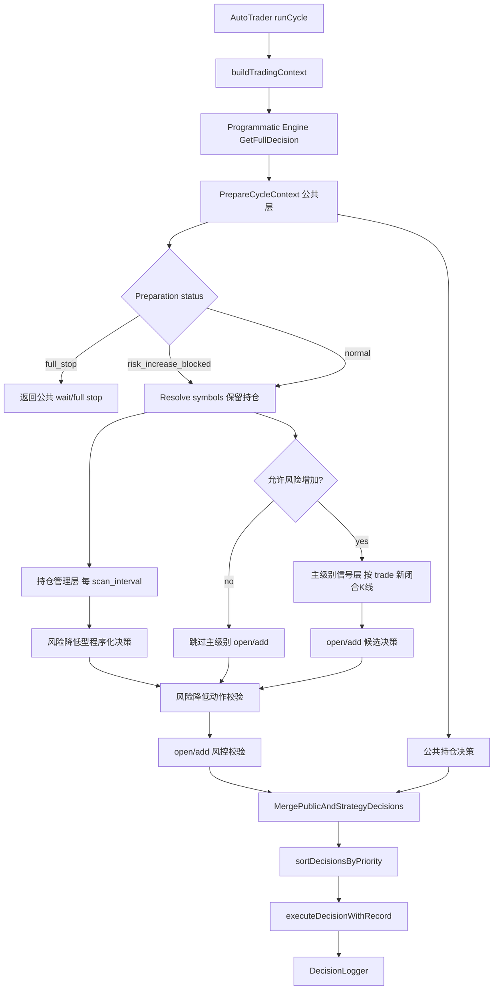

# 程序化策略双层节奏 Design

## Overview

本设计为程序化缠论策略增加“双层节奏”：

- **主级别信号层**：只在 `programmatic_strategy.timeframes.trade` 出现新闭合 K 线后分析三类买卖点，并只负责风险增加型动作：`open_long`、`open_short`、`add_long`、`add_short`。
- **持仓管理层**：每个 `scan_interval` 周期都运行，只服务已有持仓，负责风险降低或保护型动作：`update_stop_loss`、`partial_close`、`close_long`、`close_short`，以及策略级短差状态维护。

现有公共层继续作为公共风险层：熔断、行情拉取、公共交易计划评估、保护单同步、止盈止损同步和账户硬停判断仍归公共层负责。程序化持仓管理层首期只读取公共层状态并输出风险降低型 `decision.Decision`，不直接负责 `update_take_profit` 或交易计划同步。

本设计把 halt 语义拆成两类：

- `risk_increase_blocked`：熔断 cooldown、账户回撤硬停等禁止风险增加型动作，但在行情和持仓上下文可用时仍允许公共层和程序化层输出风险降低型动作。
- `full_stop`：行情、交易所连接、账户或上下文不可用，无法安全评估已有持仓时，整个策略周期停止输出真实交易动作。

程序化策略层只产出标准 `decision.Decision`，执行仍由 `trader.AutoTrader` 的现有排序、preflight、交易所实现和日志链路处理。

本需求不判断 `15m/1h/4h` 哪个级别更优。不同级别信号效果后续通过回测规格验证。本设计只保证服务支持主交易级别可配置，并保证没有新闭合主 K 线时不阻断已有持仓管理。

## Current Behavior

当前 `strategy/chanlun.Engine.GetFullDecision()` 的流程是：

1. `ResolveProgrammaticSymbols()` 得到候选池，当前持仓也会被加入。
2. `decision.PrepareCycleContext()` 拉取多周期 K 线并生成公共持仓管理决策。
3. 对每个 symbol 调用 `analyzeSymbol()`。
4. `analyzeSymbol()` 先检查 `LastAnalyzedClosedKline[tradeTF]`。
5. 如果当前闭合 `tradeTF` K 线已分析过，直接返回 `{symbol} {tradeTF} 无新闭合K线`。

这个入口级跳过对无持仓候选是合理的，但对有持仓 symbol 会阻断程序化策略自己的保本、回撤、结构破坏和短差减仓判断。

## Target Flow



关键变化：

- `LastAnalyzedClosedKline` 只约束主级别信号层。
- 持仓管理层在每个周期先于主级别信号层运行。
- 主级别无新闭合 K 线时，主信号层输出聚合诊断，不输出 open/add。
- 有持仓 symbol 即使无新 `trade` K 线，也继续跑持仓管理层。
- `risk_increase_blocked` 只跳过主级别 open/add，不跳过公共层和程序化层的风险降低动作。
- 只有 `full_stop` 才整体返回 wait/full stop，不运行程序化持仓管理层。

## Config Design

### Existing Config Kept

继续使用现有 trader 级配置：

```json
{
  "decision_mode": "programmatic",
  "programmatic_strategy": {
    "timeframes": {
      "higher": "4h",
      "trade": "1h",
      "sub": "15m",
      "micro": "3m"
    }
  }
}
```

`timeframes.trade` 是真实主交易级别，支持：

- `15m`
- `1h`
- `4h`

默认仍为 `1h`。

### Timeframe Normalization

当前 `normalizeProgrammaticTimeframes()` 允许所有字段填 `3m/15m/1h/4h`。本设计收紧 `trade`：

```go
func isSupportedProgrammaticTradeTimeframe(value string) bool {
    switch value {
    case "15m", "1h", "4h":
        return true
    default:
        return false
    }
}
```

默认组件级别由 `trade` 推导，且必须区分“未配置”和“显式配置”。实现时先规范化 `trade`，再在 `cfg.Sub == ""` 时推导 `sub`，不得先把 `sub` 固定默认成 `15m`：

| `trade` | default `sub` | default `micro` |
| --- | --- | --- |
| `15m` | `3m` | `3m` |
| `1h` | `15m` | `3m` |
| `4h` | `1h` | `3m` |

`higher` 默认保持 `4h`。如果用户显式配置 `sub` 或 `micro`，仍必须是系统已支持 timeframe，且不得使用未闭合 K 线确认主信号。

推荐实现：

```go
trade := defaultString(cfg.Trade, "1h")
if !isSupportedProgrammaticTradeTimeframe(trade) {
    return ProgrammaticTimeframesProfile{}, fmt.Errorf("timeframes.trade必须是 15m、1h 或 4h: %q", trade)
}
sub := strings.TrimSpace(strings.ToLower(cfg.Sub))
if sub == "" {
    sub = defaultSubTimeframeForTrade(trade)
}
micro := strings.TrimSpace(strings.ToLower(cfg.Micro))
if micro == "" {
    micro = "3m"
}
```

### New Position Management Config

在 `ProgrammaticStrategyConfig` 下新增可选块：

```go
type ProgrammaticPositionManagementConfig struct {
    Enabled          *bool                               `json:"enabled,omitempty"`
    Timeframes       ProgrammaticManagementTFConfig      `json:"timeframes,omitempty"`
    Breakeven        ProgrammaticBreakevenConfig         `json:"breakeven,omitempty"`
    FloatingDrawdown ProgrammaticFloatingDrawdownConfig  `json:"floating_drawdown,omitempty"`
    StructureBreak   ProgrammaticStructureBreakConfig    `json:"structure_break,omitempty"`
    ShortTrade       ProgrammaticShortTradeConfig        `json:"short_trade,omitempty"`
}
```

运行时加入：

```go
type ProgrammaticPositionManagementPolicy struct {
    Enabled          bool
    Timeframes       ProgrammaticManagementTFPolicy
    Breakeven        ProgrammaticBreakevenPolicy
    FloatingDrawdown ProgrammaticFloatingDrawdownPolicy
    StructureBreak   ProgrammaticStructureBreakPolicy
    ShortTrade       ProgrammaticShortTradePolicy
}
```

建议 JSON 形状：

```json
{
  "programmatic_strategy": {
    "position_management": {
      "enabled": true,
      "timeframes": {
        "structure": "15m",
        "micro": "3m"
      },
      "breakeven": {
        "enabled": true,
        "trigger_profit_pct": 1.0,
        "trigger_r": 1.0,
        "buffer_pct": 0.05
      },
      "floating_drawdown": {
        "enabled": true,
        "activation_profit_pct": 2.0,
        "activation_r": 1.5,
        "drawdown_pct": 35,
        "action": "partial_close"
      },
      "structure_break": {
        "enabled": true,
        "confirm_bars": 2,
        "action": "partial_close"
      },
      "short_trade": {
        "enabled": true,
        "partial_close_pct": 30
      }
    }
  }
}
```

保守默认值：

| Field | Default |
| --- | --- |
| `position_management.enabled` | `true` |
| `timeframes.structure` | `15m` |
| `timeframes.micro` | `3m` |
| `breakeven.enabled` | `true` |
| `breakeven.trigger_profit_pct` | `1.0` |
| `breakeven.trigger_r` | `1.0` |
| `breakeven.buffer_pct` | `0.05` |
| `floating_drawdown.enabled` | `true` |
| `floating_drawdown.activation_profit_pct` | `2.0` |
| `floating_drawdown.activation_r` | `1.5` |
| `floating_drawdown.drawdown_pct` | `35` |
| `floating_drawdown.action` | `partial_close` |
| `structure_break.enabled` | `true` |
| `structure_break.confirm_bars` | `2` |
| `structure_break.action` | `partial_close` |
| `short_trade.enabled` | `true` |
| `short_trade.partial_close_pct` | fallback to `position.partial_close_pct` |

百分比单位：

| Field | 配置单位 | 运行时单位 | 示例 |
| --- | --- | --- | --- |
| `breakeven.trigger_profit_pct` | 人类百分数 | pct | `1.0` 表示 1% 浮盈 |
| `breakeven.buffer_pct` | 人类百分数 | ratio | `0.05` 表示 0.05%，运行时为 `0.0005` |
| `floating_drawdown.activation_profit_pct` | 人类百分数 | pct | `2.0` 表示 2% 浮盈 |
| `floating_drawdown.drawdown_pct` | 人类百分数 | ratio | `35` 表示 35%，运行时为 `0.35` |
| `short_trade.partial_close_pct` | 人类百分数 | pct | `30` 表示减仓 30% |

说明：

- 与 `PositionInfo.UnrealizedPnLPct`、`TradePlan.PeakPnLPercent` 比较的字段保持 pct 单位，`1.0` 就是 1%。
- 用于价格乘法或比例比较的字段在配置归一化后转为 ratio，例如 `buffer_pct: 0.05` 转成 `0.0005`。
- 不得直接复用现有 `normalizePercentRatio()` 解析 `buffer_pct`，否则 `0.05` 会被解释为 `0.05` ratio，即 5%。
- `floating_drawdown.drawdown_pct` 表示从峰值浮盈回撤的比例。例如峰值浮盈 4%，当前浮盈 2.6%，回撤为 35%。
- `action` 首期只允许 `partial_close` 或 `close`，默认 `partial_close`。

## Runtime Data Structures

### State File

复用 `data/programmatic_strategy_state.json`。当前 state 是 trader -> symbol 粒度：

```go
type ProgrammaticSymbolState struct {
    LastAnalyzedClosedKline map[string]int64
    ConfirmedSignals        map[string]StoredSignal
    ExecutedSignals         map[string]SignalExec
    AddCountBySide          map[string]int
    ShortTradeState         *ShortTradeState
}
```

新增 side 级持仓管理状态：

```go
type ProgrammaticPositionState struct {
    Side                    string    `json:"side"`
    PeakPrice               float64   `json:"peak_price,omitempty"`
    PeakR                   float64   `json:"peak_r,omitempty"`
    LastBreakevenSignalID   string    `json:"last_breakeven_signal_id,omitempty"`
    LastDrawdownSignalID    string    `json:"last_drawdown_signal_id,omitempty"`
    LastStructureSignalID   string    `json:"last_structure_signal_id,omitempty"`
    LastShortTradeSignalID  string    `json:"last_short_trade_signal_id,omitempty"`
    LastManagedAt           time.Time `json:"last_managed_at,omitempty"`
}

type ProgrammaticSymbolState struct {
    // existing...
    PositionStates map[string]ProgrammaticPositionState `json:"position_states,omitempty"`
}
```

Key 使用 side：`long` / `short`。这样同一 symbol 不允许双向持仓的当前业务约束不变，但状态天然支持未来交易所或账户出现异常双边数据时隔离。

### Peak Data Ownership

系统已有 `TradePlan.PeakPrice`、`PeakPnLPercent`，并且 `decision.evaluateExistingPositions()` 每周期调用 `UpdatePlanPeakDataScoped()`。设计采用：

- 有有效 `TradePlan`：以 `TradePlan` 的 peak 数据作为主来源。
- 无有效 `TradePlan`：使用 `ProgrammaticPositionState` 临时追踪 peak，并在日志中标记 `state_source=programmatic_state_no_plan`。
- 程序化状态仍记录 `PeakR` 和各类已处理 signal id，用于去重和复盘。

### Position Management Signal ID

持仓管理层的 `SignalID` 必须确定性生成，不能使用纯当前时间戳。统一格式：

```text
pm:{trader_id}:{symbol}:{side}:{rule}:{timeframe}:{trigger_close_time}:{trigger_hash}:{config_hash}
```

字段含义：

- `rule`：`breakeven`、`floating_drawdown`、`structure_break`、`short_trade`。
- `timeframe`：触发判断所使用的主要 timeframe，例如 `3m` 或 `15m`；保本止损若只使用实时/持仓数据，可填 `position`。
- `trigger_close_time`：触发 K 线 close time；无 K 线触发时使用持仓 `UpdateTime` 或交易计划 peak 更新时间。
- `trigger_hash`：规则关键输入的稳定 hash。

各规则推荐 hash 输入：

| Rule | trigger_hash 输入 |
| --- | --- |
| `breakeven` | `entry_price + existing_stop_loss + candidate_stop_loss + trigger_profit_pct + trigger_r` |
| `floating_drawdown` | `peak_price + peak_pnl_pct + current_pnl_pct + drawdown_pct` |
| `structure_break` | `support/resistance + structure_timeframe + trigger_close_time + action` |
| `short_trade` | 复用 `StableSignalID()` 对应信号结构 |

状态去重按 `side + rule + signal_id` 判断，并写入对应 `LastBreakevenSignalID`、`LastDrawdownSignalID`、`LastStructureSignalID` 或 `LastShortTradeSignalID`。

## Engine Changes

### Cycle Preparation Halt Semantics

`decision.PrepareCycleContext()` 需要支持程序化策略的风险降低路径。建议扩展 `CyclePreparationOptions` 和 `CyclePreparation`：

```go
type CyclePreparationOptions struct {
    MarketSymbols              []string
    MarketHistoryDepth         map[string]int
    ClosedKlinesOnly           bool
    IncludeMicroADX            bool
    AllowRiskReducingOnHalt    bool
}

type CyclePreparation struct {
    PositionDecisions    []Decision
    WaitDecision         *Decision
    StopReason           string
    HaltDecision         *FullDecision
    RiskIncreaseBlocked  bool
    FullStop             bool
}
```

语义：

- `FullStop=true`：无法安全获取行情、账户或持仓上下文，策略直接返回 wait/full stop。
- `RiskIncreaseBlocked=true`：熔断 cooldown、账户回撤硬停等状态已触发，禁止 open/add，但仍应尽量拉取已有持仓 symbol 行情、运行公共持仓评估和程序化持仓管理。
- 账户硬停触发时，公共层可继续生成 close/partial/wait；程序化层只允许风险降低型动作。
- 若 `AllowRiskReducingOnHalt=false`，AI 旧路径可保持当前 halt 直接返回行为，避免扩大兼容面。

### Public Entry

保留入口：

```go
func (e *Engine) GetFullDecision(ctx *decision.Context) (*decision.FullDecision, error)
```

内部拆成：

```go
func (e *Engine) evaluatePositionManagement(
    ctx *decision.Context,
    universe []StrategySymbol,
    now time.Time,
) ([]decision.Decision, []LayerDiagnostic)

func (e *Engine) evaluateMainSignals(
    ctx *decision.Context,
    universe []StrategySymbol,
    now time.Time,
) ([]decision.Decision, []LayerDiagnostic)
```

`GetFullDecision()` 新流程：

1. Resolve universe，并确保当前持仓 symbol 始终在 universe。
2. 调用 `PrepareCycleContext(..., AllowRiskReducingOnHalt=true)` 获取行情、公共持仓决策和 halt 状态。
3. 若 `prep.FullStop` 或无法安全评估持仓，则直接返回公共 `HaltDecision` 或 wait。
4. 运行 `evaluatePositionManagement()`。
5. 若 `prep.RiskIncreaseBlocked`，跳过 `evaluateMainSignals()`，并记录“风险增加已阻断，仅运行持仓管理”。
6. 若未阻断风险增加，运行 `evaluateMainSignals()`。
7. 合并程序化持仓管理决策和主信号决策。
8. 调用风险降低动作校验和 open/add 风控校验。
9. 调用带冲突消解的 `decision.MergePublicAndStrategyDecisions(prep.PositionDecisions, validDecisions)`。
10. 若最终无动作，返回 `wait`。
11. 写入分层诊断、halt 状态与策略参数快照。

### Main Signal Layer

现有 `analyzeSymbol()` 改名或拆分为：

```go
func (e *Engine) analyzeMainSignal(
    traderID string,
    symbol string,
    data *market.Data,
    now time.Time,
) ([]ChanlunSignal, MainSignalDiagnostic)
```

主信号层负责：

- 读取 `tradeTF := e.Policy.Timeframes.Trade`。
- 只使用 `data.Klines[tradeTF]` 已闭合 K 线。
- 若 K 线不足，记录 `data_insufficient`。
- 若无新闭合 K 线，记录 `no_new_closed_kline`，不返回信号。
- 若有新闭合 K 线，执行现有包含关系、分型、笔、线段、中枢、MACD 背驰和均线吻判断。
- 无论是否识别信号，只要该闭合 K 线已完成分析，都更新 `LastAnalyzedClosedKline[tradeTF]`。

主信号层输出的信号转 decision 时只允许：

- 无持仓：`open_long` / `open_short`
- 同向持仓：`add_long` / `add_short`

反向信号不在主信号层直接处理持仓风险，交给持仓管理层按风险降低规则处理。

### Position Management Layer

新增：

```go
func (e *Engine) analyzePosition(
    ctx *decision.Context,
    pos decision.PositionInfo,
    data *market.Data,
    now time.Time,
) ([]decision.Decision, PositionManagementDiagnostic)
```

持仓管理层只遍历 `ctx.Positions`，不依赖候选池是否有新闭合主 K 线。每个持仓按以下顺序评估，先产出最高优先级动作，避免同一持仓同周期多个互相冲突动作：

1. 结构破坏强减仓/平仓。
2. 浮盈回撤保护。
3. 短差减仓。
4. 保本止损更新。
5. 无动作诊断。

顺序理由：结构破坏和回撤是风险降低；短差是主动降敞口；保本止损是保护单优化。若同周期出现 `partial_close` 和 `update_stop_loss`，执行层已支持 `partial_close` 优先，但策略层应尽量只输出一个主动作，避免过度操作。

## Position Management Rules

### 1. Breakeven Stop

输入：

- `pos.EntryPrice`
- `pos.UnrealizedPnLPct`
- `TradePlan.InitialRiskDistance` 或当前止损距离
- `TradePlan.CurrentStopLoss`
- `marketData.CurrentPrice`

触发条件：

```text
pos.UnrealizedPnLPct >= trigger_profit_pct
OR currentR >= trigger_r
```

多头新止损：

```text
bufferRatio = buffer_pct / 100
candidateSL = entryPrice * (1 + bufferRatio)
candidateSL = max(candidateSL, existingStopLoss)
```

空头新止损：

```text
bufferRatio = buffer_pct / 100
candidateSL = entryPrice * (1 - bufferRatio)
candidateSL = min(candidateSL, existingStopLoss)
```

若新止损不会改善保护效果、穿越当前价或方向不合法，则不输出动作。最终执行仍经过 `executeUpdateStopLossWithRecord()`，保留已有“利润不足 1% 不允许移动止损到保本”的保护。

输出：

```go
decision.Decision{
    Symbol: signal.Symbol,
    Action: "update_stop_loss",
    NewStopLoss: candidateSL,
    StrategyMode: "programmatic",
    StrategyMetadata: {"layer": "position_management", "rule": "breakeven"},
}
```

### 2. Floating Drawdown

输入：

- `PeakPnLPercent`
- 当前 `UnrealizedPnLPct`
- `InitialRiskDistance` 计算的 R 倍

触发条件：

```text
PeakPnLPercent >= activation_profit_pct
OR PeakR >= activation_r
```

回撤比例：

```text
drawdown = (PeakPnLPercent - currentPnLPct) / PeakPnLPercent
```

若 `drawdown >= drawdown_pct`，输出：

- 默认 `partial_close`
- `ClosePercentage` 使用 `position.partial_close_pct` 或配置覆盖
- 若配置 `action=close`，输出 `close_long` / `close_short`

诊断记录：峰值、当前浮盈、回撤比例、峰值 R、当前 R、触发阈值。

### 3. Structure Break

使用 `position_management.timeframes.structure`，默认 `15m`，以及 `micro`，默认 `3m`。

结构位计算：

- 对结构级别 K 线执行 `NormalizeInclusion()`、`FindFractals()`、`BuildStrokes()`、`BuildSegments()`。
- 多头关键结构位取最近有效上升结构的 swing low 或最近中枢 `ZG/ZD` 下沿。
- 空头关键结构位取最近有效下降结构的 swing high 或最近中枢 `ZG/ZD` 上沿。

确认条件：

- 结构级别最近一根已闭合 K 线破位；或
- `micro` 最近 `confirm_bars` 根已闭合 K 线连续破位。

多头破坏：

```text
close(structureTF) < support
OR lastNClosed(microTF).all(close < support)
```

空头破坏：

```text
close(structureTF) > resistance
OR lastNClosed(microTF).all(close > resistance)
```

输出：

- 默认 `partial_close`
- 配置 `action=close` 时输出对应全平

不得用未闭合 `15m/1h/4h` 确认结构破坏。硬止损和交易所保护单触发仍由公共层和订单追踪处理。

### 4. Short Trade Partial Close

短差减仓基于已有 `DetectSignals()`，但分析级别使用持仓管理结构级别或 micro 级别，而不是主交易级别。

规则：

- 多头持仓遇到 `sell2` / `sell3`，可触发 `partial_close`。
- 空头持仓遇到 `buy2` / `buy3`，可触发 `partial_close`。
- `buy1/sell1` 默认不触发短差减仓，避免一类反转早期噪音；后续可配置扩展。
- 使用 `StableSignalID()` + `ProgrammaticPositionState.LastShortTradeSignalID` 去重。

输出 `partial_close` 后：

- 更新 `ShortTradeState`。
- 更新 `ProgrammaticPositionState.LastShortTradeSignalID`。
- `ClosePercentage` 默认使用 `position.partial_close_pct`。

## Risk-Reducing Decision Validation

现有 `decision.ValidateStrategyDecisions()` 主要校验 open/add。为避免程序化持仓管理动作直接透传到 executor，新增等价校验路径：

```go
func ValidateRiskReducingStrategyDecisions(
    ctx *decision.Context,
    decisions []decision.Decision,
    opts RiskReducingValidationOptions,
) ([]decision.Decision, []decision.OpenRejection)
```

首期校验规则：

- 只允许 `close_long`、`close_short`、`partial_close`、`update_stop_loss`。
- 不允许程序化持仓管理层输出 `update_take_profit`；止盈同步继续由公共层负责。
- symbol 必须存在已有持仓，且 close action 方向必须匹配持仓 side。
- `partial_close.ClosePercentage` 必须在 `(0, 100]`。
- `update_stop_loss.NewStopLoss` 必须有效：
  - 多头新止损应高于已有有效止损，且低于当前价。
  - 空头新止损应低于已有有效止损，且高于当前价。
  - 若没有已有止损，则至少不得扩大入场风险。
- 同一 `symbol + side` 同一周期最多保留一个程序化持仓管理主动作。
- 每个程序化持仓管理动作必须带 `StrategyMode`、`StrategyName`、`StrategyVersion`、`ConfigHash`、`SignalID`、`StrategyMetadata.layer` 和 `StrategyMetadata.rule`。

程序化策略校验顺序：

```go
riskReducing, openLike := splitProgrammaticDecisions(strategyDecisions)
validRiskReducing, rrRejections := decision.ValidateRiskReducingStrategyDecisions(ctx, riskReducing, opts)

if prep.RiskIncreaseBlocked {
    openLike = nil
}
validOpenLike, openRejections := decision.ValidateStrategyDecisions(ctx, openLike, decision.StrategyValidationOptions{
    Source: "programmatic",
    AllowAdd: true,
})

validDecisions := append(validRiskReducing, validOpenLike...)
```

## Decision Merge and Ordering

程序化策略内部先把持仓管理决策和主信号决策合并：

```go
strategyDecisions := append(positionManagementDecisions, mainSignalDecisions...)
validDecisions, rejections := validateProgrammaticDecisions(ctx, strategyDecisions, prep)
allDecisions := decision.MergePublicAndStrategyDecisions(prep.PositionDecisions, validDecisions)
```

原则：

- 公共层决策优先于程序化策略。
- 持仓管理层决策在程序化策略内部优先于主信号层。
- 如果公共层对同 symbol 产生 `close/partial/update_stop_loss/update_take_profit`，程序化 open/add 会被 `MergePublicAndStrategyDecisions()` 阻断。
- 如果公共层对同 symbol 产生强制 close 或交易计划硬退出，压制同 symbol 的所有程序化持仓管理动作。
- 如果公共层对同 symbol 产生 `partial_close`，首期压制同 symbol 的程序化 `partial_close`、close 和 `update_stop_loss`，待公共层执行后由保护单同步重新评估。
- 如果公共层和程序化层仅同时产生 `update_stop_loss`，保留方向合法且保护效果更强的一个。
- 如果 `prep.RiskIncreaseBlocked=true`，程序化 open/add 在 merge 前已被清空。
- `trader.sortDecisionsByPriority()` 保持现有顺序：close/partial -> update stops/TP -> add -> open -> hold/wait。

## Diagnostics and Logging

新增分层诊断，但复用 `FullDecision.StrategyDiagnostics`：

```go
fullDecision.StrategyDiagnostics = map[string]any{
    "main_signal": map[string]any{
        "trade_timeframe": "1h",
        "analyzed_symbols": 3,
        "skipped_no_new_closed_kline": 8,
        "next_close_time": "2026-05-17T15:00:00+08:00",
        "messages": []string{...},
    },
    "position_management": map[string]any{
        "enabled": true,
        "positions_evaluated": 1,
        "actions": 0,
        "messages": []string{...},
    },
}
```

`CoTTrace` 摘要改为聚合形式：

```text
程序化策略周期完成: 持仓管理已评估 1 个持仓，无动作; 主信号层 8 个候选等待 1h 新闭合K线，下一次约 15:00 确认
```

避免重复刷屏：

- 不再逐个输出 `BCHUSDT 1h 无新闭合K线`。
- 对无持仓候选聚合计数。
- 对有持仓 symbol 单独记录持仓管理诊断。

每条程序化持仓管理决策的 `StrategyMetadata` 至少包含：

```json
{
  "layer": "position_management",
  "rule": "breakeven|floating_drawdown|structure_break|short_trade",
  "structure_timeframe": "15m",
  "micro_timeframe": "3m"
}
```

## API and Frontend

不新增必需 API。

现有接口继续可用：

- `/api/decisions/latest`
- `/api/strategy/signals`
- `/api/status`

后端仅增加可选字段：

- `strategy_diagnostics.main_signal`
- `strategy_diagnostics.position_management`
- 单 action 的 `strategy_metadata.layer`
- 单 action 的 `strategy_metadata.rule`

前端若当前未识别这些字段，应作为普通 JSON 诊断展示，不影响已有 action 列表、最新决策和 K 线图。

## Compatibility and Migration

- 旧配置没有 `position_management` 时，默认启用双层节奏的持仓管理层。
- 旧配置 `trade=1h` 行为保持真实主信号级别不变，只改变“无新闭合K线”时的持仓管理阻断问题。
- AI 决策路径默认不启用 `AllowRiskReducingOnHalt`，保持旧 halt 直接返回行为；程序化路径启用风险降低动作通道。
- 若旧配置曾设置 `trade=3m`，新校验会失败；需要显式改为 `15m/1h/4h`。这是为了满足主信号必须使用较稳定闭合 K 线的需求。
- 旧 `programmatic_strategy_state.json` 无 `position_states` 时按空状态读取，首次保存自动补齐。
- `LastAnalyzedClosedKline` 仍按 `symbol + timeframe` 存储，不清理旧 timeframe 数据。

## Tests

### Config Tests

新增或更新 `config/config_test.go`：

- `trade=15m/1h/4h` 通过。
- `trade=3m` 失败。
- 未配置 `sub` 时按 `trade` 推导默认组件级别。
- `position_management` 默认值归一化。
- 百分比字段按字段语义归一化：`trigger_profit_pct=1.0` 表示 1%，`buffer_pct=0.05` 表示 0.05%，`drawdown_pct=35` 表示 35%。
- 非法 action、非法 timeframe、负数阈值失败。

### Engine Tests

新增或更新 `strategy/chanlun/structure_test.go` 或新增 `strategy/chanlun/engine_test.go`：

- 无新 `trade` 闭合 K 线、无持仓：不输出 open/add。
- 无新 `trade` 闭合 K 线、有持仓：持仓管理层仍被调用。
- 有新 `trade` 闭合 K 线：主信号层分析并更新 `LastAnalyzedClosedKline`。
- 切换 `trade=15m/1h/4h` 时状态隔离。
- risk-increase blocked 且已有持仓时，跳过主信号层 open/add，但持仓管理层仍运行。
- 聚合诊断包含 main_signal 和 position_management。

### Position Management Tests

使用 fake `decision.Context` 和 deterministic K 线：

- 保本触发输出 `update_stop_loss`。
- 保本未达阈值不输出动作并记录诊断。
- 浮盈回撤触发 `partial_close`。
- 结构破坏使用 15m 闭合 K 线触发。
- 结构破坏使用连续 3m 闭合 K 线触发。
- 未闭合 K 线不触发结构破坏。
- 短差减仓同一 signal id 不重复触发。
- 保本、浮盈回撤和结构破坏使用确定性 `SignalID`，重启后不重复触发同一事件。

### Merge / Execution Tests

更新 `trader/trader_test.go` 或 `decision/decision_test.go`：

- 公共层 close 阻断程序化 open/add。
- 公共层 close 压制同 symbol 程序化 partial/stop。
- 公共层 partial 压制同 symbol 程序化 partial/close/stop。
- 公共层和程序化层同时输出 update_stop_loss 时保留保护效果更强且方向合法的一个。
- 程序化 `partial_close` 优先于 `update_stop_loss` 和 open/add。
- risk-increase blocked 时程序化 open/add 被清空，风险降低动作保留。
- 非 open-like 校验拒绝无持仓、方向不匹配、比例非法和止损降低保护效果的程序化动作。
- 持仓管理层输出的 `update_stop_loss` 仍走现有执行保护，保留利润不足拒绝路径。

## Rollout

1. 先合入代码与测试，不改生产配置的 `trade`。
2. 161 服务继续保持 `trade=1h`。
3. 启用 `position_management` 默认块，确认日志出现“主信号层等待新闭合K线，持仓管理已评估”。
4. 观察已有持仓是否每 3m 周期仍有诊断。
5. 后续单独建立回测规格，用 replay/backtest 比较 `15m/1h/4h` 信号质量后，再决定生产配置是否切换主交易级别。

## Risks

- 持仓管理层过于敏感可能增加 partial close 和止损调整次数。通过保守默认阈值、闭合 K 线确认和执行层最小名义额保护缓解。
- 与公共 `PositionEvaluator` 可能产生重复动作。通过公共层优先合并、同 symbol open/add 阻断、策略层单持仓单周期只输出一个主动作缓解。
- `trade=15m` 配置虽然支持，但实盘风险高于 `1h`。本需求不默认切换生产级别，后续用回测验证。
