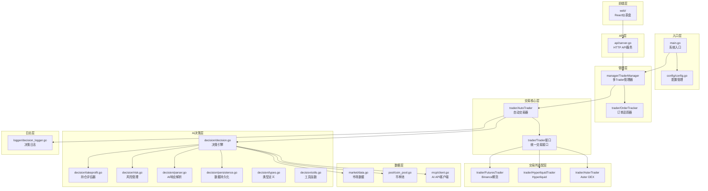
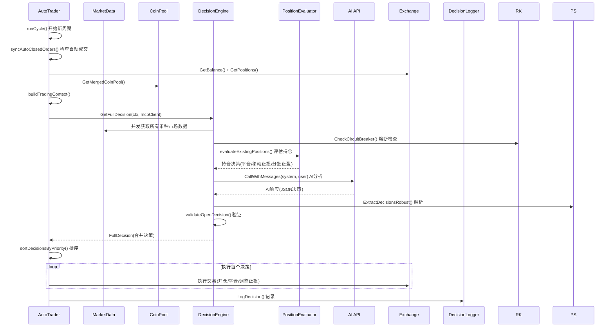
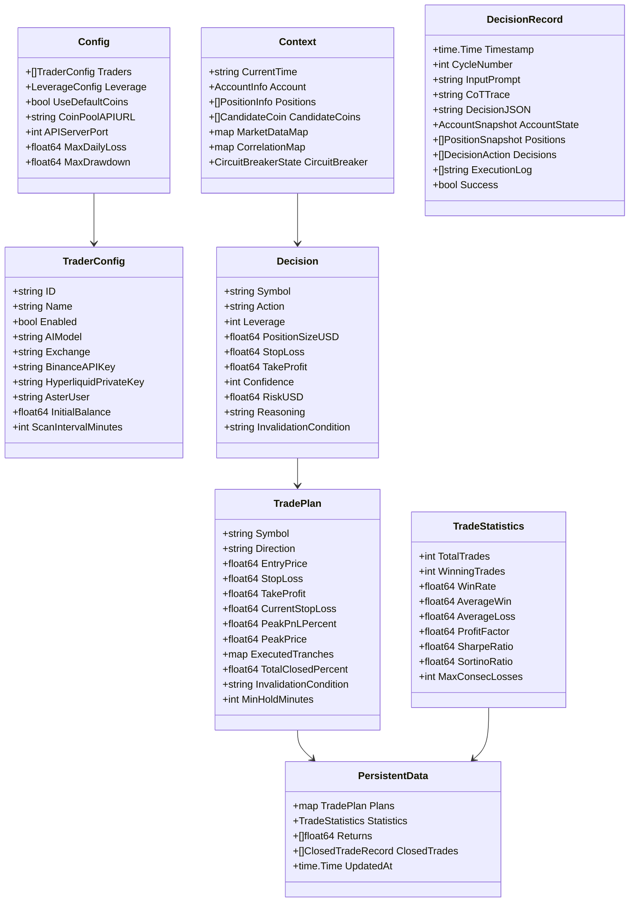

# 设计文档 - NOFX 量化交易系统

## 概述

NOFX 是一个 AI 驱动的加密货币量化交易操作系统，采用 Go 后端 + React/TypeScript 前端架构。系统核心设计围绕"多 Agent 竞赛"理念，支持多个 AI 模型（DeepSeek、Qwen、自定义 OpenAI 兼容 API）在多个交易所（Binance 期货、Hyperliquid、Aster DEX）上并行运行，独立决策、独立风控、独立记录，最终通过统一的 Web 仪表盘进行实时对比和分析。

系统的交易周期为：数据采集 → AI 决策 → 参数验证 → 订单执行 → 持仓评估 → 风险管理 → 日志记录，每 3 分钟循环一次。

## 架构

### 高层系统架构



### 数据流



## 组件与接口

### 1. 配置管理 (config/config.go)

负责从 JSON 文件加载和验证系统配置。

```go
// 核心接口
func LoadConfig(filename string) (*Config, error)
func (c *Config) Validate() error
func (tc *TraderConfig) GetScanInterval() time.Duration
```

配置结构包含：交易者列表（TraderConfig）、杠杆配置（LeverageConfig）、币种池设置、API 端口、风控参数。验证逻辑覆盖：唯一 ID 检查、AI 模型类型校验、交易所密钥完整性、杠杆默认值和警告。

### 2. 统一交易接口 (trader/interface.go)

定义所有交易所必须实现的统一接口：

```go
type Trader interface {
    GetBalance() (map[string]interface{}, error)
    GetPositions() ([]map[string]interface{}, error)
    OpenLong(symbol string, quantity float64, leverage int) (map[string]interface{}, error)
    OpenShort(symbol string, quantity float64, leverage int) (map[string]interface{}, error)
    CloseLong(symbol string, quantity float64) (map[string]interface{}, error)
    CloseShort(symbol string, quantity float64) (map[string]interface{}, error)
    SetLeverage(symbol string, leverage int) error
    GetMarketPrice(symbol string) (float64, error)
    SetStopLoss(symbol, positionSide string, quantity, stopPrice float64) error
    SetTakeProfit(symbol, positionSide string, quantity, takeProfitPrice float64) error
    CancelStopLossOrders(symbol string) error
    CancelTakeProfitOrders(symbol string) error
    CancelAllOrders(symbol string) error
    FormatQuantity(symbol string, quantity float64) (string, error)
    GetOrderHistory(symbol string, startTime, endTime int64, limit int) ([]OrderRecord, error)
    GetTradeHistory(symbol string, startTime, endTime int64, limit int) ([]TradeRecord, error)
    GetOrderStatus(symbol string, orderID int64) (*OrderRecord, error)
}
```

三个实现：
- FuturesTrader (Binance)：使用 go-binance SDK，15 秒余额/持仓缓存，双向持仓模式
- HyperliquidTrader：以太坊私钥认证，IOC 限价单模拟市价单，5 位有效数字价格精度
- AsterTrader：ABI 编码签名认证，限价单模拟市价单，交易所精度信息缓存

### 3. 自动交易器 (trader/auto_trader.go)

单个 AI 交易实例的完整生命周期管理：

```go
type AutoTrader struct { ... }
func NewAutoTrader(config AutoTraderConfig) (*AutoTrader, error)
func (at *AutoTrader) Run() error                    // 主循环
func (at *AutoTrader) runCycle() error               // 单周期执行
func (at *AutoTrader) buildTradingContext() (*decision.Context, error)
func (at *AutoTrader) executeDecisionWithRecord(d *Decision, r *DecisionAction) error
func (at *AutoTrader) syncAutoClosedOrders()         // 检测自动成交
func (at *AutoTrader) detectAutoClosedPositions(positions []PositionInfo) []DecisionAction
```

关键设计决策：
- 先平仓后开仓的执行顺序，防止仓位叠加
- 开仓前检查同币种同方向持仓，拒绝重复开仓
- 启动时同步现有持仓的交易计划
- 每周期开始检测自动成交订单

### 4. AI 决策引擎 (decision/decision.go)

核心决策流程：

```go
func GetFullDecision(ctx *Context, mcpClient *mcp.Client) (*FullDecision, error)
func evaluateExistingPositions(ctx *Context) []Decision
func shouldCallAIForNewOpportunities(ctx *Context) bool
func validateOpenDecision(d *Decision, ctx *Context) error
func ValidateAndEnrichDecision(d *Decision, ctx *Context) error
func CheckPreOpenInvalidation(d *Decision, marketData *market.Data) (bool, string)
func CreateTradePlanFromDecision(d *Decision, actualEntryPrice float64) *TradePlan
```

决策合并策略：持仓评估决策优先于 AI 新开仓决策。当持仓已满（3 个）或风险预算不足（<1%）时跳过 AI 调用。

### 5. 持仓评估器 (decision/takeprofit.go)

按优先级评估持仓：

```go
type PositionEvaluator struct {
    Position   *PositionInfo
    Plan       *TradePlan
    MarketData *market.Data
    Symbol     string
}
func (e *PositionEvaluator) Evaluate() *EvaluationResult
```

评估优先级链：硬性止损 → 固定止盈 → 最小持仓时间保护 → 利润保护 → ATR 跟踪止盈 → 自适应分批止盈 → 移动止损 → 动态止盈调整 → 计划失效条件检查。

### 6. 风险管理 (decision/risk.go)

```go
func CalculateTotalRisk(ctx *Context) (totalRisk float64, riskDetails []*PositionRisk)
func CheckCircuitBreaker(ctx *Context, stats *TradeStatistics) *CircuitBreakerState
func CalculateCorrelationMatrix(ctx *Context)
func (d *DynamicRiskAdjuster) GetAdjustedRisk(stats *TradeStatistics) float64
```

风险计算四级降级：交易计划止损 → 持仓止损单 → ATR 估算 → 默认值。不准确估算增加 10% 安全边际。

熔断触发条件：BTC 1h 暴跌 >5%（冷却 120 分钟）、账户回撤超限（冷却 120 分钟）、连续亏损 5 次（冷却 30 分钟）、保证金使用率 >90%（冷却 30 分钟）。

### 7. AI 响应解析器 (decision/parser.go)

四级降级解析策略：

```go
func ExtractDecisionsRobust(response string) ([]Decision, string, error)
// 1. 标准 JSON 解析
// 2. 模糊 JSON 解析（修复引号、尾逗号、注释等）
// 3. 文本提取（正则匹配买入/卖出/等待信号）
// 4. 默认等待决策
```

### 8. 失效条件解析器 (decision/parser.go)

```go
func ParseInvalidationCondition(condition string) *ParsedInvalidationCondition
func FormatInvalidationCondition(condition string) string
```

支持 9 种结构化条件类型和自然语言解析降级。

### 9. 市场数据模块 (market/data.go)

```go
func Get(symbol string) (*Data, error)  // 带 30 秒缓存
func Format(data *Data) string          // 格式化为 AI 可读文本
```

并发获取 4 个时间框架（3m/15m/1h/4h），计算 EMA20/50、MACD、RSI7/14、ATR3/14、ADX14、布林带、OI、资金费率。

### 10. 币种池管理 (pool/coin_pool.go)

```go
func GetMergedCoinPool(ai500Limit int) (*MergedCoinPool, error)
func GetCoinPool() ([]CoinInfo, error)       // AI500 + 3 次重试 + 缓存降级
func GetOITopPositions() ([]OIPosition, error) // OI Top + 3 次重试 + 缓存降级
```

### 11. MCP 客户端 (mcp/client.go)

```go
func (cfg *Client) CallWithMessages(systemPrompt, userPrompt string) (string, error)
func (cfg *Client) SetDeepSeekAPIKey(apiKey string)
func (cfg *Client) SetQwenAPIKey(apiKey, secretKey string)
func (cfg *Client) SetCustomAPI(apiURL, apiKey, modelName string)
```

120 秒超时，3 次重试（仅网络错误），temperature=0.5，max_tokens=2000。

### 12. 数据持久化 (decision/persistence.go)

```go
func InitPlanManager(dataDir string) error
func OnPositionOpened(decision *Decision, actualEntryPrice float64, actualQuantity float64) error
func OnPositionClosed(symbol string, exitPrice float64, pnlPercent float64, pnlUSD float64, reason string)
func ExportData() ([]byte, error)
func ImportData(data []byte) error
```

原子写入（临时文件 + 重命名），自动保存，保留最近 1000 条收益率和 100 条已平仓记录。

### 13. 决策日志 (logger/decision_logger.go)

```go
func (l *DecisionLogger) LogDecision(record *DecisionRecord) error
func (l *DecisionLogger) GetLatestRecords(n int) ([]*DecisionRecord, error)
func (l *DecisionLogger) AnalyzePerformance(lookbackCycles int) (*PerformanceAnalysis, error)
```

每条记录独立 JSON 文件，3 倍窗口预填充开仓记录避免匹配失败。

### 14. HTTP API (api/server.go)

基于 Gin 框架，CORS 中间件，11 个 RESTful 端点覆盖健康检查、竞赛总览、Trader 列表、系统状态、账户信息、持仓、决策日志、统计、收益率历史、AI 表现分析。

### 15. 前端仪表盘 (web/)

React 18 + TypeScript + Vite + Tailwind CSS + Recharts + SWR。Binance 风格深色主题，竞赛页面（排行榜 + 对比曲线）和详情页面（净值曲线 + 持仓 + 决策 + AI 学习）。中英文双语，15-30 秒自动刷新，最大 2000 数据点。

## 数据模型

### 核心数据结构



### 持久化文件结构

- `data/trade_plans.json` — 交易计划、统计数据、收益率序列、已平仓记录（原子写入）
- `decision_logs/{trader_id}/decision_YYYYMMDD_HHMMSS_cycleN.json` — 每周期决策记录
- `coin_pool_cache/latest.json` — AI500 币种池缓存
- `coin_pool_cache/oi_top_latest.json` — OI Top 缓存


## 正确性属性 (Correctness Properties)

*正确性属性是在系统所有有效执行中都应成立的特征或行为——本质上是关于系统应该做什么的形式化陈述。属性是人类可读规范与机器可验证正确性保证之间的桥梁。*

### Property 1: 配置序列化往返

*对于任意*有效的 Config 结构体，将其序列化为 JSON 再反序列化，应产生与原始配置等价的结构体。

**Validates: Requirements 1.1**

### Property 2: 配置类型必填字段验证

*对于任意*交易者配置，当 AI 模型为 "custom" 且缺少 custom_api_url/custom_api_key/custom_model_name 中任一字段时，或当交易所为 "binance" 且缺少 API 密钥时，或当交易所为 "hyperliquid" 且缺少私钥时，或当交易所为 "aster" 且缺少三个必填字段中任一时，Validate() 应返回非空错误。

**Validates: Requirements 1.3, 1.4, 1.5, 1.6, 1.7**

### Property 3: 启用交易者计数

*对于任意*包含 N 个交易者配置（其中 M 个 Enabled=true）的配置，系统应创建恰好 M 个 AutoTrader 实例。

**Validates: Requirements 1.2**

### Property 4: 默认币种池自动启用

*对于任意*配置，当 UseDefaultCoins=false 且 CoinPoolAPIURL 为空字符串时，加载配置后 UseDefaultCoins 应为 true。

**Validates: Requirements 1.8**

### Property 5: 杠杆默认值

*对于任意*配置，当杠杆值 ≤0 时，验证后应被设置为默认值 5。

**Validates: Requirements 1.9**

### Property 6: 无效配置文件拒绝

*对于任意*非法 JSON 字符串或缺少必填字段的配置内容，LoadConfig 应返回非空错误。

**Validates: Requirements 1.10**

### Property 7: 数量精度格式化往返

*对于任意*交易对和正浮点数数量，FormatQuantity 产生的字符串解析回浮点数后，与原始值的差应不超过该交易对的最小步进值（stepSize）。

**Validates: Requirements 2.5**

### Property 8: AI 响应解析鲁棒性

*对于任意*非空字符串输入，ExtractDecisionsRobust 应永远不返回 nil 决策列表（至少返回一个 wait 决策），且不应 panic。

**Validates: Requirements 3.3**

### Property 9: 决策参数自动补充

*对于任意*缺少杠杆、仓位大小、止损或止盈的开仓决策，经过 ValidateAndEnrichDecision 后，所有这些字段应为正值。

**Validates: Requirements 3.4**

### Property 10: 风险回报比验证

*对于任意*开仓决策，当净风险回报比低于 2.5:1 时，validateOpenDecision 应返回非空错误。

**Validates: Requirements 3.5**

### Property 11: 满仓或预算不足时跳过 AI 调用

*对于任意*交易上下文，当持仓数量 ≥3 或剩余风险预算 ≤1% 时，shouldCallAIForNewOpportunities 应返回 false。

**Validates: Requirements 3.6**

### Property 12: 决策合并优先级

*对于任意*持仓评估决策集合和 AI 新开仓决策集合，合并后的结果中，对于同一币种，持仓评估决策（非 hold/wait）应优先于 AI 新开仓决策。

**Validates: Requirements 3.7**

### Property 13: 开仓前失效条件预检查

*对于任意*开仓决策和市场数据，当失效条件已被触发时（如多单的 EMA 死叉已发生），CheckPreOpenInvalidation 应返回 (true, 非空原因)。

**Validates: Requirements 3.8**

### Property 14: AI 调用频率控制

*对于任意*交易上下文，当距离上次分析时间不足配置间隔时，shouldCallAIForNewOpportunities 应返回 false。

**Validates: Requirements 3.10**

### Property 15: 止损触发立即平仓

*对于任意*多头持仓，当当前价格 ≤ 有效止损价时，PositionEvaluator.Evaluate() 应返回 action="close"。*对于任意*空头持仓，当当前价格 ≥ 有效止损价时，同理。

**Validates: Requirements 4.2**

### Property 16: 止盈触发立即平仓

*对于任意*多头持仓，当当前价格 ≥ 止盈价时，PositionEvaluator.Evaluate() 应返回 action="close"。*对于任意*空头持仓，当当前价格 ≤ 止盈价时，同理。

**Validates: Requirements 4.3**

### Property 17: 最小持仓时间保护

*对于任意*持仓时间未达最小持仓时间且未实现盈亏百分比 > -3% 的持仓，PositionEvaluator.Evaluate() 应返回 action="hold"。当未实现盈亏百分比 < -3% 时，应返回 action="close"。

**Validates: Requirements 4.4**

### Property 18: 利润保护触发

*对于任意*持仓，当峰值盈利 ≥ 8% 且当前盈利 < 峰值盈利 × 50% 时，checkProfitProtection 应返回非空平仓结果。

**Validates: Requirements 4.5**

### Property 19: 移动止损单调性

*对于任意*盈利中的多头持仓，移动止损计算的新止损价应 ≥ 当前有效止损价（只升不降）。*对于任意*盈利中的空头持仓，新止损价应 ≤ 当前有效止损价。

**Validates: Requirements 4.8**

### Property 20: 计划失效条件检查时机

*对于任意*持仓时间 < 60 分钟的持仓，即使失效条件已触发，checkPlanInvalidation 也不应被调用（由 Evaluate 的优先级链保证）。*对于任意*持仓时间 ≥ 60 分钟且失效条件已触发的持仓，应返回平仓决策。

**Validates: Requirements 4.10**

### Property 21: 单笔风险上限

*对于任意*开仓决策，当计算的持仓风险（positionSizeUSD × stopDistancePct）超过账户净值的 2% 时，validateOpenDecision 应返回错误。

**Validates: Requirements 5.1**

### Property 22: 最大持仓数量限制

*对于任意*交易上下文，当现有持仓数 + 新开仓决策数 > 3 时，validateFinalDecisions 应返回错误。

**Validates: Requirements 5.2**

### Property 23: 风险计算精确性

*对于任意*持仓和已知止损价，CalculatePositionRisk 计算的 RiskUSD 应等于 positionValue × |markPrice - stopLoss| / markPrice（在浮点精度范围内）。

**Validates: Requirements 5.3**

### Property 24: 不准确风险估算安全边际

*对于任意*包含 N 个不准确风险估算的持仓集合，CalculateTotalRisk 返回的总风险应包含 (1 + N×0.1) 的安全边际乘数。

**Validates: Requirements 5.4**

### Property 25: 熔断条件触发

*对于任意*交易上下文，当满足以下任一条件时，CheckCircuitBreaker 应返回 IsTriggered=true：BTC 1h 跌幅 < -5%、账户回撤超限、连续亏损 ≥5 次、保证金使用率 > 90%。

**Validates: Requirements 5.5, 5.6, 5.7, 5.8**

### Property 26: 动态风险调整范围

*对于任意*交易统计数据，GetAdjustedRisk 返回的值应在 [BaseRisk × 0.5, BaseRisk × 1.5] 范围内。

**Validates: Requirements 5.10**

### Property 27: 技术指标值域

*对于任意*有效的 K 线数据序列（长度 ≥ 所需周期），calculateRSI 返回值应在 [0, 100] 范围内，calculateATR 返回值应 ≥ 0，calculateEMA 返回值应 > 0。

**Validates: Requirements 6.2**

### Property 28: 指标序列长度上限

*对于任意*足够长的 K 线数据，calculateIntradaySeriesEnhanced 等函数生成的各指标序列长度应 ≤ 10。

**Validates: Requirements 6.3**

### Property 29: 市场数据格式化完整性

*对于任意*有效的 market.Data 结构体，Format() 应产生包含价格、EMA、MACD、RSI、ADX 关键字的非空字符串。

**Validates: Requirements 6.9**

### Property 30: 币种评分排序

*对于任意*包含 N 个币种（N > limit）的币种池，GetTopRatedCoins(limit) 应返回恰好 limit 个币种，且按评分降序排列。

**Validates: Requirements 7.2**

### Property 31: 币种池合并去重

*对于任意*两个币种符号列表 A 和 B，合并后的 AllSymbols 应包含 A∪B 的所有唯一元素，且每个符号的 Sources 应正确记录其来源。

**Validates: Requirements 7.4**

### Property 32: 币种符号标准化

*对于任意*输入字符串，normalizeSymbol 应产生全大写且以 "USDT" 结尾的字符串。

**Validates: Requirements 7.9**

### Property 33: 决策执行排序

*对于任意*包含开仓和平仓决策的列表，sortDecisionsByPriority 后所有平仓决策应排在开仓决策之前。

**Validates: Requirements 8.1**

### Property 34: 自定义 API URL 处理

*对于任意*以 "#" 结尾的 URL 字符串，SetCustomAPI 后 BaseURL 应为去掉 "#" 的 URL，且 UseFullURL 应为 true。*对于任意*不以 "#" 结尾的 URL，UseFullURL 应为 false。

**Validates: Requirements 9.5**

### Property 35: 空 API 密钥拒绝

*对于任意* APIKey 为空的 MCP Client，CallWithMessages 应返回非空错误。

**Validates: Requirements 9.7**

### Property 36: 持久化数据往返

*对于任意*有效的 PersistentData（包含交易计划、统计、收益率、已平仓记录），序列化为 JSON 再反序列化应产生等价数据。

**Validates: Requirements 10.1, 10.4**

### Property 37: 统计指标正确性

*对于任意*交易结果序列（盈利和亏损），UpdateStatistics 后 WinRate 应等于 WinningTrades / TotalTrades，ProfitFactor 应等于 (AverageWin × WinRate) / (AverageLoss × (1 - WinRate))。

**Validates: Requirements 10.5**

### Property 38: 夏普比率公式正确性

*对于任意*收益率序列（长度 ≥ MinTradesForCalc），CalculateSharpeRatio 应等于 (meanReturn - periodicRiskFree) / stdDev × sqrt(AnnualizeFactor)。

**Validates: Requirements 10.6**

### Property 39: 收益率序列长度上限

*对于任意*数量的 AddReturn 调用，returnsSeries 的长度应永远不超过 1000。

**Validates: Requirements 10.7**

### Property 40: 数据导出导入往返

*对于任意*系统状态（计划、统计、收益率），ExportData 后 ImportData 应恢复等价状态。

**Validates: Requirements 10.8**

### Property 41: 决策日志往返

*对于任意* DecisionRecord，LogDecision 后 GetLatestRecords(1) 应返回包含该记录所有关键字段的记录。

**Validates: Requirements 11.1**

### Property 42: 日志时间正序

*对于任意* N 条按时间顺序记录的日志，GetLatestRecords(N) 返回的记录应按时间戳升序排列。

**Validates: Requirements 11.3**

### Property 43: 表现分析胜率正确性

*对于任意*包含已知开仓和平仓配对的决策记录集合，AnalyzePerformance 计算的 WinRate 应等于盈利交易数 / 总交易数 × 100。

**Validates: Requirements 11.6**

### Property 44: 失效条件解析正确性

*对于任意*有效的格式化失效条件字符串（9 种类型 × 5 种时间框架），ParseInvalidationCondition 应返回 IsValid=true，且 Type 和 Timeframe 字段正确。

**Validates: Requirements 15.1, 15.2, 15.3**

### Property 45: 失效条件格式化可读性

*对于任意*有效的失效条件，FormatInvalidationCondition 应产生非空且不包含 "未能解析" 的字符串。

**Validates: Requirements 15.5**

### Property 46: 失效条件解析-格式化往返

*对于任意*有效的格式化失效条件字符串，解析后格式化再解析，应产生与首次解析等价的条件对象（Type、Timeframe、Indicator 字段相同）。

**Validates: Requirements 15.6**

## 错误处理

### 分层错误处理策略

1. **配置层**：配置验证失败立即终止启动，返回描述性错误信息
2. **交易所层**：API 调用失败记录日志，不影响其他操作继续执行
3. **AI 层**：API 调用失败（3 次重试后）记录警告，继续处理持仓评估决策
4. **解析层**：四级降级策略确保永远不会因解析失败而崩溃
5. **持久化层**：原子写入防止数据损坏，加载失败使用空状态继续运行
6. **风控层**：熔断机制在极端情况下自动暂停交易，冷却后自动恢复

### 关键错误场景

| 场景 | 处理方式 |
|------|---------|
| 配置文件缺失/格式错误 | 返回错误，终止启动 |
| 交易所 API 超时 | 记录日志，跳过当前周期 |
| AI API 调用失败 | 3 次重试，失败后仅执行持仓评估 |
| AI 响应解析失败 | 四级降级，最终返回 wait 决策 |
| 持久化文件损坏 | 使用空状态，记录警告 |
| 币种池 API 失败 | 3 次重试 → 本地缓存 → 默认币种列表 |
| 开仓验证失败 | 跳过该决策，记录原因 |
| 熔断触发 | 暂停交易，等待冷却期结束 |

## 测试策略

### 双轨测试方法

本系统采用单元测试 + 属性基测试的双轨策略：

**属性基测试（Property-Based Testing）**：
- 使用 Go 语言的 `testing/quick` 标准库或 `github.com/leanovate/gopter` 库
- 每个属性测试最少运行 100 次迭代
- 每个测试用注释标注对应的设计属性编号
- 标注格式：`// Feature: quant-trading-system, Property N: [属性标题]`
- 每个正确性属性由一个属性基测试实现

**单元测试**：
- 覆盖具体示例和边界情况
- 集成测试覆盖交易所 API 交互（使用 mock）
- 端到端测试覆盖完整交易周期

### 测试分层

| 层级 | 测试类型 | 覆盖范围 |
|------|---------|---------|
| config | 属性测试 + 单元测试 | 配置加载、验证、默认值 |
| decision/parser | 属性测试 | JSON 解析鲁棒性、失效条件解析往返 |
| decision/risk | 属性测试 | 风险计算、熔断触发、动态调整范围 |
| decision/takeprofit | 属性测试 + 单元测试 | 止损/止盈触发、持仓保护、移动止损 |
| decision/persistence | 属性测试 | 序列化往返、统计正确性、收益率上限 |
| decision/decision | 属性测试 + 单元测试 | 决策验证、合并、频率控制 |
| market | 属性测试 | 技术指标值域、序列长度、格式化 |
| pool | 属性测试 | 符号标准化、排序、合并去重 |
| trader | 属性测试 + 单元测试 | 精度格式化、决策排序 |
| mcp | 属性测试 + 单元测试 | URL 处理、空密钥拒绝 |
| logger | 属性测试 | 日志往返、时间排序、表现分析 |
| api | 集成测试 | API 端点响应格式 |
| web | 组件测试 | 前端渲染和交互 |

### 属性基测试库选择

推荐使用 `github.com/leanovate/gopter`，它提供：
- 自定义生成器（Gen）用于生成随机交易配置、决策、持仓等
- 缩小（Shrinking）功能用于定位最小失败用例
- 与 Go 标准 testing 框架无缝集成
