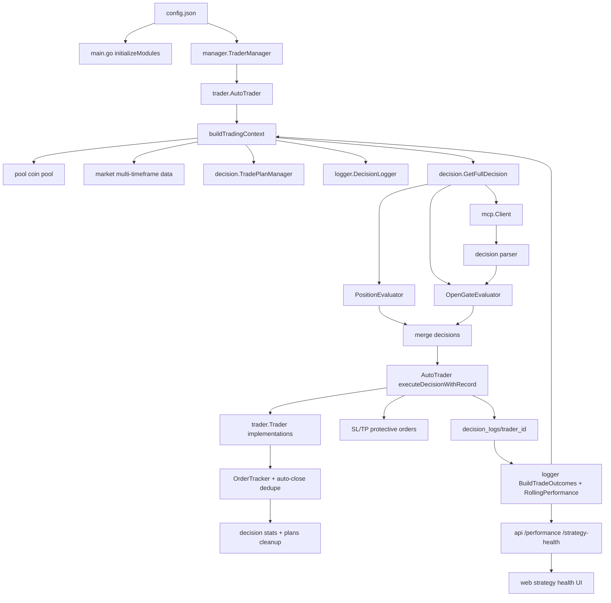

# 交易全流程评估与优化 — 设计文档

## 概览

本设计把 NOFX 的交易行为拆成 10 个可评估节点，并用统一的“交易流程健康状态”把策略、风险、执行和观测串起来：

1. 配置与 trader 生命周期。
2. 行情与币池。
3. 账户、持仓、计划、风险上下文。
4. AI 调用与解析。
5. 开仓准入与仓位 sizing。
6. 交易执行与保护单。
7. 持仓管理与退出。
8. 自动平仓追踪与 exactly-once 归因。
9. 决策日志、历史归因、rolling gate。
10. API/前端观测、测试与灰度。

实现上优先复用现有模块：

- `trader/auto_trader.go` 继续负责周期编排、运行时状态、执行排序和日志写入。
- `decision/` 继续负责决策验证、开仓门控、仓位 sizing、风控、持仓评估和交易计划。
- `logger/` 继续负责决策日志读取、历史归因、rolling performance 和执行质量指标。
- `api/` 和 `web/` 负责暴露策略健康、门控原因和执行质量。

本地仓库当前没有 `decision_logs/` 历史日志，因此设计阶段的量化结论仅作为代码审计和已有规格事实；真正的 PnL、胜率、PF、退出原因归因需要在线上日志或导出的日志集上跑离线 replay。

## 设计原则

1. **先观测，再收紧**：先把每个开仓拒绝、执行失败、保护单状态和自动平仓事件记录清楚，再逐步加硬约束。
2. **硬约束优先于 prompt**：最大持仓、风险预算、禁交易、保护单、最小名义额、RR、相关性集中度必须由代码强制。
3. **trader 级状态隔离**：账户、计划、AI 分析时间、rolling gate 和执行质量默认属于单个 trader；全局市场熔断单独命名。
4. **保护单优先**：任何开仓成交后，如果止损保护无法建立，系统必须重试、降级或紧急退出。
5. **执行 exactly-once**：同一真实平仓事件只能更新一次统计、日志和交易计划。
6. **可回放可回滚**：交易行为变化先支持 dry-run/report-only，再启用实盘硬拦截。

## 架构图



## 当前代码评估要点

### 已具备能力

- `AutoTrader.runCycle()` 已有完整周期：同步自动平仓、构建上下文、调用 `decision.GetFullDecision()`、先平后开、逐条执行、写日志。
- `decision.GetFullDecision()` 已有熔断检查、市场数据拉取、相关性矩阵、现有持仓评估、AI 新机会搜索、决策验证和合并。
- `validateOpenDecision()` 已有重复持仓、风险预算、杠杆、仓位、止损止盈方向、净 RR、单笔风险校验。
- `logger.BuildTradeOutcomes()` 已能配对 `open_*`、`close_*`、`auto_close_*`，并输出 unmatched。
- `logger.BuildRollingPerformance()` 已有 symbol/side rolling gate 和动态风险收缩。
- `executePartialCloseWithRecord()` 已有最小部分平仓名义额和剩余小仓位保护。
- `executeUpdateStopLossWithRecord()` 已在成功后调用 `decision.OnStopLossUpdated()`，能避免移动止损本地状态不更新。

### 需要优化的关键缺口

- `Config.Validate()` 使用 range copy 修改 `trader.Exchange` 和 `ScanIntervalMinutes`，默认值不会写回 `c.Traders[i]`。
- `MaxRiskPerTrade`、`TotalRiskBudget`、`AnalysisIntervalMin` 当前主要在 `decision.Initialize()` 使用默认值，未完整从配置传入每个 `AutoTrader` 的上下文。
- `LastAnalysisTime` 存在于临时 `decision.Context`，`GetFullDecision()` 更新后没有被持久带回 `AutoTrader`，AI 调用间隔可能跨周期失效。
- `TradePlanManager` 是包级全局，并且 plan key 当前按 symbol 管理，多 trader 或同 symbol 双向仓位会互相覆盖。
- 自动平仓有 `syncAutoClosedOrders()` 和 `detectAutoClosedPositions()` 两条发现路径，需要事件去重。
- 开仓后设置止损/止盈失败目前主要记录警告，缺少强制重试、降级或紧急平仓路径。
- 动态止盈目前可能只更新本地计划，交易所 TP 保护单同步边界需要明确。
- 行情数据源主要来自 Binance，非 Binance 交易所存在执行价格与行情价格差异风险。

## 数据结构设计

### 1. 运行时风控配置

新增或补齐配置字段，保持向后兼容，未设置时使用当前默认值：

```go
// config/config.go
type RiskConfig struct {
    MaxRiskPerTrade       float64 `json:"max_risk_per_trade"`
    TotalRiskBudget       float64 `json:"total_risk_budget"`
    AnalysisIntervalMin   int     `json:"analysis_interval_min"`
    MaxOpenPerDay         int     `json:"max_open_per_day"`
    MinOrderValueUSDT     float64 `json:"min_order_value_usdt"`
    DryRun                bool    `json:"dry_run"`
    EnableHardOpenGates   bool    `json:"enable_hard_open_gates"`
    EnableEmergencyClose  bool    `json:"enable_emergency_close"`
}
```

接入路径：

- `config.Config.Risk RiskConfig`
- `manager.TraderManager.AddTrader(...)`
- `trader.AutoTraderConfig`
- `trader.AutoTrader`
- `decision.Context`

为了降低破坏性，第一阶段可不改变配置文件结构，只把现有 `max_daily_loss`、`max_drawdown`、杠杆、扫描间隔和默认风险参数端到端传入；第二阶段再引入 `risk` 配置块。

### 2. trader-scoped Context

```go
// decision/decision.go
type Context struct {
    TraderID                string
    Exchange                string
    LastAnalysisTime        time.Time
    LastAIError             string
    ExecutionQuality        *logger.ExecutionQualityStats
    OpenGateSnapshot        *OpenGateSnapshot
    CandidateAssessments    map[string]*CandidateAssessment
    // 保留现有字段
}
```

`AutoTrader.buildTradingContext()` 负责注入：

- `TraderID`
- `Exchange`
- `LastAnalysisTime`，来自 `AutoTrader.lastAnalysisTime`
- `ExecutionQuality`，来自 `DecisionLogger.AnalyzePerformance(...)`
- `PerformanceGates`
- 风控参数和每日开仓计数

### 3. AI 分析状态

```go
// trader/auto_trader.go
type AutoTrader struct {
    lastAnalysisTime    time.Time
    lastAIAttemptTime   time.Time
    lastAISuccessTime   time.Time
    aiBackoffUntil      time.Time
    consecutiveAIFails  int
    openedToday         int
    openedTodayDate     string
}
```

更新策略：

- `shouldCallAIForNewOpportunities(ctx)` 只判断是否允许尝试。
- `GetFullDecision()` 在 `FullDecision` 中返回 AI 调用状态。
- `AutoTrader.runCycle()` 根据返回结果更新 `lastAIAttemptTime`、`lastAISuccessTime`、`lastAnalysisTime` 和 backoff。

建议扩展：

```go
type FullDecision struct {
    UserPrompt       string
    CoTTrace         string
    Decisions        []Decision
    Timestamp        time.Time
    AICallAttempted  bool
    AICallSucceeded  bool
    AIFailureReason  string
}
```

### 4. 候选标的评估

```go
type CandidateAssessment struct {
    Symbol             string   `json:"symbol"`
    Sources            []string `json:"sources"`
    IncludedInPrompt   bool     `json:"included_in_prompt"`
    DataAvailable      bool     `json:"data_available"`
    DataQualityReason   string   `json:"data_quality_reason,omitempty"`
    BTCCorrelation      float64  `json:"btc_correlation"`
    MarketRegime        string   `json:"market_regime"`
    TrendScore          float64  `json:"trend_score"`
    LiquidityScore      float64  `json:"liquidity_score"`
    VolatilityScore     float64  `json:"volatility_score"`
    OpenGateState       string   `json:"open_gate_state"`
    RejectionReasons    []string `json:"rejection_reasons,omitempty"`
}
```

存放位置：

- 计算逻辑：`decision/candidate.go`
- 日志输出：`logger.DecisionRecord.CandidateAssessments`
- API 输出：`/api/performance` 或新增 `/api/strategy-health`

### 5. 开仓门控

新增 `decision/open_gate.go`：

```go
type OpenGateInput struct {
    Decision          *Decision
    Context           *Context
    MarketData        *market.Data
    ExistingRisk      float64
    ExecutionQuality  *logger.ExecutionQualityStats
}

type OpenGateResult struct {
    Allowed           bool
    State             string   // allow, penalize, block
    EffectiveRisk     float64
    MinConfidence     int
    AdjustedSizeUSD   float64
    Reasons           []string
    Warnings          []string
}
```

验证顺序：

1. 基础 action/symbol/market data 校验。
2. 持仓数量和重复 symbol/side 校验。
3. 交易所 preflight：价格、精度、最小名义额。
4. 止损止盈方向和净 RR。
5. 单笔风险和总风险预算。
6. rolling symbol/side gate。
7. 市场状态 gate。
8. 相关性集中度 gate。
9. 执行质量 gate。
10. AI 失败/backoff gate。

`validateOpenDecision()` 保留为兼容入口，内部调用 `EvaluateOpenGate()`，并将拒绝原因写入日志。

### 6. 仓位 sizing

新增 `decision/position_sizing.go`：

```go
type PositionSizingInput struct {
    Equity              float64
    AvailableBalance    float64
    CurrentPrice        float64
    StopLoss            float64
    ATR                 float64
    EffectiveRiskPct    float64
    MaxLeverage         int
    RequestedLeverage   int
    IsAltcoin           bool
    CorrelationWeight   float64
    FeeAndSlippagePct   float64
}

type PositionSizingResult struct {
    PositionSizeUSD     float64
    Quantity            float64
    StopDistancePct     float64
    RiskUSD             float64
    MarginRequiredUSD   float64
    NotionalOK          bool
    CanScaleExit        bool
    Reasons             []string
}
```

算法：

```text
stop_distance_pct = abs(entry - stop_loss) / entry
raw_risk_usd = equity * effective_risk_pct
position_size_usd = raw_risk_usd / (stop_distance_pct + fee_slippage_pct)
position_size_usd *= correlation_weight
position_size_usd = min(position_size_usd, available_balance * leverage * safety_factor)
```

当 `PositionSizeUSD` 由 AI 给出时，也要用同一算法验证风险和可执行性。

### 7. 执行 preflight 与保护单结果

在 `trader` 包新增执行辅助结构，尽量不改 `Trader` 接口：

```go
type ExecutionPreflightResult struct {
    Symbol             string
    Side               string
    Quantity           float64
    NotionalUSD        float64
    FormattedQuantity  float64
    Passed             bool
    Reasons            []string
}

type ProtectiveOrderResult struct {
    StopLossSet        bool
    TakeProfitSet      bool
    StopLossError      string
    TakeProfitError    string
    EmergencyClosed    bool
}
```

接入点：

- `executeOpenLongWithRecord()`
- `executeOpenShortWithRecord()`
- `executePartialCloseWithRecord()`
- `executeUpdateStopLossWithRecord()`
- `executeUpdateTakeProfitWithRecord()`

保护单失败策略：

1. 设置止损失败时立即重试 1-2 次。
2. 若交易所支持 reduce-only 市价退出，且 `EnableEmergencyClose=true`，紧急平仓。
3. 若不能紧急平仓，记录 `high_risk_unprotected_position`，禁止该 trader 新开仓。

### 8. 自动平仓事件去重

新增 `trader/auto_close_deduper.go` 或放入 `AutoTrader`：

```go
type AutoCloseEvent struct {
    TraderID    string
    Symbol      string
    Side        string
    OrderID     int64
    ExitPrice   float64
    CloseTime   time.Time
    Source      string // order_tracker, position_snapshot, trade_history
}

func (e AutoCloseEvent) Key() string
```

Key 优先级：

1. 有 order id：`trader_id:symbol:side:order_id`
2. 无 order id：`trader_id:symbol:side:close_time_bucket:exit_price`

`syncAutoClosedOrders()` 和 `detectAutoClosedPositions()` 都必须先过 dedupe，再更新统计和写日志。

### 9. 策略健康 API

可选择扩展 `/api/performance`，或新增只读 endpoint：

```http
GET /api/strategy-health?trader_id=xxx
```

响应草案：

```json
{
  "trader_id": "aster_deepseek",
  "effective_risk": {
    "max_risk_per_trade": 0.01,
    "total_risk_budget": 0.08,
    "remaining_risk_budget": 0.035,
    "reason": "recent_10_pf_below_1"
  },
  "ai_state": {
    "last_attempt_at": "2026-05-06T13:00:00Z",
    "last_success_at": "2026-05-06T12:45:00Z",
    "backoff_until": null,
    "consecutive_failures": 0
  },
  "open_gates": {
    "blocked_symbols": [],
    "penalized_symbols": ["BCHUSDT", "LTCUSDT"],
    "side_gates": {
      "short": {"state": "penalize", "min_confidence": 90}
    }
  },
  "execution_quality": {
    "partial_close_failure_rate": 0.0,
    "protective_order_failures": 0,
    "ai_failure_count": 0
  },
  "recent_rejections": [
    {"symbol": "XRPUSDT", "action": "open_short", "reason": "short side gate requires confidence >= 90"}
  ]
}
```

前端 `web/src/components/AILearning.tsx` 或新增 `StrategyHealth.tsx` 展示：

- 有效风险比例。
- AI 调用状态。
- 禁交易/降权名单。
- 最近拒绝原因。
- 执行质量和高危错误。

## 技术实施计划

### Phase 1: 评估与可观测性

目标是不改变实盘交易行为，先把流程健康状态记录清楚。

涉及文件：

- `logger/decision_logger.go`
- `logger/logger_test.go`
- `trader/auto_trader.go`
- `decision/types.go`
- `api/server.go`
- `web/src/types/index.ts`
- `web/src/lib/api.ts`

实现：

1. 扩展 `PerformanceAnalysis.Execution`，增加：
   - `ProtectiveOrderFailures`
   - `HighRiskExecutionFailures`
   - `AIFailureCount`
   - `OpenRejectionCount`
2. 在 `DecisionRecord` 或 `DecisionAction` 中补充 `RiskState`、`GateReasons`、`ExecutionRiskLevel`。
3. `/api/performance` 返回 rolling gate、执行质量和 unmatched。
4. 前端展示策略健康状态。

验证：

- `go test ./logger ./api`
- `cd web && npm run build`

### Phase 2: 配置与运行时状态修复

涉及文件：

- `config/config.go`
- `config/config_test.go`
- `main.go`
- `manager/trader_manager.go`
- `trader/auto_trader.go`
- `decision/decision.go`

实现：

1. 修复 `Config.Validate()` range copy 默认值写回。
2. 将风险参数和分析间隔传入 `AutoTraderConfig`。
3. 在 `AutoTrader` 增加 `lastAnalysisTime` 和 AI backoff 状态。
4. `buildTradingContext()` 注入 `LastAnalysisTime`、`MaxRiskPerTrade`、`TotalRiskBudget`、`MaxAccountDrawdownPct`、`AnalysisIntervalMin`。
5. `runCycle()` 根据 `FullDecision.AICallAttempted/Succeeded` 更新状态。

验证：

- `go test ./config ./decision ./trader`

### Phase 3: 开仓门控与仓位 sizing

涉及文件：

- `decision/open_gate.go`
- `decision/position_sizing.go`
- `decision/decision.go`
- `decision/decision_test.go`
- `decision/risk.go`

实现：

1. 抽取 `EvaluateOpenGate()`。
2. 抽取 `CalculateRiskBasedPositionSize()`。
3. 增加市场状态 gate、相关性集中度 gate、执行质量 gate。
4. 对 short 侧增加更高默认门槛。
5. 将拒绝原因写入 `FullDecision.CoTTrace` 和决策日志。

验证：

- `go test ./decision`
- 用 fixture 覆盖：RR 不足、相关性集中、rolling block、执行质量差、short 置信度不足。

### Phase 4: 执行保护和保护单失败补救

涉及文件：

- `trader/auto_trader.go`
- `trader/interface.go`，仅在确实需要交易所元数据时修改
- `trader/*_trader.go`
- `trader/*_test.go`

实现：

1. 开仓前执行 preflight。
2. 开仓后设置保护单必须返回结构化结果。
3. 止损失败触发重试或紧急平仓。
4. 部分平仓后强制重新保护剩余仓位。
5. 记录高危执行失败，并反馈到 rolling gate。

交易所注意：

- Binance 的 stop/take-profit 订单可以独立取消，继续保留 `CancelStopLossOrders()` 和 `CancelTakeProfitOrders()`。
- Hyperliquid/Aster 若取消某类订单会影响另一类订单，执行层继续使用查询旧保护单并恢复的模式。
- 不在单元测试中调用真实交易所；使用 fake trader。

验证：

- `go test ./trader`
- fake trader 覆盖：止损失败后紧急平仓、止盈恢复、部分平仓剩余保护。

### Phase 5: trader-scoped 计划和 exactly-once 自动平仓

涉及文件：

- `decision/persistence.go`
- `decision/types.go`
- `decision/takeprofit.go`
- `trader/order_tracker.go`
- `trader/auto_trader.go`
- `logger/decision_logger.go`

实现：

1. `Context` 增加 `TraderID`。
2. `TradePlanManager` key 从 `symbol` 升级为 `trader_id:symbol:side`。
3. 保留兼容 wrapper，先迁移调用点，再清理旧接口。
4. 自动平仓事件加 dedupe。
5. 自动平仓确认后统一调用一个 `handleAutoCloseEvent()`，负责统计、计划清理、日志和孤儿订单撤销。

迁移：

- 旧 `data/trade_plans.json` 若没有 trader_id，迁移到第一个启用 trader 或 `default_trader`。
- 迁移前备份为 `trade_plans.json.bak`。

验证：

- `go test ./decision ./trader ./logger`
- fixture 覆盖：同 symbol 多 trader、同事件双发现路径、无 order id 降级识别。

### Phase 6: 离线 replay 与灰度

涉及文件：

- `logger/`
- `cmd/` 或 `tools/` 下新增 replay 工具
- `.kiro/specs/trading-flow-evaluation-optimization/`

实现：

1. 增加离线 replay 工具，读取 `decision_logs/{trader_id}`。
2. 输出新旧规则对比：
   - 开仓次数。
   - 拒绝原因。
   - 风险使用率。
   - 理论 PnL。
   - 执行失败率。
3. 增加 `report_only` 模式：计算新 gate 但不阻止实盘开仓，只记录会被拒绝的原因。
4. 灰度启用顺序：
   - report-only
   - 禁止最明显高危开仓
   - 启用风险收缩
   - 启用保护单失败紧急处理

验证：

- `go test ./logger`
- 使用脱敏日志样本跑 replay。

## API 与前端兼容性

- `/api/performance` 保持现有字段不变，只追加字段。
- 新增 `/api/strategy-health` 时，缺少 `trader_id` 的行为遵循现有 read endpoint：如果已有默认第一个 trader 模式则复用，否则返回 400。
- `web/src/types/index.ts` 新增可选字段，避免旧后端响应导致前端崩溃。
- 前端先只读展示，不提供实盘开关按钮，避免误操作。

## 风险控制设计

### 账户级

- 最大账户回撤：禁止新开仓，持仓管理继续。
- 保证金使用率过高：禁止新开仓，优先降风险。
- 可用余额不足：禁止新开仓。

### 策略级

- rolling PF 低：降低单笔风险。
- symbol/side 表现差：提高置信度、降仓或冷却。
- short 默认更严格。

### 执行级

- AI 失败：禁用新开仓或 backoff。
- 保护单失败：高危，禁止新增仓位。
- partial close 重复失败：禁用分批退出或合并为全平。

### 市场级

- BTC crash：全局熔断。
- BTC ranging/volatile：山寨趋势跟随降频或禁用。
- 高相关集中：限制新增同向风险。

## 测试策略

### 单元测试

- `config`: 默认值写回、百分比归一化。
- `decision`: open gate、position sizing、risk budget、market regime gate、AI frequency。
- `trader`: fake trader 执行路径、保护单失败、partial close、auto close dedupe。
- `logger`: BuildTradeOutcomes、BuildRollingPerformance、ExecutionQuality。
- `api`: strategy health 和 performance 兼容响应。

### 集成测试

- 使用 fake trader 跑单周期：
  - 无持仓 + AI wait。
  - AI 开仓但 gate 拒绝。
  - AI 开仓通过但保护单失败。
  - 已有持仓触发移动止损。
  - 自动平仓被两个路径发现但只记一次。

### 回放验证

- 使用 `decision_logs/` 离线跑新旧 gate。
- 输出 CSV/JSON：
  - `old_action`
  - `new_action`
  - `gate_state`
  - `rejection_reason`
  - `old_risk_usd`
  - `new_risk_usd`
  - `outcome_pnl`

## 兼容与迁移

- 第一阶段只追加日志/API 字段，不改变交易行为。
- 第二阶段修复配置和 AI 频率，属于低风险行为修正。
- 第三阶段起的硬 gate 默认可先 `report_only`。
- `TradePlanManager` trader-scoped 迁移需要备份旧文件。
- 不提交 `data/`、`decision_logs/`、真实 API key 或私钥。

## 回滚方案

- 所有新增硬 gate 使用配置开关或 report-only 模式。
- 如果开仓过度减少，可以只关闭市场状态 gate 和执行质量 gate，保留基础风险校验。
- 如果保护单紧急平仓误伤，关闭 `EnableEmergencyClose`，但保留高危告警和禁新仓。
- 如果 trader-scoped plan 迁移异常，用 `.bak` 恢复旧 `trade_plans.json`。

## 与需求的对应关系

| 需求 | 设计覆盖 |
| --- | --- |
| Requirement 1 | 全流程评估基线、当前代码评估、Phase 1、replay |
| Requirement 2 | 运行时风控配置、Phase 2、兼容迁移 |
| Requirement 3 | CandidateAssessment、市场数据降级、行情来源风险 |
| Requirement 4 | AI 分析状态、FullDecision AI 状态、AI backoff |
| Requirement 5 | OpenGateEvaluator、市场状态 gate、rolling gate、short gate |
| Requirement 6 | PositionSizingInput/Result、风险预算和最小名义额 |
| Requirement 7 | ExecutionPreflight、ProtectiveOrderResult、保护单失败补救 |
| Requirement 8 | PositionEvaluator 扩展、动态 TP 同步、时间风险 |
| Requirement 9 | AutoCloseEvent、dedupe、trader-scoped plan key |
| Requirement 10 | PerformanceAnalysis、StrategyHealth API、前端策略健康 |
| Requirement 11 | 账户/策略/执行/市场四层风控 |
| Requirement 12 | 测试策略、离线 replay、灰度和回滚 |

